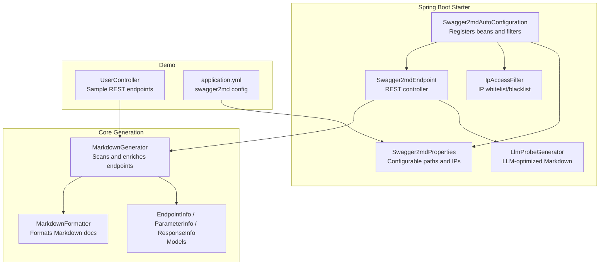
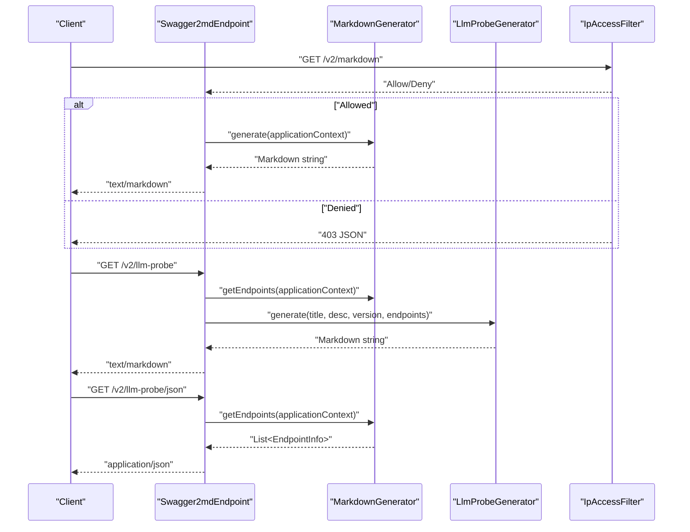
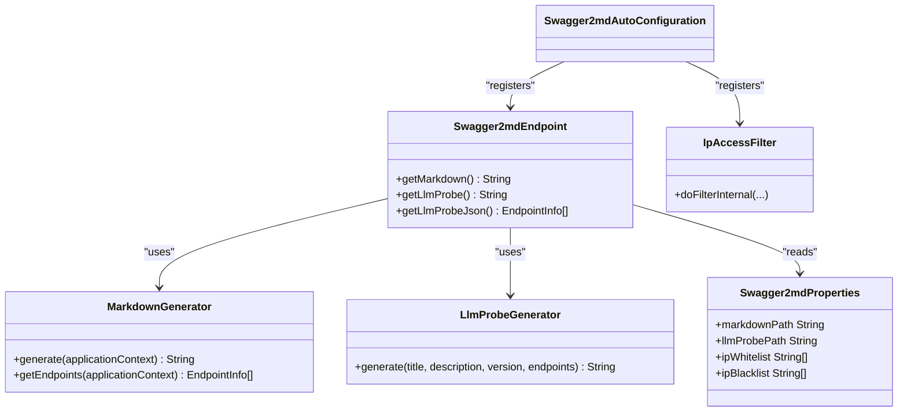
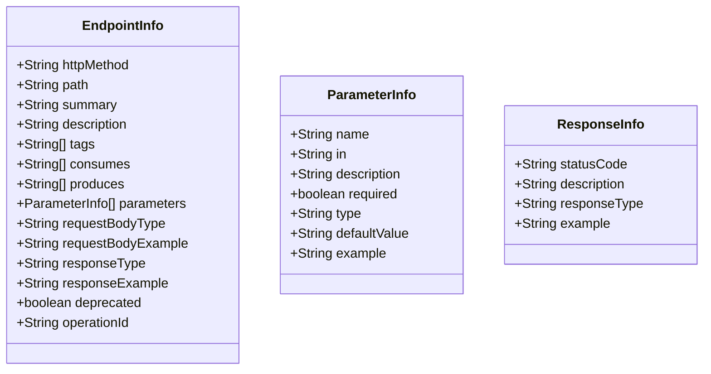

# API Documentation

<cite>
**Referenced Files in This Document**
- [Swagger2mdEndpoint.java](file://swagger2md-spring-boot-starter/src/main/java/com/github/tentac/swagger2md/autoconfigure/Swagger2mdEndpoint.java)
- [LlmProbeGenerator.java](file://swagger2md-spring-boot-starter/src/main/java/com/github/tentac/swagger2md/probe/LlmProbeGenerator.java)
- [Swagger2mdAutoConfiguration.java](file://swagger2md-spring-boot-starter/src/main/java/com/github/tentac/swagger2md/autoconfigure/Swagger2mdAutoConfiguration.java)
- [IpAccessFilter.java](file://swagger2md-spring-boot-starter/src/main/java/com/github/tentac/swagger2md/filter/IpAccessFilter.java)
- [Swagger2mdProperties.java](file://swagger2md-spring-boot-starter/src/main/java/com/github/tentac/swagger2md/autoconfigure/Swagger2mdProperties.java)
- [MarkdownGenerator.java](file://swagger2md-core/src/main/java/com/github/tentac/swagger2md/core/MarkdownGenerator.java)
- [MarkdownFormatter.java](file://swagger2md-core/src/main/java/com/github/tentac/swagger2md/core/MarkdownFormatter.java)
- [EndpointInfo.java](file://swagger2md-core/src/main/java/com/github/tentac/swagger2md/model/EndpointInfo.java)
- [ParameterInfo.java](file://swagger2md-core/src/main/java/com/github/tentac/swagger2md/model/ParameterInfo.java)
- [ResponseInfo.java](file://swagger2md-core/src/main/java/com/github/tentac/swagger2md/model/ResponseInfo.java)
- [MarkdownApi.java](file://swagger2md-core/src/main/java/com/github/tentac/swagger2md/annotation/MarkdownApi.java)
- [MarkdownApiOperation.java](file://swagger2md-core/src/main/java/com/github/tentac/swagger2md/annotation/MarkdownApiOperation.java)
- [MarkdownApiParam.java](file://swagger2md-core/src/main/java/com/github/tentac/swagger2md/annotation/MarkdownApiParam.java)
- [UserController.java](file://swagger2md-demo/src/main/java/com/github/tentac/swagger2md/demo/controller/UserController.java)
- [application.yml](file://swagger2md-demo/src/main/resources/application.yml)
</cite>

## Table of Contents
1. [Introduction](#introduction)
2. [Project Structure](#project-structure)
3. [Core Components](#core-components)
4. [Architecture Overview](#architecture-overview)
5. [Detailed Component Analysis](#detailed-component-analysis)
6. [Dependency Analysis](#dependency-analysis)
7. [Performance Considerations](#performance-considerations)
8. [Troubleshooting Guide](#troubleshooting-guide)
9. [Conclusion](#conclusion)
10. [Appendices](#appendices)

## Introduction
This document describes the RESTful endpoints exposed by the tentac Swagger2md Spring Boot starter for generating API documentation. It covers:
- GET /v2/markdown for full Markdown API documentation
- GET /v2/llm-probe for LLM-optimized capability manifest
- GET /v2/llm-probe/json for raw JSON endpoint data

It explains HTTP methods, URL patterns, request parameters, response schemas, content types, and how the output is structured. It also documents authentication via IP access filtering, rate limiting considerations, and CORS configuration. Practical examples and integration patterns are provided.

## Project Structure
The documentation endpoints are implemented in the Spring Boot starter module and rely on core generation utilities. Configuration is managed via properties and applied through auto-configuration. The demo module illustrates usage and configuration.

**Diagram sources**
- [Swagger2mdEndpoint.java:20-71](file://swagger2md-spring-boot-starter/src/main/java/com/github/tentac/swagger2md/autoconfigure/Swagger2mdEndpoint.java#L20-L71)
- [Swagger2mdAutoConfiguration.java:20-81](file://swagger2md-spring-boot-starter/src/main/java/com/github/tentac/swagger2md/autoconfigure/Swagger2mdAutoConfiguration.java#L20-L81)
- [LlmProbeGenerator.java:10-147](file://swagger2md-spring-boot-starter/src/main/java/com/github/tentac/swagger2md/probe/LlmProbeGenerator.java#L10-L147)
- [IpAccessFilter.java:19-195](file://swagger2md-spring-boot-starter/src/main/java/com/github/tentac/swagger2md/filter/IpAccessFilter.java#L19-L195)
- [Swagger2mdProperties.java:8-126](file://swagger2md-spring-boot-starter/src/main/java/com/github/tentac/swagger2md/autoconfigure/Swagger2mdProperties.java#L8-L126)
- [MarkdownGenerator.java:11-155](file://swagger2md-core/src/main/java/com/github/tentac/swagger2md/core/MarkdownGenerator.java#L11-L155)
- [MarkdownFormatter.java:8-197](file://swagger2md-core/src/main/java/com/github/tentac/swagger2md/core/MarkdownFormatter.java#L8-L197)
- [EndpointInfo.java:6-164](file://swagger2md-core/src/main/java/com/github/tentac/swagger2md/model/EndpointInfo.java#L6-L164)
- [ParameterInfo.java:3-84](file://swagger2md-core/src/main/java/com/github/tentac/swagger2md/model/ParameterInfo.java#L3-L84)
- [ResponseInfo.java:5-51](file://swagger2md-core/src/main/java/com/github/tentac/swagger2md/model/ResponseInfo.java#L5-L51)
- [UserController.java:16-186](file://swagger2md-demo/src/main/java/com/github/tentac/swagger2md/demo/controller/UserController.java#L16-L186)
- [application.yml:8-24](file://swagger2md-demo/src/main/resources/application.yml#L8-L24)

**Section sources**
- [Swagger2mdEndpoint.java:20-71](file://swagger2md-spring-boot-starter/src/main/java/com/github/tentac/swagger2md/autoconfigure/Swagger2mdEndpoint.java#L20-L71)
- [Swagger2mdAutoConfiguration.java:20-81](file://swagger2md-spring-boot-starter/src/main/java/com/github/tentac/swagger2md/autoconfigure/Swagger2mdAutoConfiguration.java#L20-L81)
- [application.yml:8-24](file://swagger2md-demo/src/main/resources/application.yml#L8-L24)

## Core Components
- Swagger2mdEndpoint: Exposes three endpoints behind configurable paths.
- LlmProbeGenerator: Produces LLM-optimized Markdown and JSON for programmatic consumption.
- MarkdownGenerator and MarkdownFormatter: Generate full Markdown documentation with tag-based organization and table of contents.
- IpAccessFilter: Applies IP-based access control to documentation endpoints.
- Swagger2mdProperties: Provides configuration for enabling/disabling features, paths, and IP lists.

Key responsibilities:
- Endpoint routing and content negotiation
- Scanning controllers and building EndpointInfo collections
- Formatting Markdown and LLM manifests
- Enforcing IP access policies

**Section sources**
- [Swagger2mdEndpoint.java:20-71](file://swagger2md-spring-boot-starter/src/main/java/com/github/tentac/swagger2md/autoconfigure/Swagger2mdEndpoint.java#L20-L71)
- [LlmProbeGenerator.java:10-147](file://swagger2md-spring-boot-starter/src/main/java/com/github/tentac/swagger2md/probe/LlmProbeGenerator.java#L10-L147)
- [MarkdownGenerator.java:11-155](file://swagger2md-core/src/main/java/com/github/tentac/swagger2md/core/MarkdownGenerator.java#L11-L155)
- [MarkdownFormatter.java:8-197](file://swagger2md-core/src/main/java/com/github/tentac/swagger2md/core/MarkdownFormatter.java#L8-L197)
- [IpAccessFilter.java:19-195](file://swagger2md-spring-boot-starter/src/main/java/com/github/tentac/swagger2md/filter/IpAccessFilter.java#L19-L195)
- [Swagger2mdProperties.java:8-126](file://swagger2md-spring-boot-starter/src/main/java/com/github/tentac/swagger2md/autoconfigure/Swagger2mdProperties.java#L8-L126)

## Architecture Overview
The endpoints are RESTful and served by a Spring MVC controller. The controller delegates to generators that scan the application context, collect endpoint metadata, and format output. An IP access filter enforces access control on documentation paths.

**Diagram sources**
- [Swagger2mdEndpoint.java:40-70](file://swagger2md-spring-boot-starter/src/main/java/com/github/tentac/swagger2md/autoconfigure/Swagger2mdEndpoint.java#L40-L70)
- [MarkdownGenerator.java:111-144](file://swagger2md-core/src/main/java/com/github/tentac/swagger2md/core/MarkdownGenerator.java#L111-L144)
- [LlmProbeGenerator.java:26-60](file://swagger2md-spring-boot-starter/src/main/java/com/github/tentac/swagger2md/probe/LlmProbeGenerator.java#L26-L60)
- [IpAccessFilter.java:61-94](file://swagger2md-spring-boot-starter/src/main/java/com/github/tentac/swagger2md/filter/IpAccessFilter.java#L61-L94)

## Detailed Component Analysis

### Endpoint: GET /v2/markdown
- Method: GET
- Path: ${swagger2md.markdown-path} (default: /v2/markdown)
- Produces: text/markdown;charset=UTF-8
- Authentication: None (subject to IP filter if configured)
- Rate limiting: Not enforced by the library
- CORS: Not handled by the library; configure at web layer if needed
- Behavior:
  - Scans Spring controllers and generates full Markdown documentation
  - Uses MarkdownFormatter to build a tag-indexed document with table of contents
  - Includes endpoint headers, summaries, descriptions, parameters, request/response examples, and cURL snippets

Response schema:
- Content-Type: text/markdown;charset=UTF-8
- Body: Markdown document containing:
  - Header with title, description, version
  - Table of contents linking to tag sections
  - Tag-based sections with endpoint entries
  - Each endpoint includes:
    - HTTP method badge and path
    - Summary and description
    - Operation ID
    - Consumes/Produces media types
    - Parameters table
    - Request body type and example (when present)
    - Response type and example (when present)
    - Example cURL request

Integration example:
- Use a browser or curl to fetch the Markdown document from the configured path.

**Section sources**
- [Swagger2mdEndpoint.java:43-47](file://swagger2md-spring-boot-starter/src/main/java/com/github/tentac/swagger2md/autoconfigure/Swagger2mdEndpoint.java#L43-L47)
- [MarkdownGenerator.java:54-99](file://swagger2md-core/src/main/java/com/github/tentac/swagger2md/core/MarkdownGenerator.java#L54-L99)
- [MarkdownFormatter.java:24-71](file://swagger2md-core/src/main/java/com/github/tentac/swagger2md/core/MarkdownFormatter.java#L24-L71)
- [application.yml:14-14](file://swagger2md-demo/src/main/resources/application.yml#L14-L14)

### Endpoint: GET /v2/llm-probe
- Method: GET
- Path: ${swagger2md.llm-probe-path} (default: /v2/llm-probe)
- Produces: text/markdown;charset=UTF-8
- Authentication: None (subject to IP filter if configured)
- Rate limiting: Not enforced by the library
- CORS: Not handled by the library; configure at web layer if needed
- Behavior:
  - Collects EndpointInfo list from MarkdownGenerator
  - Generates an LLM-optimized Markdown document with:
    - Header including API title, version, description, total endpoints
    - Capability Summary table (Method, Path, Operation ID, Summary)
    - Capability Details grouped by path with compact parameter/request/response specs
    - LLM Usage Instructions for safe invocation

Response schema:
- Content-Type: text/markdown;charset=UTF-8
- Body: Structured Markdown suitable for LLM consumption

Integration example:
- Use a client to fetch the LLM-optimized manifest and feed it to an AI assistant for guided API interaction.

**Section sources**
- [Swagger2mdEndpoint.java:52-61](file://swagger2md-spring-boot-starter/src/main/java/com/github/tentac/swagger2md/autoconfigure/Swagger2mdEndpoint.java#L52-L61)
- [LlmProbeGenerator.java:26-146](file://swagger2md-spring-boot-starter/src/main/java/com/github/tentac/swagger2md/probe/LlmProbeGenerator.java#L26-L146)
- [application.yml:15-15](file://swagger2md-demo/src/main/resources/application.yml#L15-L15)

### Endpoint: GET /v2/llm-probe/json
- Method: GET
- Path: ${swagger2md.llm-probe-path}/json (default: /v2/llm-probe/json)
- Produces: application/json
- Authentication: None (subject to IP filter if configured)
- Rate limiting: Not enforced by the library
- CORS: Not handled by the library; configure at web layer if needed
- Behavior:
  - Returns a JSON array of EndpointInfo objects for programmatic consumption by LLMs or automation tools

Response schema:
- Content-Type: application/json
- Body: Array of EndpointInfo objects with fields:
  - httpMethod: string
  - path: string
  - summary: string
  - description: string
  - tags: string[]
  - consumes: string[]
  - produces: string[]
  - parameters: ParameterInfo[]
  - requestBodyType: string
  - requestBodyExample: string
  - responseType: string
  - responseExample: string
  - deprecated: boolean
  - operationId: string

Integration example:
- Parse the JSON response and iterate over endpoints to drive LLM-driven API agents.

**Section sources**
- [Swagger2mdEndpoint.java:66-70](file://swagger2md-spring-boot-starter/src/main/java/com/github/tentac/swagger2md/autoconfigure/Swagger2mdEndpoint.java#L66-L70)
- [EndpointInfo.java:9-164](file://swagger2md-core/src/main/java/com/github/tentac/swagger2md/model/EndpointInfo.java#L9-L164)
- [ParameterInfo.java:6-84](file://swagger2md-core/src/main/java/com/github/tentac/swagger2md/model/ParameterInfo.java#L6-L84)
- [application.yml:15-15](file://swagger2md-demo/src/main/resources/application.yml#L15-L15)

### Markdown Output Format
- Table of contents generation:
  - Built from unique tags collected from endpoints
  - Anchor links mapped to tag names
- Endpoint section formatting:
  - Each endpoint includes HTTP method badge, path, optional deprecation notice, summary, description, Operation ID, Consumes/Produces, Parameters table, Request Body, Response, and Example cURL
- Tag-based organization:
  - Endpoints are grouped by tags and rendered as separate sections

**Section sources**
- [MarkdownFormatter.java:36-71](file://swagger2md-core/src/main/java/com/github/tentac/swagger2md/core/MarkdownFormatter.java#L36-L71)
- [MarkdownFormatter.java:73-132](file://swagger2md-core/src/main/java/com/github/tentac/swagger2md/core/MarkdownFormatter.java#L73-L132)

### LLM Probe Format
- Structured parameter descriptions:
  - Compact bullet list with parameter name, location, type, requirement, description, and example
- Compact request/response specifications:
  - Single-line type declarations with optional fenced JSON examples
- Usage instructions for AI systems:
  - Clear guidance on required parameters, Content-Type, path templating, Operation ID canonicalization, and deprecation handling

**Section sources**
- [LlmProbeGenerator.java:93-128](file://swagger2md-spring-boot-starter/src/main/java/com/github/tentac/swagger2md/probe/LlmProbeGenerator.java#L93-L128)
- [LlmProbeGenerator.java:133-141](file://swagger2md-spring-boot-starter/src/main/java/com/github/tentac/swagger2md/probe/LlmProbeGenerator.java#L133-L141)

### Authentication, Rate Limiting, and CORS
- Authentication:
  - No built-in authentication for documentation endpoints
  - IP access control via whitelist/blacklist CIDR patterns
- Rate limiting:
  - Not enforced by the library
- CORS:
  - Not handled by the library; configure at the web layer if needed

**Section sources**
- [IpAccessFilter.java:61-94](file://swagger2md-spring-boot-starter/src/main/java/com/github/tentac/swagger2md/filter/IpAccessFilter.java#L61-L94)
- [Swagger2mdAutoConfiguration.java:52-80](file://swagger2md-spring-boot-starter/src/main/java/com/github/tentac/swagger2md/autoconfigure/Swagger2mdAutoConfiguration.java#L52-L80)
- [Swagger2mdProperties.java:39-43](file://swagger2md-spring-boot-starter/src/main/java/com/github/tentac/swagger2md/autoconfigure/Swagger2mdProperties.java#L39-L43)

### Configuration Options
- swagger2md.enabled: Enable/disable the feature (default: true)
- swagger2md.title: API title for documentation header
- swagger2md.description: API description
- swagger2md.version: API version
- swagger2md.base-package: Package to scan for controllers (empty scans all)
- swagger2md.markdown-path: Path for Markdown endpoint (default: /v2/markdown)
- swagger2md.llm-probe-path: Path for LLM probe endpoints (default: /v2/llm-probe)
- swagger2md.llm-probe-enabled: Toggle for LLM probe features
- swagger2md.ip-whitelist: CIDR list for allowed IPs
- swagger2md.ip-blacklist: CIDR list for blocked IPs

**Section sources**
- [Swagger2mdProperties.java:15-126](file://swagger2md-spring-boot-starter/src/main/java/com/github/tentac/swagger2md/autoconfigure/Swagger2mdProperties.java#L15-L126)
- [application.yml:8-24](file://swagger2md-demo/src/main/resources/application.yml#L8-L24)

## Dependency Analysis
The controller depends on generators and properties. The auto-configuration registers the controller, filters, and generators. The filter applies to documentation paths derived from properties.

**Diagram sources**
- [Swagger2mdEndpoint.java:29-38](file://swagger2md-spring-boot-starter/src/main/java/com/github/tentac/swagger2md/autoconfigure/Swagger2mdEndpoint.java#L29-L38)
- [MarkdownGenerator.java:26-32](file://swagger2md-core/src/main/java/com/github/tentac/swagger2md/core/MarkdownGenerator.java#L26-L32)
- [LlmProbeGenerator.java:26-27](file://swagger2md-spring-boot-starter/src/main/java/com/github/tentac/swagger2md/probe/LlmProbeGenerator.java#L26-L27)
- [Swagger2mdProperties.java:87-101](file://swagger2md-spring-boot-starter/src/main/java/com/github/tentac/swagger2md/autoconfigure/Swagger2mdProperties.java#L87-L101)
- [Swagger2mdAutoConfiguration.java:40-46](file://swagger2md-spring-boot-starter/src/main/java/com/github/tentac/swagger2md/autoconfigure/Swagger2mdAutoConfiguration.java#L40-L46)
- [IpAccessFilter.java:23-59](file://swagger2md-spring-boot-starter/src/main/java/com/github/tentac/swagger2md/filter/IpAccessFilter.java#L23-L59)

**Section sources**
- [Swagger2mdEndpoint.java:29-38](file://swagger2md-spring-boot-starter/src/main/java/com/github/tentac/swagger2md/autoconfigure/Swagger2mdEndpoint.java#L29-L38)
- [Swagger2mdAutoConfiguration.java:40-46](file://swagger2md-spring-boot-starter/src/main/java/com/github/tentac/swagger2md/autoconfigure/Swagger2mdAutoConfiguration.java#L40-L46)

## Performance Considerations
- Endpoint generation scans controllers at request time; cache responses at the web server or CDN layer if appropriate.
- Consider narrowing the base package to reduce scanning overhead.
- LLM probe JSON can be large; consider pagination or filtering at the client if needed.

## Troubleshooting Guide
Common issues and resolutions:
- Access Denied (403):
  - Verify client IP against configured whitelist/blacklist CIDRs.
  - Confirm paths match the configured markdown and LLM probe paths.
- Empty or missing documentation:
  - Ensure controllers are annotated and within the configured base package.
  - Confirm swagger2md.enabled is true.
- Incorrect paths:
  - Check swagger2md.markdown-path and swagger2md.llm-probe-path configuration.

**Section sources**
- [IpAccessFilter.java:76-92](file://swagger2md-spring-boot-starter/src/main/java/com/github/tentac/swagger2md/filter/IpAccessFilter.java#L76-L92)
- [Swagger2mdAutoConfiguration.java:52-80](file://swagger2md-spring-boot-starter/src/main/java/com/github/tentac/swagger2md/autoconfigure/Swagger2mdAutoConfiguration.java#L52-L80)
- [Swagger2mdProperties.java:87-101](file://swagger2md-spring-boot-starter/src/main/java/com/github/tentac/swagger2md/autoconfigure/Swagger2mdProperties.java#L87-L101)

## Conclusion
The tentac Swagger2md endpoints provide a flexible, configurable way to expose API documentation in both human-readable Markdown and LLM-friendly formats. With IP access filtering, the system supports secure exposure of documentation assets. Clients can integrate by fetching the Markdown or JSON representations and applying the LLM usage instructions for reliable automation.

## Appendices

### Endpoint Reference Summary
- GET /v2/markdown
  - Produces: text/markdown;charset=UTF-8
  - Purpose: Full Markdown documentation with tag-based sections and table of contents
- GET /v2/llm-probe
  - Produces: text/markdown;charset=UTF-8
  - Purpose: LLM-optimized capability manifest with compact specs and usage instructions
- GET /v2/llm-probe/json
  - Produces: application/json
  - Purpose: Raw JSON endpoint data for programmatic consumption

**Section sources**
- [Swagger2mdEndpoint.java:43-70](file://swagger2md-spring-boot-starter/src/main/java/com/github/tentac/swagger2md/autoconfigure/Swagger2mdEndpoint.java#L43-L70)

### Data Models

**Diagram sources**
- [EndpointInfo.java:9-164](file://swagger2md-core/src/main/java/com/github/tentac/swagger2md/model/EndpointInfo.java#L9-L164)
- [ParameterInfo.java:6-84](file://swagger2md-core/src/main/java/com/github/tentac/swagger2md/model/ParameterInfo.java#L6-L84)
- [ResponseInfo.java:6-51](file://swagger2md-core/src/main/java/com/github/tentac/swagger2md/model/ResponseInfo.java#L6-L51)

### Example Integration Patterns
- Fetch Markdown documentation:
  - curl -H "Accept: text/markdown" http://host:port/v2/markdown
- Fetch LLM probe:
  - curl -H "Accept: text/markdown" http://host:port/v2/llm-probe
- Fetch LLM probe JSON:
  - curl http://host:port/v2/llm-probe/json

Note: Replace host and port with your service configuration.

**Section sources**
- [application.yml:1-2](file://swagger2md-demo/src/main/resources/application.yml#L1-L2)
- [Swagger2mdEndpoint.java:43-70](file://swagger2md-spring-boot-starter/src/main/java/com/github/tentac/swagger2md/autoconfigure/Swagger2mdEndpoint.java#L43-L70)