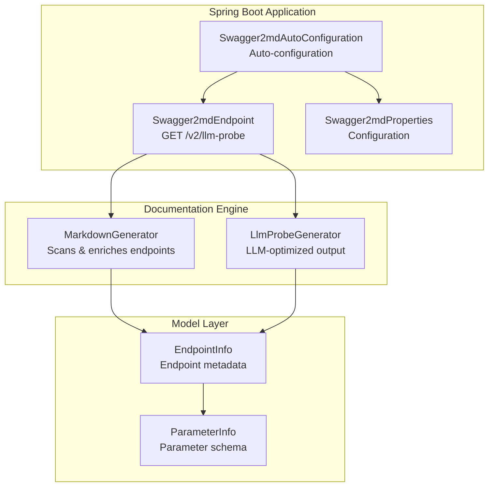
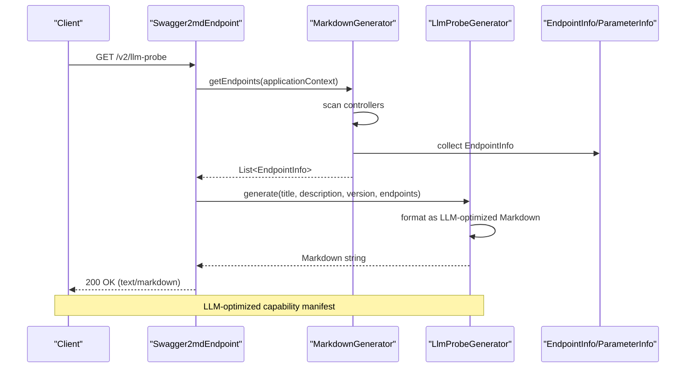
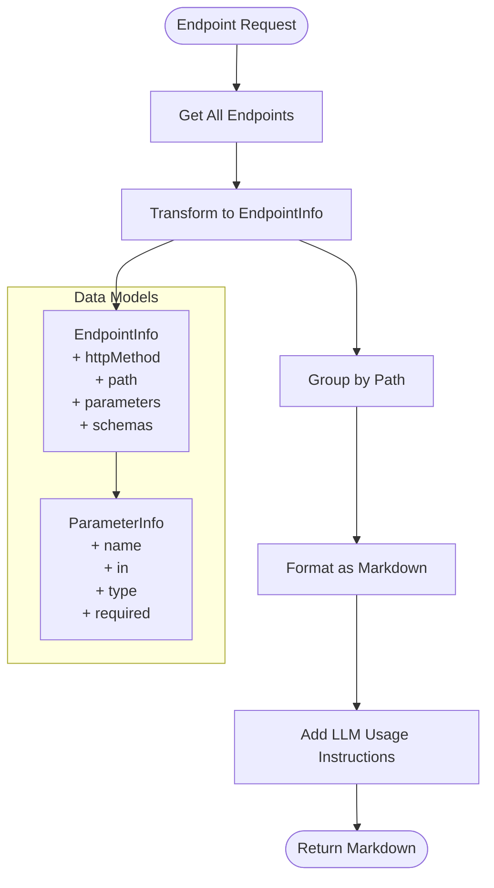
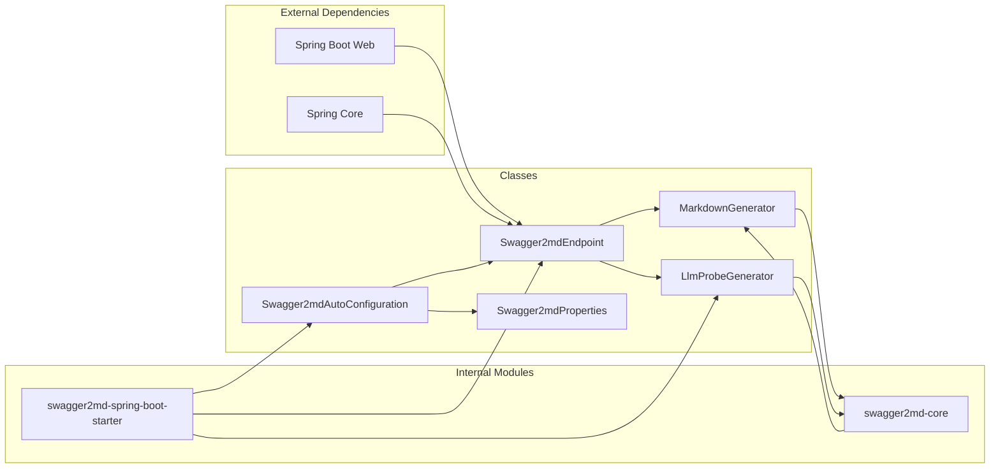

# LLM Probe Endpoint

<cite>
**Referenced Files in This Document**
- [Swagger2mdEndpoint.java](file://swagger2md-spring-boot-starter/src/main/java/com/github/tentac/swagger2md/autoconfigure/Swagger2mdEndpoint.java)
- [LlmProbeGenerator.java](file://swagger2md-spring-boot-starter/src/main/java/com/github/tentac/swagger2md/probe/LlmProbeGenerator.java)
- [Swagger2mdAutoConfiguration.java](file://swagger2md-spring-boot-starter/src/main/java/com/github/tentac/swagger2md/autoconfigure/Swagger2mdAutoConfiguration.java)
- [Swagger2mdProperties.java](file://swagger2md-spring-boot-starter/src/main/java/com/github/tentac/swagger2md/autoconfigure/Swagger2mdProperties.java)
- [MarkdownGenerator.java](file://swagger2md-core/src/main/java/com/github/tentac/swagger2md/core/MarkdownGenerator.java)
- [EndpointInfo.java](file://swagger2md-core/src/main/java/com/github/tentac/swagger2md/model/EndpointInfo.java)
- [ParameterInfo.java](file://swagger2md-core/src/main/java/com/github/tentac/swagger2md/model/ParameterInfo.java)
- [DemoApplication.java](file://swagger2md-demo/src/main/java/com/github/tentac/swagger2md/demo/DemoApplication.java)
- [application.yml](file://swagger2md-demo/src/main/resources/application.yml)
</cite>

## Table of Contents
1. [Introduction](#introduction)
2. [Project Structure](#project-structure)
3. [Core Components](#core-components)
4. [Architecture Overview](#architecture-overview)
5. [Detailed Component Analysis](#detailed-component-analysis)
6. [Dependency Analysis](#dependency-analysis)
7. [Performance Considerations](#performance-considerations)
8. [Troubleshooting Guide](#troubleshooting-guide)
9. [Conclusion](#conclusion)
10. [Appendices](#appendices)

## Introduction
This document provides API documentation for the GET /v2/llm-probe endpoint, which generates an LLM-optimized capability manifest for API endpoints. The endpoint returns a Markdown-formatted document designed for easy parsing by AI assistants and automated systems. It includes endpoint metadata, parameter specifications, and usage instructions tailored for LLM consumption.

## Project Structure
The LLM probe endpoint is part of the swagger2md-spring-boot-starter module and integrates with the core documentation generation pipeline. The endpoint is exposed by a Spring REST controller and backed by a specialized generator that formats endpoint data into a compact, machine-readable structure.

**Diagram sources**
- [Swagger2mdEndpoint.java:20-71](file://swagger2md-spring-boot-starter/src/main/java/com/github/tentac/swagger2md/autoconfigure/Swagger2mdEndpoint.java#L20-L71)
- [Swagger2mdAutoConfiguration.java:20-81](file://swagger2md-spring-boot-starter/src/main/java/com/github/tentac/swagger2md/autoconfigure/Swagger2mdAutoConfiguration.java#L20-L81)
- [MarkdownGenerator.java:15-155](file://swagger2md-core/src/main/java/com/github/tentac/swagger2md/core/MarkdownGenerator.java#L15-L155)
- [LlmProbeGenerator.java:15-160](file://swagger2md-spring-boot-starter/src/main/java/com/github/tentac/swagger2md/probe/LlmProbeGenerator.java#L15-L160)

**Section sources**
- [Swagger2mdEndpoint.java:20-71](file://swagger2md-spring-boot-starter/src/main/java/com/github/tentac/swagger2md/autoconfigure/Swagger2mdEndpoint.java#L20-L71)
- [Swagger2mdAutoConfiguration.java:20-81](file://swagger2md-spring-boot-starter/src/main/java/com/github/tentac/swagger2md/autoconfigure/Swagger2mdAutoConfiguration.java#L20-L81)

## Core Components
The LLM probe endpoint consists of several key components working together to deliver structured, AI-friendly API documentation:

- **Swagger2mdEndpoint**: REST controller that exposes the /v2/llm-probe endpoint
- **LlmProbeGenerator**: Specialized generator that transforms endpoint data into LLM-optimized Markdown
- **MarkdownGenerator**: Core documentation engine that scans and enriches endpoint metadata
- **Configuration Properties**: Runtime configuration for endpoint paths and filtering

Key characteristics:
- Returns text/markdown content type
- Uses configurable endpoint path (/v2/llm-probe by default)
- Integrates with IP access control filters
- Supports both human-readable Markdown and machine-readable JSON variants

**Section sources**
- [Swagger2mdEndpoint.java:20-71](file://swagger2md-spring-boot-starter/src/main/java/com/github/tentac/swagger2md/autoconfigure/Swagger2mdEndpoint.java#L20-L71)
- [LlmProbeGenerator.java:15-160](file://swagger2md-spring-boot-starter/src/main/java/com/github/tentac/swagger2md/probe/LlmProbeGenerator.java#L15-L160)
- [Swagger2mdProperties.java:12-126](file://swagger2md-spring-boot-starter/src/main/java/com/github/tentac/swagger2md/autoconfigure/Swagger2mdProperties.java#L12-L126)

## Architecture Overview
The LLM probe endpoint follows a layered architecture with clear separation of concerns:

**Diagram sources**
- [Swagger2mdEndpoint.java:52-61](file://swagger2md-spring-boot-starter/src/main/java/com/github/tentac/swagger2md/autoconfigure/Swagger2mdEndpoint.java#L52-L61)
- [MarkdownGenerator.java:111-145](file://swagger2md-core/src/main/java/com/github/tentac/swagger2md/core/MarkdownGenerator.java#L111-L145)
- [LlmProbeGenerator.java:26-146](file://swagger2md-spring-boot-starter/src/main/java/com/github/tentac/swagger2md/probe/LlmProbeGenerator.java#L26-L146)

## Detailed Component Analysis

### HTTP Endpoint Definition
The GET /v2/llm-probe endpoint is defined in the Swagger2mdEndpoint controller with the following characteristics:

- **HTTP Method**: GET
- **URL Pattern**: ${swagger2md.llm-probe-path:/v2/llm-probe}
- **Default Path**: /v2/llm-probe
- **Content Type**: text/markdown;charset=UTF-8
- **Security**: Subject to IP access filter configuration

The endpoint path is configurable via the swagger2md.llm-probe-path property, allowing customization of the endpoint location.

**Section sources**
- [Swagger2mdEndpoint.java:52-53](file://swagger2md-spring-boot-starter/src/main/java/com/github/tentac/swagger2md/autoconfigure/Swagger2mdEndpoint.java#L52-L53)
- [Swagger2mdProperties.java:95-101](file://swagger2md-spring-boot-starter/src/main/java/com/github/tentac/swagger2md/autoconfigure/Swagger2mdProperties.java#L95-L101)

### LLM-Optimized Output Format
The LlmProbeGenerator creates a structured Markdown document optimized for AI consumption:

#### Document Structure
1. **Header Section**: API metadata (title, version, description, total endpoints)
2. **Capability Summary**: Compact table view of all endpoints
3. **Capability Details**: Hierarchical breakdown grouped by path
4. **LLM Usage Instructions**: Practical guidance for AI systems

#### Endpoint Grouping Strategy
Endpoints are grouped by path for improved readability and LLM parsing:
- Grouped by path pattern
- Within each group, endpoints are ordered by HTTP method
- Each endpoint includes comprehensive parameter and schema information

#### Parameter Formatting for LLM Consumption
Parameters are presented in a compact, machine-readable format:
- Parameter name with type and location
- Required flag indicator
- Description and example values
- Structured bullet-point format

**Section sources**
- [LlmProbeGenerator.java:26-146](file://swagger2md-spring-boot-starter/src/main/java/com/github/tentac/swagger2md/probe/LlmProbeGenerator.java#L26-L146)

### Data Model and Transformation
The endpoint data transformation process involves several key steps:

**Diagram sources**
- [MarkdownGenerator.java:111-145](file://swagger2md-core/src/main/java/com/github/tentac/swagger2md/core/MarkdownGenerator.java#L111-L145)
- [EndpointInfo.java:9-164](file://swagger2md-core/src/main/java/com/github/tentac/swagger2md/model/EndpointInfo.java#L9-L164)
- [ParameterInfo.java:6-84](file://swagger2md-core/src/main/java/com/github/tentac/swagger2md/model/ParameterInfo.java#L6-L84)

### Endpoint Metadata Structure
Each endpoint in the LLM probe includes comprehensive metadata:

#### Endpoint Information
- **HTTP Method**: GET, POST, PUT, DELETE, etc.
- **Path**: Full request path with parameter placeholders
- **Operation ID**: Unique identifier for the endpoint
- **Summary**: Brief description of endpoint purpose
- **Description**: Detailed explanation of functionality
- **Deprecated Status**: Indicates if endpoint is deprecated

#### Parameter Specifications
Each parameter includes:
- **Name**: Parameter identifier
- **Location**: query, path, header, form, or body
- **Type**: Data type (string, integer, boolean, etc.)
- **Required**: Boolean indicating requirement
- **Description**: Parameter purpose
- **Example**: Sample value for reference

#### Schema Information
- **Request Body Type**: Content type for request bodies
- **Request Body Example**: JSON example for request payload
- **Response Type**: Content type for responses
- **Response Example**: JSON example for response payload

**Section sources**
- [EndpointInfo.java:11-52](file://swagger2md-core/src/main/java/com/github/tentac/swagger2md/model/EndpointInfo.java#L11-L52)
- [ParameterInfo.java:8-28](file://swagger2md-core/src/main/java/com/github/tentac/swagger2md/model/ParameterInfo.java#L8-L28)

### Configuration and Security
The LLM probe endpoint supports flexible configuration and security controls:

#### Configuration Properties
- **swagger2md.enabled**: Enable/disable the entire module
- **swagger2md.llm-probe-path**: Custom path for LLM probe endpoint
- **swagger2md.llm-probe-enabled**: Toggle for LLM probe functionality
- **swagger2md.ip-whitelist**: Allowed IP addresses/CIDR ranges
- **swagger2md.ip-blacklist**: Blocked IP addresses/CIDR ranges

#### IP Access Control
The auto-configuration registers an IP access filter that:
- Applies to all swagger2md endpoints
- Supports both whitelist and blacklist configurations
- Uses CIDR notation for network specifications

**Section sources**
- [Swagger2mdProperties.java:15-43](file://swagger2md-spring-boot-starter/src/main/java/com/github/tentac/swagger2md/autoconfigure/Swagger2mdProperties.java#L15-L43)
- [Swagger2mdAutoConfiguration.java:52-80](file://swagger2md-spring-boot-starter/src/main/java/com/github/tentac/swagger2md/autoconfigure/Swagger2mdAutoConfiguration.java#L52-L80)

## Dependency Analysis
The LLM probe endpoint has a well-defined dependency structure:

**Diagram sources**
- [Swagger2mdEndpoint.java:3-6](file://swagger2md-spring-boot-starter/src/main/java/com/github/tentac/swagger2md/autoconfigure/Swagger2mdEndpoint.java#L3-L6)
- [Swagger2mdAutoConfiguration.java:3-5](file://swagger2md-spring-boot-starter/src/main/java/com/github/tentac/swagger2md/autoconfigure/Swagger2mdAutoConfiguration.java#L3-L5)
- [MarkdownGenerator.java:3](file://swagger2md-core/src/main/java/com/github/tentac/swagger2md/core/MarkdownGenerator.java#L3)

**Section sources**
- [Swagger2mdEndpoint.java:3-6](file://swagger2md-spring-boot-starter/src/main/java/com/github/tentac/swagger2md/autoconfigure/Swagger2mdEndpoint.java#L3-L6)
- [Swagger2mdAutoConfiguration.java:3-5](file://swagger2md-spring-boot-starter/src/main/java/com/github/tentac/swagger2md/autoconfigure/Swagger2mdAutoConfiguration.java#L3-L5)

## Performance Considerations
The LLM probe endpoint is designed for efficient operation:

- **Lazy Loading**: Endpoints are discovered and processed on-demand
- **Memory Efficiency**: Streaming-based Markdown generation minimizes memory footprint
- **Caching**: No built-in caching; consider implementing application-level caching for high-traffic scenarios
- **Scalability**: Single-threaded processing; suitable for moderate traffic loads

## Troubleshooting Guide
Common issues and solutions for the LLM probe endpoint:

### Endpoint Not Found
**Symptoms**: 404 Not Found when accessing /v2/llm-probe
**Causes**:
- Module disabled via swagger2md.enabled=false
- Custom path configured differently
- IP address not whitelisted

**Solutions**:
- Verify swagger2md.enabled is true
- Check swagger2md.llm-probe-path configuration
- Ensure client IP is in whitelist or not blocked

### Empty or Minimal Output
**Symptoms**: Minimal or empty LLM probe content
**Causes**:
- No controllers found in base package
- Controllers not annotated appropriately
- Base package filtering excludes all controllers

**Solutions**:
- Verify base-package configuration matches controller packages
- Ensure controllers are annotated with @RestController
- Check controller visibility and accessibility

### JSON Output Issues
**Symptoms**: /v2/llm-probe/json returns unexpected format
**Causes**:
- Missing Jackson dependency
- Content negotiation issues

**Solutions**:
- Include spring-boot-starter-web dependency
- Verify application context includes necessary components

**Section sources**
- [Swagger2mdProperties.java:15-43](file://swagger2md-spring-boot-starter/src/main/java/com/github/tentac/swagger2md/autoconfigure/Swagger2mdProperties.java#L15-L43)
- [application.yml:8-24](file://swagger2md-demo/src/main/resources/application.yml#L8-L24)

## Conclusion
The GET /v2/llm-probe endpoint provides a comprehensive, LLM-optimized capability manifest for API endpoints. Its structured Markdown format, hierarchical organization, and detailed parameter specifications make it ideal for AI assistants and automated systems. The endpoint's modular design, flexible configuration, and security controls ensure it can be adapted to various deployment scenarios while maintaining optimal performance for AI consumption.

## Appendices

### API Reference Summary
- **Endpoint**: GET /v2/llm-probe
- **Content Type**: text/markdown;charset=UTF-8
- **Purpose**: LLM-optimized API capability manifest
- **Response Format**: Structured Markdown with endpoint metadata and parameter schemas

### Configuration Reference
- **swagger2md.enabled**: Enable/disable module (default: true)
- **swagger2md.llm-probe-path**: Endpoint path (default: /v2/llm-probe)
- **swagger2md.base-package**: Package to scan for controllers
- **swagger2md.ip-whitelist**: Allowed IP addresses/CIDR ranges
- **swagger2md.ip-blacklist**: Blocked IP addresses/CIDR ranges

### Integration Patterns
- **Direct API Consumption**: Call /v2/llm-probe to receive structured Markdown
- **Programmatic Access**: Use /v2/llm-probe/json for machine-readable JSON format
- **AI Assistant Integration**: Parse the Markdown structure for automated API discovery
- **Documentation Generation**: Use the endpoint as a source for dynamic documentation systems

**Section sources**
- [DemoApplication.java:8-12](file://swagger2md-demo/src/main/java/com/github/tentac/swagger2md/demo/DemoApplication.java#L8-L12)
- [application.yml:8-24](file://swagger2md-demo/src/main/resources/application.yml#L8-L24)