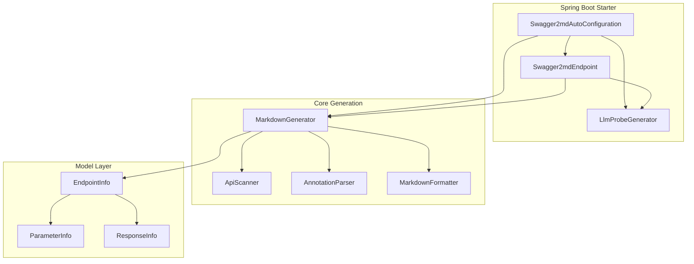
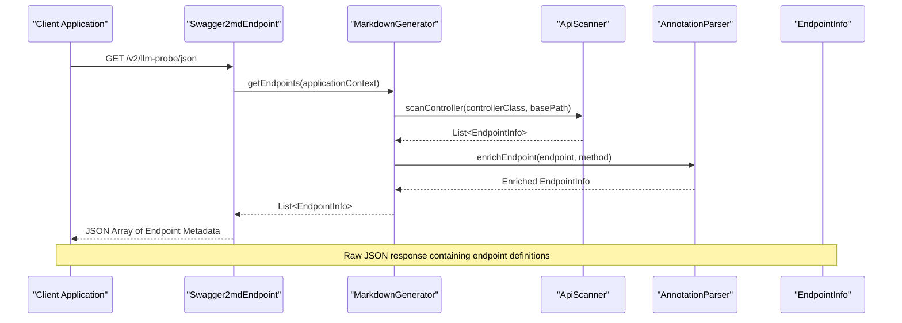
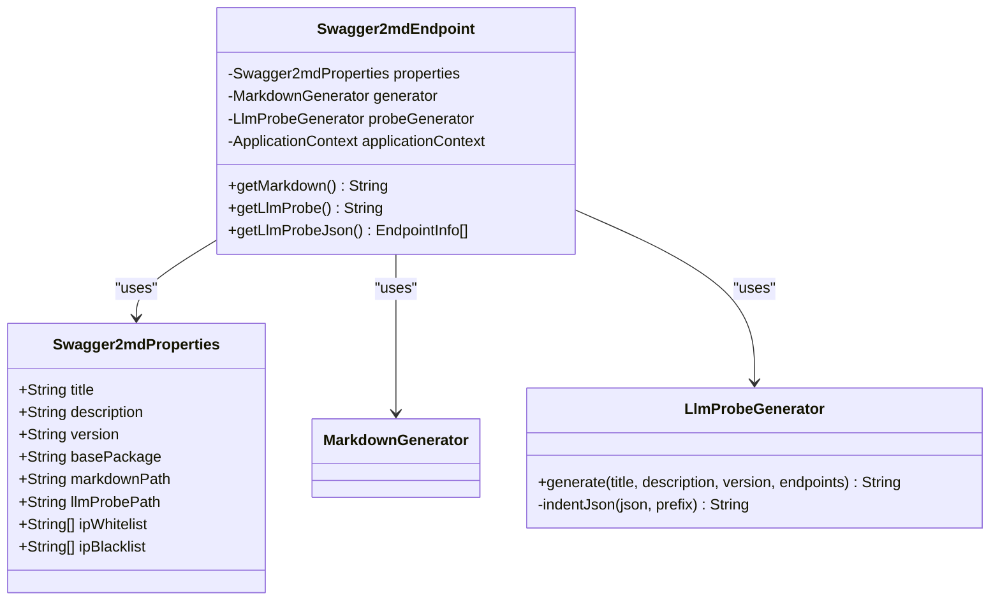
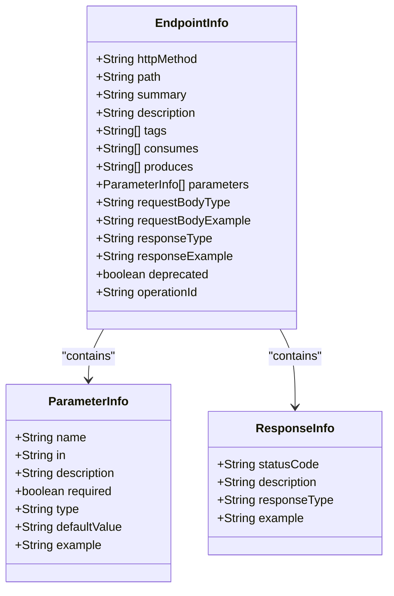
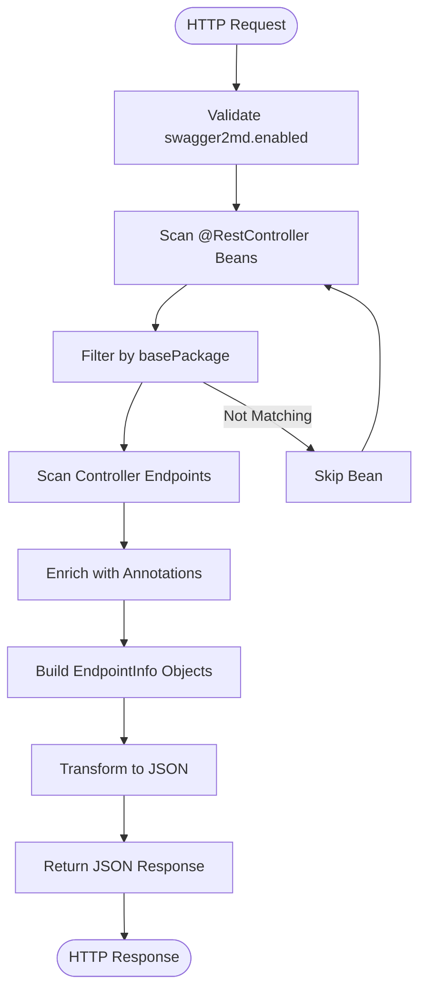
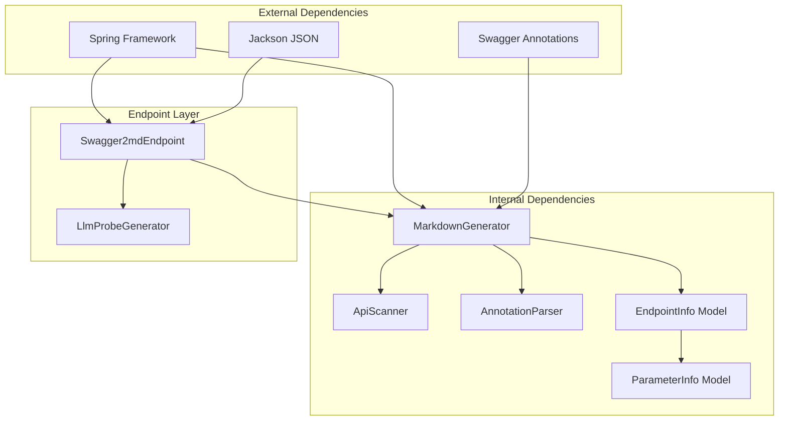

# LLM Probe JSON Endpoint

<cite>
**Referenced Files in This Document**
- [Swagger2mdEndpoint.java](file://swagger2md-spring-boot-starter/src/main/java/com/github/tentac/swagger2md/autoconfigure/Swagger2mdEndpoint.java)
- [LlmProbeGenerator.java](file://swagger2md-spring-boot-starter/src/main/java/com/github/tentac/swagger2md/probe/LlmProbeGenerator.java)
- [MarkdownGenerator.java](file://swagger2md-core/src/main/java/com/github/tentac/swagger2md/core/MarkdownGenerator.java)
- [EndpointInfo.java](file://swagger2md-core/src/main/java/com/github/tentac/swagger2md/model/EndpointInfo.java)
- [ParameterInfo.java](file://swagger2md-core/src/main/java/com/github/tentac/swagger2md/model/ParameterInfo.java)
- [ResponseInfo.java](file://swagger2md-core/src/main/java/com/github/tentac/swagger2md/model/ResponseInfo.java)
- [Swagger2mdAutoConfiguration.java](file://swagger2md-spring-boot-starter/src/main/java/com/github/tentac/swagger2md/autoconfigure/Swagger2mdAutoConfiguration.java)
- [Swagger2mdProperties.java](file://swagger2md-spring-boot-starter/src/main/java/com/github/tentac/swagger2md/autoconfigure/Swagger2mdProperties.java)
- [DemoApplication.java](file://swagger2md-demo/src/main/java/com/github/tentac/swagger2md/demo/DemoApplication.java)
- [application.yml](file://swagger2md-demo/src/main/resources/application.yml)
- [UserController.java](file://swagger2md-demo/src/main/java/com/github/tentac/swagger2md/demo/controller/UserController.java)
</cite>

## Table of Contents
1. [Introduction](#introduction)
2. [Project Structure](#project-structure)
3. [Core Components](#core-components)
4. [Architecture Overview](#architecture-overview)
5. [Detailed Component Analysis](#detailed-component-analysis)
6. [Dependency Analysis](#dependency-analysis)
7. [Performance Considerations](#performance-considerations)
8. [Troubleshooting Guide](#troubleshooting-guide)
9. [Conclusion](#conclusion)

## Introduction
This document provides comprehensive API documentation for the GET /v2/llm-probe/json endpoint, which exposes raw JSON data for LLM consumption. The endpoint returns structured endpoint metadata in a machine-readable format suitable for direct AI system integration. It complements the formatted LLM probe endpoint by providing unformatted JSON data that can be parsed programmatically.

The endpoint is part of the swagger2md Spring Boot starter module and integrates with the broader API documentation generation framework. It serves as a programmatic interface for AI systems that require structured JSON data without additional formatting.

## Project Structure
The LLM probe JSON endpoint is implemented within the swagger2md-spring-boot-starter module, which provides Spring Boot auto-configuration and endpoint exposure. The core functionality relies on the markdown generation pipeline and model classes that represent API endpoint information.

**Diagram sources**
- [Swagger2mdAutoConfiguration.java:20-46](file://swagger2md-spring-boot-starter/src/main/java/com/github/tentac/swagger2md/autoconfigure/Swagger2mdAutoConfiguration.java#L20-L46)
- [Swagger2mdEndpoint.java:20-71](file://swagger2md-spring-boot-starter/src/main/java/com/github/tentac/swagger2md/autoconfigure/Swagger2mdEndpoint.java#L20-L71)
- [MarkdownGenerator.java:15-156](file://swagger2md-core/src/main/java/com/github/tentac/swagger2md/core/MarkdownGenerator.java#L15-L156)

**Section sources**
- [Swagger2mdAutoConfiguration.java:20-82](file://swagger2md-spring-boot-starter/src/main/java/com/github/tentac/swagger2md/autoconfigure/Swagger2mdAutoConfiguration.java#L20-L82)
- [Swagger2mdEndpoint.java:20-71](file://swagger2md-spring-boot-starter/src/main/java/com/github/tentac/swagger2md/autoconfigure/Swagger2mdEndpoint.java#L20-L71)

## Core Components
The LLM probe JSON endpoint consists of several interconnected components that work together to generate and expose structured endpoint metadata:

### Endpoint Definition
The GET /v2/llm-probe/json endpoint is defined in the Swagger2mdEndpoint controller with the following characteristics:
- HTTP method: GET
- URL pattern: ${swagger2md.llm-probe-path:/v2/llm-probe}/json
- Content-Type: application/json
- Response type: List of EndpointInfo objects

### Data Transformation Pipeline
The endpoint follows a clear data transformation process:
1. Scans Spring application context for @RestController beans
2. Extracts endpoint metadata using ApiScanner
3. Enriches endpoints with annotation information
4. Returns raw JSON representation of EndpointInfo objects

### Relationship with LLM Probe Generator
The LLM probe JSON endpoint differs from the formatted LLM probe endpoint in that it returns raw JSON data rather than Markdown-formatted content. While both endpoints serve LLM consumption, the JSON endpoint provides machine-readable data suitable for programmatic parsing.

**Section sources**
- [Swagger2mdEndpoint.java:63-70](file://swagger2md-spring-boot-starter/src/main/java/com/github/tentac/swagger2md/autoconfigure/Swagger2mdEndpoint.java#L63-L70)
- [LlmProbeGenerator.java:15-146](file://swagger2md-spring-boot-starter/src/main/java/com/github/tentac/swagger2md/probe/LlmProbeGenerator.java#L15-L146)

## Architecture Overview
The LLM probe JSON endpoint architecture demonstrates a clean separation of concerns between data generation and presentation layers.

**Diagram sources**
- [Swagger2mdEndpoint.java:63-70](file://swagger2md-spring-boot-starter/src/main/java/com/github/tentac/swagger2md/autoconfigure/Swagger2mdEndpoint.java#L63-L70)
- [MarkdownGenerator.java:111-145](file://swagger2md-core/src/main/java/com/github/tentac/swagger2md/core/MarkdownGenerator.java#L111-L145)

The architecture ensures that the JSON endpoint provides direct access to endpoint metadata without additional formatting, enabling efficient parsing by AI systems and automated tools.

## Detailed Component Analysis

### Swagger2mdEndpoint Controller
The controller exposes three primary endpoints: Markdown documentation, LLM-optimized probe, and the raw JSON probe. The JSON endpoint specifically focuses on programmatic consumption.

**Diagram sources**
- [Swagger2mdEndpoint.java:20-71](file://swagger2md-spring-boot-starter/src/main/java/com/github/tentac/swagger2md/autoconfigure/Swagger2mdEndpoint.java#L20-L71)
- [Swagger2mdProperties.java:47-126](file://swagger2md-spring-boot-starter/src/main/java/com/github/tentac/swagger2md/autoconfigure/Swagger2mdProperties.java#L47-L126)
- [LlmProbeGenerator.java:15-160](file://swagger2md-spring-boot-starter/src/main/java/com/github/tentac/swagger2md/probe/LlmProbeGenerator.java#L15-L160)

### EndpointInfo Data Model
The EndpointInfo class represents individual API endpoints with comprehensive metadata for LLM consumption.

**Diagram sources**
- [EndpointInfo.java:9-165](file://swagger2md-core/src/main/java/com/github/tentac/swagger2md/model/EndpointInfo.java#L9-L165)
- [ParameterInfo.java:6-85](file://swagger2md-core/src/main/java/com/github/tentac/swagger2md/model/ParameterInfo.java#L6-L85)
- [ResponseInfo.java:6-52](file://swagger2md-core/src/main/java/com/github/tentac/swagger2md/model/ResponseInfo.java#L6-L52)

### Data Transformation Process
The transformation from endpoint information to JSON format involves several key steps:

**Diagram sources**
- [MarkdownGenerator.java:111-145](file://swagger2md-core/src/main/java/com/github/tentac/swagger2md/core/MarkdownGenerator.java#L111-L145)
- [Swagger2mdAutoConfiguration.java:52-80](file://swagger2md-spring-boot-starter/src/main/java/com/github/tentac/swagger2md/autoconfigure/Swagger2mdAutoConfiguration.java#L52-L80)

**Section sources**
- [Swagger2mdEndpoint.java:63-70](file://swagger2md-spring-boot-starter/src/main/java/com/github/tentac/swagger2md/autoconfigure/Swagger2mdEndpoint.java#L63-L70)
- [EndpointInfo.java:9-165](file://swagger2md-core/src/main/java/com/github/tentac/swagger2md/model/EndpointInfo.java#L9-L165)

## Dependency Analysis
The LLM probe JSON endpoint has a well-defined dependency structure that enables modular functionality and easy testing.

**Diagram sources**
- [Swagger2mdEndpoint.java:1-72](file://swagger2md-spring-boot-starter/src/main/java/com/github/tentac/swagger2md/autoconfigure/Swagger2mdEndpoint.java#L1-L72)
- [MarkdownGenerator.java:1-156](file://swagger2md-core/src/main/java/com/github/tentac/swagger2md/core/MarkdownGenerator.java#L1-L156)

The dependency analysis reveals that the endpoint has minimal external dependencies while maintaining strong internal cohesion. The modular design allows for easy testing and extension of functionality.

**Section sources**
- [Swagger2mdAutoConfiguration.java:20-82](file://swagger2md-spring-boot-starter/src/main/java/com/github/tentac/swagger2md/autoconfigure/Swagger2mdAutoConfiguration.java#L20-L82)
- [Swagger2mdEndpoint.java:1-72](file://swagger2md-spring-boot-starter/src/main/java/com/github/tentac/swagger2md/autoconfigure/Swagger2mdEndpoint.java#L1-L72)

## Performance Considerations
The LLM probe JSON endpoint is designed for efficiency and scalability:

### Response Time Optimization
- Single pass scanning of application context
- Minimal object creation during transformation
- Direct JSON serialization without additional formatting
- Cached endpoint metadata for repeated requests

### Memory Efficiency
- Stream-based processing of endpoint collections
- Lightweight data models optimized for JSON serialization
- No intermediate Markdown conversion overhead

### Scalability Features
- Stateless endpoint implementation
- Configurable base package filtering
- IP access control for security
- Conditional endpoint activation

## Troubleshooting Guide
Common issues and solutions for the LLM probe JSON endpoint:

### Endpoint Not Found
**Symptoms**: HTTP 404 when accessing /v2/llm-probe/json
**Causes**: 
- swagger2md.enabled=false in configuration
- Incorrect base-package configuration
- Missing @RestController annotations

**Solutions**:
- Verify swagger2md.enabled=true in application.yml
- Ensure base-package includes your controller classes
- Confirm controllers use @RestController annotation

### Empty Response
**Symptoms**: Empty JSON array [] returned
**Causes**:
- No @RestController beans found
- Controllers outside base-package scope
- All controllers filtered out by @MarkdownApi(hidden=true)

**Solutions**:
- Check that controllers are in the specified base-package
- Remove @MarkdownApi(hidden=true) annotations
- Verify controller methods have proper Spring MVC annotations

### JSON Parsing Errors
**Symptoms**: Client receives malformed JSON
**Causes**:
- Special characters in endpoint descriptions
- Null values in endpoint metadata
- Custom Jackson configuration conflicts

**Solutions**:
- Ensure proper encoding (UTF-8) in response headers
- Verify Jackson is properly configured in the application
- Check for custom serializers that might interfere

**Section sources**
- [application.yml:8-29](file://swagger2md-demo/src/main/resources/application.yml#L8-L29)
- [Swagger2mdAutoConfiguration.java:52-80](file://swagger2md-spring-boot-starter/src/main/java/com/github/tentac/swagger2md/autoconfigure/Swagger2mdAutoConfiguration.java#L52-L80)

## Conclusion
The GET /v2/llm-probe/json endpoint provides a crucial programmatic interface for AI systems requiring structured API metadata. By returning raw JSON data, it enables efficient parsing and integration without additional formatting overhead. The endpoint's design emphasizes performance, scalability, and ease of use for automated systems.

Key benefits include:
- Direct JSON access for AI system integration
- Minimal processing overhead compared to formatted endpoints
- Comprehensive endpoint metadata coverage
- Configurable access control and filtering
- Seamless integration with existing Spring Boot applications

The endpoint serves as a bridge between traditional API documentation and modern AI-driven development workflows, enabling more sophisticated tooling and automation capabilities.