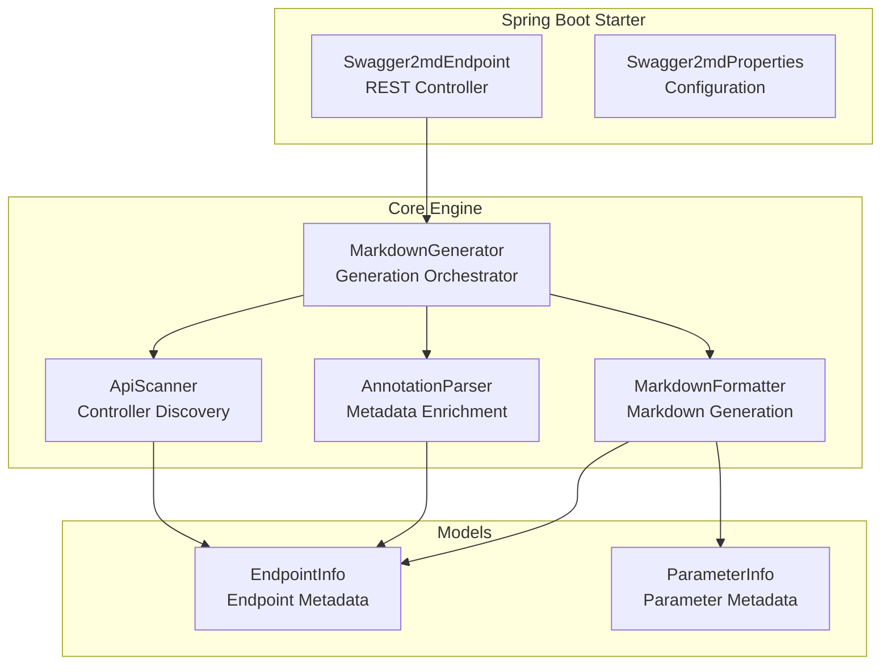
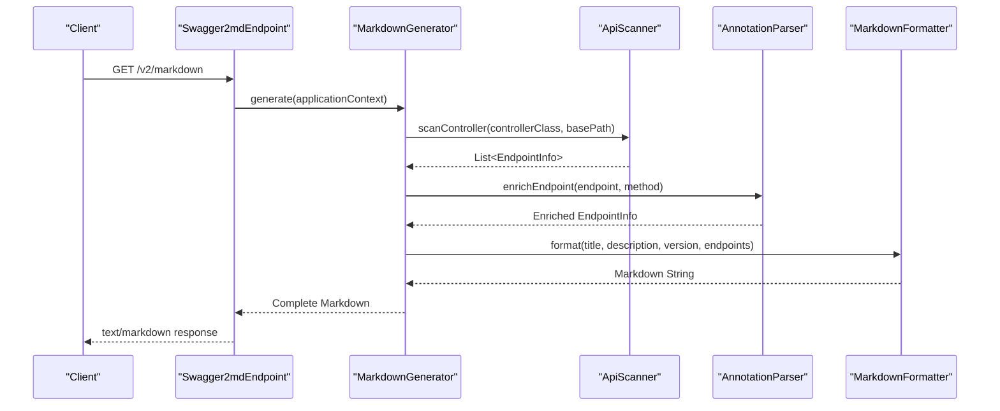
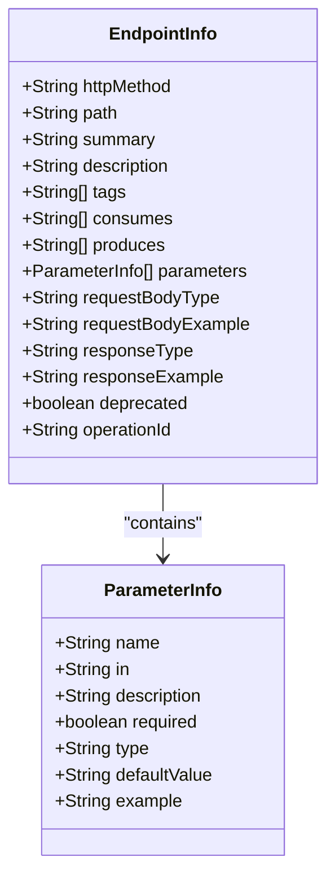
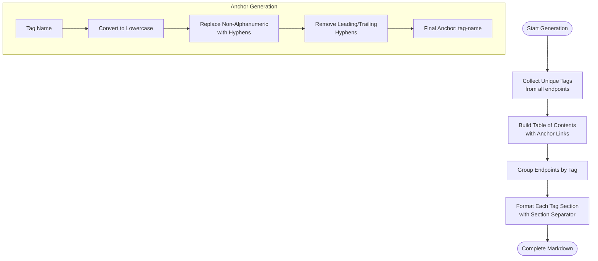
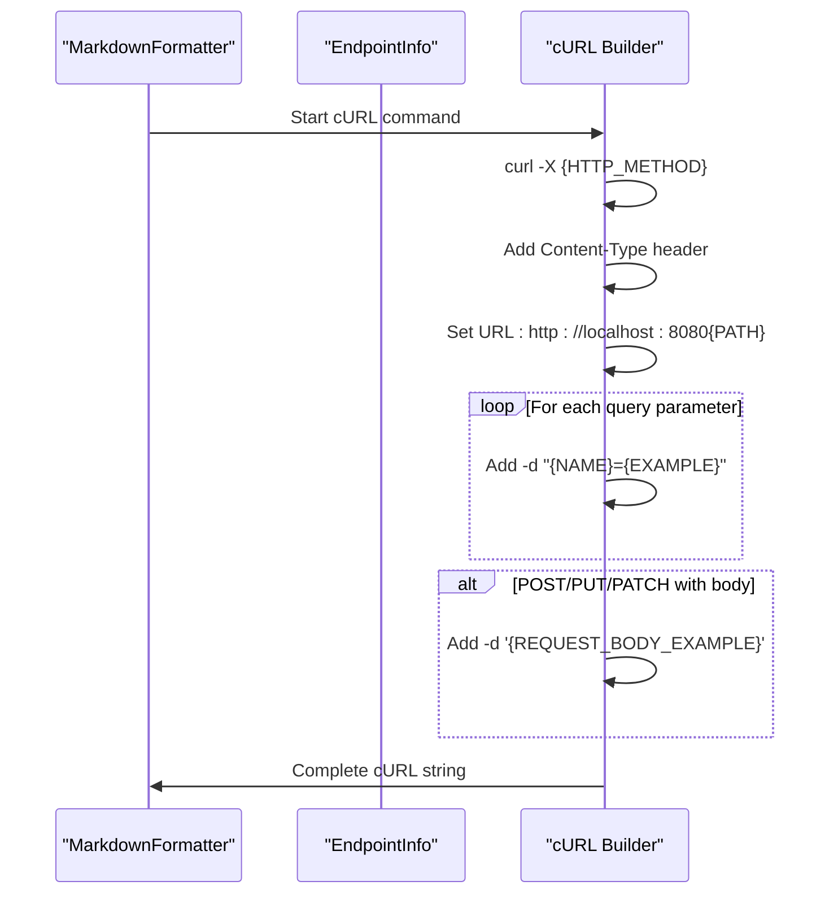
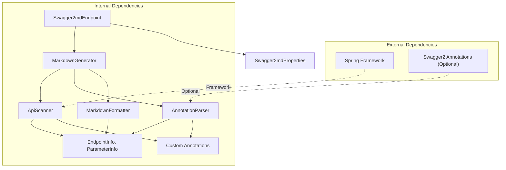

# Markdown Documentation Endpoint

<cite>
**Referenced Files in This Document**
- [Swagger2mdEndpoint.java](file://swagger2md-spring-boot-starter/src/main/java/com/github/tentac/swagger2md/autoconfigure/Swagger2mdEndpoint.java)
- [MarkdownFormatter.java](file://swagger2md-core/src/main/java/com/github/tentac/swagger2md/core/MarkdownFormatter.java)
- [MarkdownGenerator.java](file://swagger2md-core/src/main/java/com/github/tentac/swagger2md/core/MarkdownGenerator.java)
- [ApiScanner.java](file://swagger2md-core/src/main/java/com/github/tentac/swagger2md/core/ApiScanner.java)
- [AnnotationParser.java](file://swagger2md-core/src/main/java/com/github/tentac/swagger2md/core/AnnotationParser.java)
- [EndpointInfo.java](file://swagger2md-core/src/main/java/com/github/tentac/swagger2md/model/EndpointInfo.java)
- [ParameterInfo.java](file://swagger2md-core/src/main/java/com/github/tentac/swagger2md/model/ParameterInfo.java)
- [MarkdownApi.java](file://swagger2md-core/src/main/java/com/github/tentac/swagger2md/annotation/MarkdownApi.java)
- [MarkdownApiOperation.java](file://swagger2md-core/src/main/java/com/github/tentac/swagger2md/annotation/MarkdownApiOperation.java)
- [MarkdownApiParam.java](file://swagger2md-core/src/main/java/com/github/tentac/swagger2md/annotation/MarkdownApiParam.java)
- [Swagger2mdProperties.java](file://swagger2md-spring-boot-starter/src/main/java/com/github/tentac/swagger2md/autoconfigure/Swagger2mdProperties.java)
- [application.yml](file://swagger2md-demo/src/main/resources/application.yml)
- [UserController.java](file://swagger2md-demo/src/main/java/com/github/tentac/swagger2md/demo/controller/UserController.java)
</cite>

## Table of Contents
1. [Introduction](#introduction)
2. [Project Structure](#project-structure)
3. [Core Components](#core-components)
4. [Architecture Overview](#architecture-overview)
5. [Detailed Component Analysis](#detailed-component-analysis)
6. [Dependency Analysis](#dependency-analysis)
7. [Performance Considerations](#performance-considerations)
8. [Troubleshooting Guide](#troubleshooting-guide)
9. [Conclusion](#conclusion)

## Introduction
This document provides comprehensive API documentation for the GET /v2/markdown endpoint, which generates full Markdown API documentation from Spring controllers. The endpoint serves as a centralized way to export API documentation in a structured Markdown format, including table of contents, tag-based organization, and detailed endpoint sections with parameters, request/response examples, and cURL commands.

## Project Structure
The project consists of three main modules:
- swagger2md-core: Contains the core generation logic, models, and formatting utilities
- swagger2md-spring-boot-starter: Provides Spring Boot auto-configuration, REST endpoints, and property bindings
- swagger2md-demo: Demonstrates usage with a sample controller and configuration



**Diagram sources**
- [Swagger2mdEndpoint.java:20-47](file://swagger2md-spring-boot-starter/src/main/java/com/github/tentac/swagger2md/autoconfigure/Swagger2mdEndpoint.java#L20-L47)
- [MarkdownGenerator.java:15-98](file://swagger2md-core/src/main/java/com/github/tentac/swagger2md/core/MarkdownGenerator.java#L15-L98)
- [ApiScanner.java:22-56](file://swagger2md-core/src/main/java/com/github/tentac/swagger2md/core/ApiScanner.java#L22-L56)
- [AnnotationParser.java:18-35](file://swagger2md-core/src/main/java/com/github/tentac/swagger2md/core/AnnotationParser.java#L18-L35)
- [MarkdownFormatter.java:11-71](file://swagger2md-core/src/main/java/com/github/tentac/swagger2md/core/MarkdownFormatter.java#L11-L71)

**Section sources**
- [Swagger2mdEndpoint.java:1-72](file://swagger2md-spring-boot-starter/src/main/java/com/github/tentac/swagger2md/autoconfigure/Swagger2mdEndpoint.java#L1-L72)
- [MarkdownGenerator.java:1-156](file://swagger2md-core/src/main/java/com/github/tentac/swagger2md/core/MarkdownGenerator.java#L1-L156)

## Core Components
The GET /v2/markdown endpoint is implemented through a layered architecture:

### Endpoint Definition
The endpoint is defined in the Swagger2mdEndpoint class with the following characteristics:
- HTTP Method: GET
- URL Pattern: ${swagger2md.markdown-path:/v2/markdown} (defaults to /v2/markdown)
- Response Type: text/markdown;charset=UTF-8
- Access Control: Conditional on swagger2md.enabled property

### Generation Pipeline
The endpoint delegates to MarkdownGenerator.generate(), which orchestrates three core phases:
1. **Scanning**: ApiScanner discovers Spring controllers and endpoints
2. **Enrichment**: AnnotationParser adds metadata from annotations
3. **Formatting**: MarkdownFormatter transforms metadata into Markdown

**Section sources**
- [Swagger2mdEndpoint.java:40-47](file://swagger2md-spring-boot-starter/src/main/java/com/github/tentac/swagger2md/autoconfigure/Swagger2mdEndpoint.java#L40-L47)
- [MarkdownGenerator.java:54-98](file://swagger2md-core/src/main/java/com/github/tentac/swagger2md/core/MarkdownGenerator.java#L54-L98)

## Architecture Overview
The GET /v2/markdown endpoint follows a clean separation of concerns with distinct responsibilities:



**Diagram sources**
- [Swagger2mdEndpoint.java:43-47](file://swagger2md-spring-boot-starter/src/main/java/com/github/tentac/swagger2md/autoconfigure/Swagger2mdEndpoint.java#L43-L47)
- [MarkdownGenerator.java:54-98](file://swagger2md-core/src/main/java/com/github/tentac/swagger2md/core/MarkdownGenerator.java#L54-L98)
- [ApiScanner.java:38-56](file://swagger2md-core/src/main/java/com/github/tentac/swagger2md/core/ApiScanner.java#L38-L56)
- [AnnotationParser.java:26-35](file://swagger2md-core/src/main/java/com/github/tentac/swagger2md/core/AnnotationParser.java#L26-L35)
- [MarkdownFormatter.java:24-71](file://swagger2md-core/src/main/java/com/github/tentac/swagger2md/core/MarkdownFormatter.java#L24-L71)

## Detailed Component Analysis

### Endpoint Metadata Model
The EndpointInfo class represents a single API endpoint with comprehensive metadata:



**Diagram sources**
- [EndpointInfo.java:9-165](file://swagger2md-core/src/main/java/com/github/tentac/swagger2md/model/EndpointInfo.java#L9-L165)
- [ParameterInfo.java:6-85](file://swagger2md-core/src/main/java/com/github/tentac/swagger2md/model/ParameterInfo.java#L6-L85)

### Tag-Based Organization
The MarkdownFormatter organizes endpoints by tags with automatic anchor link generation:



**Diagram sources**
- [MarkdownFormatter.java:36-64](file://swagger2md-core/src/main/java/com/github/tentac/swagger2md/core/MarkdownFormatter.java#L36-L64)
- [MarkdownFormatter.java:198-200](file://swagger2md-core/src/main/java/com/github/tentac/swagger2md/core/MarkdownFormatter.java#L198-L200)

### Request Parameter Processing
The ApiScanner handles various parameter types with Spring annotation support:

```mermaid
flowchart TD
ParamStart([Parameter Detected]) --> CheckAnnotation{"Annotation Type?"}
CheckAnnotation --> |@RequestParam| QueryParam["Create Query Parameter<br/>Required: from annotation"]
CheckAnnotation --> |@PathVariable| PathParam["Create Path Parameter<br/>Required: true"]
CheckAnnotation --> |@RequestHeader| HeaderParam["Create Header Parameter<br/>Required: from annotation"]
CheckAnnotation --> |@RequestBody| BodyParam["Create Body Parameter<br/>Required: from annotation"]
CheckAnnotation --> |None| Fallback["Fallback to Query Parameter"]
QueryParam --> SetDefaults["Set Defaults<br/>name, type, description"]
PathParam --> SetDefaults
HeaderParam --> SetDefaults
BodyParam --> SetDefaults
Fallback --> SetDefaults
SetDefaults --> EndParam([Parameter Ready])
```

**Diagram sources**
- [ApiScanner.java:279-331](file://swagger2md-core/src/main/java/com/github/tentac/swagger2md/core/ApiScanner.java#L279-L331)
- [AnnotationParser.java:136-174](file://swagger2md-core/src/main/java/com/github/tentac/swagger2md/core/AnnotationParser.java#L136-L174)

### cURL Example Generation
The MarkdownFormatter generates practical cURL examples for each endpoint:



**Diagram sources**
- [MarkdownFormatter.java:161-190](file://swagger2md-core/src/main/java/com/github/tentac/swagger2md/core/MarkdownFormatter.java#L161-L190)

## Dependency Analysis
The system exhibits clean dependency relationships with clear separation of concerns:



**Diagram sources**
- [Swagger2mdEndpoint.java:3-38](file://swagger2md-spring-boot-starter/src/main/java/com/github/tentac/swagger2md/autoconfigure/Swagger2mdEndpoint.java#L3-L38)
- [MarkdownGenerator.java:17-29](file://swagger2md-core/src/main/java/com/github/tentac/swagger2md/core/MarkdownGenerator.java#L17-L29)
- [ApiScanner.java:16-27](file://swagger2md-core/src/main/java/com/github/tentac/swagger2md/core/ApiScanner.java#L16-L27)
- [AnnotationParser.java:3-8](file://swagger2md-core/src/main/java/com/github/tentac/swagger2md/core/AnnotationParser.java#L3-L8)

### Configuration Properties
The endpoint supports extensive customization through Swagger2mdProperties:

| Property | Default Value | Description |
|----------|---------------|-------------|
| swagger2md.enabled | true | Enable/disable the endpoint |
| swagger2md.title | "API Documentation" | API title in documentation header |
| swagger2md.description | "" | API description |
| swagger2md.version | "1.0.0" | API version |
| swagger2md.base-package | "" | Package filter for controller scanning |
| swagger2md.markdown-path | "/v2/markdown" | Main documentation endpoint path |
| swagger2md.llm-probe-path | "/v2/llm-probe" | LLM optimization endpoint path |
| swagger2md.llm-probe-enabled | true | Enable LLM probe endpoints |

**Section sources**
- [Swagger2mdProperties.java:12-127](file://swagger2md-spring-boot-starter/src/main/java/com/github/tentac/swagger2md/autoconfigure/Swagger2mdProperties.java#L12-L127)
- [application.yml:8-24](file://swagger2md-demo/src/main/resources/application.yml#L8-L24)

## Performance Considerations
The generation process has the following performance characteristics:
- **Scanning Phase**: Linear complexity O(n) where n is the number of controller methods
- **Annotation Processing**: Constant overhead per method with reflection
- **JSON Example Generation**: Depends on object complexity for request/response bodies
- **Memory Usage**: Proportional to total endpoint count and example sizes
- **Caching**: No built-in caching; consider implementing application-level caching for high-traffic scenarios

## Troubleshooting Guide
Common issues and solutions:

### Endpoint Not Found
**Symptoms**: 404 error when accessing /v2/markdown
**Causes**: 
- swagger2md.enabled set to false
- Controllers not in base-package filter
- Spring Boot not scanning for @RestController

**Solutions**:
- Verify swagger2md.enabled: true in configuration
- Check base-package setting matches controller package
- Ensure controllers are annotated with @RestController

### Empty Documentation Generated
**Symptoms**: Blank or minimal Markdown output
**Causes**:
- No controllers found with @RestController
- All controllers filtered out by base-package
- Hidden controllers via @MarkdownApi(hidden=true)

**Solutions**:
- Verify controller classes exist and are scanned
- Check package filtering configuration
- Review @MarkdownApi annotations for hidden flag

### Incorrect Tag Grouping
**Symptoms**: Endpoints not grouped properly
**Causes**:
- Missing @Api or @MarkdownApi annotations
- Conflicting tag definitions between class and method levels

**Solutions**:
- Add appropriate @Api or @MarkdownApi annotations
- Ensure consistent tag definitions across class and method levels

**Section sources**
- [Swagger2mdEndpoint.java:21-38](file://swagger2md-spring-boot-starter/src/main/java/com/github/tentac/swagger2md/autoconfigure/Swagger2mdEndpoint.java#L21-L38)
- [MarkdownGenerator.java:58-96](file://swagger2md-core/src/main/java/com/github/tentac/swagger2md/core/MarkdownGenerator.java#L58-L96)
- [ApiScanner.java:98-137](file://swagger2md-core/src/main/java/com/github/tentac/swagger2md/core/ApiScanner.java#L98-L137)

## Conclusion
The GET /v2/markdown endpoint provides a robust, extensible solution for generating comprehensive API documentation in Markdown format. Its architecture supports both Swagger2 and custom annotation systems, offers flexible configuration options, and produces well-structured documentation with tag-based organization, parameter tables, and practical cURL examples. The modular design enables easy integration into Spring Boot applications while maintaining clean separation of concerns between scanning, enrichment, and formatting phases.