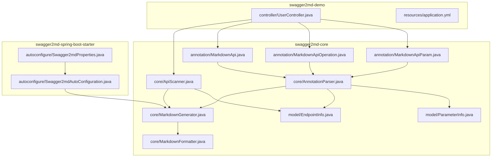
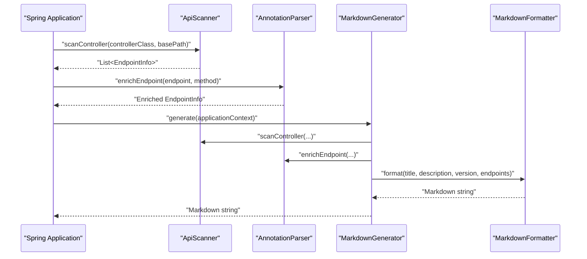
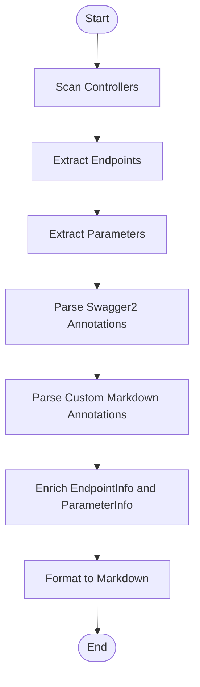
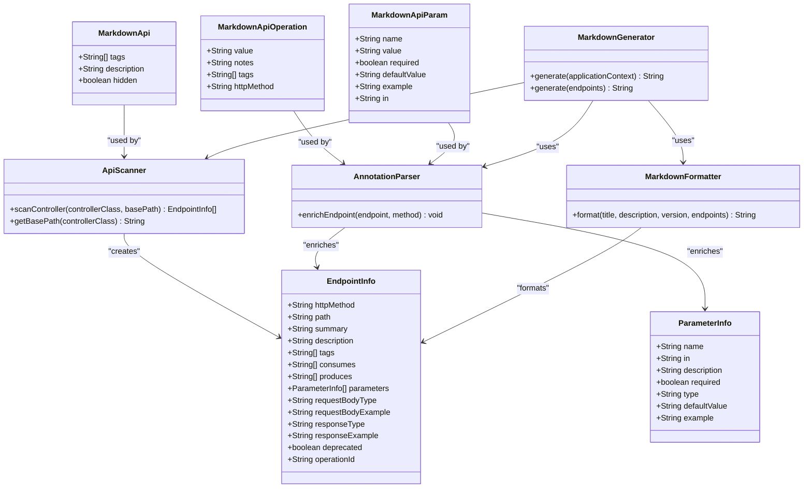

# Annotation System

<cite>
**Referenced Files in This Document**
- [MarkdownApi.java](file://swagger2md-core/src/main/java/com/github/tentac/swagger2md/annotation/MarkdownApi.java)
- [MarkdownApiOperation.java](file://swagger2md-core/src/main/java/com/github/tentac/swagger2md/annotation/MarkdownApiOperation.java)
- [MarkdownApiParam.java](file://swagger2md-core/src/main/java/com/github/tentac/swagger2md/annotation/MarkdownApiParam.java)
- [AnnotationParser.java](file://swagger2md-core/src/main/java/com/github/tentac/swagger2md/core/AnnotationParser.java)
- [ApiScanner.java](file://swagger2md-core/src/main/java/com/github/tentac/swagger2md/core/ApiScanner.java)
- [MarkdownGenerator.java](file://swagger2md-core/src/main/java/com/github/tentac/swagger2md/core/MarkdownGenerator.java)
- [MarkdownFormatter.java](file://swagger2md-core/src/main/java/com/github/tentac/swagger2md/core/MarkdownFormatter.java)
- [EndpointInfo.java](file://swagger2md-core/src/main/java/com/github/tentac/swagger2md/model/EndpointInfo.java)
- [ParameterInfo.java](file://swagger2md-core/src/main/java/com/github/tentac/swagger2md/model/ParameterInfo.java)
- [UserController.java](file://swagger2md-demo/src/main/java/com/github/tentac/swagger2md/demo/controller/UserController.java)
- [Swagger2mdAutoConfiguration.java](file://swagger2md-spring-boot-starter/src/main/java/com/github/tentac/swagger2md/autoconfigure/Swagger2mdAutoConfiguration.java)
- [Swagger2mdProperties.java](file://swagger2md-spring-boot-starter/src/main/java/com/github/tentac/swagger2md/autoconfigure/Swagger2mdProperties.java)
- [application.yml](file://swagger2md-demo/src/main/resources/application.yml)
</cite>

## Table of Contents
1. [Introduction](#introduction)
2. [Project Structure](#project-structure)
3. [Core Components](#core-components)
4. [Architecture Overview](#architecture-overview)
5. [Detailed Component Analysis](#detailed-component-analysis)
6. [Dependency Analysis](#dependency-analysis)
7. [Performance Considerations](#performance-considerations)
8. [Troubleshooting Guide](#troubleshooting-guide)
9. [Conclusion](#conclusion)
10. [Appendices](#appendices)

## Introduction
This document explains the annotation system that powers Swagger2md’s documentation generation. It covers both Swagger2 annotation support and custom Markdown annotation capabilities. The system provides three annotation types:
- MarkdownApi: Controller-level documentation and grouping
- MarkdownApiOperation: Endpoint-level summaries and notes
- MarkdownApiParam: Parameter-level documentation, validation, and examples

It documents the annotation processing pipeline, conversion from Swagger2 annotations to Markdown format, custom annotation syntax, configuration options, parameter validation, return value specifications, and integration with the broader documentation generation process.

## Project Structure
The annotation system spans three modules:
- swagger2md-core: Contains annotations, scanning, parsing, formatting, and model classes
- swagger2md-demo: Demonstrates usage with a sample controller
- swagger2md-spring-boot-starter: Provides Spring Boot auto-configuration and properties

**Diagram sources**
- [MarkdownApi.java:1-25](file://swagger2md-core/src/main/java/com/github/tentac/swagger2md/annotation/MarkdownApi.java#L1-L25)
- [MarkdownApiOperation.java:1-28](file://swagger2md-core/src/main/java/com/github/tentac/swagger2md/annotation/MarkdownApiOperation.java#L1-L28)
- [MarkdownApiParam.java:1-34](file://swagger2md-core/src/main/java/com/github/tentac/swagger2md/annotation/MarkdownApiParam.java#L1-L34)
- [ApiScanner.java:1-323](file://swagger2md-core/src/main/java/com/github/tentac/swagger2md/core/ApiScanner.java#L1-L323)
- [AnnotationParser.java:1-211](file://swagger2md-core/src/main/java/com/github/tentac/swagger2md/core/AnnotationParser.java#L1-L211)
- [MarkdownGenerator.java:1-156](file://swagger2md-core/src/main/java/com/github/tentac/swagger2md/core/MarkdownGenerator.java#L1-L156)
- [MarkdownFormatter.java:1-198](file://swagger2md-core/src/main/java/com/github/tentac/swagger2md/core/MarkdownFormatter.java#L1-L198)
- [EndpointInfo.java:1-165](file://swagger2md-core/src/main/java/com/github/tentac/swagger2md/model/EndpointInfo.java#L1-L165)
- [ParameterInfo.java:1-85](file://swagger2md-core/src/main/java/com/github/tentac/swagger2md/model/ParameterInfo.java#L1-L85)
- [UserController.java:1-187](file://swagger2md-demo/src/main/java/com/github/tentac/swagger2md/demo/controller/UserController.java#L1-L187)
- [Swagger2mdAutoConfiguration.java:1-82](file://swagger2md-spring-boot-starter/src/main/java/com/github/tentac/swagger2md/autoconfigure/Swagger2mdAutoConfiguration.java#L1-L82)
- [Swagger2mdProperties.java:1-127](file://swagger2md-spring-boot-starter/src/main/java/com/github/tentac/swagger2md/autoconfigure/Swagger2mdProperties.java#L1-L127)

**Section sources**
- [MarkdownApi.java:1-25](file://swagger2md-core/src/main/java/com/github/tentac/swagger2md/annotation/MarkdownApi.java#L1-L25)
- [MarkdownApiOperation.java:1-28](file://swagger2md-core/src/main/java/com/github/tentac/swagger2md/annotation/MarkdownApiOperation.java#L1-L28)
- [MarkdownApiParam.java:1-34](file://swagger2md-core/src/main/java/com/github/tentac/swagger2md/annotation/MarkdownApiParam.java#L1-L34)
- [ApiScanner.java:1-323](file://swagger2md-core/src/main/java/com/github/tentac/swagger2md/core/ApiScanner.java#L1-L323)
- [AnnotationParser.java:1-211](file://swagger2md-core/src/main/java/com/github/tentac/swagger2md/core/AnnotationParser.java#L1-L211)
- [MarkdownGenerator.java:1-156](file://swagger2md-core/src/main/java/com/github/tentac/swagger2md/core/MarkdownGenerator.java#L1-L156)
- [MarkdownFormatter.java:1-198](file://swagger2md-core/src/main/java/com/github/tentac/swagger2md/core/MarkdownFormatter.java#L1-L198)
- [EndpointInfo.java:1-165](file://swagger2md-core/src/main/java/com/github/tentac/swagger2md/model/EndpointInfo.java#L1-L165)
- [ParameterInfo.java:1-85](file://swagger2md-core/src/main/java/com/github/tentac/swagger2md/model/ParameterInfo.java#L1-L85)
- [UserController.java:1-187](file://swagger2md-demo/src/main/java/com/github/tentac/swagger2md/demo/controller/UserController.java#L1-L187)
- [Swagger2mdAutoConfiguration.java:1-82](file://swagger2md-spring-boot-starter/src/main/java/com/github/tentac/swagger2md/autoconfigure/Swagger2mdAutoConfiguration.java#L1-L82)
- [Swagger2mdProperties.java:1-127](file://swagger2md-spring-boot-starter/src/main/java/com/github/tentac/swagger2md/autoconfigure/Swagger2mdProperties.java#L1-L127)
- [application.yml:1-29](file://swagger2md-demo/src/main/resources/application.yml#L1-L29)

## Core Components
- Annotations define documentation metadata at controller, endpoint, and parameter levels.
- ApiScanner discovers endpoints from Spring controllers and extracts basic metadata.
- AnnotationParser enriches EndpointInfo and ParameterInfo with Swagger2 and custom annotations.
- MarkdownGenerator orchestrates scanning, parsing, and formatting into Markdown.
- MarkdownFormatter renders the final Markdown with grouping, tables, and cURL examples.
- Model classes represent endpoints and parameters for downstream formatting.

Key responsibilities:
- Controller-level: MarkdownApi sets tags and description; hidden flag excludes controllers.
- Endpoint-level: MarkdownApiOperation sets summary, notes, tags, and HTTP method override.
- Parameter-level: MarkdownApiParam sets name, description, required, default, example, and location.

**Section sources**
- [MarkdownApi.java:1-25](file://swagger2md-core/src/main/java/com/github/tentac/swagger2md/annotation/MarkdownApi.java#L1-L25)
- [MarkdownApiOperation.java:1-28](file://swagger2md-core/src/main/java/com/github/tentac/swagger2md/annotation/MarkdownApiOperation.java#L1-L28)
- [MarkdownApiParam.java:1-34](file://swagger2md-core/src/main/java/com/github/tentac/swagger2md/annotation/MarkdownApiParam.java#L1-L34)
- [ApiScanner.java:94-158](file://swagger2md-core/src/main/java/com/github/tentac/swagger2md/core/ApiScanner.java#L94-L158)
- [AnnotationParser.java:26-121](file://swagger2md-core/src/main/java/com/github/tentac/swagger2md/core/AnnotationParser.java#L26-L121)
- [MarkdownGenerator.java:54-99](file://swagger2md-core/src/main/java/com/github/tentac/swagger2md/core/MarkdownGenerator.java#L54-L99)
- [MarkdownFormatter.java:24-71](file://swagger2md-core/src/main/java/com/github/tentac/swagger2md/core/MarkdownFormatter.java#L24-L71)
- [EndpointInfo.java:9-52](file://swagger2md-core/src/main/java/com/github/tentac/swagger2md/model/EndpointInfo.java#L9-L52)
- [ParameterInfo.java:6-28](file://swagger2md-core/src/main/java/com/github/tentac/swagger2md/model/ParameterInfo.java#L6-L28)

## Architecture Overview
The annotation system integrates with Spring MVC controllers and Swagger2 annotations to produce Markdown documentation. The flow:
1. Controllers are scanned for REST endpoints.
2. Endpoint metadata is extracted (HTTP method, path, consumes/produces).
3. Parameters are inferred from Spring annotations (path, query, header, body).
4. Annotations are parsed to enrich summaries, descriptions, tags, and parameter details.
5. Output is formatted into Markdown with grouping and cURL examples.

**Diagram sources**
- [ApiScanner.java:34-52](file://swagger2md-core/src/main/java/com/github/tentac/swagger2md/core/ApiScanner.java#L34-L52)
- [AnnotationParser.java:26-35](file://swagger2md-core/src/main/java/com/github/tentac/swagger2md/core/AnnotationParser.java#L26-L35)
- [MarkdownGenerator.java:54-99](file://swagger2md-core/src/main/java/com/github/tentac/swagger2md/core/MarkdownGenerator.java#L54-L99)
- [MarkdownFormatter.java:24-71](file://swagger2md-core/src/main/java/com/github/tentac/swagger2md/core/MarkdownFormatter.java#L24-L71)

## Detailed Component Analysis

### Annotation Types and Syntax
- MarkdownApi (controller-level)
  - Purpose: Define tags, description, and visibility for a controller.
  - Fields: tags (array), description (string), hidden (boolean).
  - Behavior: Used by ApiScanner to derive class-level tags and description; hidden excludes controllers from generation.

- MarkdownApiOperation (endpoint-level)
  - Purpose: Provide endpoint-level summary and notes; override HTTP method if needed.
  - Fields: value (summary), notes (description), tags (array), httpMethod (override).
  - Behavior: Used by AnnotationParser to enrich EndpointInfo.

- MarkdownApiParam (parameter-level)
  - Purpose: Describe parameter name, description, required flag, defaults, examples, and location.
  - Fields: name, value, required, defaultValue, example, in (query/path/header/form/body).
  - Behavior: Used by AnnotationParser to enrich ParameterInfo.

Validation and defaults:
- Empty or default values are ignored during enrichment to avoid overriding explicit metadata.
- Parameter location inference falls back to query if no Spring parameter annotation is present.

**Section sources**
- [MarkdownApi.java:16-24](file://swagger2md-core/src/main/java/com/github/tentac/swagger2md/annotation/MarkdownApi.java#L16-L24)
- [MarkdownApiOperation.java:16-27](file://swagger2md-core/src/main/java/com/github/tentac/swagger2md/annotation/MarkdownApiOperation.java#L16-L27)
- [MarkdownApiParam.java:16-33](file://swagger2md-core/src/main/java/com/github/tentac/swagger2md/annotation/MarkdownApiParam.java#L16-L33)
- [ApiScanner.java:245-297](file://swagger2md-core/src/main/java/com/github/tentac/swagger2md/core/ApiScanner.java#L245-L297)
- [AnnotationParser.java:179-185](file://swagger2md-core/src/main/java/com/github/tentac/swagger2md/core/AnnotationParser.java#L179-L185)

### Annotation Processing Pipeline
The pipeline proceeds in stages:
1. Controller discovery and base path extraction
2. Endpoint extraction from Spring mapping annotations
3. Parameter extraction from Spring parameter annotations
4. Enrichment from Swagger2 annotations (when present)
5. Enrichment from custom Markdown annotations
6. Formatting into Markdown

Key steps:
- ApiScanner detects REST controllers and mapping annotations, builds paths, and infers parameter locations.
- AnnotationParser reads both Swagger2 and custom annotations to populate EndpointInfo and ParameterInfo.
- MarkdownGenerator orchestrates scanning and parsing across all REST controllers and delegates formatting to MarkdownFormatter.

**Diagram sources**
- [ApiScanner.java:34-52](file://swagger2md-core/src/main/java/com/github/tentac/swagger2md/core/ApiScanner.java#L34-L52)
- [AnnotationParser.java:26-35](file://swagger2md-core/src/main/java/com/github/tentac/swagger2md/core/AnnotationParser.java#L26-L35)
- [MarkdownGenerator.java:54-99](file://swagger2md-core/src/main/java/com/github/tentac/swagger2md/core/MarkdownGenerator.java#L54-L99)
- [MarkdownFormatter.java:24-71](file://swagger2md-core/src/main/java/com/github/tentac/swagger2md/core/MarkdownFormatter.java#L24-L71)

**Section sources**
- [ApiScanner.java:160-243](file://swagger2md-core/src/main/java/com/github/tentac/swagger2md/core/ApiScanner.java#L160-L243)
- [AnnotationParser.java:26-121](file://swagger2md-core/src/main/java/com/github/tentac/swagger2md/core/AnnotationParser.java#L26-L121)
- [MarkdownGenerator.java:54-99](file://swagger2md-core/src/main/java/com/github/tentac/swagger2md/core/MarkdownGenerator.java#L54-L99)

### Swagger2 Annotation Conversion
The system supports both Swagger2 and custom annotations. Conversion rules:
- @Api and @ApiOperation map to controller and endpoint metadata respectively.
- @ApiParam maps to parameter metadata.
- Custom annotations take precedence when present.

Conversion specifics:
- Controller tags and description: @Api tags and description are read via reflection; if absent, @MarkdownApi tags/description are used.
- Endpoint summary and notes: @ApiOperation.value and @ApiOperation.notes map to EndpointInfo.summary and .description; @MarkdownApiOperation overrides when present.
- Tags replacement: Method-level tags replace class-level tags if provided.
- HTTP method override: @ApiOperation.httpMethod is supported; @MarkdownApiOperation.httpMethod is also supported.
- Deprecated flag: @ApiOperation.hidden maps to EndpointInfo.deprecated.

Parameter conversion:
- @ApiParam.value maps to ParameterInfo.description.
- @ApiParam.name maps to ParameterInfo.name.
- @ApiParam.required maps to ParameterInfo.required.
- @ApiParam.defaultValue maps to ParameterInfo.defaultValue.
- @ApiParam.example maps to ParameterInfo.example.
- Custom @MarkdownApiParam fields map similarly.

**Section sources**
- [AnnotationParser.java:37-91](file://swagger2md-core/src/main/java/com/github/tentac/swagger2md/core/AnnotationParser.java#L37-L91)
- [AnnotationParser.java:136-174](file://swagger2md-core/src/main/java/com/github/tentac/swagger2md/core/AnnotationParser.java#L136-L174)
- [ApiScanner.java:94-158](file://swagger2md-core/src/main/java/com/github/tentac/swagger2md/core/ApiScanner.java#L94-L158)

### Custom Annotation Syntax and Usage
Examples from the demo controller demonstrate proper usage patterns:
- Controller-level: Both @Api and @MarkdownApi are applied to the same controller to ensure compatibility with existing Swagger2 tooling while enabling Markdown generation.
- Endpoint-level: @ApiOperation and @MarkdownApiOperation annotate the same method to provide Swagger2 and Markdown metadata.
- Parameter-level: @ApiParam and @MarkdownApiParam annotate the same parameters to provide dual metadata sources.

Common patterns:
- Use @MarkdownApi.tags to group endpoints; @MarkdownApi.description to describe the controller.
- Use @MarkdownApiOperation.value and @MarkdownApiOperation.notes to document endpoints.
- Use @MarkdownApiParam.in to specify parameter location (query, path, header, body).
- Combine @Api* and @MarkdownApi* annotations for seamless migration from Swagger2.

**Section sources**
- [UserController.java:20-137](file://swagger2md-demo/src/main/java/com/github/tentac/swagger2md/demo/controller/UserController.java#L20-L137)

### Configuration Options
Spring Boot starter exposes configuration properties under the swagger2md prefix:
- enabled: Enable/disable the module
- title: Documentation title
- description: Documentation description
- version: API version
- basePackage: Package filter for scanning controllers
- markdownPath: Endpoint path for Markdown output
- llmProbePath: Endpoint path for LLM probe
- llmProbeEnabled: Enable/disable LLM probe
- ipWhitelist/ipBlacklist: Access control for endpoints

These properties are bound to Swagger2mdProperties and injected into MarkdownGenerator via Swagger2mdAutoConfiguration.

**Section sources**
- [Swagger2mdProperties.java:12-127](file://swagger2md-spring-boot-starter/src/main/java/com/github/tentac/swagger2md/autoconfigure/Swagger2mdProperties.java#L12-L127)
- [Swagger2mdAutoConfiguration.java:25-33](file://swagger2md-spring-boot-starter/src/main/java/com/github/tentac/swagger2md/autoconfigure/Swagger2mdAutoConfiguration.java#L25-L33)
- [application.yml:8-24](file://swagger2md-demo/src/main/resources/application.yml#L8-L24)

### Return Value Specifications
- EndpointInfo supports request/response type and example fields for documentation rendering.
- MarkdownFormatter conditionally renders request/response blocks when these fields are populated.
- The demo controller demonstrates returning collections and entities; the formatter will render response examples if provided.

**Section sources**
- [EndpointInfo.java:35-46](file://swagger2md-core/src/main/java/com/github/tentac/swagger2md/model/EndpointInfo.java#L35-L46)
- [MarkdownFormatter.java:120-127](file://swagger2md-core/src/main/java/com/github/tentac/swagger2md/core/MarkdownFormatter.java#L120-L127)

### Integration with Documentation Generation
- MarkdownGenerator scans all @RestController beans, filters by basePackage, and excludes controllers marked hidden.
- It retrieves base paths, scans endpoints, and enriches them using AnnotationParser.
- MarkdownFormatter groups endpoints by tags and generates a structured Markdown document with cURL examples.

**Section sources**
- [MarkdownGenerator.java:54-99](file://swagger2md-core/src/main/java/com/github/tentac/swagger2md/core/MarkdownGenerator.java#L54-L99)
- [MarkdownFormatter.java:24-71](file://swagger2md-core/src/main/java/com/github/tentac/swagger2md/core/MarkdownFormatter.java#L24-L71)

## Dependency Analysis
The annotation system exhibits low coupling and clear separation of concerns:
- Annotations are pure metadata and do not depend on other components.
- ApiScanner depends on Spring annotations and constructs EndpointInfo.
- AnnotationParser depends on both Swagger2 and custom annotations to enrich models.
- MarkdownGenerator composes scanning, parsing, and formatting.
- MarkdownFormatter depends only on model classes for rendering.

**Diagram sources**
- [MarkdownApi.java:1-25](file://swagger2md-core/src/main/java/com/github/tentac/swagger2md/annotation/MarkdownApi.java#L1-L25)
- [MarkdownApiOperation.java:1-28](file://swagger2md-core/src/main/java/com/github/tentac/swagger2md/annotation/MarkdownApiOperation.java#L1-L28)
- [MarkdownApiParam.java:1-34](file://swagger2md-core/src/main/java/com/github/tentac/swagger2md/annotation/MarkdownApiParam.java#L1-L34)
- [ApiScanner.java:34-52](file://swagger2md-core/src/main/java/com/github/tentac/swagger2md/core/ApiScanner.java#L34-L52)
- [AnnotationParser.java:26-35](file://swagger2md-core/src/main/java/com/github/tentac/swagger2md/core/AnnotationParser.java#L26-L35)
- [MarkdownGenerator.java:54-99](file://swagger2md-core/src/main/java/com/github/tentac/swagger2md/core/MarkdownGenerator.java#L54-L99)
- [MarkdownFormatter.java:24-71](file://swagger2md-core/src/main/java/com/github/tentac/swagger2md/core/MarkdownFormatter.java#L24-L71)
- [EndpointInfo.java:9-52](file://swagger2md-core/src/main/java/com/github/tentac/swagger2md/model/EndpointInfo.java#L9-L52)
- [ParameterInfo.java:6-28](file://swagger2md-core/src/main/java/com/github/tentac/swagger2md/model/ParameterInfo.java#L6-L28)

**Section sources**
- [ApiScanner.java:1-323](file://swagger2md-core/src/main/java/com/github/tentac/swagger2md/core/ApiScanner.java#L1-L323)
- [AnnotationParser.java:1-211](file://swagger2md-core/src/main/java/com/github/tentac/swagger2md/core/AnnotationParser.java#L1-L211)
- [MarkdownGenerator.java:1-156](file://swagger2md-core/src/main/java/com/github/tentac/swagger2md/core/MarkdownGenerator.java#L1-L156)
- [MarkdownFormatter.java:1-198](file://swagger2md-core/src/main/java/com/github/tentac/swagger2md/core/MarkdownFormatter.java#L1-L198)
- [EndpointInfo.java:1-165](file://swagger2md-core/src/main/java/com/github/tentac/swagger2md/model/EndpointInfo.java#L1-L165)
- [ParameterInfo.java:1-85](file://swagger2md-core/src/main/java/com/github/tentac/swagger2md/model/ParameterInfo.java#L1-L85)

## Performance Considerations
- Reflection usage: AnnotationParser and ApiScanner use reflection to read Swagger2 annotations. This is acceptable for build-time or startup-time documentation generation but should be avoided in hot paths.
- Scanning scope: Use basePackage configuration to limit controller scanning and reduce overhead.
- Annotation presence checks: The code gracefully handles missing annotations, minimizing exceptions and fallback logic.
- Parameter indexing: When parameter names are unavailable, AnnotationParser falls back to index-based matching, reducing complexity.

[No sources needed since this section provides general guidance]

## Troubleshooting Guide
Common issues and resolutions:
- Missing Swagger2 dependency: If Swagger2 annotations are not present, the system still works with custom annotations. Ensure @MarkdownApi, @MarkdownApiOperation, and @MarkdownApiParam are used appropriately.
- Parameter name resolution: If method parameter names are not available (e.g., compiled without debug symbols), AnnotationParser falls back to index-based matching. Prefer compiling with debug information or explicitly specify parameter names via @ApiParam.name or @MarkdownApiParam.name.
- Hidden controller exclusion: If a controller does not appear in documentation, check @MarkdownApi.hidden; set it to false to include.
- Tag conflicts: Method-level tags replace class-level tags when provided via @ApiOperation.tags or @MarkdownApiOperation.tags.
- HTTP method detection: If RequestMapping lacks an explicit method, the system defaults to GET; ensure mapping annotations specify the intended HTTP method.
- Access control: If endpoints are unreachable, verify ipWhitelist/ipBlacklist configuration in swagger2md properties.

**Section sources**
- [AnnotationParser.java:179-185](file://swagger2md-core/src/main/java/com/github/tentac/swagger2md/core/AnnotationParser.java#L179-L185)
- [ApiScanner.java:160-210](file://swagger2md-core/src/main/java/com/github/tentac/swagger2md/core/ApiScanner.java#L160-L210)
- [MarkdownGenerator.java:72-77](file://swagger2md-core/src/main/java/com/github/tentac/swagger2md/core/MarkdownGenerator.java#L72-L77)
- [Swagger2mdProperties.java:39-43](file://swagger2md-spring-boot-starter/src/main/java/com/github/tentac/swagger2md/autoconfigure/Swagger2mdProperties.java#L39-L43)

## Conclusion
The annotation system provides a robust bridge between Swagger2 and custom Markdown annotations, enabling flexible documentation generation. By combining controller-level, endpoint-level, and parameter-level annotations, teams can document APIs comprehensively while maintaining compatibility with existing Swagger2 tooling. The modular design ensures easy configuration, predictable behavior, and straightforward troubleshooting.

[No sources needed since this section summarizes without analyzing specific files]

## Appendices

### Annotation Reference Summary
- MarkdownApi
  - Target: TYPE
  - Fields: tags[], description, hidden
  - Effect: Sets controller tags/description; controls inclusion

- MarkdownApiOperation
  - Target: METHOD
  - Fields: value, notes, tags[], httpMethod
  - Effect: Sets endpoint summary/description/tags; overrides HTTP method

- MarkdownApiParam
  - Targets: PARAMETER, METHOD
  - Fields: name, value, required, defaultValue, example, in
  - Effect: Sets parameter metadata and location

**Section sources**
- [MarkdownApi.java:12-24](file://swagger2md-core/src/main/java/com/github/tentac/swagger2md/annotation/MarkdownApi.java#L12-L24)
- [MarkdownApiOperation.java:12-27](file://swagger2md-core/src/main/java/com/github/tentac/swagger2md/annotation/MarkdownApiOperation.java#L12-L27)
- [MarkdownApiParam.java:12-33](file://swagger2md-core/src/main/java/com/github/tentac/swagger2md/annotation/MarkdownApiParam.java#L12-L33)