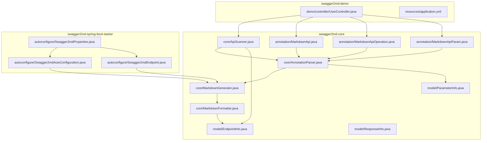
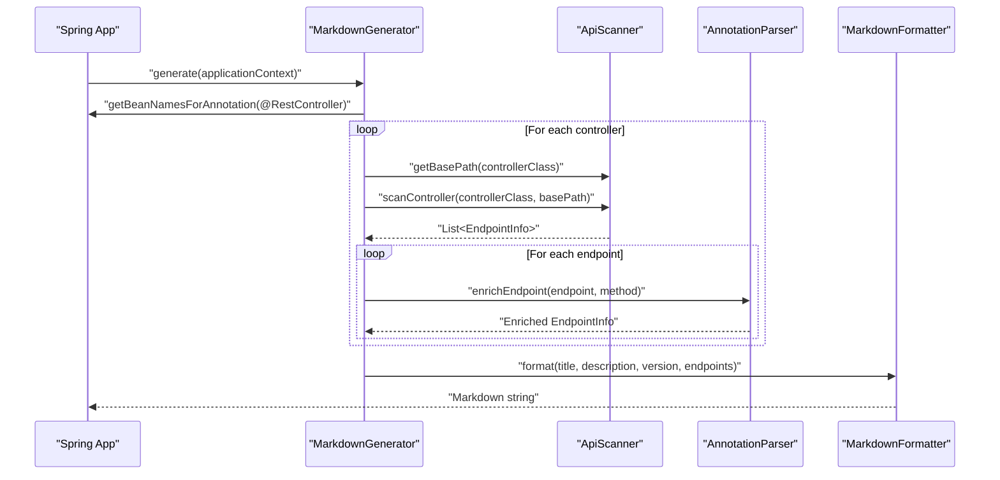
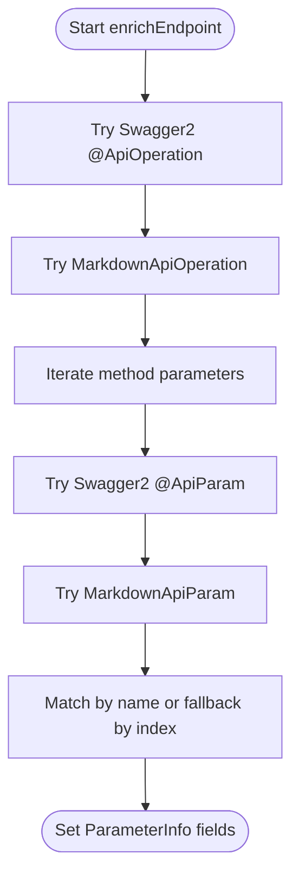
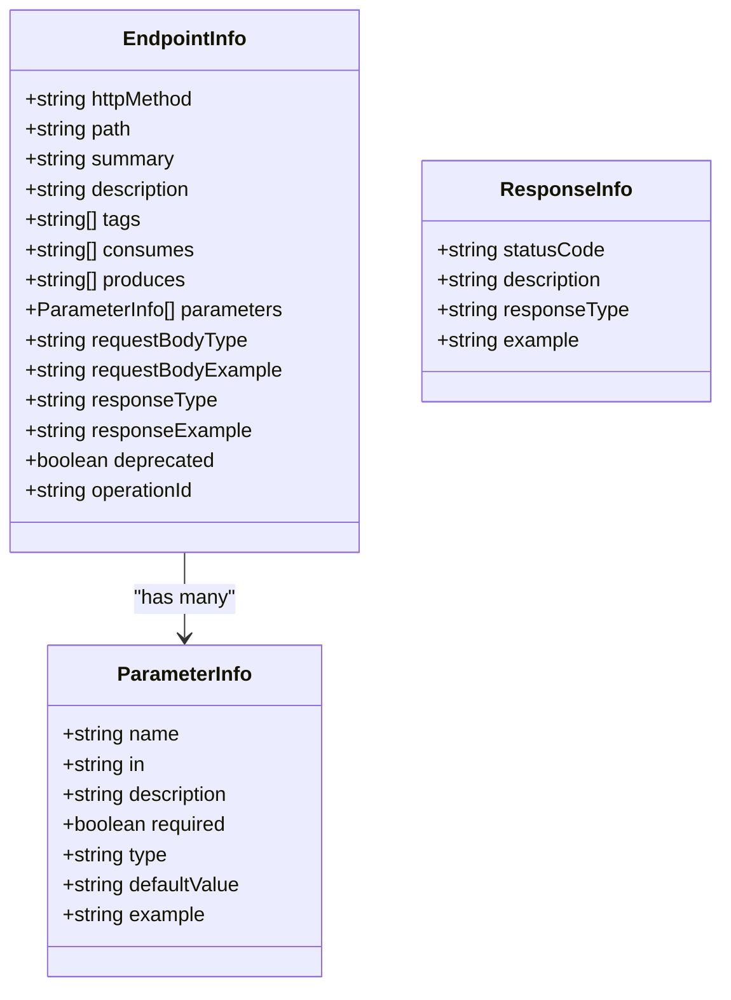
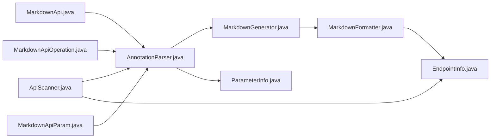

# Custom Markdown Annotations

<cite>
**Referenced Files in This Document**
- [MarkdownApi.java](file://swagger2md-core/src/main/java/com/github/tentac/swagger2md/annotation/MarkdownApi.java)
- [MarkdownApiOperation.java](file://swagger2md-core/src/main/java/com/github/tentac/swagger2md/annotation/MarkdownApiOperation.java)
- [MarkdownApiParam.java](file://swagger2md-core/src/main/java/com/github/tentac/swagger2md/annotation/MarkdownApiParam.java)
- [AnnotationParser.java](file://swagger2md-core/src/main/java/com/github/tentac/swagger2md/core/AnnotationParser.java)
- [ApiScanner.java](file://swagger2md-core/src/main/java/com/github/tentac/swagger2md/core/ApiScanner.java)
- [MarkdownGenerator.java](file://swagger2md-core/src/main/java/com/github/tentac/swagger2md/core/MarkdownGenerator.java)
- [MarkdownFormatter.java](file://swagger2md-core/src/main/java/com/github/tentac/swagger2md/core/MarkdownFormatter.java)
- [EndpointInfo.java](file://swagger2md-core/src/main/java/com/github/tentac/swagger2md/model/EndpointInfo.java)
- [ParameterInfo.java](file://swagger2md-core/src/main/java/com/github/tentac/swagger2md/model/ParameterInfo.java)
- [ResponseInfo.java](file://swagger2md-core/src/main/java/com/github/tentac/swagger2md/model/ResponseInfo.java)
- [UserController.java](file://swagger2md-demo/src/main/java/com/github/tentac/swagger2md/demo/controller/UserController.java)
- [application.yml](file://swagger2md-demo/src/main/resources/application.yml)
- [Swagger2mdAutoConfiguration.java](file://swagger2md-spring-boot-starter/src/main/java/com/github/tentac/swagger2md/autoconfigure/Swagger2mdAutoConfiguration.java)
- [Swagger2mdEndpoint.java](file://swagger2md-spring-boot-starter/src/main/java/com/github/tentac/swagger2md/autoconfigure/Swagger2mdEndpoint.java)
- [Swagger2mdProperties.java](file://swagger2md-spring-boot-starter/src/main/java/com/github/tentac/swagger2md/autoconfigure/Swagger2mdProperties.java)
</cite>

## Table of Contents
1. [Introduction](#introduction)
2. [Project Structure](#project-structure)
3. [Core Components](#core-components)
4. [Architecture Overview](#architecture-overview)
5. [Detailed Component Analysis](#detailed-component-analysis)
6. [Dependency Analysis](#dependency-analysis)
7. [Performance Considerations](#performance-considerations)
8. [Troubleshooting Guide](#troubleshooting-guide)
9. [Conclusion](#conclusion)
10. [Appendices](#appendices)

## Introduction
This document explains the custom Markdown annotation system designed to generate API documentation in Markdown format without requiring Swagger2 annotations. It focuses on three annotations:
- MarkdownApi: Controller-level grouping and description
- MarkdownApiOperation: Endpoint-level metadata
- MarkdownApiParam: Parameter-level documentation

It also documents the annotation processing workflow, precedence rules, parameter enrichment, and integration with the Markdown generation pipeline. Practical examples show how to annotate controllers, methods, and parameters, along with migration guidance from Swagger2 annotations.

## Project Structure
The system is organized into three modules:
- swagger2md-core: Annotations, scanning, parsing, formatting, and model classes
- swagger2md-demo: Example Spring Boot application demonstrating usage
- swagger2md-spring-boot-starter: Auto-configuration and runtime endpoints

**Diagram sources**
- [MarkdownApi.java:1-25](file://swagger2md-core/src/main/java/com/github/tentac/swagger2md/annotation/MarkdownApi.java#L1-L25)
- [MarkdownApiOperation.java:1-28](file://swagger2md-core/src/main/java/com/github/tentac/swagger2md/annotation/MarkdownApiOperation.java#L1-L28)
- [MarkdownApiParam.java:1-34](file://swagger2md-core/src/main/java/com/github/tentac/swagger2md/annotation/MarkdownApiParam.java#L1-L34)
- [ApiScanner.java:1-400](file://swagger2md-core/src/main/java/com/github/tentac/swagger2md/core/ApiScanner.java#L1-L400)
- [AnnotationParser.java:1-211](file://swagger2md-core/src/main/java/com/github/tentac/swagger2md/core/AnnotationParser.java#L1-L211)
- [MarkdownGenerator.java:1-156](file://swagger2md-core/src/main/java/com/github/tentac/swagger2md/core/MarkdownGenerator.java#L1-L156)
- [MarkdownFormatter.java:1-202](file://swagger2md-core/src/main/java/com/github/tentac/swagger2md/core/MarkdownFormatter.java#L1-L202)
- [EndpointInfo.java:1-165](file://swagger2md-core/src/main/java/com/github/tentac/swagger2md/model/EndpointInfo.java#L1-L165)
- [ParameterInfo.java:1-85](file://swagger2md-core/src/main/java/com/github/tentac/swagger2md/model/ParameterInfo.java#L1-L85)
- [ResponseInfo.java:1-52](file://swagger2md-core/src/main/java/com/github/tentac/swagger2md/model/ResponseInfo.java#L1-L52)
- [UserController.java:1-187](file://swagger2md-demo/src/main/java/com/github/tentac/swagger2md/demo/controller/UserController.java#L1-L187)
- [application.yml:1-29](file://swagger2md-demo/src/main/resources/application.yml#L1-L29)
- [Swagger2mdAutoConfiguration.java:1-82](file://swagger2md-spring-boot-starter/src/main/java/com/github/tentac/swagger2md/autoconfigure/Swagger2mdAutoConfiguration.java#L1-L82)
- [Swagger2mdEndpoint.java:1-72](file://swagger2md-spring-boot-starter/src/main/java/com/github/tentac/swagger2md/autoconfigure/Swagger2mdEndpoint.java#L1-L72)
- [Swagger2mdProperties.java:1-127](file://swagger2md-spring-boot-starter/src/main/java/com/github/tentac/swagger2md/autoconfigure/Swagger2mdProperties.java#L1-L127)

**Section sources**
- [MarkdownApi.java:1-25](file://swagger2md-core/src/main/java/com/github/tentac/swagger2md/annotation/MarkdownApi.java#L1-L25)
- [MarkdownApiOperation.java:1-28](file://swagger2md-core/src/main/java/com/github/tentac/swagger2md/annotation/MarkdownApiOperation.java#L1-L28)
- [MarkdownApiParam.java:1-34](file://swagger2md-core/src/main/java/com/github/tentac/swagger2md/annotation/MarkdownApiParam.java#L1-L34)
- [ApiScanner.java:1-400](file://swagger2md-core/src/main/java/com/github/tentac/swagger2md/core/ApiScanner.java#L1-L400)
- [AnnotationParser.java:1-211](file://swagger2md-core/src/main/java/com/github/tentac/swagger2md/core/AnnotationParser.java#L1-L211)
- [MarkdownGenerator.java:1-156](file://swagger2md-core/src/main/java/com/github/tentac/swagger2md/core/MarkdownGenerator.java#L1-L156)
- [MarkdownFormatter.java:1-202](file://swagger2md-core/src/main/java/com/github/tentac/swagger2md/core/MarkdownFormatter.java#L1-L202)
- [EndpointInfo.java:1-165](file://swagger2md-core/src/main/java/com/github/tentac/swagger2md/model/EndpointInfo.java#L1-L165)
- [ParameterInfo.java:1-85](file://swagger2md-core/src/main/java/com/github/tentac/swagger2md/model/ParameterInfo.java#L1-L85)
- [ResponseInfo.java:1-52](file://swagger2md-core/src/main/java/com/github/tentac/swagger2md/model/ResponseInfo.java#L1-L52)
- [UserController.java:1-187](file://swagger2md-demo/src/main/java/com/github/tentac/swagger2md/demo/controller/UserController.java#L1-L187)
- [application.yml:1-29](file://swagger2md-demo/src/main/resources/application.yml#L1-L29)
- [Swagger2mdAutoConfiguration.java:1-82](file://swagger2md-spring-boot-starter/src/main/java/com/github/tentac/swagger2md/autoconfigure/Swagger2mdAutoConfiguration.java#L1-L82)
- [Swagger2mdEndpoint.java:1-72](file://swagger2md-spring-boot-starter/src/main/java/com/github/tentac/swagger2md/autoconfigure/Swagger2mdEndpoint.java#L1-L72)
- [Swagger2mdProperties.java:1-127](file://swagger2md-spring-boot-starter/src/main/java/com/github/tentac/swagger2md/autoconfigure/Swagger2mdProperties.java#L1-L127)

## Core Components
- MarkdownApi: Controller-level annotation with tags(), description(), and hidden() to group and hide controllers.
- MarkdownApiOperation: Endpoint-level annotation with value(), notes(), tags(), and httpMethod().
- MarkdownApiParam: Parameter-level annotation with name(), value(), required(), defaultValue(), example(), and in().

These annotations integrate with the scanning and parsing pipeline to enrich EndpointInfo and ParameterInfo models, which are then formatted into Markdown.

**Section sources**
- [MarkdownApi.java:14-24](file://swagger2md-core/src/main/java/com/github/tentac/swagger2md/annotation/MarkdownApi.java#L14-L24)
- [MarkdownApiOperation.java:14-27](file://swagger2md-core/src/main/java/com/github/tentac/swagger2md/annotation/MarkdownApiOperation.java#L14-L27)
- [MarkdownApiParam.java:14-33](file://swagger2md-core/src/main/java/com/github/tentac/swagger2md/annotation/MarkdownApiParam.java#L14-L33)

## Architecture Overview
The generation pipeline scans Spring controllers, extracts endpoint metadata, enriches it with annotations, and formats the result into Markdown.

**Diagram sources**
- [MarkdownGenerator.java:54-99](file://swagger2md-core/src/main/java/com/github/tentac/swagger2md/core/MarkdownGenerator.java#L54-L99)
- [ApiScanner.java:38-56](file://swagger2md-core/src/main/java/com/github/tentac/swagger2md/core/ApiScanner.java#L38-L56)
- [AnnotationParser.java:26-35](file://swagger2md-core/src/main/java/com/github/tentac/swagger2md/core/AnnotationParser.java#L26-L35)
- [MarkdownFormatter.java:24-71](file://swagger2md-core/src/main/java/com/github/tentac/swagger2md/core/MarkdownFormatter.java#L24-L71)

## Detailed Component Analysis

### MarkdownApi Annotation
Purpose:
- Tag API groups at the controller level
- Describe the controller’s purpose
- Hide controllers from documentation

Key attributes:
- tags(): String[]
- description(): String
- hidden(): boolean

Processing:
- Class-level tags are extracted and merged, with defaults falling back to the controller class name if none are provided.
- Hidden controllers are skipped during generation.

Integration:
- Used by ApiScanner to build class-level tags and description.
- Respected by MarkdownGenerator to skip controllers marked hidden.

Best practices:
- Keep tags concise and consistent across controllers.
- Use description to summarize controller responsibilities.
- Mark deprecated or internal controllers as hidden.

**Section sources**
- [MarkdownApi.java:16-23](file://swagger2md-core/src/main/java/com/github/tentac/swagger2md/annotation/MarkdownApi.java#L16-L23)
- [ApiScanner.java:98-162](file://swagger2md-core/src/main/java/com/github/tentac/swagger2md/core/ApiScanner.java#L98-L162)
- [MarkdownGenerator.java:72-77](file://swagger2md-core/src/main/java/com/github/tentac/swagger2md/core/MarkdownGenerator.java#L72-L77)

### MarkdownApiOperation Annotation
Purpose:
- Provide endpoint-level metadata
- Override or complement method-level documentation

Key attributes:
- value(): String (summary)
- notes(): String (description)
- tags(): String[] (overrides class-level tags if present)
- httpMethod(): String (override auto-detected HTTP method)

Processing:
- Enrichment occurs after Swagger2 @ApiOperation, allowing custom annotations to take precedence for summary, description, tags, and HTTP method.

Integration:
- Applied to methods scanned by ApiScanner; later enriched by AnnotationParser.

Best practices:
- Keep value() short and descriptive.
- Use notes() for usage instructions and constraints.
- Use tags() to override grouping when needed.
- Use httpMethod() sparingly; prefer Spring mapping annotations.

**Section sources**
- [MarkdownApiOperation.java:16-27](file://swagger2md-core/src/main/java/com/github/tentac/swagger2md/annotation/MarkdownApiOperation.java#L16-L27)
- [AnnotationParser.java:93-109](file://swagger2md-core/src/main/java/com/github/tentac/swagger2md/core/AnnotationParser.java#L93-L109)

### MarkdownApiParam Annotation
Purpose:
- Document endpoint parameters
- Specify parameter location, requirement, defaults, and examples

Key attributes:
- name(): String
- value(): String (description)
- required(): boolean
- defaultValue(): String
- example(): String
- in(): String (query, path, header, form, body)

Processing:
- Enrichment occurs per parameter after Swagger2 @ApiParam, allowing custom annotations to override descriptions, names, required flags, defaults, examples, and locations.

Integration:
- Applied to method parameters; matched to EndpointInfo parameters by name or fallback by index.

Best practices:
- Always specify in() to reflect the parameter’s location.
- Provide meaningful examples for better documentation clarity.
- Mark required parameters explicitly.

**Section sources**
- [MarkdownApiParam.java:16-33](file://swagger2md-core/src/main/java/com/github/tentac/swagger2md/annotation/MarkdownApiParam.java#L16-L33)
- [AnnotationParser.java:187-209](file://swagger2md-core/src/main/java/com/github/tentac/swagger2md/core/AnnotationParser.java#L187-L209)

### Annotation Precedence and Inheritance Patterns
Precedence:
- Method-level MarkdownApiOperation takes precedence over Swagger2 @ApiOperation for summary, description, tags, and HTTP method.
- Method-level MarkdownApiParam takes precedence over Swagger2 @ApiParam for description, name, required, default, example, and location.
- Class-level MarkdownApi tags and description are merged with Swagger2 @Api equivalents; duplicates are avoided.

Inheritance:
- Class-level tags and description are inherited by all endpoints within the controller.
- Method-level tags can override class-level tags.
- Method-level httpMethod can override inferred HTTP method.

Validation:
- Empty or whitespace-only tag arrays are treated as “no tags” to avoid polluting groupings.
- Parameter matching falls back to index when name-based lookup fails.

**Section sources**
- [AnnotationParser.java:37-91](file://swagger2md-core/src/main/java/com/github/tentac/swagger2md/core/AnnotationParser.java#L37-L91)
- [AnnotationParser.java:136-174](file://swagger2md-core/src/main/java/com/github/tentac/swagger2md/core/AnnotationParser.java#L136-L174)
- [AnnotationParser.java:179-185](file://swagger2md-core/src/main/java/com/github/tentac/swagger2md/core/AnnotationParser.java#L179-L185)
- [ApiScanner.java:98-137](file://swagger2md-core/src/main/java/com/github/tentac/swagger2md/core/ApiScanner.java#L98-L137)

### Parameter Enrichment Workflow

**Diagram sources**
- [AnnotationParser.java:26-35](file://swagger2md-core/src/main/java/com/github/tentac/swagger2md/core/AnnotationParser.java#L26-L35)
- [AnnotationParser.java:111-134](file://swagger2md-core/src/main/java/com/github/tentac/swagger2md/core/AnnotationParser.java#L111-L134)
- [AnnotationParser.java:136-174](file://swagger2md-core/src/main/java/com/github/tentac/swagger2md/core/AnnotationParser.java#L136-L174)
- [AnnotationParser.java:187-209](file://swagger2md-core/src/main/java/com/github/tentac/swagger2md/core/AnnotationParser.java#L187-L209)

### Model Classes

**Diagram sources**
- [EndpointInfo.java:9-165](file://swagger2md-core/src/main/java/com/github/tentac/swagger2md/model/EndpointInfo.java#L9-L165)
- [ParameterInfo.java:6-85](file://swagger2md-core/src/main/java/com/github/tentac/swagger2md/model/ParameterInfo.java#L6-L85)
- [ResponseInfo.java:6-52](file://swagger2md-core/src/main/java/com/github/tentac/swagger2md/model/ResponseInfo.java#L6-L52)

### Example Usage
Controllers:
- See [UserController.java:20-24](file://swagger2md-demo/src/main/java/com/github/tentac/swagger2md/demo/controller/UserController.java#L20-L24) for controller-level annotations combining @Api and @MarkdownApi.

Endpoints:
- See [UserController.java:29-39](file://swagger2md-demo/src/main/java/com/github/tentac/swagger2md/demo/controller/UserController.java#L29-L39) for listing all users.
- See [UserController.java:44-56](file://swagger2md-demo/src/main/java/com/github/tentac/swagger2md/demo/controller/UserController.java#L44-L56) for retrieving by ID with path parameter.
- See [UserController.java:61-72](file://swagger2md-demo/src/main/java/com/github/tentac/swagger2md/demo/controller/UserController.java#L61-L72) for creating a user with a request body.
- See [UserController.java:77-93](file://swagger2md-demo/src/main/java/com/github/tentac/swagger2md/demo/controller/UserController.java#L77-L93) for updating a user.
- See [UserController.java:98-110](file://swagger2md-demo/src/main/java/com/github/tentac/swagger2md/demo/controller/UserController.java#L98-L110) for deleting a user.
- See [UserController.java:115-137](file://swagger2md-demo/src/main/java/com/github/tentac/swagger2md/demo/controller/UserController.java#L115-L137) for searching with query parameters.

Parameters:
- See [UserController.java:50-54](file://swagger2md-demo/src/main/java/com/github/tentac/swagger2md/demo/controller/UserController.java#L50-L54) for path parameter documentation.
- See [UserController.java:83-87](file://swagger2md-demo/src/main/java/com/github/tentac/swagger2md/demo/controller/UserController.java#L83-L87) for path parameter documentation.
- See [UserController.java:121-125](file://swagger2md-demo/src/main/java/com/github/tentac/swagger2md/demo/controller/UserController.java#L121-L125) for query parameter documentation.
- See [UserController.java:126-129](file://swagger2md-demo/src/main/java/com/github/tentac/swagger2md/demo/controller/UserController.java#L126-L129) for query parameter with default.
- See [UserController.java:130-133](file://swagger2md-demo/src/main/java/com/github/tentac/swagger2md/demo/controller/UserController.java#L130-L133) for another query parameter with default.

**Section sources**
- [UserController.java:20-137](file://swagger2md-demo/src/main/java/com/github/tentac/swagger2md/demo/controller/UserController.java#L20-L137)

### Migration from Swagger2 Annotations
- Replace @Api with @MarkdownApi for controller-level grouping and description.
- Replace @ApiOperation with @MarkdownApiOperation for endpoint-level metadata.
- Replace @ApiParam with @MarkdownApiParam for parameter-level documentation.
- Keep @ApiModel and @ApiModelProperty for model documentation; they are not part of this system but can coexist.
- Prefer Spring mapping annotations (@GetMapping, @PostMapping, etc.) for HTTP method and path detection; use @MarkdownApiOperation.httpMethod() only when necessary.

Validation tips:
- Ensure tags are non-empty and unique per controller to avoid duplicates.
- Verify parameter locations (in) match actual Spring annotations (e.g., @PathVariable, @RequestParam).
- Confirm operationId matches the method name for successful enrichment.

**Section sources**
- [ApiScanner.java:164-277](file://swagger2md-core/src/main/java/com/github/tentac/swagger2md/core/ApiScanner.java#L164-L277)
- [AnnotationParser.java:37-91](file://swagger2md-core/src/main/java/com/github/tentac/swagger2md/core/AnnotationParser.java#L37-L91)
- [AnnotationParser.java:136-174](file://swagger2md-core/src/main/java/com/github/tentac/swagger2md/core/AnnotationParser.java#L136-L174)

## Dependency Analysis

**Diagram sources**
- [MarkdownApi.java:1-25](file://swagger2md-core/src/main/java/com/github/tentac/swagger2md/annotation/MarkdownApi.java#L1-L25)
- [MarkdownApiOperation.java:1-28](file://swagger2md-core/src/main/java/com/github/tentac/swagger2md/annotation/MarkdownApiOperation.java#L1-L28)
- [MarkdownApiParam.java:1-34](file://swagger2md-core/src/main/java/com/github/tentac/swagger2md/annotation/MarkdownApiParam.java#L1-L34)
- [AnnotationParser.java:1-211](file://swagger2md-core/src/main/java/com/github/tentac/swagger2md/core/AnnotationParser.java#L1-L211)
- [ApiScanner.java:1-400](file://swagger2md-core/src/main/java/com/github/tentac/swagger2md/core/ApiScanner.java#L1-L400)
- [MarkdownGenerator.java:1-156](file://swagger2md-core/src/main/java/com/github/tentac/swagger2md/core/MarkdownGenerator.java#L1-L156)
- [MarkdownFormatter.java:1-202](file://swagger2md-core/src/main/java/com/github/tentac/swagger2md/core/MarkdownFormatter.java#L1-L202)
- [EndpointInfo.java:1-165](file://swagger2md-core/src/main/java/com/github/tentac/swagger2md/model/EndpointInfo.java#L1-L165)
- [ParameterInfo.java:1-85](file://swagger2md-core/src/main/java/com/github/tentac/swagger2md/model/ParameterInfo.java#L1-L85)

**Section sources**
- [MarkdownGenerator.java:17-30](file://swagger2md-core/src/main/java/com/github/tentac/swagger2md/core/MarkdownGenerator.java#L17-L30)
- [ApiScanner.java:24-27](file://swagger2md-core/src/main/java/com/github/tentac/swagger2md/core/ApiScanner.java#L24-L27)

## Performance Considerations
- Reflection usage is minimal and scoped to annotation inspection and method discovery.
- Parameter enrichment uses linear scans over method parameters; complexity is acceptable for typical endpoint counts.
- JSON example generation is invoked only when body parameters or return types are detected.
- Consider limiting the scanned package via basePackage to reduce overhead in large applications.

## Troubleshooting Guide
Common issues and resolutions:
- Endpoints not appearing:
  - Ensure the controller class is annotated with @RestController or @Controller and has methods with @ResponseBody or @RestController.
  - Verify the controller is within the configured basePackage.
  - Confirm the controller is not marked hidden via @MarkdownApi(hidden=true).

- Tags missing or incorrect:
  - Ensure tags are non-empty; empty arrays are treated as “no tags.”
  - Method-level tags override class-level tags; confirm precedence expectations.

- Parameters not documented:
  - Ensure @MarkdownApiParam is applied to method parameters.
  - Confirm parameter names match between method signature and EndpointInfo; fallback to index matching is supported.

- HTTP method mismatch:
  - Prefer Spring mapping annotations; use @MarkdownApiOperation.httpMethod() only when necessary.

- Swagger2 compatibility:
  - Both Swagger2 and custom annotations are supported; custom annotations take precedence for the fields they cover.

Runtime configuration:
- Configure paths and visibility via application.yml under swagger2md.* properties.
- Use the exposed endpoints to serve Markdown and LLM probe outputs.

**Section sources**
- [MarkdownGenerator.java:67-77](file://swagger2md-core/src/main/java/com/github/tentac/swagger2md/core/MarkdownGenerator.java#L67-L77)
- [ApiScanner.java:98-137](file://swagger2md-core/src/main/java/com/github/tentac/swagger2md/core/ApiScanner.java#L98-L137)
- [AnnotationParser.java:179-185](file://swagger2md-core/src/main/java/com/github/tentac/swagger2md/core/AnnotationParser.java#L179-L185)
- [application.yml:8-25](file://swagger2md-demo/src/main/resources/application.yml#L8-L25)
- [Swagger2mdEndpoint.java:43-70](file://swagger2md-spring-boot-starter/src/main/java/com/github/tentac/swagger2md/autoconfigure/Swagger2mdEndpoint.java#L43-L70)

## Conclusion
The custom Markdown annotation system provides a lightweight, Swagger2-free way to generate Markdown API documentation. By annotating controllers, endpoints, and parameters with MarkdownApi, MarkdownApiOperation, and MarkdownApiParam, teams can maintain clear, structured documentation that integrates seamlessly with Spring Boot applications. The system supports precedence rules, parameter enrichment, and runtime exposure via dedicated endpoints, enabling both human-readable docs and machine-friendly outputs.

## Appendices

### Best Practices Checklist
- Controller-level
  - Define clear tags and descriptions with @MarkdownApi
  - Hide deprecated or internal controllers with hidden=true
- Endpoint-level
  - Provide concise summaries and detailed notes with @MarkdownApiOperation
  - Override HTTP method only when necessary
- Parameter-level
  - Document each parameter with @MarkdownApiParam
  - Specify location (in), required flag, defaults, and examples
- Migration
  - Replace @Api, @ApiOperation, @ApiParam with their Markdown counterparts
  - Keep @ApiModel and @ApiModelProperty for model documentation

### Runtime Endpoints
- Markdown documentation: GET ${swagger2md.markdown-path}
- LLM probe (Markdown): GET ${swagger2md.llm-probe-path}
- LLM probe (JSON): GET ${swagger2md.llm-probe-path}/json

Paths and toggles are configurable via swagger2md.* properties.

**Section sources**
- [Swagger2mdEndpoint.java:43-70](file://swagger2md-spring-boot-starter/src/main/java/com/github/tentac/swagger2md/autoconfigure/Swagger2mdEndpoint.java#L43-L70)
- [Swagger2mdProperties.java:30-43](file://swagger2md-spring-boot-starter/src/main/java/com/github/tentac/swagger2md/autoconfigure/Swagger2mdProperties.java#L30-L43)
- [application.yml:8-16](file://swagger2md-demo/src/main/resources/application.yml#L8-L16)