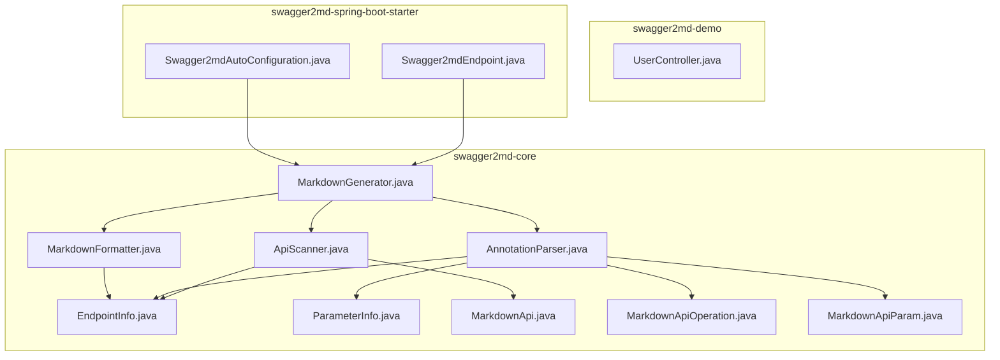
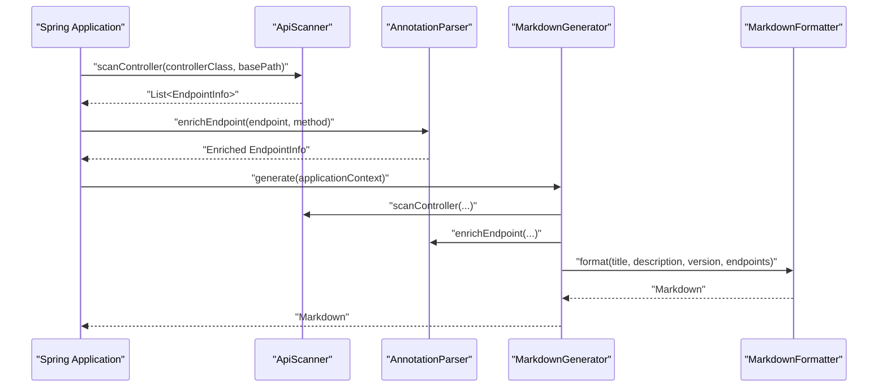
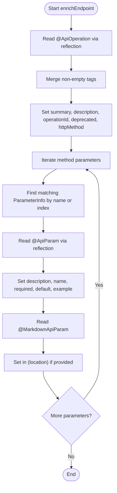
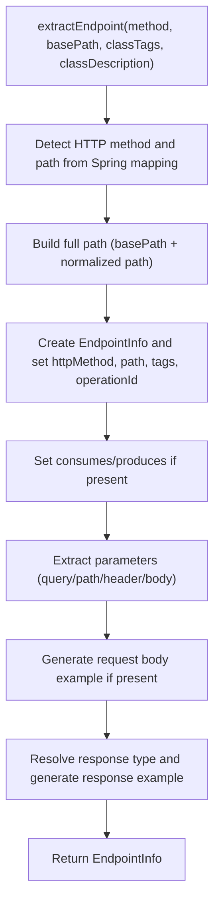
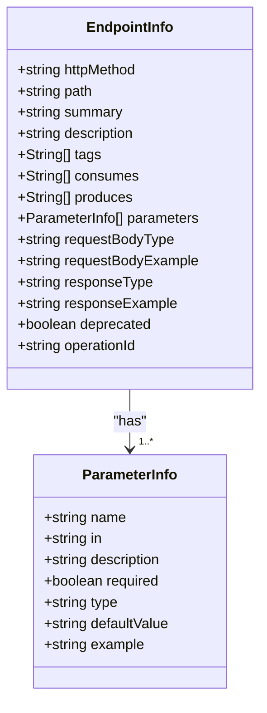
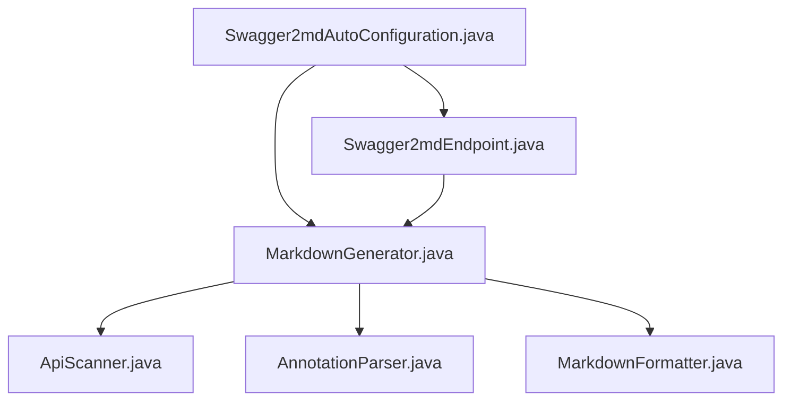

# Swagger2 Annotation Compatibility

<cite>
**Referenced Files in This Document**
- [AnnotationParser.java](file://swagger2md-core/src/main/java/com/github/tentac/swagger2md/core/AnnotationParser.java)
- [ApiScanner.java](file://swagger2md-core/src/main/java/com/github/tentac/swagger2md/core/ApiScanner.java)
- [MarkdownGenerator.java](file://swagger2md-core/src/main/java/com/github/tentac/swagger2md/core/MarkdownGenerator.java)
- [MarkdownFormatter.java](file://swagger2md-core/src/main/java/com/github/tentac/swagger2md/core/MarkdownFormatter.java)
- [EndpointInfo.java](file://swagger2md-core/src/main/java/com/github/tentac/swagger2md/model/EndpointInfo.java)
- [ParameterInfo.java](file://swagger2md-core/src/main/java/com/github/tentac/swagger2md/model/ParameterInfo.java)
- [MarkdownApi.java](file://swagger2md-core/src/main/java/com/github/tentac/swagger2md/annotation/MarkdownApi.java)
- [MarkdownApiOperation.java](file://swagger2md-core/src/main/java/com/github/tentac/swagger2md/annotation/MarkdownApiOperation.java)
- [MarkdownApiParam.java](file://swagger2md-core/src/main/java/com/github/tentac/swagger2md/annotation/MarkdownApiParam.java)
- [UserController.java](file://swagger2md-demo/src/main/java/com/github/tentac/swagger2md/demo/controller/UserController.java)
- [Swagger2mdAutoConfiguration.java](file://swagger2md-spring-boot-starter/src/main/java/com/github/tentac/swagger2md/autoconfigure/Swagger2mdAutoConfiguration.java)
- [Swagger2mdEndpoint.java](file://swagger2md-spring-boot-starter/src/main/java/com/github/tentac/swagger2md/autoconfigure/Swagger2mdEndpoint.java)
</cite>

## Table of Contents
1. [Introduction](#introduction)
2. [Project Structure](#project-structure)
3. [Core Components](#core-components)
4. [Architecture Overview](#architecture-overview)
5. [Detailed Component Analysis](#detailed-component-analysis)
6. [Dependency Analysis](#dependency-analysis)
7. [Performance Considerations](#performance-considerations)
8. [Troubleshooting Guide](#troubleshooting-guide)
9. [Conclusion](#conclusion)
10. [Appendices](#appendices)

## Introduction
This document explains how the system supports Swagger2 annotations alongside its own Markdown annotations to build internal EndpointInfo objects. It covers the annotation conversion pipeline, supported attributes, parameter extraction logic, response type resolution, annotation inheritance rules, and practical examples. It also provides migration guidance from existing Swagger2 setups and troubleshooting tips for annotation processing.

## Project Structure
The project is organized into three modules:
- swagger2md-core: Core scanning, parsing, formatting, and model classes.
- swagger2md-demo: Example Spring MVC controllers demonstrating mixed Swagger2 and Markdown annotations.
- swagger2md-spring-boot-starter: Spring Boot auto-configuration and runtime endpoints.

**Diagram sources**
- [ApiScanner.java:1-400](file://swagger2md-core/src/main/java/com/github/tentac/swagger2md/core/ApiScanner.java#L1-L400)
- [AnnotationParser.java:1-211](file://swagger2md-core/src/main/java/com/github/tentac/swagger2md/core/AnnotationParser.java#L1-L211)
- [MarkdownGenerator.java:1-156](file://swagger2md-core/src/main/java/com/github/tentac/swagger2md/core/MarkdownGenerator.java#L1-L156)
- [MarkdownFormatter.java:1-202](file://swagger2md-core/src/main/java/com/github/tentac/swagger2md/core/MarkdownFormatter.java#L1-L202)
- [EndpointInfo.java:1-165](file://swagger2md-core/src/main/java/com/github/tentac/swagger2md/model/EndpointInfo.java#L1-L165)
- [ParameterInfo.java:1-85](file://swagger2md-core/src/main/java/com/github/tentac/swagger2md/model/ParameterInfo.java#L1-L85)
- [MarkdownApi.java:1-25](file://swagger2md-core/src/main/java/com/github/tentac/swagger2md/annotation/MarkdownApi.java#L1-L25)
- [MarkdownApiOperation.java:1-28](file://swagger2md-core/src/main/java/com/github/tentac/swagger2md/annotation/MarkdownApiOperation.java#L1-L28)
- [MarkdownApiParam.java:1-34](file://swagger2md-core/src/main/java/com/github/tentac/swagger2md/annotation/MarkdownApiParam.java#L1-L34)
- [UserController.java:1-187](file://swagger2md-demo/src/main/java/com/github/tentac/swagger2md/demo/controller/UserController.java#L1-L187)
- [Swagger2mdAutoConfiguration.java:1-82](file://swagger2md-spring-boot-starter/src/main/java/com/github/tentac/swagger2md/autoconfigure/Swagger2mdAutoConfiguration.java#L1-L82)
- [Swagger2mdEndpoint.java:1-72](file://swagger2md-spring-boot-starter/src/main/java/com/github/tentac/swagger2md/autoconfigure/Swagger2mdEndpoint.java#L1-L72)

**Section sources**
- [ApiScanner.java:1-400](file://swagger2md-core/src/main/java/com/github/tentac/swagger2md/core/ApiScanner.java#L1-L400)
- [AnnotationParser.java:1-211](file://swagger2md-core/src/main/java/com/github/tentac/swagger2md/core/AnnotationParser.java#L1-L211)
- [MarkdownGenerator.java:1-156](file://swagger2md-core/src/main/java/com/github/tentac/swagger2md/core/MarkdownGenerator.java#L1-L156)
- [MarkdownFormatter.java:1-202](file://swagger2md-core/src/main/java/com/github/tentac/swagger2md/core/MarkdownFormatter.java#L1-L202)
- [Swagger2mdAutoConfiguration.java:1-82](file://swagger2md-spring-boot-starter/src/main/java/com/github/tentac/swagger2md/autoconfigure/Swagger2mdAutoConfiguration.java#L1-L82)
- [Swagger2mdEndpoint.java:1-72](file://swagger2md-spring-boot-starter/src/main/java/com/github/tentac/swagger2md/autoconfigure/Swagger2mdEndpoint.java#L1-L72)

## Core Components
- ApiScanner: Discovers Spring MVC controllers, extracts HTTP method, path, consumes/produces, class-level tags/description, and builds EndpointInfo instances. It also resolves parameter locations and generates JSON examples for request/response bodies.
- AnnotationParser: Enriches EndpointInfo with Swagger2 and Markdown annotations. It reads @Api, @ApiOperation, @ApiParam and merges them with @MarkdownApi, @MarkdownApiOperation, @MarkdownApiParam.
- MarkdownGenerator: Orchestrates scanning, parsing, and formatting to produce Markdown documentation. It filters controllers and delegates enrichment to AnnotationParser.
- MarkdownFormatter: Converts EndpointInfo lists into structured Markdown with tables, examples, and cURL snippets.
- Model classes: EndpointInfo and ParameterInfo represent the internal API model enriched by annotations.

Key responsibilities:
- Annotation compatibility: Reads Swagger2 annotations via reflection and merges with Markdown annotations.
- Parameter extraction: Determines parameter location (query, path, header, body) from Spring annotations and Swagger2/Markdown parameter annotations.
- Response type resolution: Infers response type name and generates JSON examples for both request and response bodies.

**Section sources**
- [ApiScanner.java:1-400](file://swagger2md-core/src/main/java/com/github/tentac/swagger2md/core/ApiScanner.java#L1-L400)
- [AnnotationParser.java:1-211](file://swagger2md-core/src/main/java/com/github/tentac/swagger2md/core/AnnotationParser.java#L1-L211)
- [MarkdownGenerator.java:1-156](file://swagger2md-core/src/main/java/com/github/tentac/swagger2md/core/MarkdownGenerator.java#L1-L156)
- [MarkdownFormatter.java:1-202](file://swagger2md-core/src/main/java/com/github/tentac/swagger2md/core/MarkdownFormatter.java#L1-L202)
- [EndpointInfo.java:1-165](file://swagger2md-core/src/main/java/com/github/tentac/swagger2md/model/EndpointInfo.java#L1-L165)
- [ParameterInfo.java:1-85](file://swagger2md-core/src/main/java/com/github/tentac/swagger2md/model/ParameterInfo.java#L1-L85)

## Architecture Overview
The system scans Spring controllers, builds EndpointInfo objects, enriches them with Swagger2 and Markdown annotations, and formats them into Markdown.

**Diagram sources**
- [ApiScanner.java:38-56](file://swagger2md-core/src/main/java/com/github/tentac/swagger2md/core/ApiScanner.java#L38-L56)
- [AnnotationParser.java:26-35](file://swagger2md-core/src/main/java/com/github/tentac/swagger2md/core/AnnotationParser.java#L26-L35)
- [MarkdownGenerator.java:54-99](file://swagger2md-core/src/main/java/com/github/tentac/swagger2md/core/MarkdownGenerator.java#L54-L99)
- [MarkdownFormatter.java:24-71](file://swagger2md-core/src/main/java/com/github/tentac/swagger2md/core/MarkdownFormatter.java#L24-L71)

## Detailed Component Analysis

### AnnotationParser: Swagger2 to EndpointInfo Conversion Pipeline
The parser performs two enrichment passes per endpoint:
1. Enrichment from Swagger2 annotations (@Api, @ApiOperation, @ApiParam) via reflection.
2. Enrichment from Markdown annotations (@MarkdownApi, @MarkdownApiOperation, @MarkdownApiParam).

Supported Swagger2 attributes mapped to EndpointInfo/ParameterInfo:
- @ApiOperation
  - value -> summary
  - notes -> description
  - tags -> tags (only if non-empty)
  - nickname -> operationId
  - hidden -> deprecated (when present)
  - httpMethod -> httpMethod (when present)
- @ApiParam
  - value -> ParameterInfo.description
  - name -> ParameterInfo.name
  - required -> ParameterInfo.required
  - defaultValue -> ParameterInfo.defaultValue
  - example -> ParameterInfo.example

Parameter matching logic:
- The parser matches parameters by name first; if not found, falls back to index order.

Tag filtering:
- Empty tag arrays (default values) are ignored to avoid polluting tags.

**Diagram sources**
- [AnnotationParser.java:26-134](file://swagger2md-core/src/main/java/com/github/tentac/swagger2md/core/AnnotationParser.java#L26-L134)
- [AnnotationParser.java:136-209](file://swagger2md-core/src/main/java/com/github/tentac/swagger2md/core/AnnotationParser.java#L136-L209)

**Section sources**
- [AnnotationParser.java:26-91](file://swagger2md-core/src/main/java/com/github/tentac/swagger2md/core/AnnotationParser.java#L26-L91)
- [AnnotationParser.java:93-109](file://swagger2md-core/src/main/java/com/github/tentac/swagger2md/core/AnnotationParser.java#L93-L109)
- [AnnotationParser.java:111-134](file://swagger2md-core/src/main/java/com/github/tentac/swagger2md/core/AnnotationParser.java#L111-L134)
- [AnnotationParser.java:136-174](file://swagger2md-core/src/main/java/com/github/tentac/swagger2md/core/AnnotationParser.java#L136-L174)
- [AnnotationParser.java:176-185](file://swagger2md-core/src/main/java/com/github/tentac/swagger2md/core/AnnotationParser.java#L176-L185)
- [AnnotationParser.java:187-209](file://swagger2md-core/src/main/java/com/github/tentac/swagger2md/core/AnnotationParser.java#L187-L209)

### ApiScanner: Parameter Extraction and Response Resolution
Parameter extraction rules:
- Location detection:
  - @RequestParam -> in=query; name resolved from value/name; required/defaultValue applied
  - @PathVariable -> in=path; required=true; name resolved from value/name
  - @RequestHeader -> in=header; required/defaultValue applied; name resolved from value/name
  - @RequestBody -> in=body; required applied
  - No Spring param annotation -> defaults to in=query
- Type inference: Uses parameter type simple name.

Response type resolution:
- For non-void return types, the system records responseType and generates a JSON example using JsonExampleGenerator.
- For generic return types (e.g., List<User>), the formatter displays a readable type name.

Class-level tags and description:
- Extracted from @Api (tags, description) or @MarkdownApi (tags, description); defaults to controller simple name if tags are empty.

HTTP method and path resolution:
- Detected from @GetMapping/@PostMapping/etc.; RequestMapping attempts to infer method if unspecified.

**Diagram sources**
- [ApiScanner.java:164-277](file://swagger2md-core/src/main/java/com/github/tentac/swagger2md/core/ApiScanner.java#L164-L277)
- [ApiScanner.java:279-331](file://swagger2md-core/src/main/java/com/github/tentac/swagger2md/core/ApiScanner.java#L279-L331)
- [ApiScanner.java:360-398](file://swagger2md-core/src/main/java/com/github/tentac/swagger2md/core/ApiScanner.java#L360-L398)
- [ApiScanner.java:98-162](file://swagger2md-core/src/main/java/com/github/tentac/swagger2md/core/ApiScanner.java#L98-L162)

**Section sources**
- [ApiScanner.java:164-277](file://swagger2md-core/src/main/java/com/github/tentac/swagger2md/core/ApiScanner.java#L164-L277)
- [ApiScanner.java:279-331](file://swagger2md-core/src/main/java/com/github/tentac/swagger2md/core/ApiScanner.java#L279-L331)
- [ApiScanner.java:360-398](file://swagger2md-core/src/main/java/com/github/tentac/swagger2md/core/ApiScanner.java#L360-L398)
- [ApiScanner.java:98-162](file://swagger2md-core/src/main/java/com/github/tentac/swagger2md/core/ApiScanner.java#L98-L162)

### Model Classes: EndpointInfo and ParameterInfo
EndpointInfo fields include HTTP method, path, summary, description, tags, consumes/produces, parameters, request/response types/examples, deprecation flag, and operationId.

ParameterInfo fields include name, location (in), description, required flag, type, default/example values.

These models are populated by ApiScanner and enriched by AnnotationParser.

**Diagram sources**
- [EndpointInfo.java:9-165](file://swagger2md-core/src/main/java/com/github/tentac/swagger2md/model/EndpointInfo.java#L9-L165)
- [ParameterInfo.java:6-85](file://swagger2md-core/src/main/java/com/github/tentac/swagger2md/model/ParameterInfo.java#L6-L85)

**Section sources**
- [EndpointInfo.java:9-165](file://swagger2md-core/src/main/java/com/github/tentac/swagger2md/model/EndpointInfo.java#L9-L165)
- [ParameterInfo.java:6-85](file://swagger2md-core/src/main/java/com/github/tentac/swagger2md/model/ParameterInfo.java#L6-L85)

### Practical Examples: Annotating Spring MVC Controllers
The demo controller demonstrates:
- Class-level annotations: @Api and @MarkdownApi for tags and description.
- Method-level annotations: @ApiOperation and @MarkdownApiOperation for summary and notes.
- Parameter-level annotations: @ApiParam and @MarkdownApiParam for descriptions, names, required flags, defaults, examples, and locations.

Examples are available in the demo controller file.

**Section sources**
- [UserController.java:20-137](file://swagger2md-demo/src/main/java/com/github/tentac/swagger2md/demo/controller/UserController.java#L20-L137)

### Annotation Inheritance Rules
- Class-level tags and description:
  - Swagger2 @Api tags and description are extracted and merged with @MarkdownApi tags/description.
  - If no tags are provided, the controller simple name is used as the default tag.
- Method-level tags:
  - @ApiOperation tags override class-level tags when present and non-empty.
- Parameter-level overrides:
  - @ApiParam and @MarkdownApiParam enrich ParameterInfo; later annotations take precedence if both are present.

**Section sources**
- [ApiScanner.java:98-162](file://swagger2md-core/src/main/java/com/github/tentac/swagger2md/core/ApiScanner.java#L98-L162)
- [AnnotationParser.java:37-91](file://swagger2md-core/src/main/java/com/github/tentac/swagger2md/core/AnnotationParser.java#L37-L91)
- [AnnotationParser.java:93-109](file://swagger2md-core/src/main/java/com/github/tentac/swagger2md/core/AnnotationParser.java#L93-L109)

### Migration Strategies from Existing Swagger2 Setups
- Gradual adoption:
  - Keep @Api, @ApiOperation, @ApiParam for now; add @MarkdownApi, @MarkdownApiOperation, @MarkdownApiParam alongside to enhance documentation.
- Attribute parity:
  - Map @ApiOperation.value/notes to summary/description; @Api.tags to tags; @ApiParam.value to description; @ApiParam.name to name; @ApiParam.required to required; @ApiParam.defaultValue to defaultValue; @ApiParam.example to example.
- Tag management:
  - Prefer method-level tags via @ApiOperation.tags to override class-level tags when needed.
- Deprecation:
  - Use @ApiOperation.hidden to mark endpoints as deprecated; it maps to the deprecated flag on EndpointInfo.

**Section sources**
- [AnnotationParser.java:37-91](file://swagger2md-core/src/main/java/com/github/tentac/swagger2md/core/AnnotationParser.java#L37-L91)
- [ApiScanner.java:98-162](file://swagger2md-core/src/main/java/com/github/tentac/swagger2md/core/ApiScanner.java#L98-L162)

### Combining Swagger2 Annotations with Custom Markdown Annotations
- Use both sets of annotations on the same controller and method to maximize compatibility and leverage Markdown enhancements.
- Markdown annotations support an additional "in" attribute for explicit parameter location, complementing Spring’s parameter annotations.

**Section sources**
- [AnnotationParser.java:187-209](file://swagger2md-core/src/main/java/com/github/tentac/swagger2md/core/AnnotationParser.java#L187-L209)
- [MarkdownApiParam.java:14-33](file://swagger2md-core/src/main/java/com/github/tentac/swagger2md/annotation/MarkdownApiParam.java#L14-L33)

## Dependency Analysis
The runtime integration relies on Spring Boot auto-configuration to expose endpoints serving Markdown and JSON probes.

**Diagram sources**
- [Swagger2mdAutoConfiguration.java:20-82](file://swagger2md-spring-boot-starter/src/main/java/com/github/tentac/swagger2md/autoconfigure/Swagger2mdAutoConfiguration.java#L20-L82)
- [Swagger2mdEndpoint.java:20-72](file://swagger2md-spring-boot-starter/src/main/java/com/github/tentac/swagger2md/autoconfigure/Swagger2mdEndpoint.java#L20-L72)
- [MarkdownGenerator.java:15-30](file://swagger2md-core/src/main/java/com/github/tentac/swagger2md/core/MarkdownGenerator.java#L15-L30)
- [ApiScanner.java:22-27](file://swagger2md-core/src/main/java/com/github/tentac/swagger2md/core/ApiScanner.java#L22-L27)
- [AnnotationParser.java:18-25](file://swagger2md-core/src/main/java/com/github/tentac/swagger2md/core/AnnotationParser.java#L18-L25)
- [MarkdownFormatter.java:11-14](file://swagger2md-core/src/main/java/com/github/tentac/swagger2md/core/MarkdownFormatter.java#L11-L14)

**Section sources**
- [Swagger2mdAutoConfiguration.java:20-82](file://swagger2md-spring-boot-starter/src/main/java/com/github/tentac/swagger2md/autoconfigure/Swagger2mdAutoConfiguration.java#L20-L82)
- [Swagger2mdEndpoint.java:20-72](file://swagger2md-spring-boot-starter/src/main/java/com/github/tentac/swagger2md/autoconfigure/Swagger2mdEndpoint.java#L20-L72)
- [MarkdownGenerator.java:15-30](file://swagger2md-core/src/main/java/com/github/tentac/swagger2md/core/MarkdownGenerator.java#L15-L30)

## Performance Considerations
- Reflection usage:
  - Both ApiScanner and AnnotationParser use reflection to read Swagger2 annotations. This is acceptable for startup-time generation but avoid invoking reflection per request.
- JSON example generation:
  - JsonExampleGenerator traverses object graphs; keep payload models reasonably shallow to limit recursion depth.
- Package scoping:
  - Use the base package configuration to limit controller scanning scope in large applications.

## Troubleshooting Guide
Common issues and resolutions:
- Swagger2 annotations not detected:
  - Ensure io.swagger.annotations.ApiOperation and io.swagger.annotations.ApiParam are on the classpath; the parser uses reflection and ignores missing classes.
- Empty or default tags:
  - The parser ignores empty tag arrays; provide meaningful tags via @ApiOperation(tags) or @MarkdownApiOperation(tags).
- Parameter name mismatch:
  - If @ApiParam.name differs from the Java parameter name, the parser matches by name first; ensure parameter names are preserved (compile with debug info).
- Parameter location confusion:
  - Prefer Spring parameter annotations (@RequestParam, @PathVariable, @RequestHeader, @RequestBody) for clarity; @MarkdownApiParam.in can override inferred location.
- Hidden controller:
  - If a controller is marked @MarkdownApi(hidden = true), it is excluded from generation.
- Missing operationId:
  - The parser uses method name as operationId; ensure unique method names per controller or rely on method signature matching.

**Section sources**
- [AnnotationParser.java:88-90](file://swagger2md-core/src/main/java/com/github/tentac/swagger2md/core/AnnotationParser.java#L88-L90)
- [AnnotationParser.java:179-185](file://swagger2md-core/src/main/java/com/github/tentac/swagger2md/core/AnnotationParser.java#L179-L185)
- [MarkdownGenerator.java:72-77](file://swagger2md-core/src/main/java/com/github/tentac/swagger2md/core/MarkdownGenerator.java#L72-L77)
- [ApiScanner.java:279-331](file://swagger2md-core/src/main/java/com/github/tentac/swagger2md/core/ApiScanner.java#L279-L331)

## Conclusion
The system provides seamless compatibility with Swagger2 annotations while enabling enhanced documentation via Markdown annotations. The pipeline from scanning Spring controllers to generating Markdown is robust, with clear mapping rules and fallback behaviors. By combining Swagger2 and Markdown annotations, teams can migrate incrementally and improve documentation quality.

## Appendices

### Supported Swagger2 Attributes and Mappings
- @ApiOperation
  - value -> EndpointInfo.summary
  - notes -> EndpointInfo.description
  - tags -> EndpointInfo.tags (non-empty only)
  - nickname -> EndpointInfo.operationId
  - hidden -> EndpointInfo.deprecated
  - httpMethod -> EndpointInfo.httpMethod (when present)
- @ApiParam
  - value -> ParameterInfo.description
  - name -> ParameterInfo.name
  - required -> ParameterInfo.required
  - defaultValue -> ParameterInfo.defaultValue
  - example -> ParameterInfo.example

**Section sources**
- [AnnotationParser.java:37-91](file://swagger2md-core/src/main/java/com/github/tentac/swagger2md/core/AnnotationParser.java#L37-L91)
- [AnnotationParser.java:136-174](file://swagger2md-core/src/main/java/com/github/tentac/swagger2md/core/AnnotationParser.java#L136-L174)

### Example Controller Reference
See the demo controller for practical usage of mixed annotations across GET, POST, PUT, DELETE, and query/path/header parameters.

**Section sources**
- [UserController.java:20-137](file://swagger2md-demo/src/main/java/com/github/tentac/swagger2md/demo/controller/UserController.java#L20-L137)