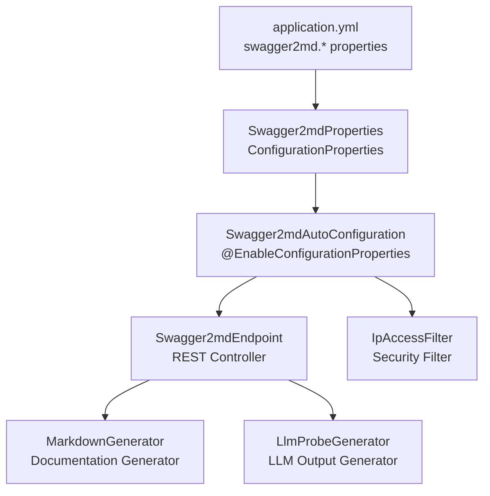
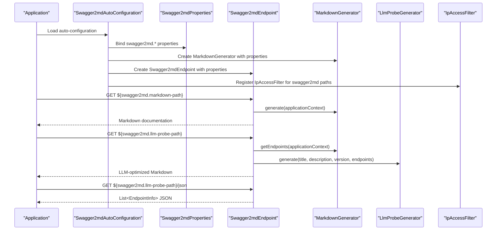
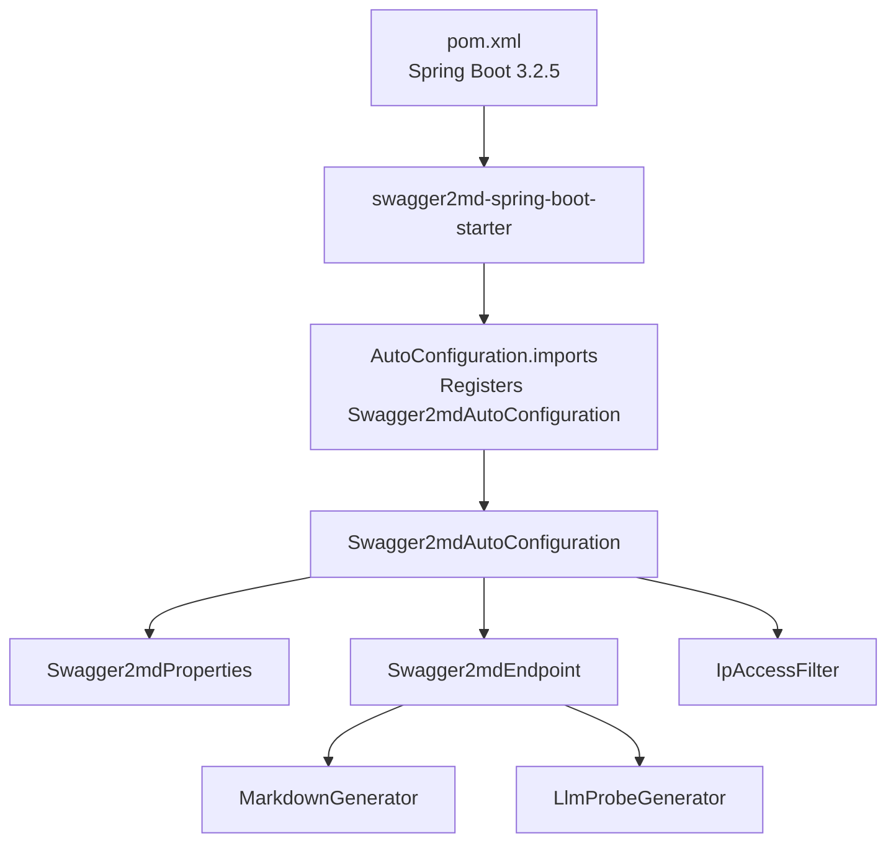

# Configuration Reference

<cite>
**Referenced Files in This Document**
- [Swagger2mdProperties.java](file://swagger2md-spring-boot-starter/src/main/java/com/github/tentac/swagger2md/autoconfigure/Swagger2mdProperties.java)
- [Swagger2mdAutoConfiguration.java](file://swagger2md-spring-boot-starter/src/main/java/com/github/tentac/swagger2md/autoconfigure/Swagger2mdAutoConfiguration.java)
- [Swagger2mdEndpoint.java](file://swagger2md-spring-boot-starter/src/main/java/com/github/tentac/swagger2md/autoconfigure/Swagger2mdEndpoint.java)
- [IpAccessFilter.java](file://swagger2md-spring-boot-starter/src/main/java/com/github/tentac/swagger2md/filter/IpAccessFilter.java)
- [LlmProbeGenerator.java](file://swagger2md-spring-boot-starter/src/main/java/com/github/tentac/swagger2md/probe/LlmProbeGenerator.java)
- [application.yml](file://swagger2md-demo/src/main/resources/application.yml)
- [org.springframework.boot.autoconfigure.AutoConfiguration.imports](file://swagger2md-spring-boot-starter/src/main/resources/META-INF/spring/org.springframework.boot.autoconfigure.AutoConfiguration.imports)
- [pom.xml](file://pom.xml)
</cite>

## Table of Contents
1. [Introduction](#introduction)
2. [Project Structure](#project-structure)
3. [Core Components](#core-components)
4. [Architecture Overview](#architecture-overview)
5. [Detailed Component Analysis](#detailed-component-analysis)
6. [Dependency Analysis](#dependency-analysis)
7. [Performance Considerations](#performance-considerations)
8. [Troubleshooting Guide](#troubleshooting-guide)
9. [Conclusion](#conclusion)
10. [Appendices](#appendices)

## Introduction
This document provides a comprehensive configuration reference for the tentac project’s Swagger2md module. It focuses on the complete Swagger2mdProperties configuration class, covering endpoint path customization, security settings, LLM probe options, and output formatting controls. It explains default values, property precedence, environment-specific configuration patterns, validation rules, inter-property dependencies, best practices, common configuration patterns, troubleshooting guidance, and migration considerations.

## Project Structure
The configuration system centers around a Spring Boot starter module that auto-configures documentation endpoints and security filters. The key configuration class is Swagger2mdProperties, which binds to the swagger2md.* namespace. The auto-configuration registers beans conditionally and applies IP access filtering to the generated endpoints.

**Diagram sources**
- [application.yml:8-24](file://swagger2md-demo/src/main/resources/application.yml#L8-L24)
- [Swagger2mdProperties.java:12-126](file://swagger2md-spring-boot-starter/src/main/java/com/github/tentac/swagger2md/autoconfigure/Swagger2mdProperties.java#L12-L126)
- [Swagger2mdAutoConfiguration.java:20-81](file://swagger2md-spring-boot-starter/src/main/java/com/github/tentac/swagger2md/autoconfigure/Swagger2mdAutoConfiguration.java#L20-L81)
- [Swagger2mdEndpoint.java:20-71](file://swagger2md-spring-boot-starter/src/main/java/com/github/tentac/swagger2md/autoconfigure/Swagger2mdEndpoint.java#L20-L71)
- [IpAccessFilter.java:23-95](file://swagger2md-spring-boot-starter/src/main/java/com/github/tentac/swagger2md/filter/IpAccessFilter.java#L23-L95)
- [LlmProbeGenerator.java:15-146](file://swagger2md-spring-boot-starter/src/main/java/com/github/tentac/swagger2md/probe/LlmProbeGenerator.java#L15-L146)

**Section sources**
- [application.yml:8-24](file://swagger2md-demo/src/main/resources/application.yml#L8-L24)
- [Swagger2mdProperties.java:12-126](file://swagger2md-spring-boot-starter/src/main/java/com/github/tentac/swagger2md/autoconfigure/Swagger2mdProperties.java#L12-L126)
- [Swagger2mdAutoConfiguration.java:20-81](file://swagger2md-spring-boot-starter/src/main/java/com/github/tentac/swagger2md/autoconfigure/Swagger2mdAutoConfiguration.java#L20-L81)

## Core Components
This section documents the Swagger2mdProperties configuration class and its role in controlling the behavior of the documentation endpoints and security filters.

- Configuration prefix: swagger2md
- Binding mechanism: @ConfigurationProperties(prefix = "swagger2md")
- Auto-configuration: Enabled via @EnableConfigurationProperties and @ConditionalOnProperty

Key properties and defaults:
- enabled: true
- title: "API Documentation"
- description: ""
- version: "1.0.0"
- basePackage: "" (empty scans all packages)
- markdownPath: "/v2/markdown"
- llmProbePath: "/v2/llm-probe"
- llmProbeEnabled: true
- ipWhitelist: [] (empty list disables whitelist)
- ipBlacklist: [] (empty list disables blacklist)

Behavioral notes:
- When enabled=false, auto-configuration and endpoints are disabled by default.
- The LLM probe endpoints are registered under llmProbePath and llmProbePath + "/json".
- IP access filter is registered only when whitelist or blacklist is configured.

**Section sources**
- [Swagger2mdProperties.java:12-126](file://swagger2md-spring-boot-starter/src/main/java/com/github/tentac/swagger2md/autoconfigure/Swagger2mdProperties.java#L12-L126)
- [Swagger2mdAutoConfiguration.java:20-81](file://swagger2md-spring-boot-starter/src/main/java/com/github/tentac/swagger2md/autoconfigure/Swagger2mdAutoConfiguration.java#L20-L81)
- [Swagger2mdEndpoint.java:20-71](file://swagger2md-spring-boot-starter/src/main/java/com/github/tentac/swagger2md/autoconfigure/Swagger2mdEndpoint.java#L20-L71)

## Architecture Overview
The configuration system integrates with Spring Boot’s configuration binding and auto-configuration mechanisms. Properties are bound to Swagger2mdProperties, which are consumed by the auto-configuration to register beans and endpoints. Security is enforced via IpAccessFilter, which evaluates client IPs against configured CIDR lists.

**Diagram sources**
- [Swagger2mdAutoConfiguration.java:20-81](file://swagger2md-spring-boot-starter/src/main/java/com/github/tentac/swagger2md/autoconfigure/Swagger2mdAutoConfiguration.java#L20-L81)
- [Swagger2mdEndpoint.java:20-71](file://swagger2md-spring-boot-starter/src/main/java/com/github/tentac/swagger2md/autoconfigure/Swagger2mdEndpoint.java#L20-L71)
- [IpAccessFilter.java:23-95](file://swagger2md-spring-boot-starter/src/main/java/com/github/tentac/swagger2md/filter/IpAccessFilter.java#L23-L95)

## Detailed Component Analysis

### Swagger2mdProperties
Swagger2mdProperties defines all configuration options for the module. It binds to the swagger2md.* namespace and exposes getters/setters for each property. Defaults are defined inline.

- Property categories:
  - General metadata: title, description, version
  - Scanning control: basePackage
  - Endpoint paths: markdownPath, llmProbePath
  - LLM probe control: llmProbeEnabled
  - Security: ipWhitelist, ipBlacklist
  - Activation: enabled

Validation and constraints:
- No explicit validation annotations are present in the class.
- CIDR entries are validated at runtime by IpAccessFilter; invalid entries produce warnings and are ignored.

Inter-property dependencies:
- llmProbeEnabled does not gate endpoint creation; llmProbe endpoints are still registered when llmProbeEnabled=true and enabled=true.
- markdownPath and llmProbePath are used to configure URL patterns for IpAccessFilter registration.

Environment-specific patterns:
- Properties can be overridden via environment variables, system properties, or externalized configuration files.
- The YAML example demonstrates typical property placement under swagger2md.

**Section sources**
- [Swagger2mdProperties.java:12-126](file://swagger2md-spring-boot-starter/src/main/java/com/github/tentac/swagger2md/autoconfigure/Swagger2mdProperties.java#L12-L126)

### Swagger2mdAutoConfiguration
This class orchestrates bean registration based on properties. It conditionally enables itself when swagger2md.enabled=true (default true). It creates:
- MarkdownGenerator with metadata and scanning settings
- LlmProbeGenerator
- Swagger2mdEndpoint wired to properties and generators
- IpAccessFilter registration for swagger2md paths when whitelist or blacklist is configured

URL pattern registration:
- Applies to both base paths and wildcard patterns for both markdownPath and llmProbePath.

**Section sources**
- [Swagger2mdAutoConfiguration.java:20-81](file://swagger2md-spring-boot-starter/src/main/java/com/github/tentac/swagger2md/autoconfigure/Swagger2mdAutoConfiguration.java#L20-L81)

### Swagger2mdEndpoint
The REST controller exposes two primary endpoints:
- GET ${swagger2md.markdown-path}: Produces full Markdown documentation
- GET ${swagger2md.llm-probe-path}: Produces LLM-optimized Markdown
- GET ${swagger2md.llm-probe-path}/json: Produces JSON of endpoints for programmatic consumption

Endpoint path resolution:
- Uses SpEL expressions to fall back to defaults if properties are not set.

**Section sources**
- [Swagger2mdEndpoint.java:20-71](file://swagger2md-spring-boot-starter/src/main/java/com/github/tentac/swagger2md/autoconfigure/Swagger2mdEndpoint.java#L20-L71)

### IpAccessFilter
Security enforcement filter:
- Evaluates client IP against configured whitelist and blacklist
- Supports CIDR notation for both IPv4 and IPv6
- Logs warnings for invalid CIDR entries and denies access accordingly
- Applies to swagger2md endpoints only

Filter behavior:
- Blacklist takes precedence over whitelist
- If whitelist is enabled and no match, access is denied
- If blacklist is enabled and matches, access is denied

**Section sources**
- [IpAccessFilter.java:23-196](file://swagger2md-spring-boot-starter/src/main/java/com/github/tentac/swagger2md/filter/IpAccessFilter.java#L23-L196)

### LlmProbeGenerator
Generates LLM-optimized Markdown output describing API capabilities. It formats:
- Header with API metadata
- Capability summary table
- Detailed sections grouped by path
- Compact parameter, request body, and response information
- Usage instructions for LLM consumption

**Section sources**
- [LlmProbeGenerator.java:15-146](file://swagger2md-spring-boot-starter/src/main/java/com/github/tentac/swagger2md/probe/LlmProbeGenerator.java#L15-L146)

## Dependency Analysis
The configuration system relies on Spring Boot’s configuration binding and auto-configuration. The starter module registers its auto-configuration via META-INF imports.

**Diagram sources**
- [pom.xml:27](file://pom.xml#L27)
- [org.springframework.boot.autoconfigure.AutoConfiguration.imports:1](file://swagger2md-spring-boot-starter/src/main/resources/META-INF/spring/org.springframework.boot.autoconfigure.AutoConfiguration.imports#L1)
- [Swagger2mdAutoConfiguration.java:20-81](file://swagger2md-spring-boot-starter/src/main/java/com/github/tentac/swagger2md/autoconfigure/Swagger2mdAutoConfiguration.java#L20-L81)

**Section sources**
- [pom.xml:27](file://pom.xml#L27)
- [org.springframework.boot.autoconfigure.AutoConfiguration.imports:1](file://swagger2md-spring-boot-starter/src/main/resources/META-INF/spring/org.springframework.boot.autoconfigure.AutoConfiguration.imports#L1)

## Performance Considerations
- Endpoint scanning: basePackage can limit controller discovery to reduce startup overhead.
- LLM probe generation: Complexity scales with the number of endpoints; consider limiting exposed endpoints for large APIs.
- IP filtering: CIDR matching is O(N) per filter list; keep whitelist/blacklist reasonably sized.

## Troubleshooting Guide
Common configuration issues and resolutions:

- Endpoints not accessible:
  - Verify swagger2md.enabled=true and paths are not conflicting with existing routes.
  - Confirm markdownPath and llmProbePath are unique and not overlapping with application endpoints.

- Access denied errors:
  - Check ipWhitelist and ipBlacklist CIDR entries; invalid entries are logged and ignored.
  - Ensure client IP is included in whitelist or not present in blacklist.
  - Confirm IpAccessFilter is registered (whitelist or blacklist configured).

- LLM probe output missing:
  - Ensure llmProbeEnabled=true and swagger2md.enabled=true.
  - Verify llmProbePath is not blocked by firewall or proxy.

- Property precedence:
  - Application YAML properties bind to swagger2md.* namespace.
  - Environment variables and system properties override YAML values.
  - Externalized configuration files take precedence over embedded YAML.

- Migration considerations:
  - Property names remain stable; no breaking changes observed in the referenced files.
  - If changing endpoint paths, update clients to use new paths.
  - When upgrading Spring Boot, ensure compatibility with the declared version.

**Section sources**
- [IpAccessFilter.java:76-92](file://swagger2md-spring-boot-starter/src/main/java/com/github/tentac/swagger2md/filter/IpAccessFilter.java#L76-L92)
- [Swagger2mdAutoConfiguration.java:52-80](file://swagger2md-spring-boot-starter/src/main/java/com/github/tentac/swagger2md/autoconfigure/Swagger2mdAutoConfiguration.java#L52-L80)

## Conclusion
The Swagger2md configuration system provides a flexible, Spring Boot-native way to expose Markdown-formatted API documentation and LLM-optimized probes with built-in IP-based access control. Properties are straightforward, defaults are sensible, and security can be tuned via CIDR lists. Following the best practices outlined here ensures reliable operation across environments.

## Appendices

### Property Reference and Defaults
- enabled: true
- title: "API Documentation"
- description: ""
- version: "1.0.0"
- basePackage: "" (scan all)
- markdownPath: "/v2/markdown"
- llmProbePath: "/v2/llm-probe"
- llmProbeEnabled: true
- ipWhitelist: [] (no whitelist)
- ipBlacklist: [] (no blacklist)

**Section sources**
- [Swagger2mdProperties.java:12-126](file://swagger2md-spring-boot-starter/src/main/java/com/github/tentac/swagger2md/autoconfigure/Swagger2mdProperties.java#L12-L126)

### Property Validation Rules
- No explicit validation annotations are present in the properties class.
- CIDR entries are validated at runtime; invalid entries produce warnings and are ignored.
- Access control follows blacklist-first, then whitelist evaluation.

**Section sources**
- [IpAccessFilter.java:40-58](file://swagger2md-spring-boot-starter/src/main/java/com/github/tentac/swagger2md/filter/IpAccessFilter.java#L40-L58)
- [IpAccessFilter.java:76-92](file://swagger2md-spring-boot-starter/src/main/java/com/github/tentac/swagger2md/filter/IpAccessFilter.java#L76-L92)

### Property Precedence and Environment Patterns
- YAML: swagger2md.* properties
- Environment variables: SPRING_CONFIG_ADDITIONAL_PROFILES or environment-specific overrides
- System properties: spring.config.additional-profiles
- Externalized configuration: spring.config.import

**Section sources**
- [application.yml:8-24](file://swagger2md-demo/src/main/resources/application.yml#L8-L24)

### Complete Configuration Examples
- Basic setup: Enable module, set title, description, version, and basePackage.
- Security configuration: Configure ipWhitelist and ipBlacklist with CIDR entries.
- Advanced customization: Override endpoint paths, enable/disable LLM probe, and tune scanning scope.

Refer to the demo application YAML for a complete example.

**Section sources**
- [application.yml:8-24](file://swagger2md-demo/src/main/resources/application.yml#L8-L24)

### Inter-Property Dependencies
- enabled governs activation of auto-configuration and endpoints.
- markdownPath and llmProbePath define URL patterns for IpAccessFilter registration.
- llmProbeEnabled controls LLM probe availability; endpoints are still registered when true.

**Section sources**
- [Swagger2mdAutoConfiguration.java:52-80](file://swagger2md-spring-boot-starter/src/main/java/com/github/tentac/swagger2md/autoconfigure/Swagger2mdAutoConfiguration.java#L52-L80)
- [Swagger2mdEndpoint.java:40-70](file://swagger2md-spring-boot-starter/src/main/java/com/github/tentac/swagger2md/autoconfigure/Swagger2mdEndpoint.java#L40-L70)

### Best Practices
- Use distinct endpoint paths for markdownPath and llmProbePath to avoid conflicts.
- Prefer CIDR notation for precise IP control; keep lists minimal.
- Limit basePackage to reduce scanning overhead.
- Use environment-specific configuration for production hardening.

### Migration Considerations
- No breaking changes observed in the referenced files.
- When changing endpoint paths, update consumers and reverse proxies.
- Maintain backward compatibility by keeping default paths unchanged unless necessary.