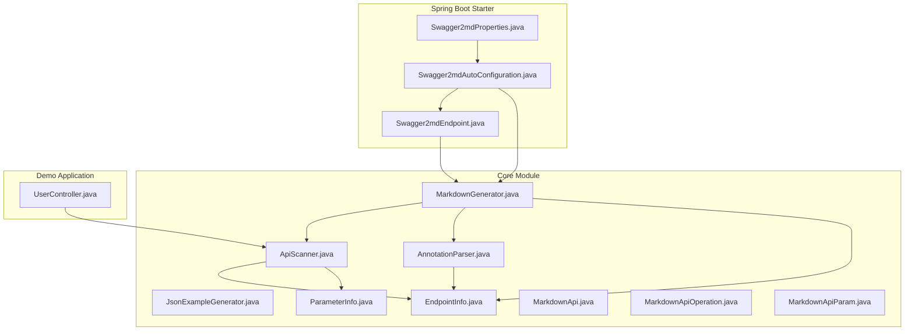
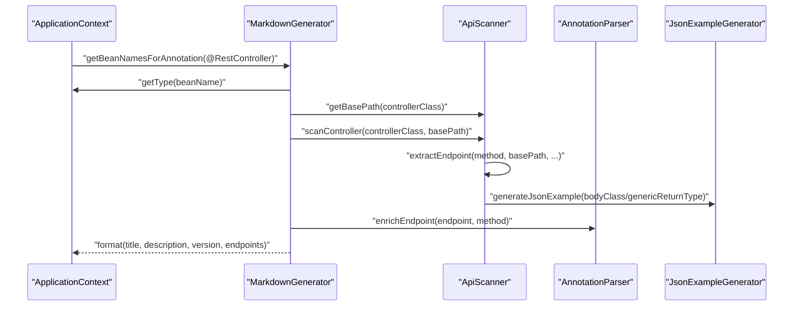
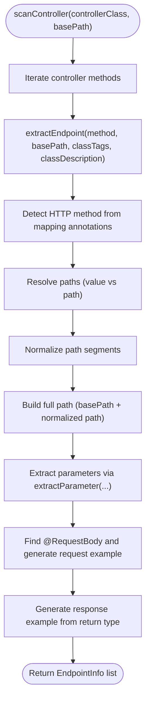
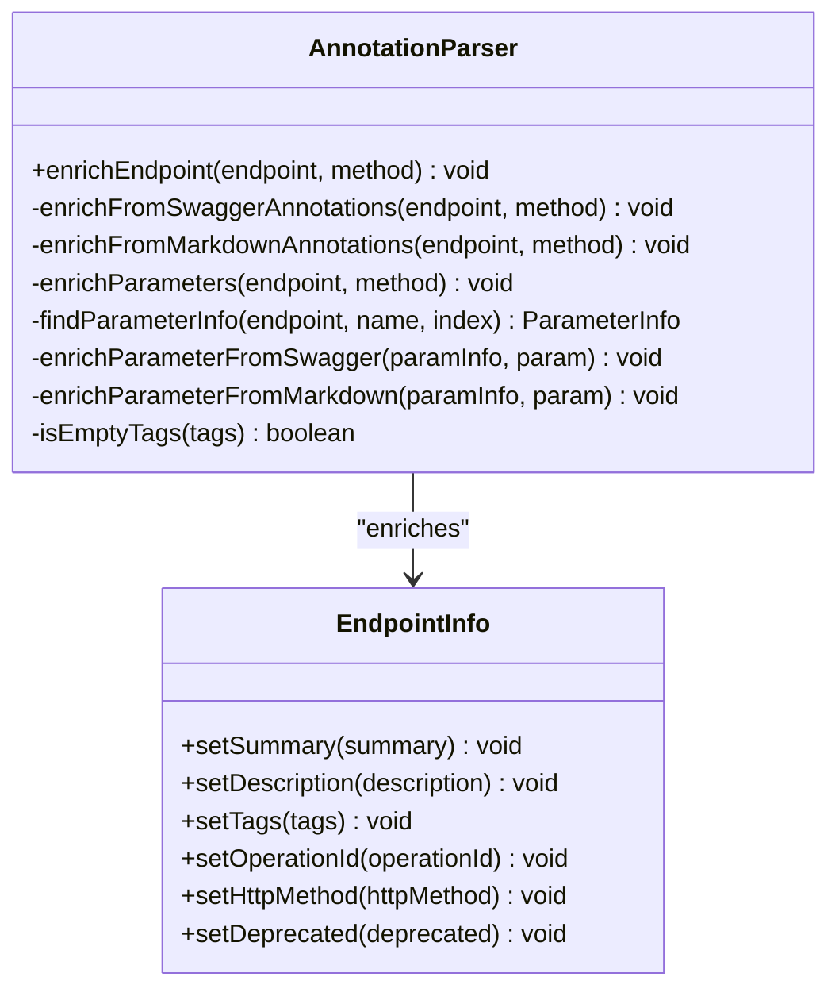
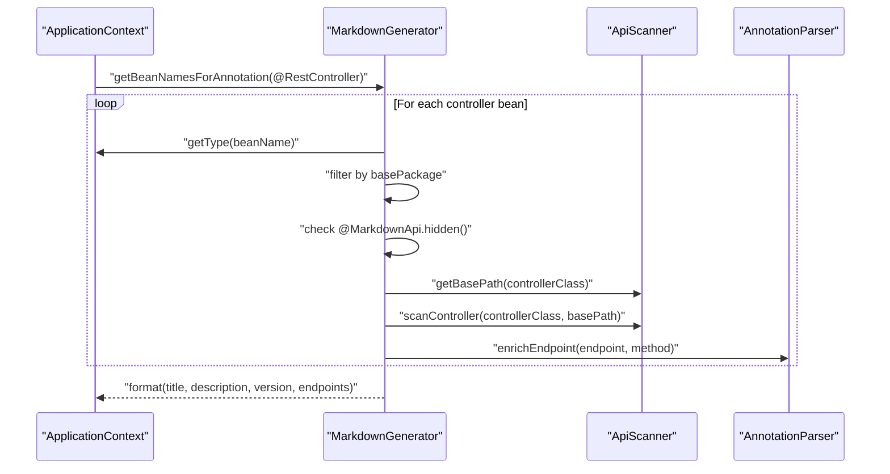
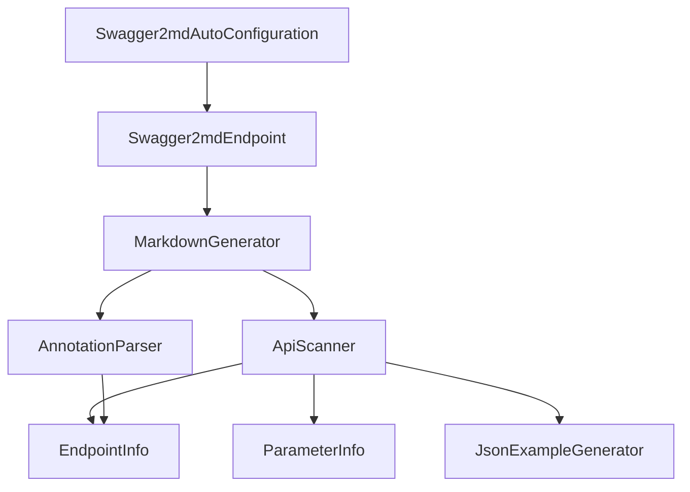

# API Scanner

<cite>
**Referenced Files in This Document**
- [ApiScanner.java](file://swagger2md-core/src/main/java/com/github/tentac/swagger2md/core/ApiScanner.java)
- [AnnotationParser.java](file://swagger2md-core/src/main/java/com/github/tentac/swagger2md/core/AnnotationParser.java)
- [MarkdownGenerator.java](file://swagger2md-core/src/main/java/com/github/tentac/swagger2md/core/MarkdownGenerator.java)
- [JsonExampleGenerator.java](file://swagger2md-core/src/main/java/com/github/tentac/swagger2md/core/JsonExampleGenerator.java)
- [EndpointInfo.java](file://swagger2md-core/src/main/java/com/github/tentac/swagger2md/model/EndpointInfo.java)
- [ParameterInfo.java](file://swagger2md-core/src/main/java/com/github/tentac/swagger2md/model/ParameterInfo.java)
- [MarkdownApi.java](file://swagger2md-core/src/main/java/com/github/tentac/swagger2md/annotation/MarkdownApi.java)
- [MarkdownApiOperation.java](file://swagger2md-core/src/main/java/com/github/tentac/swagger2md/annotation/MarkdownApiOperation.java)
- [MarkdownApiParam.java](file://swagger2md-core/src/main/java/com/github/tentac/swagger2md/annotation/MarkdownApiParam.java)
- [Swagger2mdAutoConfiguration.java](file://swagger2md-spring-boot-starter/src/main/java/com/github/tentac/swagger2md/autoconfigure/Swagger2mdAutoConfiguration.java)
- [Swagger2mdEndpoint.java](file://swagger2md-spring-boot-starter/src/main/java/com/github/tentac/swagger2md/autoconfigure/Swagger2mdEndpoint.java)
- [Swagger2mdProperties.java](file://swagger2md-spring-boot-starter/src/main/java/com/github/tentac/swagger2md/autoconfigure/Swagger2mdProperties.java)
- [UserController.java](file://swagger2md-demo/src/main/java/com/github/tentac/swagger2md/demo/controller/UserController.java)
</cite>

## Table of Contents
1. [Introduction](#introduction)
2. [Project Structure](#project-structure)
3. [Core Components](#core-components)
4. [Architecture Overview](#architecture-overview)
5. [Detailed Component Analysis](#detailed-component-analysis)
6. [Dependency Analysis](#dependency-analysis)
7. [Performance Considerations](#performance-considerations)
8. [Troubleshooting Guide](#troubleshooting-guide)
9. [Conclusion](#conclusion)

## Introduction
This document explains the API Scanner component responsible for discovering Spring MVC controllers and extracting endpoint metadata. It covers how the scanner identifies controllers using annotations, resolves base paths, discovers endpoints via mapping annotations, and performs reflection-based method and parameter analysis. It also documents supported annotation combinations, path resolution algorithms, filtering mechanisms for base packages, performance considerations for large applications, and integration with Spring's ApplicationContext. Finally, it provides troubleshooting guidance for common scanning issues and edge cases.

## Project Structure
The API Scanner lives in the core module and integrates with Spring Boot autoconfiguration and a demo application showcasing typical controller usage.

**Diagram sources**
- [ApiScanner.java:1-400](file://swagger2md-core/src/main/java/com/github/tentac/swagger2md/core/ApiScanner.java#L1-L400)
- [AnnotationParser.java:1-211](file://swagger2md-core/src/main/java/com/github/tentac/swagger2md/core/AnnotationParser.java#L1-L211)
- [MarkdownGenerator.java:1-156](file://swagger2md-core/src/main/java/com/github/tentac/swagger2md/core/MarkdownGenerator.java#L1-L156)
- [JsonExampleGenerator.java:1-268](file://swagger2md-core/src/main/java/com/github/tentac/swagger2md/core/JsonExampleGenerator.java#L1-L268)
- [EndpointInfo.java:1-165](file://swagger2md-core/src/main/java/com/github/tentac/swagger2md/model/EndpointInfo.java#L1-L165)
- [ParameterInfo.java:1-85](file://swagger2md-core/src/main/java/com/github/tentac/swagger2md/model/ParameterInfo.java#L1-L85)
- [MarkdownApi.java:1-25](file://swagger2md-core/src/main/java/com/github/tentac/swagger2md/annotation/MarkdownApi.java#L1-L25)
- [MarkdownApiOperation.java:1-28](file://swagger2md-core/src/main/java/com/github/tentac/swagger2md/annotation/MarkdownApiOperation.java#L1-L28)
- [MarkdownApiParam.java:1-34](file://swagger2md-core/src/main/java/com/github/tentac/swagger2md/annotation/MarkdownApiParam.java#L1-L34)
- [Swagger2mdAutoConfiguration.java:1-82](file://swagger2md-spring-boot-starter/src/main/java/com/github/tentac/swagger2md/autoconfigure/Swagger2mdAutoConfiguration.java#L1-L82)
- [Swagger2mdEndpoint.java:1-72](file://swagger2md-spring-boot-starter/src/main/java/com/github/tentac/swagger2md/autoconfigure/Swagger2mdEndpoint.java#L1-L72)
- [Swagger2mdProperties.java:1-127](file://swagger2md-spring-boot-starter/src/main/java/com/github/tentac/swagger2md/autoconfigure/Swagger2mdProperties.java#L1-L127)
- [UserController.java:1-187](file://swagger2md-demo/src/main/java/com/github/tentac/swagger2md/demo/controller/UserController.java#L1-L187)

**Section sources**
- [ApiScanner.java:1-400](file://swagger2md-core/src/main/java/com/github/tentac/swagger2md/core/ApiScanner.java#L1-L400)
- [MarkdownGenerator.java:1-156](file://swagger2md-core/src/main/java/com/github/tentac/swagger2md/core/MarkdownGenerator.java#L1-L156)
- [Swagger2mdAutoConfiguration.java:1-82](file://swagger2md-spring-boot-starter/src/main/java/com/github/tentac/swagger2md/autoconfigure/Swagger2mdAutoConfiguration.java#L1-L82)

## Core Components
- ApiScanner: Discovers controllers, extracts base paths, detects HTTP methods, resolves paths, and builds EndpointInfo with parameters and examples.
- AnnotationParser: Enriches EndpointInfo with metadata from Swagger2 and custom annotations.
- MarkdownGenerator: Orchestrates scanning across Spring ApplicationContext beans, applies base-package filtering, and produces Markdown output.
- JsonExampleGenerator: Generates JSON examples for request/response bodies using reflection.
- Model classes: EndpointInfo and ParameterInfo represent discovered endpoints and parameters.
- Annotations: Custom annotations enable standalone documentation without Swagger2.

Key responsibilities:
- Controller discovery: Uses ApplicationContext to locate @RestController beans and optional @Controller with @ResponseBody methods.
- Base path resolution: Reads @RequestMapping at class level and normalizes it.
- Endpoint extraction: Inspects method-level mapping annotations to detect HTTP methods and paths.
- Parameter resolution: Determines parameter locations (query, path, header, body) and types via Spring annotations.
- Example generation: Builds JSON examples for request and response bodies.

**Section sources**
- [ApiScanner.java:31-96](file://swagger2md-core/src/main/java/com/github/tentac/swagger2md/core/ApiScanner.java#L31-L96)
- [AnnotationParser.java:20-35](file://swagger2md-core/src/main/java/com/github/tentac/swagger2md/core/AnnotationParser.java#L20-L35)
- [MarkdownGenerator.java:48-99](file://swagger2md-core/src/main/java/com/github/tentac/swagger2md/core/MarkdownGenerator.java#L48-L99)
- [JsonExampleGenerator.java:23-39](file://swagger2md-core/src/main/java/com/github/tentac/swagger2md/core/JsonExampleGenerator.java#L23-L39)
- [EndpointInfo.java:6-52](file://swagger2md-core/src/main/java/com/github/tentac/swagger2md/model/EndpointInfo.java#L6-L52)
- [ParameterInfo.java:3-28](file://swagger2md-core/src/main/java/com/github/tentac/swagger2md/model/ParameterInfo.java#L3-L28)
- [MarkdownApi.java:8-25](file://swagger2md-core/src/main/java/com/github/tentac/swagger2md/annotation/MarkdownApi.java#L8-L25)
- [MarkdownApiOperation.java:8-28](file://swagger2md-core/src/main/java/com/github/tentac/swagger2md/annotation/MarkdownApiOperation.java#L8-L28)
- [MarkdownApiParam.java:8-34](file://swagger2md-core/src/main/java/com/github/tentac/swagger2md/annotation/MarkdownApiParam.java#L8-L34)

## Architecture Overview
The scanner integrates with Spring’s ApplicationContext to discover controllers and build endpoint metadata. The flow begins with controller discovery, followed by base path extraction, endpoint scanning, annotation enrichment, and finally formatting into Markdown.

**Diagram sources**
- [MarkdownGenerator.java:54-99](file://swagger2md-core/src/main/java/com/github/tentac/swagger2md/core/MarkdownGenerator.java#L54-L99)
- [ApiScanner.java:38-56](file://swagger2md-core/src/main/java/com/github/tentac/swagger2md/core/ApiScanner.java#L38-L56)
- [AnnotationParser.java:26-35](file://swagger2md-core/src/main/java/com/github/tentac/swagger2md/core/AnnotationParser.java#L26-L35)
- [JsonExampleGenerator.java:26-39](file://swagger2md-core/src/main/java/com/github/tentac/swagger2md/core/JsonExampleGenerator.java#L26-L39)

## Detailed Component Analysis

### ApiScanner: Controller Discovery and Endpoint Extraction
Responsibilities:
- Detect REST controllers: Checks @RestController and falls back to @Controller plus any @ResponseBody-annotated method.
- Extract base paths: Reads @RequestMapping at class level and normalizes to a clean path segment.
- Discover endpoints: Iterates methods and inspects mapping annotations to determine HTTP method, path(s), consumes/produces.
- Resolve parameters: Uses Spring annotations to classify parameters (query, path, header, body) and derive types.
- Build EndpointInfo: Aggregates HTTP method, path, tags, consumes/produces, parameters, and request/response examples.

Key behaviors:
- HTTP method detection order: GetMapping, PostMapping, PutMapping, DeleteMapping, PatchMapping, then RequestMapping (infers from method field or defaults to GET).
- Path resolution: Prefers value() over path() from mapping annotations; if both are empty, treats as class-level base path only.
- Path normalization: Ensures leading slash and removes trailing slash for base paths; ensures leading slash for method paths.
- Parameter classification: Uses @RequestParam, @PathVariable, @RequestHeader, @RequestBody; defaults to query if none are present.
- Body parameter detection: Finds the first @RequestBody parameter to generate request examples.
- Response type handling: Generates response type name and example using generic return type.

**Diagram sources**
- [ApiScanner.java:38-56](file://swagger2md-core/src/main/java/com/github/tentac/swagger2md/core/ApiScanner.java#L38-L56)
- [ApiScanner.java:164-277](file://swagger2md-core/src/main/java/com/github/tentac/swagger2md/core/ApiScanner.java#L164-L277)
- [ApiScanner.java:279-331](file://swagger2md-core/src/main/java/com/github/tentac/swagger2md/core/ApiScanner.java#L279-L331)
- [ApiScanner.java:337-355](file://swagger2md-core/src/main/java/com/github/tentac/swagger2md/core/ApiScanner.java#L337-L355)
- [ApiScanner.java:360-367](file://swagger2md-core/src/main/java/com/github/tentac/swagger2md/core/ApiScanner.java#L360-L367)
- [ApiScanner.java:372-398](file://swagger2md-core/src/main/java/com/github/tentac/swagger2md/core/ApiScanner.java#L372-L398)

**Section sources**
- [ApiScanner.java:31-96](file://swagger2md-core/src/main/java/com/github/tentac/swagger2md/core/ApiScanner.java#L31-L96)
- [ApiScanner.java:164-277](file://swagger2md-core/src/main/java/com/github/tentac/swagger2md/core/ApiScanner.java#L164-L277)
- [ApiScanner.java:279-331](file://swagger2md-core/src/main/java/com/github/tentac/swagger2md/core/ApiScanner.java#L279-L331)
- [ApiScanner.java:337-355](file://swagger2md-core/src/main/java/com/github/tentac/swagger2md/core/ApiScanner.java#L337-L355)
- [ApiScanner.java:360-367](file://swagger2md-core/src/main/java/com/github/tentac/swagger2md/core/ApiScanner.java#L360-L367)
- [ApiScanner.java:372-398](file://swagger2md-core/src/main/java/com/github/tentac/swagger2md/core/ApiScanner.java#L372-L398)

### AnnotationParser: Enrichment from Swagger2 and Custom Annotations
Responsibilities:
- Enrich endpoint summaries, descriptions, tags, operation IDs, deprecation, and HTTP method overrides using Swagger2 annotations.
- Support custom annotations for standalone documentation generation.
- Enrich parameter metadata including descriptions, names, required flags, defaults, and examples.

Behavior highlights:
- Safe reflection: Attempts to load Swagger2 annotations dynamically; ignores missing dependencies.
- Tag precedence: Method-level tags replace class-level tags if present.
- Parameter enrichment: Matches parameters by name or index fallback.

**Diagram sources**
- [AnnotationParser.java:26-35](file://swagger2md-core/src/main/java/com/github/tentac/swagger2md/core/AnnotationParser.java#L26-L35)
- [AnnotationParser.java:37-91](file://swagger2md-core/src/main/java/com/github/tentac/swagger2md/core/AnnotationParser.java#L37-L91)
- [AnnotationParser.java:93-109](file://swagger2md-core/src/main/java/com/github/tentac/swagger2md/core/AnnotationParser.java#L93-L109)
- [AnnotationParser.java:111-134](file://swagger2md-core/src/main/java/com/github/tentac/swagger2md/core/AnnotationParser.java#L111-L134)
- [AnnotationParser.java:136-174](file://swagger2md-core/src/main/java/com/github/tentac/swagger2md/core/AnnotationParser.java#L136-L174)
- [AnnotationParser.java:187-209](file://swagger2md-core/src/main/java/com/github/tentac/swagger2md/core/AnnotationParser.java#L187-L209)
- [EndpointInfo.java:17-51](file://swagger2md-core/src/main/java/com/github/tentac/swagger2md/model/EndpointInfo.java#L17-L51)

**Section sources**
- [AnnotationParser.java:20-35](file://swagger2md-core/src/main/java/com/github/tentac/swagger2md/core/AnnotationParser.java#L20-L35)
- [AnnotationParser.java:37-91](file://swagger2md-core/src/main/java/com/github/tentac/swagger2md/core/AnnotationParser.java#L37-L91)
- [AnnotationParser.java:93-109](file://swagger2md-core/src/main/java/com/github/tentac/swagger2md/core/AnnotationParser.java#L93-L109)
- [AnnotationParser.java:111-134](file://swagger2md-core/src/main/java/com/github/tentac/swagger2md/core/AnnotationParser.java#L111-L134)
- [AnnotationParser.java:136-174](file://swagger2md-core/src/main/java/com/github/tentac/swagger2md/core/AnnotationParser.java#L136-L174)
- [AnnotationParser.java:187-209](file://swagger2md-core/src/main/java/com/github/tentac/swagger2md/core/AnnotationParser.java#L187-L209)

### MarkdownGenerator: Orchestrating Controller Discovery and Formatting
Responsibilities:
- Discover controllers via ApplicationContext: Uses @RestController bean names and filters by base package.
- Extract class-level tags and descriptions via annotations.
- Invoke ApiScanner to build EndpointInfo lists.
- Enrich endpoints with AnnotationParser.
- Format output using MarkdownFormatter.

Filtering mechanisms:
- Base package filtering: Skips controllers whose package does not start with the configured base package.
- Hidden controllers: Respects @MarkdownApi(hidden = true) to exclude controllers.

Integration with Spring:
- Leverages ApplicationContext.getBeanNamesForAnnotation and getType to introspect controller beans.
- Uses method name and parameter types to re-resolve method signatures for annotation enrichment.

**Diagram sources**
- [MarkdownGenerator.java:54-99](file://swagger2md-core/src/main/java/com/github/tentac/swagger2md/core/MarkdownGenerator.java#L54-L99)
- [MarkdownGenerator.java:111-145](file://swagger2md-core/src/main/java/com/github/tentac/swagger2md/core/MarkdownGenerator.java#L111-L145)

**Section sources**
- [MarkdownGenerator.java:48-99](file://swagger2md-core/src/main/java/com/github/tentac/swagger2md/core/MarkdownGenerator.java#L48-L99)
- [MarkdownGenerator.java:111-145](file://swagger2md-core/src/main/java/com/github/tentac/swagger2md/core/MarkdownGenerator.java#L111-L145)

### JsonExampleGenerator: Reflection-Based Example Generation
Responsibilities:
- Generate JSON examples for request and response bodies using reflection.
- Handle primitives, wrappers, strings, dates, collections, maps, and nested objects.
- Respect Jackson @JsonProperty for field naming.
- Prevent infinite recursion with depth limits and cycle detection.

Key capabilities:
- Supports generic types (e.g., List<T>, Map<K,V>) by generating representative examples.
- Skips static, transient, and synthetic fields.
- Provides sensible defaults for complex types.

**Section sources**
- [JsonExampleGenerator.java:23-39](file://swagger2md-core/src/main/java/com/github/tentac/swagger2md/core/JsonExampleGenerator.java#L23-L39)
- [JsonExampleGenerator.java:128-179](file://swagger2md-core/src/main/java/com/github/tentac/swagger2md/core/JsonExampleGenerator.java#L128-L179)
- [JsonExampleGenerator.java:229-244](file://swagger2md-core/src/main/java/com/github/tentac/swagger2md/core/JsonExampleGenerator.java#L229-L244)

### Supported Annotation Combinations and Examples
The scanner supports dual annotation compatibility:
- Spring MVC mapping annotations: @GetMapping, @PostMapping, @PutMapping, @DeleteMapping, @PatchMapping, and @RequestMapping.
- Optional Swagger2 annotations: @Api, @ApiOperation, @ApiParam for enhanced metadata.
- Custom standalone annotations: @MarkdownApi, @MarkdownApiOperation, @MarkdownApiParam.

Examples from the demo controller illustrate:
- Class-level @RestController and @RequestMapping("/api/users").
- Mixed usage of @GetMapping, @PostMapping, @PutMapping, @DeleteMapping with @PathVariable, @RequestParam, and @RequestBody.
- Dual annotation support with @Api and @MarkdownApi at class level, and @ApiOperation/@MarkdownApiOperation at method level.

**Section sources**
- [UserController.java:20-137](file://swagger2md-demo/src/main/java/com/github/tentac/swagger2md/demo/controller/UserController.java#L20-L137)
- [ApiScanner.java:24-27](file://swagger2md-core/src/main/java/com/github/tentac/swagger2md/core/ApiScanner.java#L24-L27)
- [MarkdownApi.java:8-25](file://swagger2md-core/src/main/java/com/github/tentac/swagger2md/annotation/MarkdownApi.java#L8-L25)
- [MarkdownApiOperation.java:8-28](file://swagger2md-core/src/main/java/com/github/tentac/swagger2md/annotation/MarkdownApiOperation.java#L8-L28)
- [MarkdownApiParam.java:8-34](file://swagger2md-core/src/main/java/com/github/tentac/swagger2md/annotation/MarkdownApiParam.java#L8-L34)

### Path Resolution Algorithm
The scanner resolves endpoint paths using a deterministic algorithm:
- Prefer value() over path() from mapping annotations.
- If both are empty, treat as class-level base path only.
- Normalize each path segment to ensure leading slash and remove trailing slash for base paths.
- Combine base path and method path to form the full path.

Edge cases handled:
- Empty arrays from annotations resolved to a single empty path segment representing base path only.
- Missing leading slash added automatically for method paths.

**Section sources**
- [ApiScanner.java:337-355](file://swagger2md-core/src/main/java/com/github/tentac/swagger2md/core/ApiScanner.java#L337-L355)

### Filtering Mechanisms for Base Packages
The generator filters controllers by base package:
- If basePackage is configured, only controllers whose package name starts with basePackage are scanned.
- Hidden controllers are excluded when @MarkdownApi(hidden = true) is present.

**Section sources**
- [MarkdownGenerator.java:67-77](file://swagger2md-core/src/main/java/com/github/tentac/swagger2md/core/MarkdownGenerator.java#L67-L77)
- [MarkdownGenerator.java:121-127](file://swagger2md-core/src/main/java/com/github/tentac/swagger2md/core/MarkdownGenerator.java#L121-L127)

### Integration with Spring’s ApplicationContext
The scanner integrates seamlessly with Spring:
- Uses ApplicationContext.getBeanNamesForAnnotation to discover @RestController beans.
- Retrieves controller class types via getType(beanName).
- Resolves method signatures by name and parameter types for annotation enrichment.
- Exposed as REST endpoints via Swagger2mdEndpoint, which delegates to MarkdownGenerator.

**Section sources**
- [MarkdownGenerator.java:58-65](file://swagger2md-core/src/main/java/com/github/tentac/swagger2md/core/MarkdownGenerator.java#L58-L65)
- [Swagger2mdEndpoint.java:43-70](file://swagger2md-spring-boot-starter/src/main/java/com/github/tentac/swagger2md/autoconfigure/Swagger2mdEndpoint.java#L43-L70)
- [Swagger2mdAutoConfiguration.java:44-46](file://swagger2md-spring-boot-starter/src/main/java/com/github/tentac/swagger2md/autoconfigure/Swagger2mdAutoConfiguration.java#L44-L46)

## Dependency Analysis
The core scanning pipeline exhibits clear separation of concerns:
- MarkdownGenerator depends on ApiScanner, AnnotationParser, and MarkdownFormatter.
- ApiScanner depends on EndpointInfo and ParameterInfo models and uses JsonExampleGenerator for examples.
- AnnotationParser enriches EndpointInfo using reflection against Swagger2 and custom annotations.
- Spring Boot starter registers beans and exposes endpoints backed by MarkdownGenerator.

**Diagram sources**
- [MarkdownGenerator.java:17-30](file://swagger2md-core/src/main/java/com/github/tentac/swagger2md/core/MarkdownGenerator.java#L17-L30)
- [ApiScanner.java](file://swagger2md-core/src/main/java/com/github/tentac/swagger2md/core/ApiScanner.java#L29)
- [AnnotationParser.java](file://swagger2md-core/src/main/java/com/github/tentac/swagger2md/core/AnnotationParser.java#L18)
- [Swagger2mdAutoConfiguration.java:25-46](file://swagger2md-spring-boot-starter/src/main/java/com/github/tentac/swagger2md/autoconfigure/Swagger2mdAutoConfiguration.java#L25-L46)
- [Swagger2mdEndpoint.java:29-38](file://swagger2md-spring-boot-starter/src/main/java/com/github/tentac/swagger2md/autoconfigure/Swagger2mdEndpoint.java#L29-L38)

**Section sources**
- [MarkdownGenerator.java:17-30](file://swagger2md-core/src/main/java/com/github/tentac/swagger2md/core/MarkdownGenerator.java#L17-L30)
- [ApiScanner.java](file://swagger2md-core/src/main/java/com/github/tentac/swagger2md/core/ApiScanner.java#L29)
- [AnnotationParser.java](file://swagger2md-core/src/main/java/com/github/tentac/swagger2md/core/AnnotationParser.java#L18)
- [Swagger2mdAutoConfiguration.java:25-46](file://swagger2md-spring-boot-starter/src/main/java/com/github/tentac/swagger2md/autoconfigure/Swagger2mdAutoConfiguration.java#L25-L46)
- [Swagger2mdEndpoint.java:29-38](file://swagger2md-spring-boot-starter/src/main/java/com/github/tentac/swagger2md/autoconfigure/Swagger2mdEndpoint.java#L29-L38)

## Performance Considerations
- Reflection overhead: Scanning all methods and parameters across controllers incurs reflection costs. For large applications:
  - Narrow the base package to reduce controller count.
  - Avoid unnecessary deep generic type inspection by limiting complex nested structures.
- Example generation: JsonExampleGenerator prevents cycles and caps recursion depth; still, avoid extremely deep object graphs to keep example generation fast.
- Annotation parsing: AnnotationParser uses dynamic class loading; ensure Swagger2 dependencies are present only when needed to avoid classloading overhead.
- Bean discovery: ApplicationContext.getBeanNamesForAnnotation iterates all beans; configure basePackage to minimize traversal.

[No sources needed since this section provides general guidance]

## Troubleshooting Guide
Common issues and resolutions:
- Controller not discovered:
  - Ensure the controller is a @RestController or @Controller with at least one @ResponseBody-annotated method.
  - Verify the controller resides under the configured basePackage.
  - Confirm @MarkdownApi(hidden = true) is not unintentionally hiding the controller.
- Incorrect base path:
  - Confirm @RequestMapping at class level uses a leading slash and no trailing slash.
  - Ensure method-level paths are properly annotated; empty value() and path() imply class-level base path only.
- HTTP method not detected:
  - Prefer explicit mapping annotations (@GetMapping, @PostMapping, etc.) for clarity.
  - If using @RequestMapping, specify the method field or rely on default GET.
- Parameters misclassified:
  - Use @RequestParam, @PathVariable, @RequestHeader, @RequestBody explicitly to avoid ambiguity.
  - For body parameters, ensure exactly one @RequestBody per method; otherwise, the scanner may not generate a request example.
- Missing Swagger2 annotations:
  - The scanner gracefully handles missing Swagger2 annotations; custom annotations are supported as alternatives.
- Generic response types:
  - For complex generics, ensure the return type is resolvable; otherwise, the response type name may be simplified.

**Section sources**
- [ApiScanner.java:81-96](file://swagger2md-core/src/main/java/com/github/tentac/swagger2md/core/ApiScanner.java#L81-L96)
- [ApiScanner.java:164-218](file://swagger2md-core/src/main/java/com/github/tentac/swagger2md/core/ApiScanner.java#L164-L218)
- [ApiScanner.java:279-331](file://swagger2md-core/src/main/java/com/github/tentac/swagger2md/core/ApiScanner.java#L279-L331)
- [MarkdownGenerator.java:67-77](file://swagger2md-core/src/main/java/com/github/tentac/swagger2md/core/MarkdownGenerator.java#L67-L77)
- [MarkdownGenerator.java:121-127](file://swagger2md-core/src/main/java/com/github/tentac/swagger2md/core/MarkdownGenerator.java#L121-L127)

## Conclusion
The API Scanner provides a robust, reflection-based mechanism to discover Spring MVC controllers, resolve base and endpoint paths, classify parameters, and generate Markdown documentation enriched with metadata from Swagger2 and custom annotations. Its integration with Spring’s ApplicationContext enables seamless operation in Spring Boot environments, while filtering and performance considerations help maintain efficiency in large applications.