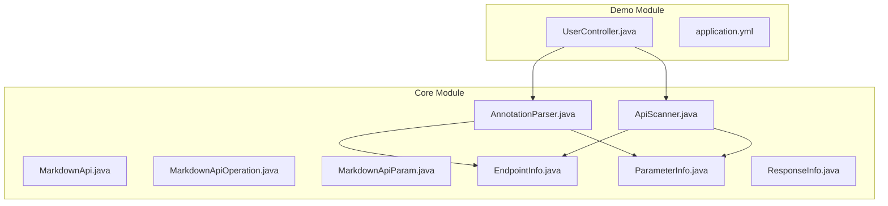
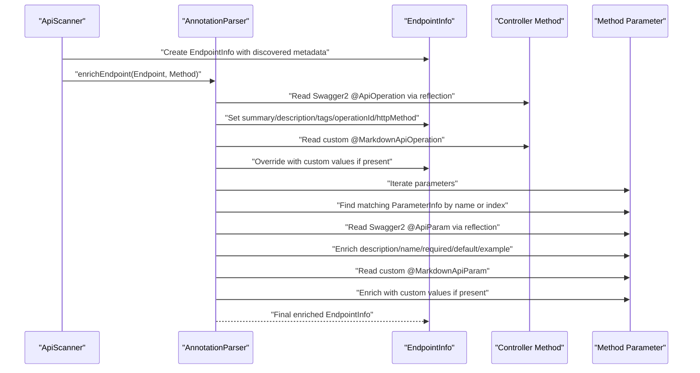
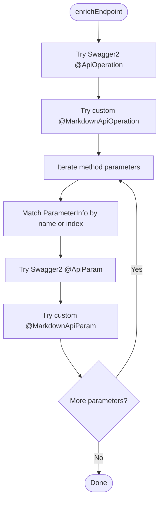
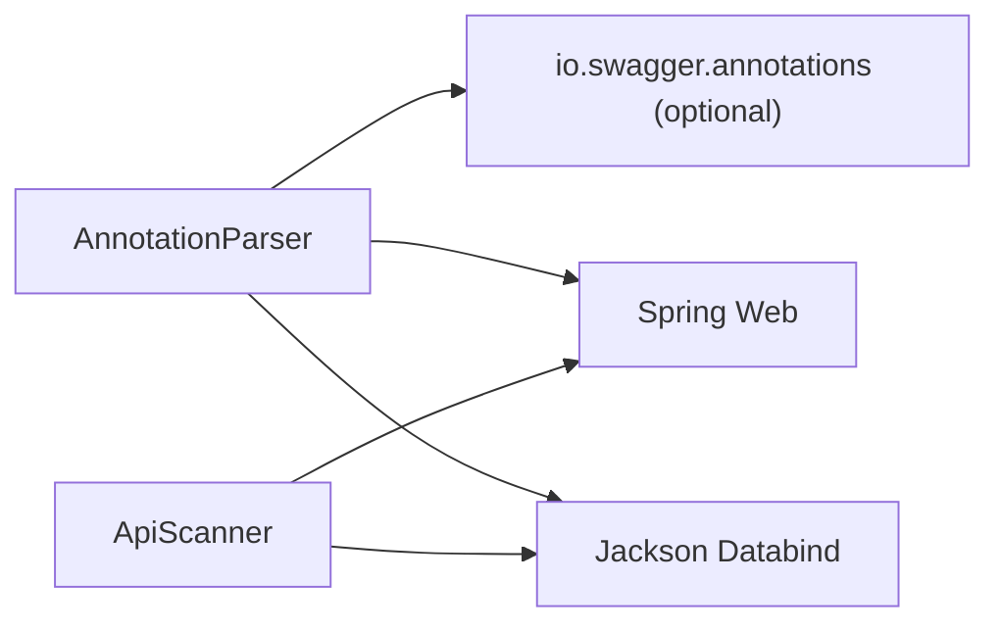

# Annotation Parser

<cite>
**Referenced Files in This Document**
- [AnnotationParser.java](file://swagger2md-core/src/main/java/com/github/tentac/swagger2md/core/AnnotationParser.java)
- [ApiScanner.java](file://swagger2md-core/src/main/java/com/github/tentac/swagger2md/core/ApiScanner.java)
- [MarkdownApi.java](file://swagger2md-core/src/main/java/com/github/tentac/swagger2md/annotation/MarkdownApi.java)
- [MarkdownApiOperation.java](file://swagger2md-core/src/main/java/com/github/tentac/swagger2md/annotation/MarkdownApiOperation.java)
- [MarkdownApiParam.java](file://swagger2md-core/src/main/java/com/github/tentac/swagger2md/annotation/MarkdownApiParam.java)
- [EndpointInfo.java](file://swagger2md-core/src/main/java/com/github/tentac/swagger2md/model/EndpointInfo.java)
- [ParameterInfo.java](file://swagger2md-core/src/main/java/com/github/tentac/swagger2md/model/ParameterInfo.java)
- [ResponseInfo.java](file://swagger2md-core/src/main/java/com/github/tentac/swagger2md/model/ResponseInfo.java)
- [UserController.java](file://swagger2md-demo/src/main/java/com/github/tentac/swagger2md/demo/controller/UserController.java)
- [application.yml](file://swagger2md-demo/src/main/resources/application.yml)
- [pom.xml](file://swagger2md-core/pom.xml)
- [pom.xml](file://pom.xml)
</cite>

## Table of Contents
1. [Introduction](#introduction)
2. [Project Structure](#project-structure)
3. [Core Components](#core-components)
4. [Architecture Overview](#architecture-overview)
5. [Detailed Component Analysis](#detailed-component-analysis)
6. [Dependency Analysis](#dependency-analysis)
7. [Performance Considerations](#performance-considerations)
8. [Troubleshooting Guide](#troubleshooting-guide)
9. [Conclusion](#conclusion)

## Introduction
This document describes the Annotation Parser component responsible for processing both Swagger2 annotations and custom Markdown annotations to enrich API endpoint metadata. It explains the dual annotation support system, parameter extraction from method signatures, response type analysis, and integration with the EndpointInfo model. The document also covers annotation precedence rules, fallback mechanisms, and migration strategies from Swagger2 to custom annotations.

## Project Structure
The Annotation Parser resides in the core module alongside supporting models and annotations. The demo module demonstrates practical usage with both Swagger2 and custom annotations.

**Diagram sources**
- [AnnotationParser.java:1-211](file://swagger2md-core/src/main/java/com/github/tentac/swagger2md/core/AnnotationParser.java#L1-L211)
- [ApiScanner.java:1-400](file://swagger2md-core/src/main/java/com/github/tentac/swagger2md/core/ApiScanner.java#L1-L400)
- [MarkdownApi.java:1-25](file://swagger2md-core/src/main/java/com/github/tentac/swagger2md/annotation/MarkdownApi.java#L1-L25)
- [MarkdownApiOperation.java:1-28](file://swagger2md-core/src/main/java/com/github/tentac/swagger2md/annotation/MarkdownApiOperation.java#L1-L28)
- [MarkdownApiParam.java:1-34](file://swagger2md-core/src/main/java/com/github/tentac/swagger2md/annotation/MarkdownApiParam.java#L1-L34)
- [EndpointInfo.java:1-165](file://swagger2md-core/src/main/java/com/github/tentac/swagger2md/model/EndpointInfo.java#L1-L165)
- [ParameterInfo.java:1-85](file://swagger2md-core/src/main/java/com/github/tentac/swagger2md/model/ParameterInfo.java#L1-L85)
- [ResponseInfo.java:1-52](file://swagger2md-core/src/main/java/com/github/tentac/swagger2md/model/ResponseInfo.java#L1-L52)
- [UserController.java:1-187](file://swagger2md-demo/src/main/java/com/github/tentac/swagger2md/demo/controller/UserController.java#L1-L187)
- [application.yml:1-29](file://swagger2md-demo/src/main/resources/application.yml#L1-L29)

**Section sources**
- [pom.xml:1-112](file://pom.xml#L1-L112)
- [pom.xml:1-51](file://swagger2md-core/pom.xml#L1-L51)

## Core Components
- AnnotationParser: Orchestrates enrichment of EndpointInfo using Swagger2 and custom annotations. It applies precedence rules and fallback mechanisms during enrichment.
- ApiScanner: Discovers endpoints from Spring controllers, extracts base paths, HTTP methods, paths, consumes/produces, parameters, and response types. It integrates with AnnotationParser to enrich discovered endpoints.
- Annotations: Custom Markdown annotations (MarkdownApi, MarkdownApiOperation, MarkdownApiParam) mirror Swagger2 semantics for standalone mode.
- Models: EndpointInfo, ParameterInfo, ResponseInfo represent enriched endpoint metadata and parameter/response definitions.

Key responsibilities:
- Dual annotation support: Reads Swagger2 annotations via reflection and custom annotations directly.
- Precedence and fallback: Method-level annotations override class-level defaults; custom annotations can complement Swagger2 annotations.
- Parameter enrichment: Matches method parameters to EndpointInfo parameters by name or index, then enriches descriptions, required flags, defaults, examples, and locations.
- Response type analysis: Determines response type and generates JSON examples for request/response bodies.

**Section sources**
- [AnnotationParser.java:1-211](file://swagger2md-core/src/main/java/com/github/tentac/swagger2md/core/AnnotationParser.java#L1-L211)
- [ApiScanner.java:1-400](file://swagger2md-core/src/main/java/com/github/tentac/swagger2md/core/ApiScanner.java#L1-L400)
- [MarkdownApi.java:1-25](file://swagger2md-core/src/main/java/com/github/tentac/swagger2md/annotation/MarkdownApi.java#L1-L25)
- [MarkdownApiOperation.java:1-28](file://swagger2md-core/src/main/java/com/github/tentac/swagger2md/annotation/MarkdownApiOperation.java#L1-L28)
- [MarkdownApiParam.java:1-34](file://swagger2md-core/src/main/java/com/github/tentac/swagger2md/annotation/MarkdownApiParam.java#L1-L34)
- [EndpointInfo.java:1-165](file://swagger2md-core/src/main/java/com/github/tentac/swagger2md/model/EndpointInfo.java#L1-L165)
- [ParameterInfo.java:1-85](file://swagger2md-core/src/main/java/com/github/tentac/swagger2md/model/ParameterInfo.java#L1-L85)
- [ResponseInfo.java:1-52](file://swagger2md-core/src/main/java/com/github/tentac/swagger2md/model/ResponseInfo.java#L1-L52)

## Architecture Overview
The Annotation Parser participates in a two-stage pipeline:
1. Discovery and basic enrichment by ApiScanner: Extracts HTTP method, path, consumes/produces, parameters, and response metadata.
2. Annotation-driven enrichment by AnnotationParser: Applies Swagger2 and custom annotations to refine summaries, descriptions, tags, operation IDs, parameter details, and HTTP method overrides.

**Diagram sources**
- [ApiScanner.java:164-277](file://swagger2md-core/src/main/java/com/github/tentac/swagger2md/core/ApiScanner.java#L164-L277)
- [AnnotationParser.java:26-35](file://swagger2md-core/src/main/java/com/github/tentac/swagger2md/core/AnnotationParser.java#L26-L35)
- [AnnotationParser.java:37-91](file://swagger2md-core/src/main/java/com/github/tentac/swagger2md/core/AnnotationParser.java#L37-L91)
- [AnnotationParser.java:93-109](file://swagger2md-core/src/main/java/com/github/tentac/swagger2md/core/AnnotationParser.java#L93-L109)
- [AnnotationParser.java:111-134](file://swagger2md-core/src/main/java/com/github/tentac/swagger2md/core/AnnotationParser.java#L111-L134)
- [AnnotationParser.java:136-174](file://swagger2md-core/src/main/java/com/github/tentac/swagger2md/core/AnnotationParser.java#L136-L174)
- [AnnotationParser.java:187-209](file://swagger2md-core/src/main/java/com/github/tentac/swagger2md/core/AnnotationParser.java#L187-L209)

## Detailed Component Analysis

### AnnotationParser
Implements a dual annotation enrichment strategy:
- Swagger2 compatibility: Uses reflection to read io.swagger.annotations.ApiOperation and io.swagger.annotations.ApiParam. Handles optional fields and gracefully ignores missing annotations.
- Custom Markdown annotations: Directly reads com.github.tentac.swagger2md.annotation.MarkdownApiOperation and MarkdownApiParam.
- Precedence and fallback:
  - Method-level Swagger2 @ApiOperation takes precedence over class-level tags.
  - Custom @MarkdownApiOperation values override Swagger2 where present.
  - Parameter enrichment merges Swagger2 and custom values, with custom taking precedence for overlapping fields.
  - Tag filtering excludes default empty-string tags to prevent pollution.
- Parameter matching:
  - First attempts match by parameter name.
  - Falls back to index-based matching if name-based lookup fails.
- HTTP method override: Allows explicit HTTP method specification via annotations.

**Diagram sources**
- [AnnotationParser.java:26-35](file://swagger2md-core/src/main/java/com/github/tentac/swagger2md/core/AnnotationParser.java#L26-L35)
- [AnnotationParser.java:37-91](file://swagger2md-core/src/main/java/com/github/tentac/swagger2md/core/AnnotationParser.java#L37-L91)
- [AnnotationParser.java:93-109](file://swagger2md-core/src/main/java/com/github/tentac/swagger2md/core/AnnotationParser.java#L93-L109)
- [AnnotationParser.java:111-134](file://swagger2md-core/src/main/java/com/github/tentac/swagger2md/core/AnnotationParser.java#L111-L134)
- [AnnotationParser.java:136-174](file://swagger2md-core/src/main/java/com/github/tentac/swagger2md/core/AnnotationParser.java#L136-L174)
- [AnnotationParser.java:187-209](file://swagger2md-core/src/main/java/com/github/tentac/swagger2md/core/AnnotationParser.java#L187-L209)

**Section sources**
- [AnnotationParser.java:1-211](file://swagger2md-core/src/main/java/com/github/tentac/swagger2md/core/AnnotationParser.java#L1-L211)

### ApiScanner
Discovers endpoints from Spring controllers and prepares EndpointInfo for annotation enrichment:
- Base path resolution from class-level @RequestMapping.
- HTTP method detection from @GetMapping/@PostMapping/etc.
- Consumes/produces extraction from mapping annotations.
- Parameter classification by Spring annotations (@RequestParam, @PathVariable, @RequestHeader, @RequestBody).
- Body parameter identification and request/response type analysis.
- JSON example generation for request and response bodies.

Integration with AnnotationParser:
- Calls AnnotationParser.enrichEndpoint after constructing EndpointInfo to apply annotation-driven metadata.

**Section sources**
- [ApiScanner.java:1-400](file://swagger2md-core/src/main/java/com/github/tentac/swagger2md/core/ApiScanner.java#L1-L400)

### Custom Markdown Annotations
Mirror Swagger2 semantics for standalone mode:
- MarkdownApi: Controller-level grouping and description.
- MarkdownApiOperation: Endpoint-level summary, notes, tags, and HTTP method override.
- MarkdownApiParam: Parameter-level name, description, required flag, default value, example, and location.

These annotations are designed to be used alongside or instead of Swagger2 annotations, enabling gradual migration.

**Section sources**
- [MarkdownApi.java:1-25](file://swagger2md-core/src/main/java/com/github/tentac/swagger2md/annotation/MarkdownApi.java#L1-L25)
- [MarkdownApiOperation.java:1-28](file://swagger2md-core/src/main/java/com/github/tentac/swagger2md/annotation/MarkdownApiOperation.java#L1-L28)
- [MarkdownApiParam.java:1-34](file://swagger2md-core/src/main/java/com/github/tentac/swagger2md/annotation/MarkdownApiParam.java#L1-L34)

### Model Integration
- EndpointInfo: Holds endpoint metadata (HTTP method, path, summary, description, tags, consumes, produces, parameters, request/response types/examples, deprecation, operation ID).
- ParameterInfo: Holds parameter metadata (name, location, description, required, type, default, example).
- ResponseInfo: Represents response definitions (status code, description, type, example).

AnnotationParser enriches these models by applying annotation values and merging Swagger2 and custom annotation data.

**Section sources**
- [EndpointInfo.java:1-165](file://swagger2md-core/src/main/java/com/github/tentac/swagger2md/model/EndpointInfo.java#L1-L165)
- [ParameterInfo.java:1-85](file://swagger2md-core/src/main/java/com/github/tentac/swagger2md/model/ParameterInfo.java#L1-L85)
- [ResponseInfo.java:1-52](file://swagger2md-core/src/main/java/com/github/tentac/swagger2md/model/ResponseInfo.java#L1-L52)

### Practical Usage Example
The demo controller illustrates dual annotation usage:
- Controller-level: @Api and @MarkdownApi for tags and descriptions.
- Method-level: @ApiOperation and @MarkdownApiOperation for summaries and notes.
- Parameter-level: @ApiParam and @MarkdownApiParam for parameter details.

This setup enables seamless compatibility with existing Swagger2 projects while allowing adoption of custom annotations.

**Section sources**
- [UserController.java:1-187](file://swagger2md-demo/src/main/java/com/github/tentac/swagger2md/demo/controller/UserController.java#L1-L187)
- [application.yml:1-29](file://swagger2md-demo/src/main/resources/application.yml#L1-L29)

## Dependency Analysis
External dependencies relevant to annotation parsing:
- Swagger Annotations: Optional dependency for Swagger2 compatibility. The parser uses reflection to access these annotations when present.
- Spring Web and Context: Required for annotations and reflection capabilities.
- Jackson: Used for JSON serialization and example generation.

**Diagram sources**
- [pom.xml:19-51](file://swagger2md-core/pom.xml#L19-L51)
- [pom.xml:33-68](file://pom.xml#L33-L68)

**Section sources**
- [pom.xml:1-51](file://swagger2md-core/pom.xml#L1-L51)
- [pom.xml:1-112](file://pom.xml#L1-L112)

## Performance Considerations
- Reflection overhead: The parser uses reflection to access Swagger2 annotations. While guarded by try/catch blocks, repeated reflection calls can add overhead in large applications. Consider caching annotation metadata if performance becomes a concern.
- Parameter matching: Index fallback ensures robustness but may be slower than name-based matching in methods with many parameters. Keep parameter lists reasonable and leverage meaningful parameter names.
- JSON example generation: Generating examples for complex generic types can be expensive. Limit example generation to representative scenarios or disable for heavy endpoints if needed.

## Troubleshooting Guide
Common issues and resolutions:
- Missing Swagger2 dependency: If io.swagger.annotations classes are not on the classpath, the parser gracefully ignores them. Ensure the optional dependency is included if you rely on Swagger2 annotations.
- Empty tag arrays: The parser filters out default empty-string tags to avoid polluting endpoint metadata. Verify that your tags are non-empty when using @Api or @MarkdownApi.
- Parameter name mismatches: If parameter names are not preserved (e.g., due to bytecode optimization), the parser falls back to index-based matching. Ensure debug symbols are enabled or use explicit parameter names in annotations.
- HTTP method inference: For @RequestMapping without explicit method, the parser defaults to GET. Provide explicit mapping annotations to avoid ambiguity.
- Migration from Swagger2: Start by adding custom annotations alongside existing Swagger2 annotations. Gradually remove Swagger2 annotations as confidence grows.

**Section sources**
- [AnnotationParser.java:37-91](file://swagger2md-core/src/main/java/com/github/tentac/swagger2md/core/AnnotationParser.java#L37-L91)
- [AnnotationParser.java:176-185](file://swagger2md-core/src/main/java/com/github/tentac/swagger2md/core/AnnotationParser.java#L176-L185)
- [ApiScanner.java:203-214](file://swagger2md-core/src/main/java/com/github/tentac/swagger2md/core/ApiScanner.java#L203-L214)

## Conclusion
The Annotation Parser provides a robust, backward-compatible mechanism for processing both Swagger2 and custom Markdown annotations. By leveraging reflection and a clear precedence model, it enables incremental migration from Swagger2 to custom annotations while preserving existing documentation. The integration with ApiScanner ensures comprehensive endpoint discovery and enrichment, resulting in rich, accurate API documentation suitable for LLM integration and general consumption.