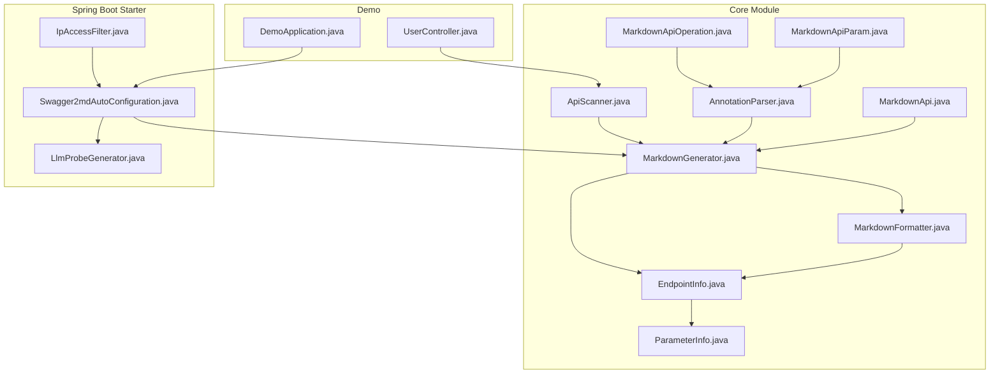
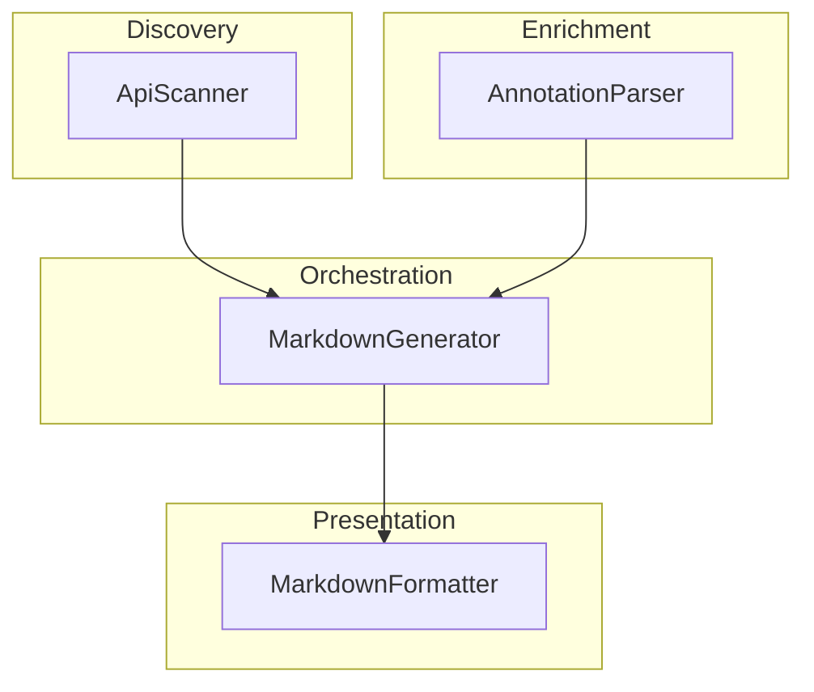
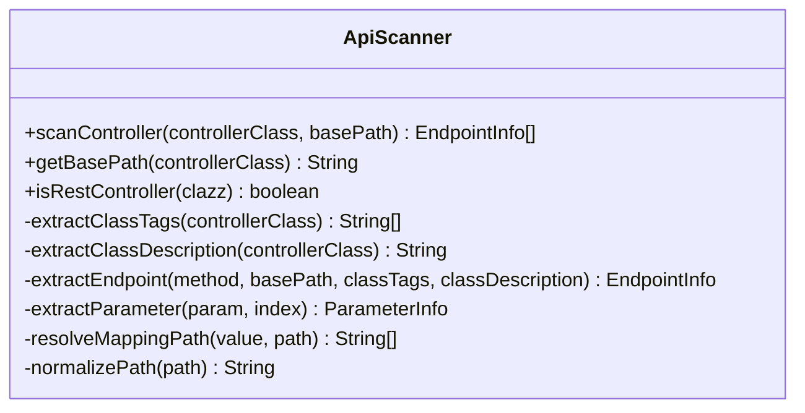
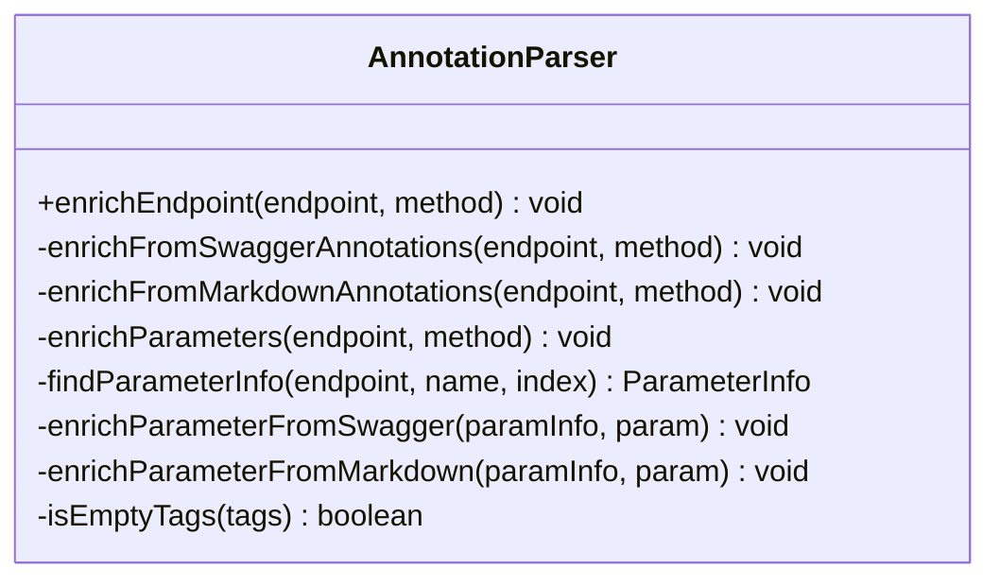
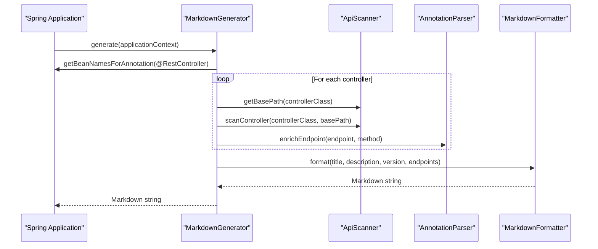
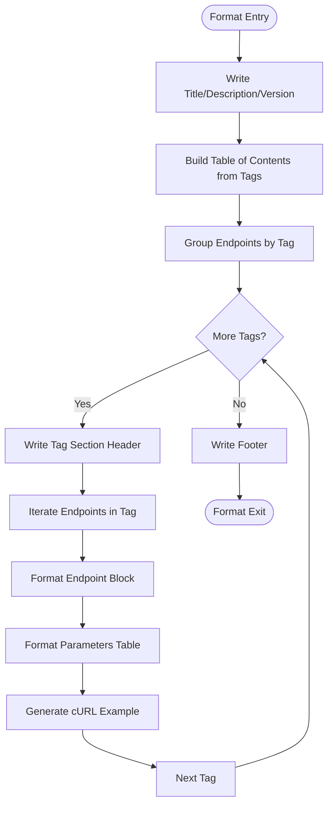
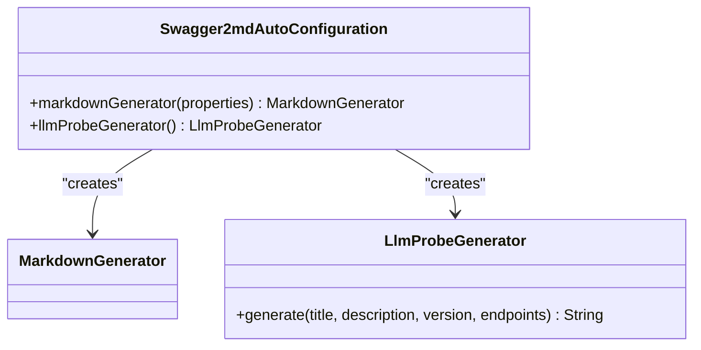
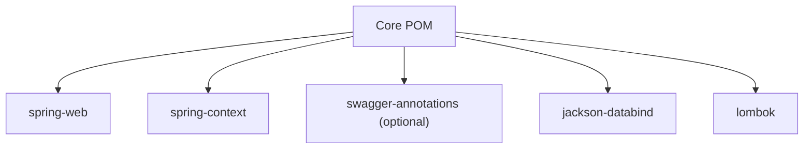
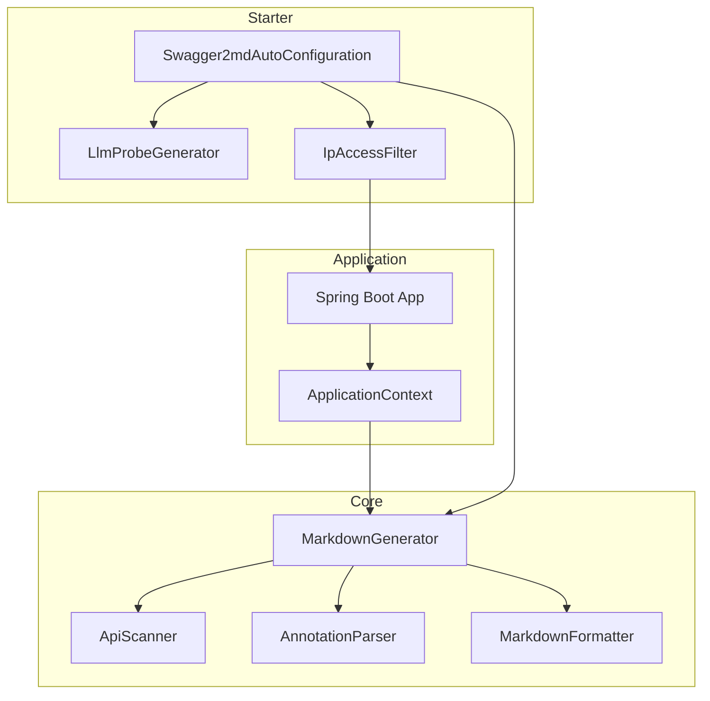
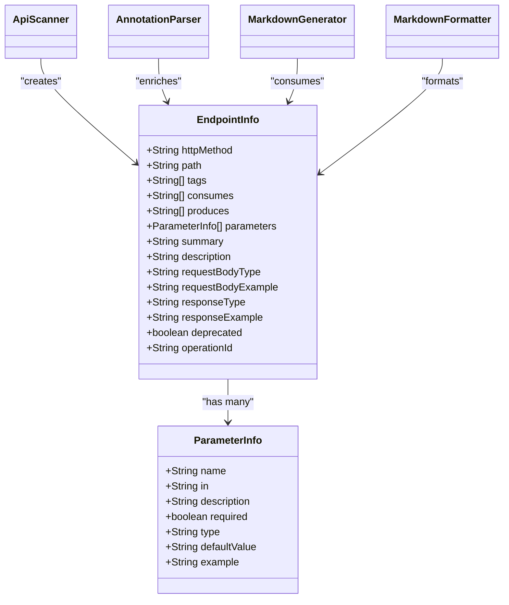

# Core Architecture

<cite>
**Referenced Files in This Document**
- [ApiScanner.java](file://swagger2md-core/src/main/java/com/github/tentac/swagger2md/core/ApiScanner.java)
- [AnnotationParser.java](file://swagger2md-core/src/main/java/com/github/tentac/swagger2md/core/AnnotationParser.java)
- [MarkdownGenerator.java](file://swagger2md-core/src/main/java/com/github/tentac/swagger2md/core/MarkdownGenerator.java)
- [MarkdownFormatter.java](file://swagger2md-core/src/main/java/com/github/tentac/swagger2md/core/MarkdownFormatter.java)
- [MarkdownApi.java](file://swagger2md-core/src/main/java/com/github/tentac/swagger2md/annotation/MarkdownApi.java)
- [MarkdownApiOperation.java](file://swagger2md-core/src/main/java/com/github/tentac/swagger2md/annotation/MarkdownApiOperation.java)
- [MarkdownApiParam.java](file://swagger2md-core/src/main/java/com/github/tentac/swagger2md/annotation/MarkdownApiParam.java)
- [EndpointInfo.java](file://swagger2md-core/src/main/java/com/github/tentac/swagger2md/model/EndpointInfo.java)
- [ParameterInfo.java](file://swagger2md-core/src/main/java/com/github/tentac/swagger2md/model/ParameterInfo.java)
- [LlmProbeGenerator.java](file://swagger2md-spring-boot-starter/src/main/java/com/github/tentac/swagger2md/probe/LlmProbeGenerator.java)
- [Swagger2mdAutoConfiguration.java](file://swagger2md-spring-boot-starter/src/main/java/com/github/tentac/swagger2md/autoconfigure/Swagger2mdAutoConfiguration.java)
- [IpAccessFilter.java](file://swagger2md-spring-boot-starter/src/main/java/com/github/tentac/swagger2md/filter/IpAccessFilter.java)
- [DemoApplication.java](file://swagger2md-demo/src/main/java/com/github/tentac/swagger2md/demo/DemoApplication.java)
- [UserController.java](file://swagger2md-demo/src/main/java/com/github/tentac/swagger2md/demo/controller/UserController.java)
- [pom.xml (Parent)](file://pom.xml)
- [pom.xml (Core)](file://swagger2md-core/pom.xml)
</cite>

## Table of Contents
1. [Introduction](#introduction)
2. [Project Structure](#project-structure)
3. [Core Components](#core-components)
4. [Architecture Overview](#architecture-overview)
5. [Detailed Component Analysis](#detailed-component-analysis)
6. [Dependency Analysis](#dependency-analysis)
7. [Performance Considerations](#performance-considerations)
8. [Troubleshooting Guide](#troubleshooting-guide)
9. [Conclusion](#conclusion)
10. [Appendices](#appendices)

## Introduction
This document describes the core architecture of the tentac Swagger2md module with a focus on the core module that powers Markdown API documentation generation. The system is composed of four primary components:
- ApiScanner: discovers REST controllers and extracts endpoint metadata from Spring annotations.
- AnnotationParser: enriches endpoint metadata using both Swagger2 and custom Markdown annotations.
- MarkdownGenerator: orchestrates scanning, parsing, and formatting to produce Markdown documentation.
- MarkdownFormatter: transforms endpoint metadata into a human-readable Markdown document.

The core module supports both standalone usage and Spring Boot integration. It leverages design patterns such as factory (for generating documentation via MarkdownGenerator), strategy (for annotation enrichment), and template method (for LLM probe generation via LlmProbeGenerator). Infrastructure-wise, it requires Java 17+ and Spring Boot 3.x, with optional Swagger2 annotations for backward compatibility.

## Project Structure
The repository is organized as a multi-module Maven project:
- swagger2md-core: Contains the core engine (scanning, parsing, formatting) and shared models/annotations.
- swagger2md-spring-boot-starter: Provides Spring Boot auto-configuration, web endpoints, and security filters for exposing generated docs.
- swagger2md-demo: A sample Spring Boot application showcasing usage with mixed Swagger2 and Markdown annotations.

**Diagram sources**
- [ApiScanner.java:1-323](file://swagger2md-core/src/main/java/com/github/tentac/swagger2md/core/ApiScanner.java#L1-L323)
- [AnnotationParser.java:1-211](file://swagger2md-core/src/main/java/com/github/tentac/swagger2md/core/AnnotationParser.java#L1-L211)
- [MarkdownGenerator.java:1-156](file://swagger2md-core/src/main/java/com/github/tentac/swagger2md/core/MarkdownGenerator.java#L1-L156)
- [MarkdownFormatter.java:1-198](file://swagger2md-core/src/main/java/com/github/tentac/swagger2md/core/MarkdownFormatter.java#L1-L198)
- [EndpointInfo.java:1-165](file://swagger2md-core/src/main/java/com/github/tentac/swagger2md/model/EndpointInfo.java#L1-L165)
- [ParameterInfo.java:1-85](file://swagger2md-core/src/main/java/com/github/tentac/swagger2md/model/ParameterInfo.java#L1-L85)
- [MarkdownApi.java:1-25](file://swagger2md-core/src/main/java/com/github/tentac/swagger2md/annotation/MarkdownApi.java#L1-L25)
- [MarkdownApiOperation.java:1-28](file://swagger2md-core/src/main/java/com/github/tentac/swagger2md/annotation/MarkdownApiOperation.java#L1-L28)
- [MarkdownApiParam.java:1-34](file://swagger2md-core/src/main/java/com/github/tentac/swagger2md/annotation/MarkdownApiParam.java#L1-L34)
- [Swagger2mdAutoConfiguration.java:1-82](file://swagger2md-spring-boot-starter/src/main/java/com/github/tentac/swagger2md/autoconfigure/Swagger2mdAutoConfiguration.java#L1-L82)
- [LlmProbeGenerator.java:1-148](file://swagger2md-spring-boot-starter/src/main/java/com/github/tentac/swagger2md/probe/LlmProbeGenerator.java#L1-L148)
- [IpAccessFilter.java:1-196](file://swagger2md-spring-boot-starter/src/main/java/com/github/tentac/swagger2md/filter/IpAccessFilter.java#L1-L196)
- [DemoApplication.java:1-20](file://swagger2md-demo/src/main/java/com/github/tentac/swagger2md/demo/DemoApplication.java#L1-L20)
- [UserController.java:1-187](file://swagger2md-demo/src/main/java/com/github/tentac/swagger2md/demo/controller/UserController.java#L1-L187)

**Section sources**
- [pom.xml (Parent):15-19](file://pom.xml#L15-L19)
- [pom.xml (Core):1-51](file://swagger2md-core/pom.xml#L1-L51)

## Core Components
This section documents the four main components and their responsibilities, along with design patterns and integration points.

- ApiScanner
  - Purpose: Discover REST controllers and extract endpoint metadata (HTTP method, path, consumes/produces, parameters).
  - Key capabilities:
    - Detects REST controllers via @RestController and @Controller with @ResponseBody.
    - Resolves base paths from @RequestMapping and normalizes paths.
    - Extracts class-level tags/description from Swagger @Api and custom @MarkdownApi.
    - Infers parameter locations (@RequestParam, @PathVariable, @RequestHeader, @RequestBody).
  - Design pattern: Strategy-like selection of mapping annotations and parameter extraction.

- AnnotationParser
  - Purpose: Enrich EndpointInfo with additional metadata from annotations.
  - Key capabilities:
    - Reads Swagger2 @ApiOperation and @ApiParam (optional).
    - Reads custom @MarkdownApiOperation and @MarkdownApiParam.
    - Supports tag replacement and method-level overrides.
  - Design pattern: Strategy pattern for annotation processing (Swagger2 vs custom).

- MarkdownGenerator
  - Purpose: Orchestrate the generation pipeline and expose two generation modes:
    - From Spring ApplicationContext (scans and parses).
    - From pre-assembled EndpointInfo list (format only).
  - Factory pattern: Constructs and wires ApiScanner, AnnotationParser, and MarkdownFormatter.
  - Integration: Filters controllers by base package and respects @MarkdownApi(hidden).

- MarkdownFormatter
  - Purpose: Produce Markdown documentation from EndpointInfo lists.
  - Key capabilities:
    - Groups endpoints by tags, generates TOC, and formats endpoint sections.
    - Emits cURL examples and escapes special Markdown characters.
  - Template method: The formatting steps are fixed but the content is data-driven.

**Section sources**
- [ApiScanner.java:17-323](file://swagger2md-core/src/main/java/com/github/tentac/swagger2md/core/ApiScanner.java#L17-L323)
- [AnnotationParser.java:14-211](file://swagger2md-core/src/main/java/com/github/tentac/swagger2md/core/AnnotationParser.java#L14-L211)
- [MarkdownGenerator.java:11-156](file://swagger2md-core/src/main/java/com/github/tentac/swagger2md/core/MarkdownGenerator.java#L11-L156)
- [MarkdownFormatter.java:8-198](file://swagger2md-core/src/main/java/com/github/tentac/swagger2md/core/MarkdownFormatter.java#L8-L198)

## Architecture Overview
The core module follows a layered architecture:
- Discovery Layer: ApiScanner scans Spring controllers and builds EndpointInfo.
- Enrichment Layer: AnnotationParser augments EndpointInfo with metadata.
- Orchestration Layer: MarkdownGenerator coordinates scanning, parsing, and formatting.
- Presentation Layer: MarkdownFormatter renders Markdown output.

**Diagram sources**
- [ApiScanner.java:1-323](file://swagger2md-core/src/main/java/com/github/tentac/swagger2md/core/ApiScanner.java#L1-L323)
- [AnnotationParser.java:1-211](file://swagger2md-core/src/main/java/com/github/tentac/swagger2md/core/AnnotationParser.java#L1-L211)
- [MarkdownGenerator.java:1-156](file://swagger2md-core/src/main/java/com/github/tentac/swagger2md/core/MarkdownGenerator.java#L1-L156)
- [MarkdownFormatter.java:1-198](file://swagger2md-core/src/main/java/com/github/tentac/swagger2md/core/MarkdownFormatter.java#L1-L198)

## Detailed Component Analysis

### ApiScanner Analysis
ApiScanner focuses on Spring MVC controller discovery and endpoint extraction. It handles:
- Class-level base path resolution and normalization.
- Method-level mapping detection across RequestMapping variants.
- Parameter extraction with location inference and defaults.
- Optional fallback to class-level tags/description if Swagger annotations are absent.

**Diagram sources**
- [ApiScanner.java:20-323](file://swagger2md-core/src/main/java/com/github/tentac/swagger2md/core/ApiScanner.java#L20-L323)

**Section sources**
- [ApiScanner.java:22-92](file://swagger2md-core/src/main/java/com/github/tentac/swagger2md/core/ApiScanner.java#L22-L92)
- [ApiScanner.java:94-158](file://swagger2md-core/src/main/java/com/github/tentac/swagger2md/core/ApiScanner.java#L94-L158)
- [ApiScanner.java:160-243](file://swagger2md-core/src/main/java/com/github/tentac/swagger2md/core/ApiScanner.java#L160-L243)
- [ApiScanner.java:245-297](file://swagger2md-core/src/main/java/com/github/tentac/swagger2md/core/ApiScanner.java#L245-L297)

### AnnotationParser Analysis
AnnotationParser enriches EndpointInfo using either Swagger2 annotations or custom Markdown annotations. It:
- Attempts to read @ApiOperation and @ApiParam via reflection.
- Falls back to @MarkdownApiOperation and @MarkdownApiParam.
- Supports tag replacement and method-level overrides.
- Handles parameter enrichment by name/index matching.

**Diagram sources**
- [AnnotationParser.java:18-211](file://swagger2md-core/src/main/java/com/github/tentac/swagger2md/core/AnnotationParser.java#L18-L211)

**Section sources**
- [AnnotationParser.java:26-91](file://swagger2md-core/src/main/java/com/github/tentac/swagger2md/core/AnnotationParser.java#L26-L91)
- [AnnotationParser.java:93-121](file://swagger2md-core/src/main/java/com/github/tentac/swagger2md/core/AnnotationParser.java#L93-L121)
- [AnnotationParser.java:136-174](file://swagger2md-core/src/main/java/com/github/tentac/swagger2md/core/AnnotationParser.java#L136-L174)
- [AnnotationParser.java:187-209](file://swagger2md-core/src/main/java/com/github/tentac/swagger2md/core/AnnotationParser.java#L187-L209)

### MarkdownGenerator Analysis
MarkdownGenerator orchestrates the generation process:
- Scans ApplicationContext for @RestController beans.
- Applies basePackage filtering and respects @MarkdownApi(hidden).
- Builds EndpointInfo lists and enriches via AnnotationParser.
- Delegates formatting to MarkdownFormatter.

**Diagram sources**
- [MarkdownGenerator.java:54-99](file://swagger2md-core/src/main/java/com/github/tentac/swagger2md/core/MarkdownGenerator.java#L54-L99)
- [ApiScanner.java:34-52](file://swagger2md-core/src/main/java/com/github/tentac/swagger2md/core/ApiScanner.java#L34-L52)
- [AnnotationParser.java:26-35](file://swagger2md-core/src/main/java/com/github/tentac/swagger2md/core/AnnotationParser.java#L26-L35)
- [MarkdownFormatter.java:24-71](file://swagger2md-core/src/main/java/com/github/tentac/swagger2md/core/MarkdownFormatter.java#L24-L71)

**Section sources**
- [MarkdownGenerator.java:54-99](file://swagger2md-core/src/main/java/com/github/tentac/swagger2md/core/MarkdownGenerator.java#L54-L99)
- [MarkdownGenerator.java:107-145](file://swagger2md-core/src/main/java/com/github/tentac/swagger2md/core/MarkdownGenerator.java#L107-L145)

### MarkdownFormatter Analysis
MarkdownFormatter produces Markdown output:
- Generates header, description, version, and TOC.
- Groups endpoints by tags and formats each endpoint with parameters, request/response examples, and cURL.
- Escapes special Markdown characters and converts tag names to anchors.

**Diagram sources**
- [MarkdownFormatter.java:24-71](file://swagger2md-core/src/main/java/com/github/tentac/swagger2md/core/MarkdownFormatter.java#L24-L71)
- [MarkdownFormatter.java:73-132](file://swagger2md-core/src/main/java/com/github/tentac/swagger2md/core/MarkdownFormatter.java#L73-L132)
- [MarkdownFormatter.java:134-196](file://swagger2md-core/src/main/java/com/github/tentac/swagger2md/core/MarkdownFormatter.java#L134-L196)

**Section sources**
- [MarkdownFormatter.java:24-71](file://swagger2md-core/src/main/java/com/github/tentac/swagger2md/core/MarkdownFormatter.java#L24-L71)
- [MarkdownFormatter.java:157-186](file://swagger2md-core/src/main/java/com/github/tentac/swagger2md/core/MarkdownFormatter.java#L157-L186)

### LLM Probe Generator (Starter Integration)
The Spring Boot starter introduces LlmProbeGenerator for LLM-friendly Markdown:
- Generates a capability manifest with summarized endpoints and compact details.
- Groups by path for readability and includes usage instructions for LLMs.
- Used alongside MarkdownGenerator in the auto-configuration.

**Diagram sources**
- [LlmProbeGenerator.java:15-148](file://swagger2md-spring-boot-starter/src/main/java/com/github/tentac/swagger2md/probe/LlmProbeGenerator.java#L15-L148)
- [Swagger2mdAutoConfiguration.java:25-46](file://swagger2md-spring-boot-starter/src/main/java/com/github/tentac/swagger2md/autoconfigure/Swagger2mdAutoConfiguration.java#L25-L46)

**Section sources**
- [LlmProbeGenerator.java:26-146](file://swagger2md-spring-boot-starter/src/main/java/com/github/tentac/swagger2md/probe/LlmProbeGenerator.java#L26-L146)
- [Swagger2mdAutoConfiguration.java:25-46](file://swagger2md-spring-boot-starter/src/main/java/com/github/tentac/swagger2md/autoconfigure/Swagger2mdAutoConfiguration.java#L25-L46)

## Dependency Analysis
The core module depends on Spring Web and Spring Context for annotation scanning and ApplicationContext usage. Swagger2 annotations are optional for backward compatibility. Jackson is used for JSON serialization needs.

**Diagram sources**
- [pom.xml (Core):19-48](file://swagger2md-core/pom.xml#L19-L48)

**Section sources**
- [pom.xml (Parent):33-68](file://pom.xml#L33-L68)
- [pom.xml (Core):19-48](file://swagger2md-core/pom.xml#L19-L48)

## Performance Considerations
- Reflection overhead: Scanning and parsing rely on reflection. For large applications, consider narrowing the basePackage scope to reduce bean traversal.
- Annotation availability: Optional Swagger2 annotations avoid reflection costs when absent.
- Memory footprint: EndpointInfo and ParameterInfo are lightweight POJOs; formatting is string-heavy but linear in endpoint count.
- Scalability: The current design is single-threaded. For high-throughput scenarios, consider caching or asynchronous generation behind a queue.

## Troubleshooting Guide
Common issues and resolutions:
- Endpoints not found:
  - Verify controllers are annotated with @RestController or @Controller with @ResponseBody.
  - Confirm basePackage filter excludes controllers unintentionally.
- Missing descriptions/tags:
  - Ensure @MarkdownApi or Swagger @Api annotations are present on controllers.
- Parameter location mismatches:
  - Use @MarkdownApiParam or Swagger @ApiParam to explicitly define parameter locations and descriptions.
- Access control:
  - Configure IP whitelist/blacklist via starter properties to restrict exposure of documentation endpoints.

**Section sources**
- [MarkdownGenerator.java:67-77](file://swagger2md-core/src/main/java/com/github/tentac/swagger2md/core/MarkdownGenerator.java#L67-L77)
- [ApiScanner.java:94-133](file://swagger2md-core/src/main/java/com/github/tentac/swagger2md/core/ApiScanner.java#L94-L133)
- [AnnotationParser.java:93-121](file://swagger2md-core/src/main/java/com/github/tentac/swagger2md/core/AnnotationParser.java#L93-L121)
- [IpAccessFilter.java:61-95](file://swagger2md-spring-boot-starter/src/main/java/com/github/tentac/swagger2md/filter/IpAccessFilter.java#L61-L95)

## Conclusion
The core module provides a clean separation of concerns: discovery (ApiScanner), enrichment (AnnotationParser), orchestration (MarkdownGenerator), and presentation (MarkdownFormatter). It supports both standalone usage and Spring Boot integration, with optional Swagger2 compatibility and LLM-optimized output. The design emphasizes modularity, extensibility, and maintainability through well-defined interfaces and layered architecture.

## Appendices

### System Context Diagram
This diagram shows how the core module integrates with Spring Boot and the starter for runtime exposure and security.

**Diagram sources**
- [MarkdownGenerator.java:54-99](file://swagger2md-core/src/main/java/com/github/tentac/swagger2md/core/MarkdownGenerator.java#L54-L99)
- [Swagger2mdAutoConfiguration.java:25-80](file://swagger2md-spring-boot-starter/src/main/java/com/github/tentac/swagger2md/autoconfigure/Swagger2mdAutoConfiguration.java#L25-L80)
- [LlmProbeGenerator.java:26-146](file://swagger2md-spring-boot-starter/src/main/java/com/github/tentac/swagger2md/probe/LlmProbeGenerator.java#L26-L146)
- [IpAccessFilter.java:61-95](file://swagger2md-spring-boot-starter/src/main/java/com/github/tentac/swagger2md/filter/IpAccessFilter.java#L61-L95)

### Component Relationships and Data Models

**Diagram sources**
- [EndpointInfo.java:9-165](file://swagger2md-core/src/main/java/com/github/tentac/swagger2md/model/EndpointInfo.java#L9-L165)
- [ParameterInfo.java:6-85](file://swagger2md-core/src/main/java/com/github/tentac/swagger2md/model/ParameterInfo.java#L6-L85)
- [ApiScanner.java:34-52](file://swagger2md-core/src/main/java/com/github/tentac/swagger2md/core/ApiScanner.java#L34-L52)
- [AnnotationParser.java:26-35](file://swagger2md-core/src/main/java/com/github/tentac/swagger2md/core/AnnotationParser.java#L26-L35)
- [MarkdownGenerator.java:54-99](file://swagger2md-core/src/main/java/com/github/tentac/swagger2md/core/MarkdownGenerator.java#L54-L99)
- [MarkdownFormatter.java:24-71](file://swagger2md-core/src/main/java/com/github/tentac/swagger2md/core/MarkdownFormatter.java#L24-L71)

### Usage Examples and Integration Patterns
- Standalone usage:
  - Instantiate MarkdownGenerator and call generate(applicationContext) to scan and format.
  - Alternatively, call getEndpoints(...) to retrieve EndpointInfo and format externally.
- Spring Boot integration:
  - Enable via starter properties; auto-configuration registers MarkdownGenerator and LlmProbeGenerator.
  - Access endpoints via configured paths (Markdown and LLM probe) with optional IP filtering.

**Section sources**
- [MarkdownGenerator.java:54-99](file://swagger2md-core/src/main/java/com/github/tentac/swagger2md/core/MarkdownGenerator.java#L54-L99)
- [Swagger2mdAutoConfiguration.java:25-46](file://swagger2md-spring-boot-starter/src/main/java/com/github/tentac/swagger2md/autoconfigure/Swagger2mdAutoConfiguration.java#L25-L46)
- [DemoApplication.java:6-12](file://swagger2md-demo/src/main/java/com/github/tentac/swagger2md/demo/DemoApplication.java#L6-L12)
- [UserController.java:20-137](file://swagger2md-demo/src/main/java/com/github/tentac/swagger2md/demo/controller/UserController.java#L20-L137)