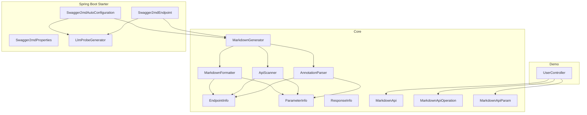
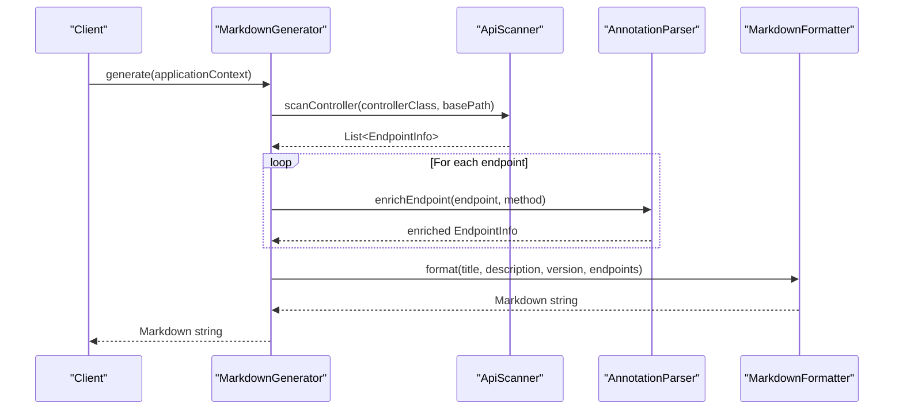
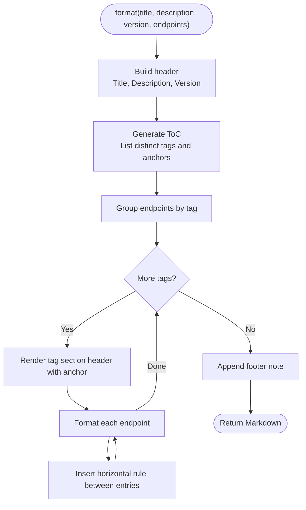
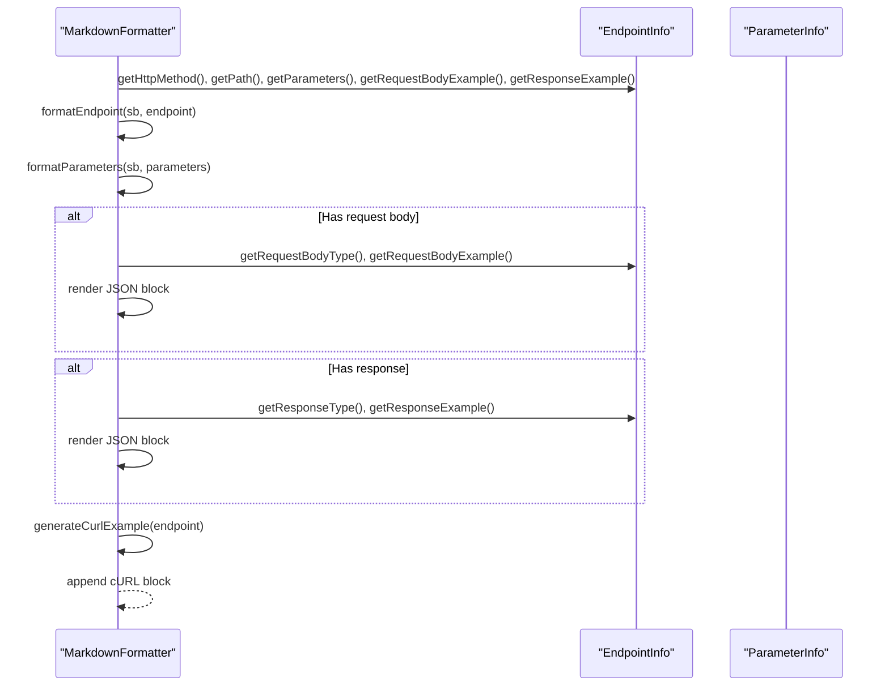
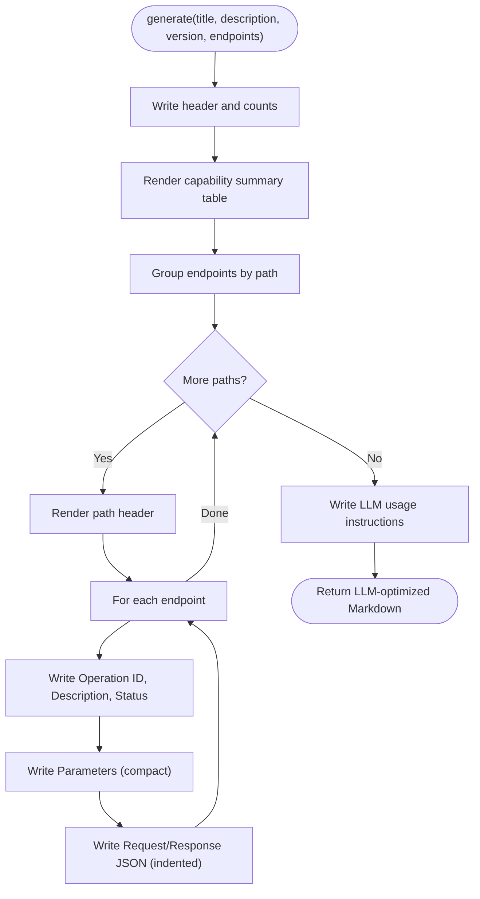
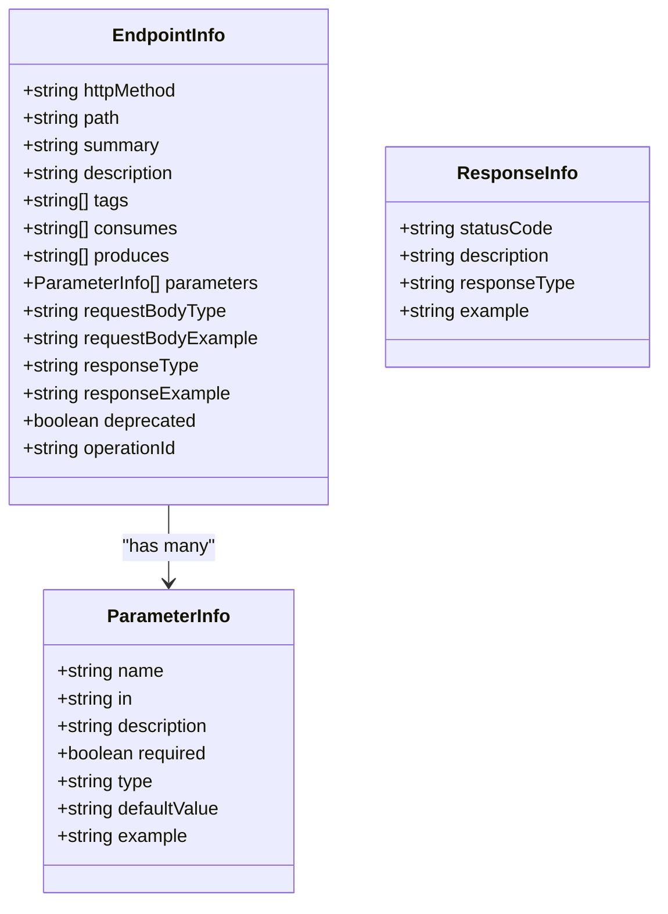
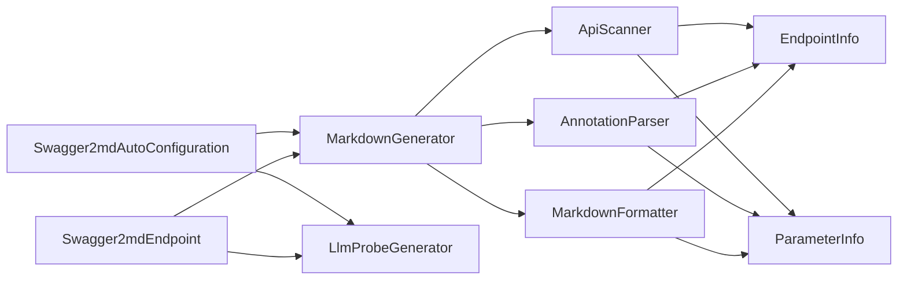

# Markdown Formatter

<cite>
**Referenced Files in This Document**
- [MarkdownFormatter.java](file://swagger2md-core/src/main/java/com/github/tentac/swagger2md/core/MarkdownFormatter.java)
- [MarkdownGenerator.java](file://swagger2md-core/src/main/java/com/github/tentac/swagger2md/core/MarkdownGenerator.java)
- [ApiScanner.java](file://swagger2md-core/src/main/java/com/github/tentac/swagger2md/core/ApiScanner.java)
- [AnnotationParser.java](file://swagger2md-core/src/main/java/com/github/tentac/swagger2md/core/AnnotationParser.java)
- [EndpointInfo.java](file://swagger2md-core/src/main/java/com/github/tentac/swagger2md/model/EndpointInfo.java)
- [ParameterInfo.java](file://swagger2md-core/src/main/java/com/github/tentac/swagger2md/model/ParameterInfo.java)
- [ResponseInfo.java](file://swagger2md-core/src/main/java/com/github/tentac/swagger2md/model/ResponseInfo.java)
- [MarkdownApi.java](file://swagger2md-core/src/main/java/com/github/tentac/swagger2md/annotation/MarkdownApi.java)
- [MarkdownApiOperation.java](file://swagger2md-core/src/main/java/com/github/tentac/swagger2md/annotation/MarkdownApiOperation.java)
- [MarkdownApiParam.java](file://swagger2md-core/src/main/java/com/github/tentac/swagger2md/annotation/MarkdownApiParam.java)
- [Swagger2mdAutoConfiguration.java](file://swagger2md-spring-boot-starter/src/main/java/com/github/tentac/swagger2md/autoconfigure/Swagger2mdAutoConfiguration.java)
- [Swagger2mdEndpoint.java](file://swagger2md-spring-boot-starter/src/main/java/com/github/tentac/swagger2md/autoconfigure/Swagger2mdEndpoint.java)
- [Swagger2mdProperties.java](file://swagger2md-spring-boot-starter/src/main/java/com/github/tentac/swagger2md/autoconfigure/Swagger2mdProperties.java)
- [LlmProbeGenerator.java](file://swagger2md-spring-boot-starter/src/main/java/com/github/tentac/swagger2md/probe/LlmProbeGenerator.java)
- [UserController.java](file://swagger2md-demo/src/main/java/com/github/tentac/swagger2md/demo/controller/UserController.java)
</cite>

## Table of Contents
1. [Introduction](#introduction)
2. [Project Structure](#project-structure)
3. [Core Components](#core-components)
4. [Architecture Overview](#architecture-overview)
5. [Detailed Component Analysis](#detailed-component-analysis)
6. [Dependency Analysis](#dependency-analysis)
7. [Performance Considerations](#performance-considerations)
8. [Troubleshooting Guide](#troubleshooting-guide)
9. [Conclusion](#conclusion)
10. [Appendices](#appendices)

## Introduction
This document explains the Markdown Formatter component responsible for transforming endpoint metadata into structured Markdown documentation. It covers the formatting algorithms for:
- Generating a table of contents
- Organizing endpoints by tags
- Creating endpoint-specific sections with HTTP method indicators
- Formatting parameter and response tables
It also documents the LLM-optimized output structure, compact request/response specifications, usage instructions, and formatting conventions. Examples of generated Markdown output, customization options, and integration with documentation systems are included, along with guidance on maintaining formatting consistency and readability for LLM consumption.

## Project Structure
The Markdown Formatter lives in the core module and integrates with scanning, annotation enrichment, and Spring Boot starter components. The demo module illustrates usage with real controllers.

**Diagram sources**
- [MarkdownGenerator.java:15-156](file://swagger2md-core/src/main/java/com/github/tentac/swagger2md/core/MarkdownGenerator.java#L15-L156)
- [MarkdownFormatter.java:11-202](file://swagger2md-core/src/main/java/com/github/tentac/swagger2md/core/MarkdownFormatter.java#L11-L202)
- [ApiScanner.java:22-400](file://swagger2md-core/src/main/java/com/github/tentac/swagger2md/core/ApiScanner.java#L22-L400)
- [AnnotationParser.java:18-211](file://swagger2md-core/src/main/java/com/github/tentac/swagger2md/core/AnnotationParser.java#L18-L211)
- [EndpointInfo.java:9-165](file://swagger2md-core/src/main/java/com/github/tentac/swagger2md/model/EndpointInfo.java#L9-L165)
- [ParameterInfo.java:6-85](file://swagger2md-core/src/main/java/com/github/tentac/swagger2md/model/ParameterInfo.java#L6-L85)
- [ResponseInfo.java:6-52](file://swagger2md-core/src/main/java/com/github/tentac/swagger2md/model/ResponseInfo.java#L6-L52)
- [MarkdownApi.java:14-25](file://swagger2md-core/src/main/java/com/github/tentac/swagger2md/annotation/MarkdownApi.java#L14-L25)
- [MarkdownApiOperation.java:14-28](file://swagger2md-core/src/main/java/com/github/tentac/swagger2md/annotation/MarkdownApiOperation.java#L14-L28)
- [MarkdownApiParam.java:13-34](file://swagger2md-core/src/main/java/com/github/tentac/swagger2md/annotation/MarkdownApiParam.java#L13-L34)
- [Swagger2mdAutoConfiguration.java:20-82](file://swagger2md-spring-boot-starter/src/main/java/com/github/tentac/swagger2md/autoconfigure/Swagger2mdAutoConfiguration.java#L20-L82)
- [Swagger2mdEndpoint.java:20-72](file://swagger2md-spring-boot-starter/src/main/java/com/github/tentac/swagger2md/autoconfigure/Swagger2mdEndpoint.java#L20-L72)
- [Swagger2mdProperties.java:12-127](file://swagger2md-spring-boot-starter/src/main/java/com/github/tentac/swagger2md/autoconfigure/Swagger2mdProperties.java#L12-L127)
- [LlmProbeGenerator.java:15-161](file://swagger2md-spring-boot-starter/src/main/java/com/github/tentac/swagger2md/probe/LlmProbeGenerator.java#L15-L161)
- [UserController.java:20-187](file://swagger2md-demo/src/main/java/com/github/tentac/swagger2md/demo/controller/UserController.java#L20-L187)

**Section sources**
- [MarkdownGenerator.java:15-156](file://swagger2md-core/src/main/java/com/github/tentac/swagger2md/core/MarkdownGenerator.java#L15-L156)
- [Swagger2mdAutoConfiguration.java:20-82](file://swagger2md-spring-boot-starter/src/main/java/com/github/tentac/swagger2md/autoconfigure/Swagger2mdAutoConfiguration.java#L20-L82)
- [Swagger2mdEndpoint.java:20-72](file://swagger2md-spring-boot-starter/src/main/java/com/github/tentac/swagger2md/autoconfigure/Swagger2mdEndpoint.java#L20-L72)

## Core Components
- MarkdownFormatter: Transforms a list of EndpointInfo into a complete Markdown document with header, table of contents, tag-based sections, endpoint subsections, parameter tables, request/response blocks, and cURL examples.
- MarkdownGenerator: Orchestrates scanning, annotation enrichment, and formatting to produce Markdown or raw EndpointInfo lists.
- ApiScanner: Discovers endpoints from Spring controllers, resolves paths, HTTP methods, consumes/produces, parameters, and generates JSON examples for request/response bodies.
- AnnotationParser: Enriches EndpointInfo and ParameterInfo with metadata from Swagger2 and custom annotations.
- Model classes: EndpointInfo, ParameterInfo, ResponseInfo define the data structures used across the pipeline.
- Spring Boot Starter: Auto-configures the generator, exposes endpoints for Markdown and LLM probe outputs, and applies IP access filters.

**Section sources**
- [MarkdownFormatter.java:11-202](file://swagger2md-core/src/main/java/com/github/tentac/swagger2md/core/MarkdownFormatter.java#L11-L202)
- [MarkdownGenerator.java:15-156](file://swagger2md-core/src/main/java/com/github/tentac/swagger2md/core/MarkdownGenerator.java#L15-L156)
- [ApiScanner.java:22-400](file://swagger2md-core/src/main/java/com/github/tentac/swagger2md/core/ApiScanner.java#L22-L400)
- [AnnotationParser.java:18-211](file://swagger2md-core/src/main/java/com/github/tentac/swagger2md/core/AnnotationParser.java#L18-L211)
- [EndpointInfo.java:9-165](file://swagger2md-core/src/main/java/com/github/tentac/swagger2md/model/EndpointInfo.java#L9-L165)
- [ParameterInfo.java:6-85](file://swagger2md-core/src/main/java/com/github/tentac/swagger2md/model/ParameterInfo.java#L6-L85)
- [ResponseInfo.java:6-52](file://swagger2md-core/src/main/java/com/github/tentac/swagger2md/model/ResponseInfo.java#L6-L52)
- [Swagger2mdAutoConfiguration.java:20-82](file://swagger2md-spring-boot-starter/src/main/java/com/github/tentac/swagger2md/autoconfigure/Swagger2mdAutoConfiguration.java#L20-L82)
- [Swagger2mdEndpoint.java:20-72](file://swagger2md-spring-boot-starter/src/main/java/com/github/tentac/swagger2md/autoconfigure/Swagger2mdEndpoint.java#L20-L72)

## Architecture Overview
The Markdown Formatter participates in a three-stage pipeline:
1. Discovery: ApiScanner scans Spring controllers and builds EndpointInfo instances.
2. Enrichment: AnnotationParser augments EndpointInfo and ParameterInfo with metadata.
3. Formatting: MarkdownFormatter renders Markdown with a table of contents, tag sections, endpoint details, parameter tables, and cURL examples.

**Diagram sources**
- [MarkdownGenerator.java:54-99](file://swagger2md-core/src/main/java/com/github/tentac/swagger2md/core/MarkdownGenerator.java#L54-L99)
- [ApiScanner.java:38-56](file://swagger2md-core/src/main/java/com/github/tentac/swagger2md/core/ApiScanner.java#L38-L56)
- [AnnotationParser.java:26-35](file://swagger2md-core/src/main/java/com/github/tentac/swagger2md/core/AnnotationParser.java#L26-L35)
- [MarkdownFormatter.java:24-71](file://swagger2md-core/src/main/java/com/github/tentac/swagger2md/core/MarkdownFormatter.java#L24-L71)

## Detailed Component Analysis

### MarkdownFormatter
Responsibilities:
- Build document header with title, description, and version
- Generate a numbered table of contents anchored by normalized tag names
- Group endpoints by tags and render tag sections with anchors
- Render each endpoint with HTTP method badge, summary/description, operation ID, consumes/produces, parameters table, request/response JSON blocks, and a cURL example
- Escape pipe characters and newlines in table cells to maintain Markdown validity

Key formatting conventions:
- Section separators use thematic breaks
- Tag anchors are lowercase, hyphen-delimited identifiers derived from tag names
- Parameters table includes Name, In, Type, Required, Description, Default, Example
- Request/Response examples are fenced JSON blocks
- cURL example includes Content-Type header, path, query parameters, and optional body for applicable methods

Algorithmic steps:
- Collect distinct tags from endpoints
- For each tag: render anchor section header, iterate endpoints, format each endpoint, insert horizontal rules between entries
- Escape special characters in text fields to prevent table corruption

**Diagram sources**
- [MarkdownFormatter.java:24-71](file://swagger2md-core/src/main/java/com/github/tentac/swagger2md/core/MarkdownFormatter.java#L24-L71)

**Section sources**
- [MarkdownFormatter.java:11-202](file://swagger2md-core/src/main/java/com/github/tentac/swagger2md/core/MarkdownFormatter.java#L11-L202)

### Endpoint Rendering and cURL Generation
Behavior:
- Endpoint header displays HTTP method as a code badge followed by the path; deprecated endpoints are marked
- Summary and description are rendered as bold-label paragraphs
- Operation ID, consumes, and produces are shown as labeled items
- Parameters are rendered in a Markdown table with required flags and examples
- Request/Response bodies are shown as JSON blocks when present
- cURL example includes:
  - Method and host/path
  - Content-Type header
  - Query parameters built from example values
  - Optional request body for POST/PUT/PATCH when example exists

**Diagram sources**
- [MarkdownFormatter.java:73-136](file://swagger2md-core/src/main/java/com/github/tentac/swagger2md/core/MarkdownFormatter.java#L73-L136)
- [MarkdownFormatter.java:138-159](file://swagger2md-core/src/main/java/com/github/tentac/swagger2md/core/MarkdownFormatter.java#L138-L159)
- [MarkdownFormatter.java:161-190](file://swagger2md-core/src/main/java/com/github/tentac/swagger2md/core/MarkdownFormatter.java#L161-L190)

**Section sources**
- [MarkdownFormatter.java:73-190](file://swagger2md-core/src/main/java/com/github/tentac/swagger2md/core/MarkdownFormatter.java#L73-L190)

### Parameter Table Formatting
Behavior:
- Renders a seven-column table: Name, In, Type, Required, Description, Default, Example
- Escapes pipe characters and converts newlines to spaces in cell content
- Omits rows when parameters list is empty

Complexity:
- O(N) over the number of parameters

**Section sources**
- [MarkdownFormatter.java:138-159](file://swagger2md-core/src/main/java/com/github/tentac/swagger2md/core/MarkdownFormatter.java#L138-L159)
- [ParameterInfo.java:6-85](file://swagger2md-core/src/main/java/com/github/tentac/swagger2md/model/ParameterInfo.java#L6-L85)

### LLM-Optimized Output (LlmProbeGenerator)
Purpose:
- Produce a compact, structured Markdown document optimized for LLM consumption
- Provide capability summary and details grouped by path
- Include compact parameter listings, request/response JSON examples, and usage instructions

Structure highlights:
- Header with API title, version, description, and total endpoint count
- Capability Summary table: Method, Path, Operation ID, Summary
- Capability Details: grouped by path, then per-method details including parameters, request/response JSON, and deprecation status
- Usage instructions for LLMs

**Diagram sources**
- [LlmProbeGenerator.java:26-146](file://swagger2md-spring-boot-starter/src/main/java/com/github/tentac/swagger2md/probe/LlmProbeGenerator.java#L26-L146)

**Section sources**
- [LlmProbeGenerator.java:15-161](file://swagger2md-spring-boot-starter/src/main/java/com/github/tentac/swagger2md/probe/LlmProbeGenerator.java#L15-L161)

### Data Models

**Diagram sources**
- [EndpointInfo.java:9-165](file://swagger2md-core/src/main/java/com/github/tentac/swagger2md/model/EndpointInfo.java#L9-L165)
- [ParameterInfo.java:6-85](file://swagger2md-core/src/main/java/com/github/tentac/swagger2md/model/ParameterInfo.java#L6-L85)
- [ResponseInfo.java:6-52](file://swagger2md-core/src/main/java/com/github/tentac/swagger2md/model/ResponseInfo.java#L6-L52)

**Section sources**
- [EndpointInfo.java:9-165](file://swagger2md-core/src/main/java/com/github/tentac/swagger2md/model/EndpointInfo.java#L9-L165)
- [ParameterInfo.java:6-85](file://swagger2md-core/src/main/java/com/github/tentac/swagger2md/model/ParameterInfo.java#L6-L85)
- [ResponseInfo.java:6-52](file://swagger2md-core/src/main/java/com/github/tentac/swagger2md/model/ResponseInfo.java#L6-L52)

### Annotation Support
- Controller-level: @Api (Swagger2) and @MarkdownApi (custom) supply tags and descriptions
- Method-level: @ApiOperation (Swagger2) and @MarkdownApiOperation (custom) supply summary, notes, tags, and HTTP method overrides
- Parameter-level: @ApiParam (Swagger2) and @MarkdownApiParam (custom) supply descriptions, defaults, examples, and locations

Integration:
- ApiScanner extracts class tags and descriptions, infers HTTP method and path, and builds EndpointInfo
- AnnotationParser enriches EndpointInfo and ParameterInfo with annotation-derived metadata

**Section sources**
- [ApiScanner.java:98-162](file://swagger2md-core/src/main/java/com/github/tentac/swagger2md/core/ApiScanner.java#L98-L162)
- [AnnotationParser.java:26-109](file://swagger2md-core/src/main/java/com/github/tentac/swagger2md/core/AnnotationParser.java#L26-L109)
- [MarkdownApi.java:14-25](file://swagger2md-core/src/main/java/com/github/tentac/swagger2md/annotation/MarkdownApi.java#L14-L25)
- [MarkdownApiOperation.java:14-28](file://swagger2md-core/src/main/java/com/github/tentac/swagger2md/annotation/MarkdownApiOperation.java#L14-L28)
- [MarkdownApiParam.java:13-34](file://swagger2md-core/src/main/java/com/github/tentac/swagger2md/annotation/MarkdownApiParam.java#L13-L34)

### Demo Controller Integration
The demo UserController demonstrates:
- Dual annotation support (@Api and @MarkdownApi) for tags and descriptions
- Mixed parameter types: path, query, and body parameters
- JSON response examples generated automatically

**Section sources**
- [UserController.java:20-187](file://swagger2md-demo/src/main/java/com/github/tentac/swagger2md/demo/controller/UserController.java#L20-L187)

## Dependency Analysis
The core pipeline exhibits low coupling and high cohesion:
- MarkdownGenerator depends on ApiScanner, AnnotationParser, and MarkdownFormatter
- ApiScanner and AnnotationParser operate on model classes
- Spring Boot starter registers the generator, exposes endpoints, and applies IP filtering

**Diagram sources**
- [Swagger2mdAutoConfiguration.java:20-82](file://swagger2md-spring-boot-starter/src/main/java/com/github/tentac/swagger2md/autoconfigure/Swagger2mdAutoConfiguration.java#L20-L82)
- [Swagger2mdEndpoint.java:20-72](file://swagger2md-spring-boot-starter/src/main/java/com/github/tentac/swagger2md/autoconfigure/Swagger2mdEndpoint.java#L20-L72)
- [MarkdownGenerator.java:15-30](file://swagger2md-core/src/main/java/com/github/tentac/swagger2md/core/MarkdownGenerator.java#L15-L30)
- [ApiScanner.java:22-400](file://swagger2md-core/src/main/java/com/github/tentac/swagger2md/core/ApiScanner.java#L22-L400)
- [AnnotationParser.java:18-211](file://swagger2md-core/src/main/java/com/github/tentac/swagger2md/core/AnnotationParser.java#L18-L211)
- [MarkdownFormatter.java:11-202](file://swagger2md-core/src/main/java/com/github/tentac/swagger2md/core/MarkdownFormatter.java#L11-L202)

**Section sources**
- [Swagger2mdAutoConfiguration.java:20-82](file://swagger2md-spring-boot-starter/src/main/java/com/github/tentac/swagger2md/autoconfigure/Swagger2mdAutoConfiguration.java#L20-L82)
- [Swagger2mdEndpoint.java:20-72](file://swagger2md-spring-boot-starter/src/main/java/com/github/tentac/swagger2md/autoconfigure/Swagger2mdEndpoint.java#L20-L72)
- [MarkdownGenerator.java:15-30](file://swagger2md-core/src/main/java/com/github/tentac/swagger2md/core/MarkdownGenerator.java#L15-L30)

## Performance Considerations
- Complexity: Formatting is linear in the number of endpoints and parameters
- Escaping: Minimal overhead for pipe and newline escaping in table cells
- JSON rendering: Indentation for LLM probe is linear in the number of lines
- Recommendations:
  - Keep parameter sets concise to minimize table rendering cost
  - Prefer short descriptions to reduce escaping overhead
  - Use basePackage filtering to limit scanned controllers when appropriate

[No sources needed since this section provides general guidance]

## Troubleshooting Guide
Common issues and resolutions:
- Missing endpoints:
  - Verify controllers are annotated with @RestController or have @ResponseBody methods
  - Ensure basePackage property matches controller package prefixes
- Incorrect tags or descriptions:
  - Confirm @Api or @MarkdownApi presence at controller level
  - Check @ApiOperation/@MarkdownApiOperation at method level
- Parameter mismatches:
  - Ensure @RequestParam, @PathVariable, @RequestHeader, or @RequestBody annotations are present
  - Validate @ApiParam or @MarkdownApiParam for descriptions, defaults, and examples
- cURL example anomalies:
  - Confirm example values exist for query parameters
  - Ensure request body examples are present for POST/PUT/PATCH
- Access restrictions:
  - Configure IP whitelist/blacklist via swagger2md.ip-whitelist/ip-blacklist
  - Adjust endpoint paths via swagger2md.markdown-path and swagger2md.llm-probe-path

**Section sources**
- [ApiScanner.java:81-96](file://swagger2md-core/src/main/java/com/github/tentac/swagger2md/core/ApiScanner.java#L81-L96)
- [Swagger2mdProperties.java:12-127](file://swagger2md-spring-boot-starter/src/main/java/com/github/tentac/swagger2md/autoconfigure/Swagger2mdProperties.java#L12-L127)
- [Swagger2mdEndpoint.java:43-70](file://swagger2md-spring-boot-starter/src/main/java/com/github/tentac/swagger2md/autoconfigure/Swagger2mdEndpoint.java#L43-L70)

## Conclusion
The Markdown Formatter provides a robust, annotation-aware pipeline to generate human-readable and LLM-friendly API documentation. Its algorithms ensure consistent formatting, clear organization by tags, and compact presentation of endpoint capabilities. With Spring Boot starter integration, it offers flexible configuration, secure endpoints, and dual outputs: standard Markdown and LLM-optimized probe documents.

[No sources needed since this section summarizes without analyzing specific files]

## Appendices

### Generated Markdown Output Structure
- Header: Title, optional description, version
- Table of Contents: Numbered links to tag sections
- Tag Sections: Anchored headers with horizontal separators between endpoints
- Endpoint Blocks: HTTP method badge, summary/description, operation ID, consumes/produces, parameters table, request/response JSON, cURL example
- Footer: Generator attribution

**Section sources**
- [MarkdownFormatter.java:24-71](file://swagger2md-core/src/main/java/com/github/tentac/swagger2md/core/MarkdownFormatter.java#L24-L71)

### LLM-Optimized Output Structure
- Header: Purpose note, API title, version, description, total endpoints
- Capability Summary: Compact table of methods, paths, operation IDs, summaries
- Capability Details: Grouped by path, then method, with parameters and JSON examples
- Usage Instructions: Clear rules for required parameters, content-type, path parameter substitution, operation IDs, and deprecation handling

**Section sources**
- [LlmProbeGenerator.java:26-146](file://swagger2md-spring-boot-starter/src/main/java/com/github/tentac/swagger2md/probe/LlmProbeGenerator.java#L26-L146)

### Customization Options
- Title, description, version: Configure via generator setters or properties
- Base package filtering: Limit scanning scope
- Endpoint paths: Customize markdown-path and llm-probe-path
- IP access control: Whitelist/blacklist for endpoints
- Annotation-driven metadata: Use @Api/@ApiOperation/@ApiParam and @MarkdownApi/@MarkdownApiOperation/@MarkdownApiParam

**Section sources**
- [MarkdownGenerator.java:32-46](file://swagger2md-core/src/main/java/com/github/tentac/swagger2md/core/MarkdownGenerator.java#L32-L46)
- [Swagger2mdProperties.java:12-127](file://swagger2md-spring-boot-starter/src/main/java/com/github/tentac/swagger2md/autoconfigure/Swagger2mdProperties.java#L12-L127)
- [Swagger2mdAutoConfiguration.java:25-33](file://swagger2md-spring-boot-starter/src/main/java/com/github/tentac/swagger2md/autoconfigure/Swagger2mdAutoConfiguration.java#L25-L33)
- [Swagger2mdEndpoint.java:43-70](file://swagger2md-spring-boot-starter/src/main/java/com/github/tentac/swagger2md/autoconfigure/Swagger2mdEndpoint.java#L43-L70)

### Integration with Documentation Systems
- Expose endpoints via Swagger2mdEndpoint for live documentation
- Consume LLM probe JSON for programmatic ingestion
- Apply IP access filters for controlled access
- Complement with static documentation generators by importing EndpointInfo lists

**Section sources**
- [Swagger2mdEndpoint.java:20-72](file://swagger2md-spring-boot-starter/src/main/java/com/github/tentac/swagger2md/autoconfigure/Swagger2mdEndpoint.java#L20-L72)
- [Swagger2mdAutoConfiguration.java:48-80](file://swagger2md-spring-boot-starter/src/main/java/com/github/tentac/swagger2md/autoconfigure/Swagger2mdAutoConfiguration.java#L48-L80)
- [LlmProbeGenerator.java:65-70](file://swagger2md-spring-boot-starter/src/main/java/com/github/tentac/swagger2md/probe/LlmProbeGenerator.java#L65-L70)