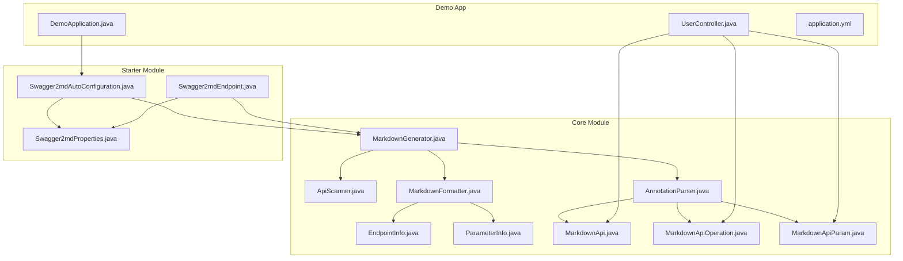
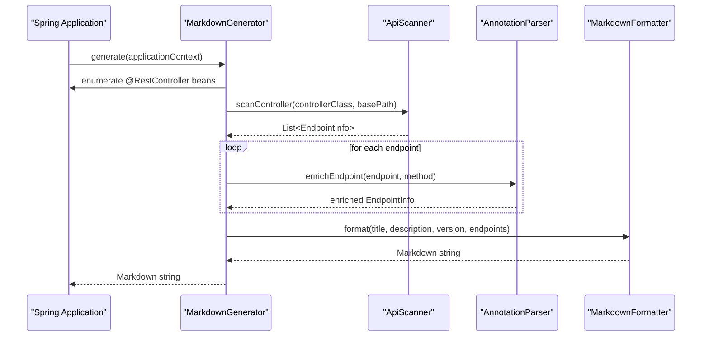
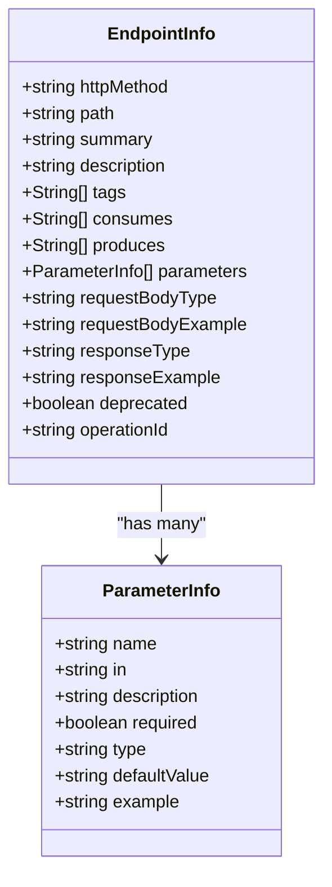
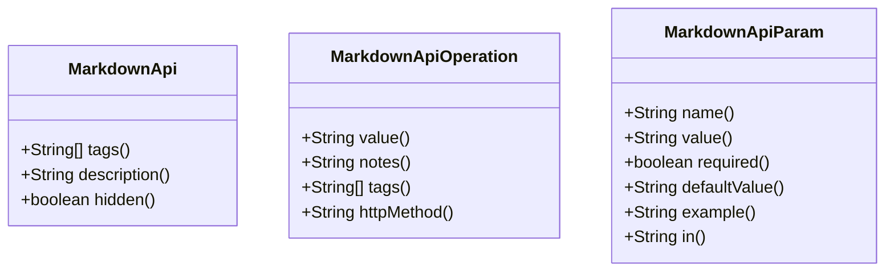
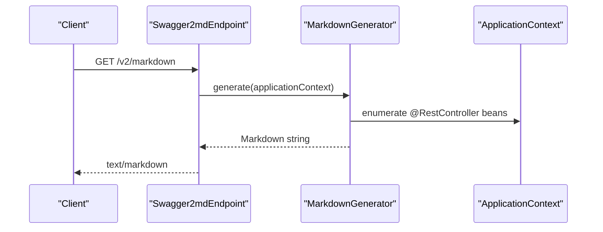
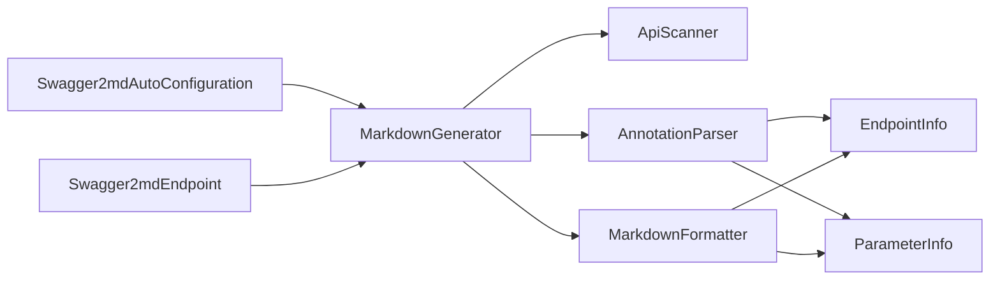

# Markdown Generator

<cite>
**Referenced Files in This Document**
- [MarkdownGenerator.java](file://swagger2md-core/src/main/java/com/github/tentac/swagger2md/core/MarkdownGenerator.java)
- [ApiScanner.java](file://swagger2md-core/src/main/java/com/github/tentac/swagger2md/core/ApiScanner.java)
- [AnnotationParser.java](file://swagger2md-core/src/main/java/com/github/tentac/swagger2md/core/AnnotationParser.java)
- [MarkdownFormatter.java](file://swagger2md-core/src/main/java/com/github/tentac/swagger2md/core/MarkdownFormatter.java)
- [EndpointInfo.java](file://swagger2md-core/src/main/java/com/github/tentac/swagger2md/model/EndpointInfo.java)
- [ParameterInfo.java](file://swagger2md-core/src/main/java/com/github/tentac/swagger2md/model/ParameterInfo.java)
- [MarkdownApi.java](file://swagger2md-core/src/main/java/com/github/tentac/swagger2md/annotation/MarkdownApi.java)
- [MarkdownApiOperation.java](file://swagger2md-core/src/main/java/com/github/tentac/swagger2md/annotation/MarkdownApiOperation.java)
- [MarkdownApiParam.java](file://swagger2md-core/src/main/java/com/github/tentac/swagger2md/annotation/MarkdownApiParam.java)
- [Swagger2mdAutoConfiguration.java](file://swagger2md-spring-boot-starter/src/main/java/com/github/tentac/swagger2md/autoconfigure/Swagger2mdAutoConfiguration.java)
- [Swagger2mdProperties.java](file://swagger2md-spring-boot-starter/src/main/java/com/github/tentac/swagger2md/autoconfigure/Swagger2mdProperties.java)
- [Swagger2mdEndpoint.java](file://swagger2md-spring-boot-starter/src/main/java/com/github/tentac/swagger2md/autoconfigure/Swagger2mdEndpoint.java)
- [DemoApplication.java](file://swagger2md-demo/src/main/java/com/github/tentac/swagger2md/demo/DemoApplication.java)
- [UserController.java](file://swagger2md-demo/src/main/java/com/github/tentac/swagger2md/demo/controller/UserController.java)
- [application.yml](file://swagger2md-demo/src/main/resources/application.yml)
</cite>

## Table of Contents
1. [Introduction](#introduction)
2. [Project Structure](#project-structure)
3. [Core Components](#core-components)
4. [Architecture Overview](#architecture-overview)
5. [Detailed Component Analysis](#detailed-component-analysis)
6. [Dependency Analysis](#dependency-analysis)
7. [Performance Considerations](#performance-considerations)
8. [Troubleshooting Guide](#troubleshooting-guide)
9. [Conclusion](#conclusion)
10. [Appendices](#appendices)

## Introduction
This document explains the Markdown Generator component responsible for orchestrating the end-to-end documentation generation pipeline. It covers the factory-like composition of scanner, parser, and formatter components, the sequential workflow from controller discovery to final Markdown rendering, and the public API surface including ApplicationContext-driven generation and pre-scanned endpoint generation. It also documents configuration options, error handling strategies, performance optimization techniques, and extensibility points for customization.

## Project Structure
The Markdown Generator lives in the core module alongside supporting models and annotations. Spring Boot integration is provided by the starter module, which auto-configures the generator and exposes endpoints for Markdown and LLM probes.

**Diagram sources**
- [MarkdownGenerator.java:15-30](file://swagger2md-core/src/main/java/com/github/tentac/swagger2md/core/MarkdownGenerator.java#L15-L30)
- [ApiScanner.java:22-29](file://swagger2md-core/src/main/java/com/github/tentac/swagger2md/core/ApiScanner.java#L22-L29)
- [AnnotationParser.java:18-35](file://swagger2md-core/src/main/java/com/github/tentac/swagger2md/core/AnnotationParser.java#L18-L35)
- [MarkdownFormatter.java:11-23](file://swagger2md-core/src/main/java/com/github/tentac/swagger2md/core/MarkdownFormatter.java#L11-L23)
- [EndpointInfo.java:9-52](file://swagger2md-core/src/main/java/com/github/tentac/swagger2md/model/EndpointInfo.java#L9-L52)
- [ParameterInfo.java:6-28](file://swagger2md-core/src/main/java/com/github/tentac/swagger2md/model/ParameterInfo.java#L6-L28)
- [MarkdownApi.java:14-24](file://swagger2md-core/src/main/java/com/github/tentac/swagger2md/annotation/MarkdownApi.java#L14-L24)
- [MarkdownApiOperation.java:14-27](file://swagger2md-core/src/main/java/com/github/tentac/swagger2md/annotation/MarkdownApiOperation.java#L14-L27)
- [MarkdownApiParam.java:13-33](file://swagger2md-core/src/main/java/com/github/tentac/swagger2md/annotation/MarkdownApiParam.java#L13-L33)
- [Swagger2mdAutoConfiguration.java:20-33](file://swagger2md-spring-boot-starter/src/main/java/com/github/tentac/swagger2md/autoconfigure/Swagger2mdAutoConfiguration.java#L20-L33)
- [Swagger2mdProperties.java:12-44](file://swagger2md-spring-boot-starter/src/main/java/com/github/tentac/swagger2md/autoconfigure/Swagger2mdProperties.java#L12-L44)
- [Swagger2mdEndpoint.java:20-38](file://swagger2md-spring-boot-starter/src/main/java/com/github/tentac/swagger2md/autoconfigure/Swagger2mdEndpoint.java#L20-L38)
- [DemoApplication.java:13-18](file://swagger2md-demo/src/main/java/com/github/tentac/swagger2md/demo/DemoApplication.java#L13-L18)
- [UserController.java:20-24](file://swagger2md-demo/src/main/java/com/github/tentac/swagger2md/demo/controller/UserController.java#L20-L24)
- [application.yml:8-16](file://swagger2md-demo/src/main/resources/application.yml#L8-L16)

**Section sources**
- [MarkdownGenerator.java:15-30](file://swagger2md-core/src/main/java/com/github/tentac/swagger2md/core/MarkdownGenerator.java#L15-L30)
- [Swagger2mdAutoConfiguration.java:20-33](file://swagger2md-spring-boot-starter/src/main/java/com/github/tentac/swagger2md/autoconfigure/Swagger2mdAutoConfiguration.java#L20-L33)
- [Swagger2mdEndpoint.java:20-38](file://swagger2md-spring-boot-starter/src/main/java/com/github/tentac/swagger2md/autoconfigure/Swagger2mdEndpoint.java#L20-L38)

## Core Components
- MarkdownGenerator: Orchestrates scanning, parsing, and formatting. Exposes two generate() overloads and a getEndpoints() method. Supports configuration for title, description, version, and base package filtering.
- ApiScanner: Discovers REST endpoints from Spring controllers, extracts HTTP method, path, consumes/produces, parameters, and generates JSON examples for request/response bodies.
- AnnotationParser: Enriches EndpointInfo with metadata from Swagger2 and custom annotations, including summaries, descriptions, tags, deprecation, parameter details, and overrides.
- MarkdownFormatter: Renders a structured Markdown document with header, table of contents, grouped sections by tags, endpoint details, parameter tables, request/response examples, and cURL examples.

Key public API methods:
- generate(ApplicationContext): Scans controllers, enriches endpoints, and formats Markdown.
- generate(List<EndpointInfo>): Formats pre-scanned endpoints into Markdown.
- getEndpoints(ApplicationContext): Returns a list of enriched EndpointInfo for external use or custom formatting.

Configuration options:
- setTitle, setDescription, setVersion, setBasePackage on MarkdownGenerator.
- Properties via Swagger2mdProperties: title, description, version, basePackage, markdownPath, llmProbePath, llmProbeEnabled, ipWhitelist, ipBlacklist.

**Section sources**
- [MarkdownGenerator.java:48-109](file://swagger2md-core/src/main/java/com/github/tentac/swagger2md/core/MarkdownGenerator.java#L48-L109)
- [ApiScanner.java:38-56](file://swagger2md-core/src/main/java/com/github/tentac/swagger2md/core/ApiScanner.java#L38-L56)
- [AnnotationParser.java:26-35](file://swagger2md-core/src/main/java/com/github/tentac/swagger2md/core/AnnotationParser.java#L26-L35)
- [MarkdownFormatter.java:24-71](file://swagger2md-core/src/main/java/com/github/tentac/swagger2md/core/MarkdownFormatter.java#L24-L71)
- [Swagger2mdProperties.java:18-43](file://swagger2md-spring-boot-starter/src/main/java/com/github/tentac/swagger2md/autoconfigure/Swagger2mdProperties.java#L18-L43)

## Architecture Overview
The Markdown Generator follows a pipeline architecture:
1. Discovery: Controllers are discovered via ApplicationContext and filtered by base package and @MarkdownApi(hidden).
2. Extraction: ApiScanner builds EndpointInfo with HTTP method, path, consumes/produces, parameters, and JSON examples.
3. Enrichment: AnnotationParser augments EndpointInfo with Swagger2 and custom annotations.
4. Formatting: MarkdownFormatter renders Markdown with grouping, tables, and examples.

**Diagram sources**
- [MarkdownGenerator.java:54-98](file://swagger2md-core/src/main/java/com/github/tentac/swagger2md/core/MarkdownGenerator.java#L54-L98)
- [ApiScanner.java:38-56](file://swagger2md-core/src/main/java/com/github/tentac/swagger2md/core/ApiScanner.java#L38-L56)
- [AnnotationParser.java:26-35](file://swagger2md-core/src/main/java/com/github/tentac/swagger2md/core/AnnotationParser.java#L26-L35)
- [MarkdownFormatter.java:24-71](file://swagger2md-core/src/main/java/com/github/tentac/swagger2md/core/MarkdownFormatter.java#L24-L71)

## Detailed Component Analysis

### MarkdownGenerator
Responsibilities:
- Compose and coordinate scanner, parser, and formatter.
- Filter controllers by base package and @MarkdownApi(hidden).
- Extract base path from controller class-level @RequestMapping.
- Enrich endpoints by resolving method signatures and applying annotations.
- Provide two generate() overloads and a getEndpoints() method for flexibility.

Public API:
- generate(ApplicationContext): Orchestrates the full pipeline.
- generate(List<EndpointInfo>): Skips scanning and parsing, only formats.
- getEndpoints(ApplicationContext): Returns enriched endpoints without formatting.

Configuration:
- setTitle, setDescription, setVersion, setBasePackage.

Error handling:
- Ignores NoSuchMethodException during method resolution for annotation enrichment.
- Filters out hidden controllers marked with @MarkdownApi(hidden).

Extensibility:
- Subclassing allows overriding scanning/parsing/formatting steps.
- Inject custom parser/formatter implementations via constructor if needed.

**Section sources**
- [MarkdownGenerator.java:48-155](file://swagger2md-core/src/main/java/com/github/tentac/swagger2md/core/MarkdownGenerator.java#L48-L155)

### ApiScanner
Responsibilities:
- Detect REST controllers and extract endpoints from method-level mapping annotations.
- Compute full paths by combining class-level and method-level paths.
- Extract parameters (query, path, header, body) and infer types.
- Generate JSON examples for request and response bodies using reflection and generic types.

Key behaviors:
- Supports GET, POST, PUT, DELETE, PATCH, and REQUEST mappings.
- Infers class-level tags and description from Swagger2 @Api and custom @MarkdownApi.
- Normalizes paths and handles default values for consumes/produces.

Complexity:
- Scanning N methods across M controllers yields O(M*N) endpoint extraction.
- Parameter type resolution uses reflection and generic type inspection.

**Section sources**
- [ApiScanner.java:38-277](file://swagger2md-core/src/main/java/com/github/tentac/swagger2md/core/ApiScanner.java#L38-L277)

### AnnotationParser
Responsibilities:
- Enrich EndpointInfo with summaries, descriptions, tags, HTTP method overrides, deprecation flags, and parameter metadata.
- Supports both Swagger2 annotations and custom annotations for standalone mode.

Enrichment order:
- First, attempts to enrich from Swagger2 @ApiOperation and @ApiParam.
- Then enriches from custom @MarkdownApiOperation and @MarkdownApiParam.
- Finally enriches parameters by matching by name or fallback by index.

Edge cases:
- Ignores empty tag arrays that are defaults.
- Handles missing method-level annotations gracefully.

**Section sources**
- [AnnotationParser.java:26-210](file://swagger2md-core/src/main/java/com/github/tentac/swagger2md/core/AnnotationParser.java#L26-L210)

### MarkdownFormatter
Responsibilities:
- Render Markdown with header, description, version, and table of contents.
- Group endpoints by tags and render each section with endpoint details.
- Produce parameter tables, request/response examples, and cURL commands.

Formatting details:
- Uses section separators and anchors for navigation.
- Generates cURL examples with appropriate headers, query parameters, and optional body payloads.

**Section sources**
- [MarkdownFormatter.java:24-190](file://swagger2md-core/src/main/java/com/github/tentac/swagger2md/core/MarkdownFormatter.java#L24-L190)

### Model Classes
EndpointInfo and ParameterInfo represent the internal data model used across the pipeline.

**Diagram sources**
- [EndpointInfo.java:9-165](file://swagger2md-core/src/main/java/com/github/tentac/swagger2md/model/EndpointInfo.java#L9-L165)
- [ParameterInfo.java:6-85](file://swagger2md-core/src/main/java/com/github/tentac/swagger2md/model/ParameterInfo.java#L6-L85)

**Section sources**
- [EndpointInfo.java:9-165](file://swagger2md-core/src/main/java/com/github/tentac/swagger2md/model/EndpointInfo.java#L9-L165)
- [ParameterInfo.java:6-85](file://swagger2md-core/src/main/java/com/github/tentac/swagger2md/model/ParameterInfo.java#L6-L85)

### Annotations
Custom annotations enable standalone mode without requiring Swagger2 libraries.

**Diagram sources**
- [MarkdownApi.java:14-24](file://swagger2md-core/src/main/java/com/github/tentac/swagger2md/annotation/MarkdownApi.java#L14-L24)
- [MarkdownApiOperation.java:14-27](file://swagger2md-core/src/main/java/com/github/tentac/swagger2md/annotation/MarkdownApiOperation.java#L14-L27)
- [MarkdownApiParam.java:13-33](file://swagger2md-core/src/main/java/com/github/tentac/swagger2md/annotation/MarkdownApiParam.java#L13-L33)

**Section sources**
- [MarkdownApi.java:14-24](file://swagger2md-core/src/main/java/com/github/tentac/swagger2md/annotation/MarkdownApi.java#L14-L24)
- [MarkdownApiOperation.java:14-27](file://swagger2md-core/src/main/java/com/github/tentac/swagger2md/annotation/MarkdownApiOperation.java#L14-L27)
- [MarkdownApiParam.java:13-33](file://swagger2md-core/src/main/java/com/github/tentac/swagger2md/annotation/MarkdownApiParam.java#L13-L33)

### Spring Boot Integration
The starter module auto-configures the generator and exposes endpoints for Markdown and LLM probes.

**Diagram sources**
- [Swagger2mdEndpoint.java:43-47](file://swagger2md-spring-boot-starter/src/main/java/com/github/tentac/swagger2md/autoconfigure/Swagger2mdEndpoint.java#L43-L47)
- [Swagger2mdAutoConfiguration.java:25-33](file://swagger2md-spring-boot-starter/src/main/java/com/github/tentac/swagger2md/autoconfigure/Swagger2mdAutoConfiguration.java#L25-L33)
- [MarkdownGenerator.java:54-98](file://swagger2md-core/src/main/java/com/github/tentac/swagger2md/core/MarkdownGenerator.java#L54-L98)

**Section sources**
- [Swagger2mdAutoConfiguration.java:20-81](file://swagger2md-spring-boot-starter/src/main/java/com/github/tentac/swagger2md/autoconfigure/Swagger2mdAutoConfiguration.java#L20-L81)
- [Swagger2mdEndpoint.java:20-71](file://swagger2md-spring-boot-starter/src/main/java/com/github/tentac/swagger2md/autoconfigure/Swagger2mdEndpoint.java#L20-L71)
- [Swagger2mdProperties.java:12-127](file://swagger2md-spring-boot-starter/src/main/java/com/github/tentac/swagger2md/autoconfigure/Swagger2mdProperties.java#L12-L127)

## Dependency Analysis
- MarkdownGenerator depends on ApiScanner, AnnotationParser, and MarkdownFormatter.
- AnnotationParser depends on EndpointInfo, ParameterInfo, and the custom annotations.
- MarkdownFormatter depends on EndpointInfo and ParameterInfo.
- Spring Boot integration registers MarkdownGenerator and exposes endpoints via Swagger2mdEndpoint.

**Diagram sources**
- [MarkdownGenerator.java:17-29](file://swagger2md-core/src/main/java/com/github/tentac/swagger2md/core/MarkdownGenerator.java#L17-L29)
- [AnnotationParser.java:18-35](file://swagger2md-core/src/main/java/com/github/tentac/swagger2md/core/AnnotationParser.java#L18-L35)
- [MarkdownFormatter.java:11-23](file://swagger2md-core/src/main/java/com/github/tentac/swagger2md/core/MarkdownFormatter.java#L11-L23)
- [Swagger2mdAutoConfiguration.java:25-46](file://swagger2md-spring-boot-starter/src/main/java/com/github/tentac/swagger2md/autoconfigure/Swagger2mdAutoConfiguration.java#L25-L46)
- [Swagger2mdEndpoint.java:29-38](file://swagger2md-spring-boot-starter/src/main/java/com/github/tentac/swagger2md/autoconfigure/Swagger2mdEndpoint.java#L29-L38)

**Section sources**
- [MarkdownGenerator.java:17-29](file://swagger2md-core/src/main/java/com/github/tentac/swagger2md/core/MarkdownGenerator.java#L17-L29)
- [AnnotationParser.java:18-35](file://swagger2md-core/src/main/java/com/github/tentac/swagger2md/core/AnnotationParser.java#L18-L35)
- [MarkdownFormatter.java:11-23](file://swagger2md-core/src/main/java/com/github/tentac/swagger2md/core/MarkdownFormatter.java#L11-L23)
- [Swagger2mdAutoConfiguration.java:25-46](file://swagger2md-spring-boot-starter/src/main/java/com/github/tentac/swagger2md/autoconfigure/Swagger2mdAutoConfiguration.java#L25-L46)
- [Swagger2mdEndpoint.java:29-38](file://swagger2md-spring-boot-starter/src/main/java/com/github/tentac/swagger2md/autoconfigure/Swagger2mdEndpoint.java#L29-L38)

## Performance Considerations
- Reflection overhead: Scanning and parsing rely on reflection. For large applications, consider narrowing the base package to reduce controller enumeration and method introspection.
- Generic type resolution: Determining response/request types and generating JSON examples involves generic type analysis; caching or precomputing examples can mitigate repeated work.
- Annotation parsing: Multiple reflection calls per method and parameter; avoid excessive annotations or implement lightweight alternatives if needed.
- I/O-bound formatting: Markdown generation is CPU-bound but fast; ensure efficient string building and minimal allocations.
- Caching: Store generated Markdown or endpoint lists if the application context does not change frequently.

[No sources needed since this section provides general guidance]

## Troubleshooting Guide
Common issues and resolutions:
- Endpoints not appearing:
  - Verify controllers are annotated with @RestController or equivalent and expose @ResponseBody methods.
  - Confirm base package filtering matches controller packages.
  - Ensure @MarkdownApi(hidden) is not set to true for controllers.
- Missing parameter details:
  - Add @RequestParam, @PathVariable, @RequestHeader, or @RequestBody annotations to methods.
  - Use @MarkdownApiParam for custom parameter descriptions and overrides.
- Empty or incorrect tags:
  - Provide @MarkdownApi(tags) on controllers or @MarkdownApiOperation(tags) on methods.
  - Avoid empty tag arrays; defaults are applied only when tags are absent.
- JSON examples missing:
  - Ensure request/response types are non-primitive and have accessible constructors or builders.
  - For generic types, ensure generics are resolvable at runtime.
- cURL examples incorrect:
  - Confirm consumes/produces and method-specific path/query/header parameters are correctly detected.

**Section sources**
- [MarkdownGenerator.java:67-77](file://swagger2md-core/src/main/java/com/github/tentac/swagger2md/core/MarkdownGenerator.java#L67-L77)
- [ApiScanner.java:279-331](file://swagger2md-core/src/main/java/com/github/tentac/swagger2md/core/ApiScanner.java#L279-L331)
- [AnnotationParser.java:136-174](file://swagger2md-core/src/main/java/com/github/tentac/swagger2md/core/AnnotationParser.java#L136-L174)

## Conclusion
The Markdown Generator provides a robust, extensible pipeline for transforming Spring REST controllers into structured Markdown documentation. Its modular design separates concerns across scanning, parsing, and formatting, while Spring Boot integration simplifies deployment and exposure of documentation endpoints. Configuration options and custom annotations enable broad customization for diverse documentation needs.

[No sources needed since this section summarizes without analyzing specific files]

## Appendices

### Complete Generation Pipeline Examples
- ApplicationContext-driven generation:
  - Invoke generate(applicationContext) to scan, enrich, and format Markdown.
  - Example path: [MarkdownGenerator.generate(ApplicationContext):54-98](file://swagger2md-core/src/main/java/com/github/tentac/swagger2md/core/MarkdownGenerator.java#L54-L98)
- Pre-scanned endpoints generation:
  - Call getEndpoints(applicationContext) to obtain enriched EndpointInfo, then pass to generate(List<EndpointInfo>) for custom formatting.
  - Example paths: [MarkdownGenerator.getEndpoints:111-144](file://swagger2md-core/src/main/java/com/github/tentac/swagger2md/core/MarkdownGenerator.java#L111-L144), [MarkdownGenerator.generate(List<EndpointInfo>):107-109](file://swagger2md-core/src/main/java/com/github/tentac/swagger2md/core/MarkdownGenerator.java#L107-L109)
- Spring Boot endpoint exposure:
  - Access Markdown at configured path (default /v2/markdown) and LLM probe endpoints.
  - Example paths: [Swagger2mdEndpoint.getMarkdown:43-47](file://swagger2md-spring-boot-starter/src/main/java/com/github/tentac/swagger2md/autoconfigure/Swagger2mdEndpoint.java#L43-L47), [Swagger2mdEndpoint.getLlmProbe:52-61](file://swagger2md-spring-boot-starter/src/main/java/com/github/tentac/swagger2md/autoconfigure/Swagger2mdEndpoint.java#L52-L61)

**Section sources**
- [MarkdownGenerator.java:54-109](file://swagger2md-core/src/main/java/com/github/tentac/swagger2md/core/MarkdownGenerator.java#L54-L109)
- [Swagger2mdEndpoint.java:43-70](file://swagger2md-spring-boot-starter/src/main/java/com/github/tentac/swagger2md/autoconfigure/Swagger2mdEndpoint.java#L43-L70)

### Configuration Options Reference
- Title, description, version, base package:
  - Setter methods on MarkdownGenerator.
  - Spring Boot properties via Swagger2mdProperties.
  - Example paths: [MarkdownGenerator setters:32-46](file://swagger2md-core/src/main/java/com/github/tentac/swagger2md/core/MarkdownGenerator.java#L32-L46), [Swagger2mdProperties:18-85](file://swagger2md-spring-boot-starter/src/main/java/com/github/tentac/swagger2md/autoconfigure/Swagger2mdProperties.java#L18-L85)
- Endpoint paths and LLM probe toggles:
  - markdownPath, llmProbePath, llmProbeEnabled.
  - Example path: [Swagger2mdProperties:87-109](file://swagger2md-spring-boot-starter/src/main/java/com/github/tentac/swagger2md/autoconfigure/Swagger2mdProperties.java#L87-L109)
- Demo configuration:
  - Example path: [application.yml:8-16](file://swagger2md-demo/src/main/resources/application.yml#L8-L16)

**Section sources**
- [MarkdownGenerator.java:32-46](file://swagger2md-core/src/main/java/com/github/tentac/swagger2md/core/MarkdownGenerator.java#L32-L46)
- [Swagger2mdProperties.java:18-109](file://swagger2md-spring-boot-starter/src/main/java/com/github/tentac/swagger2md/autoconfigure/Swagger2mdProperties.java#L18-L109)
- [application.yml:8-16](file://swagger2md-demo/src/main/resources/application.yml#L8-L16)

### Extensibility and Customization
- Custom parser/formatter:
  - Extend or replace AnnotationParser and MarkdownFormatter for specialized metadata or output formats.
- Controller annotations:
  - Use @MarkdownApi, @MarkdownApiOperation, and @MarkdownApiParam for standalone documentation without Swagger2.
- Demo usage:
  - Example controller demonstrates mixed Swagger2 and custom annotations.
  - Example path: [UserController:20-137](file://swagger2md-demo/src/main/java/com/github/tentac/swagger2md/demo/controller/UserController.java#L20-L137)

**Section sources**
- [AnnotationParser.java:18-35](file://swagger2md-core/src/main/java/com/github/tentac/swagger2md/core/AnnotationParser.java#L18-L35)
- [MarkdownFormatter.java:11-23](file://swagger2md-core/src/main/java/com/github/tentac/swagger2md/core/MarkdownFormatter.java#L11-L23)
- [UserController.java:20-137](file://swagger2md-demo/src/main/java/com/github/tentac/swagger2md/demo/controller/UserController.java#L20-L137)