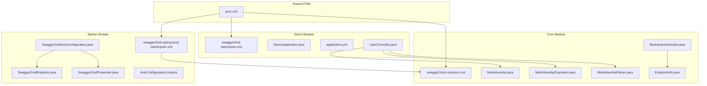

# Getting Started

<cite>
**Referenced Files in This Document**
- [pom.xml](file://pom.xml)
- [swagger2md-core/pom.xml](file://swagger2md-core/pom.xml)
- [swagger2md-spring-boot-starter/pom.xml](file://swagger2md-spring-boot-starter/pom.xml)
- [swagger2md-demo/pom.xml](file://swagger2md-demo/pom.xml)
- [DemoApplication.java](file://swagger2md-demo/src/main/java/com/github/tentac/swagger2md/demo/DemoApplication.java)
- [application.yml](file://swagger2md-demo/src/main/resources/application.yml)
- [UserController.java](file://swagger2md-demo/src/main/java/com/github/tentac/swagger2md/demo/controller/UserController.java)
- [Swagger2mdAutoConfiguration.java](file://swagger2md-spring-boot-starter/src/main/java/com/github/tentac/swagger2md/autoconfigure/Swagger2mdAutoConfiguration.java)
- [Swagger2mdEndpoint.java](file://swagger2md-spring-boot-starter/src/main/java/com/github/tentac/swagger2md/autoconfigure/Swagger2mdEndpoint.java)
- [Swagger2mdProperties.java](file://swagger2md-spring-boot-starter/src/main/java/com/github/tentac/swagger2md/autoconfigure/Swagger2mdProperties.java)
- [MarkdownGenerator.java](file://swagger2md-core/src/main/java/com/github/tentac/swagger2md/core/MarkdownGenerator.java)
- [MarkdownApi.java](file://swagger2md-core/src/main/java/com/github/tentac/swagger2md/annotation/MarkdownApi.java)
- [MarkdownApiOperation.java](file://swagger2md-core/src/main/java/com/github/tentac/swagger2md/annotation/MarkdownApiOperation.java)
- [MarkdownApiParam.java](file://swagger2md-core/src/main/java/com/github/tentac/swagger2md/annotation/MarkdownApiParam.java)
- [EndpointInfo.java](file://swagger2md-core/src/main/java/com/github/tentac/swagger2md/model/EndpointInfo.java)
- [org.springframework.boot.autoconfigure.AutoConfiguration.imports](file://swagger2md-spring-boot-starter/src/main/resources/META-INF/spring/org.springframework.boot.autoconfigure.AutoConfiguration.imports)
</cite>

## Table of Contents
1. [Introduction](#introduction)
2. [Project Structure](#project-structure)
3. [Installation and Setup](#installation-and-setup)
4. [Running the Demo Application](#running-the-demo-application)
5. [Generating Your First Markdown Documentation](#generating-your-first-markdown-documentation)
6. [Basic Spring Boot Application Setup](#basic-spring-boot-application-setup)
7. [Essential Property Configuration](#essential-property-configuration)
8. [Practical Example: Annotating a Controller](#practical-example-annotating-a-controller)
9. [Accessing Generated Endpoints](#accessing-generated-endpoints)
10. [Verifying the Output](#verifying-the-output)
11. [Common Initial Setup Issues](#common-initial-setup-issues)
12. [Troubleshooting Guide](#troubleshooting-guide)
13. [Conclusion](#conclusion)

## Introduction
This guide helps you quickly install and use the tentac project to generate Markdown-format API documentation from Spring Boot controllers. It covers adding the Maven dependency, configuring a minimal Spring Boot app, running the demo, generating documentation, and resolving common setup issues.

## Project Structure
The repository is a multi-module Maven project with three modules:
- swagger2md-core: Core engine for scanning, parsing, and formatting Markdown documentation.
- swagger2md-spring-boot-starter: Spring Boot auto-configuration and endpoints for serving documentation.
- swagger2md-demo: Example Spring Boot application demonstrating usage.

**Diagram sources**
- [pom.xml:15-19](file://pom.xml#L15-L19)
- [swagger2md-core/pom.xml:1-51](file://swagger2md-core/pom.xml#L1-L51)
- [swagger2md-spring-boot-starter/pom.xml:1-50](file://swagger2md-spring-boot-starter/pom.xml#L1-L50)
- [swagger2md-demo/pom.xml:1-55](file://swagger2md-demo/pom.xml#L1-L55)
- [MarkdownGenerator.java:1-156](file://swagger2md-core/src/main/java/com/github/tentac/swagger2md/core/MarkdownGenerator.java#L1-L156)
- [Swagger2mdAutoConfiguration.java:1-82](file://swagger2md-spring-boot-starter/src/main/java/com/github/tentac/swagger2md/autoconfigure/Swagger2mdAutoConfiguration.java#L1-L82)
- [Swagger2mdEndpoint.java:1-72](file://swagger2md-spring-boot-starter/src/main/java/com/github/tentac/swagger2md/autoconfigure/Swagger2mdEndpoint.java#L1-L72)
- [Swagger2mdProperties.java:1-127](file://swagger2md-spring-boot-starter/src/main/java/com/github/tentac/swagger2md/autoconfigure/Swagger2mdProperties.java#L1-L127)
- [MarkdownApi.java:1-25](file://swagger2md-core/src/main/java/com/github/tentac/swagger2md/annotation/MarkdownApi.java#L1-L25)
- [MarkdownApiOperation.java:1-28](file://swagger2md-core/src/main/java/com/github/tentac/swagger2md/annotation/MarkdownApiOperation.java#L1-L28)
- [MarkdownApiParam.java:1-34](file://swagger2md-core/src/main/java/com/github/tentac/swagger2md/annotation/MarkdownApiParam.java#L1-L34)
- [EndpointInfo.java:1-165](file://swagger2md-core/src/main/java/com/github/tentac/swagger2md/model/EndpointInfo.java#L1-L165)
- [org.springframework.boot.autoconfigure.AutoConfiguration.imports:1-2](file://swagger2md-spring-boot-starter/src/main/resources/META-INF/spring/org.springframework.boot.autoconfigure.AutoConfiguration.imports#L1-L2)

**Section sources**
- [pom.xml:15-19](file://pom.xml#L15-L19)

## Installation and Setup
Add the starter dependency to your Spring Boot application’s Maven POM. The starter module includes the core engine and auto-configures endpoints.

- Add the starter dependency to your application’s pom.xml under dependencies.
- Ensure your Spring Boot version matches the parent POM properties.

Key dependency details:
- Starter artifact: com.github.tentac:swagger2md-spring-boot-starter
- Core artifact: com.github.tentac:swagger2md-core
- Spring Boot version used by the project: 3.2.5

**Section sources**
- [swagger2md-spring-boot-starter/pom.xml:19-48](file://swagger2md-spring-boot-starter/pom.xml#L19-L48)
- [swagger2md-core/pom.xml:19-49](file://swagger2md-core/pom.xml#L19-L49)
- [pom.xml:27-31](file://pom.xml#L27-L31)

## Running the Demo Application
The demo module demonstrates a ready-to-run application that exposes documentation endpoints.

Steps:
1. Build the demo module using Maven.
2. Run the main class com.github.tentac.swagger2md.demo.DemoApplication.
3. Access the endpoints described below.

Endpoints exposed by the demo:
- Markdown documentation: http://localhost:8080/v2/markdown
- LLM probe (Markdown): http://localhost:8080/v2/llm-probe
- LLM probe (JSON): http://localhost:8080/v2/llm-probe/json

**Section sources**
- [DemoApplication.java:6-12](file://swagger2md-demo/src/main/java/com/github/tentac/swagger2md/demo/DemoApplication.java#L6-L12)
- [swagger2md-demo/pom.xml:43-53](file://swagger2md-demo/pom.xml#L43-L53)

## Generating Your First Markdown Documentation
To generate Markdown documentation from your own controllers:

1. Annotate your REST controllers with the provided annotations.
2. Ensure your controllers are in the Spring component scan path.
3. Start your Spring Boot application.
4. Request the Markdown endpoint to retrieve generated documentation.

How it works internally:
- The core generator scans Spring controllers, enriches endpoint metadata via annotations, and formats the output as Markdown.

**Section sources**
- [MarkdownGenerator.java:48-99](file://swagger2md-core/src/main/java/com/github/tentac/swagger2md/core/MarkdownGenerator.java#L48-L99)
- [Swagger2mdEndpoint.java:40-47](file://swagger2md-spring-boot-starter/src/main/java/com/github/tentac/swagger2md/autoconfigure/Swagger2mdEndpoint.java#L40-L47)

## Basic Spring Boot Application Setup
Create a minimal Spring Boot application with web support and the starter dependency. The demo module shows the recommended setup.

Required elements:
- A main class annotated as a Spring Boot application.
- Dependencies on spring-boot-starter-web and the swagger2md starter.
- Optional: Swagger2 annotations for compatibility with existing docs.

**Section sources**
- [DemoApplication.java:13-19](file://swagger2md-demo/src/main/java/com/github/tentac/swagger2md/demo/DemoApplication.java#L13-L19)
- [swagger2md-demo/pom.xml:19-41](file://swagger2md-demo/pom.xml#L19-L41)

## Essential Property Configuration
Configure swagger2md via application.yml or application.properties. The demo shows a baseline configuration.

Key properties (prefix: swagger2md):
- enabled: toggles the feature on/off
- title: documentation title
- description: documentation description
- version: API version
- base-package: restricts scanning to a package prefix
- markdown-path: path for Markdown endpoint
- llm-probe-path: path for LLM probe endpoints
- llm-probe-enabled: enables LLM probe endpoints
- ip-whitelist and ip-blacklist: IP filtering for endpoints

**Section sources**
- [application.yml:8-24](file://swagger2md-demo/src/main/resources/application.yml#L8-L24)
- [Swagger2mdProperties.java:15-44](file://swagger2md-spring-boot-starter/src/main/java/com/github/tentac/swagger2md/autoconfigure/Swagger2mdProperties.java#L15-L44)

## Practical Example: Annotating a Controller
The demo controller illustrates how to annotate a REST controller for documentation generation.

Highlights:
- Controller-level annotation groups endpoints and sets description.
- Method-level annotation describes operations.
- Parameter-level annotation documents parameters and locations.

Reference the demo controller for a complete example.

**Section sources**
- [UserController.java:20-137](file://swagger2md-demo/src/main/java/com/github/tentac/swagger2md/demo/controller/UserController.java#L20-L137)
- [MarkdownApi.java:16-24](file://swagger2md-core/src/main/java/com/github/tentac/swagger2md/annotation/MarkdownApi.java#L16-L24)
- [MarkdownApiOperation.java:16-27](file://swagger2md-core/src/main/java/com/github/tentac/swagger2md/annotation/MarkdownApiOperation.java#L16-L27)
- [MarkdownApiParam.java:16-33](file://swagger2md-core/src/main/java/com/github/tentac/swagger2md/annotation/MarkdownApiParam.java#L16-L33)

## Accessing Generated Endpoints
Once your application is running, access these endpoints:

- Markdown documentation: GET http://localhost:8080/v2/markdown
- LLM probe (Markdown): GET http://localhost:8080/v2/llm-probe
- LLM probe (JSON): GET http://localhost:8080/v2/llm-probe/json

These paths are configurable via swagger2md.markdown-path and swagger2md.llm-probe-path.

**Section sources**
- [Swagger2mdEndpoint.java:43-69](file://swagger2md-spring-boot-starter/src/main/java/com/github/tentac/swagger2md/autoconfigure/Swagger2mdEndpoint.java#L43-L69)
- [Swagger2mdProperties.java:30-37](file://swagger2md-spring-boot-starter/src/main/java/com/github/tentac/swagger2md/autoconfigure/Swagger2mdProperties.java#L30-L37)

## Verifying the Output
Expected verification steps:
- Open the Markdown endpoint in a browser or curl to confirm documentation renders.
- Verify the LLM probe endpoints return structured content suitable for LLM consumption.
- Confirm that endpoints are filtered by IP whitelist/blacklist if configured.
- Ensure only controllers within the configured base-package are included.

**Section sources**
- [application.yml:17-24](file://swagger2md-demo/src/main/resources/application.yml#L17-L24)
- [Swagger2mdAutoConfiguration.java:52-80](file://swagger2md-spring-boot-starter/src/main/java/com/github/tentac/swagger2md/autoconfigure/Swagger2mdAutoConfiguration.java#L52-L80)

## Common Initial Setup Issues
- Missing starter dependency: Ensure the swagger2md starter is added to your application dependencies.
- Java version mismatch: The project targets Java 17; align your development environment accordingly.
- Port conflicts: The demo runs on port 8080; adjust server.port if needed.
- Package scanning issues: Set swagger2md.base-package to include your controllers.
- IP filtering blocking access: Review ip-whitelist/ip-blacklist settings if endpoints are inaccessible.
- Spring Boot version mismatch: Align your Spring Boot version with the project’s managed version.

**Section sources**
- [pom.xml:21-31](file://pom.xml#L21-L31)
- [swagger2md-demo/pom.xml:43-53](file://swagger2md-demo/pom.xml#L43-L53)
- [application.yml:1-2](file://swagger2md-demo/src/main/resources/application.yml#L1-L2)
- [Swagger2mdProperties.java:27-28](file://swagger2md-spring-boot-starter/src/main/java/com/github/tentac/swagger2md/autoconfigure/Swagger2mdProperties.java#L27-L28)

## Troubleshooting Guide
- Documentation not generated: Verify swagger2md.enabled is true and base-package includes your controllers.
- Endpoints 404: Confirm paths are correct and not overridden by other mappings.
- LLM probe returns empty: Ensure llm-probe-enabled is true and endpoints are scanned.
- IP filter denies access: Adjust ip-whitelist/ip-blacklist entries to include your client IP.
- Logging: Increase logging level for the swagger2md package to debug scanning and generation.

**Section sources**
- [application.yml:26-29](file://swagger2md-demo/src/main/resources/application.yml#L26-L29)
- [Swagger2mdAutoConfiguration.java:22-23](file://swagger2md-spring-boot-starter/src/main/java/com/github/tentac/swagger2md/autoconfigure/Swagger2mdAutoConfiguration.java#L22-L23)

## Conclusion
You now have everything needed to install the tentac starter, configure a minimal Spring Boot application, run the demo, generate Markdown documentation, and troubleshoot common issues. Extend the demo controller pattern to document your own APIs and customize properties for your environment.