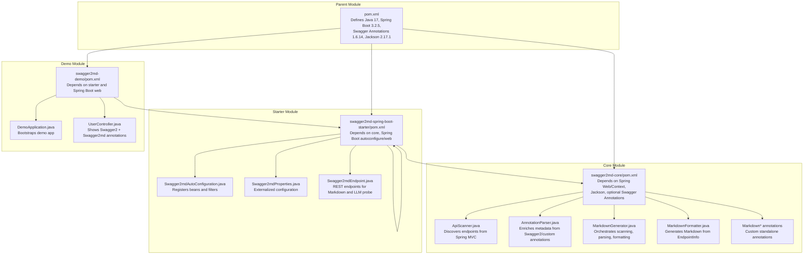
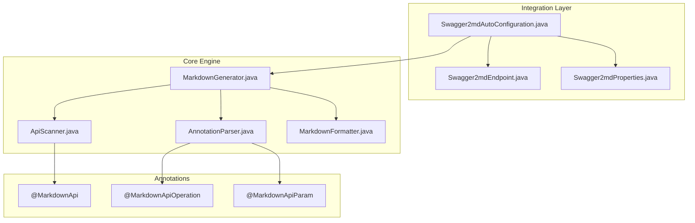
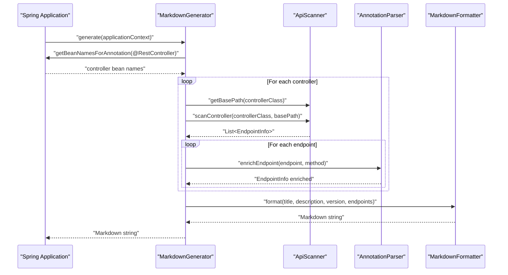
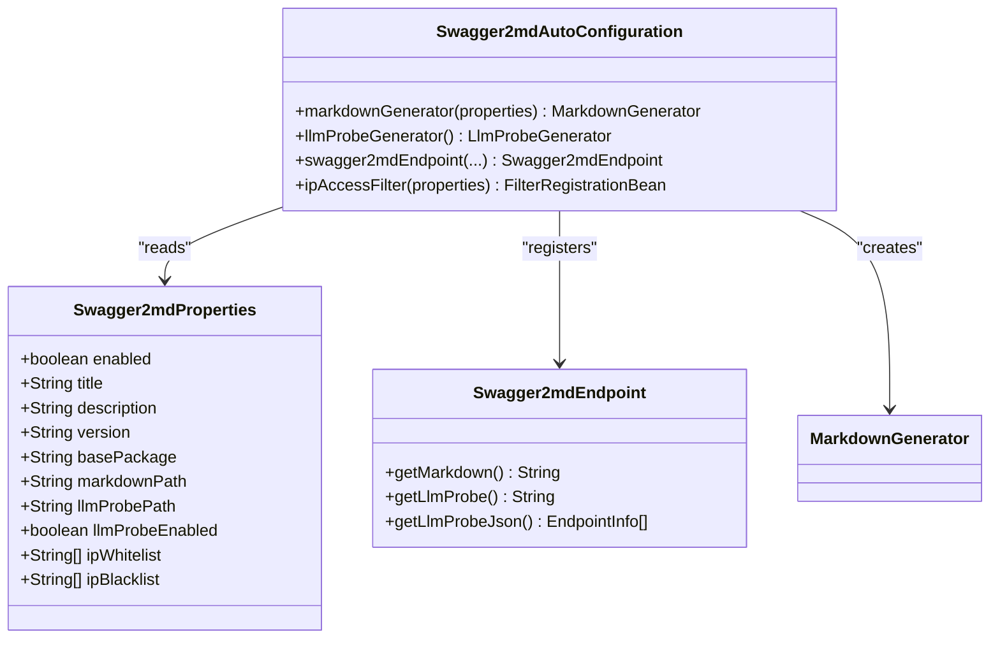
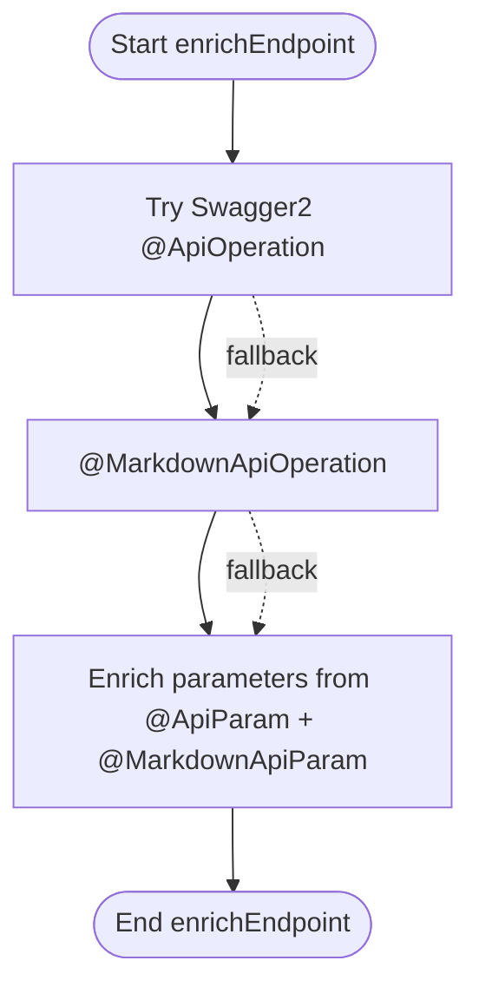
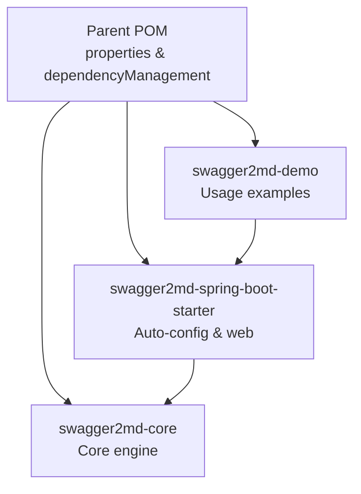

# Architecture Overview

<cite>
**Referenced Files in This Document**
- [pom.xml](file://pom.xml)
- [swagger2md-core/pom.xml](file://swagger2md-core/pom.xml)
- [swagger2md-spring-boot-starter/pom.xml](file://swagger2md-spring-boot-starter/pom.xml)
- [swagger2md-demo/pom.xml](file://swagger2md-demo/pom.xml)
- [ApiScanner.java](file://swagger2md-core/src/main/java/com/github/tentac/swagger2md/core/ApiScanner.java)
- [AnnotationParser.java](file://swagger2md-core/src/main/java/com/github/tentac/swagger2md/core/AnnotationParser.java)
- [MarkdownGenerator.java](file://swagger2md-core/src/main/java/com/github/tentac/swagger2md/core/MarkdownGenerator.java)
- [MarkdownFormatter.java](file://swagger2md-core/src/main/java/com/github/tentac/swagger2md/core/MarkdownFormatter.java)
- [MarkdownApi.java](file://swagger2md-core/src/main/java/com/github/tentac/swagger2md/annotation/MarkdownApi.java)
- [MarkdownApiOperation.java](file://swagger2md-core/src/main/java/com/github/tentac/swagger2md/annotation/MarkdownApiOperation.java)
- [MarkdownApiParam.java](file://swagger2md-core/src/main/java/com/github/tentac/swagger2md/annotation/MarkdownApiParam.java)
- [Swagger2mdAutoConfiguration.java](file://swagger2md-spring-boot-starter/src/main/java/com/github/tentac/swagger2md/autoconfigure/Swagger2mdAutoConfiguration.java)
- [Swagger2mdProperties.java](file://swagger2md-spring-boot-starter/src/main/java/com/github/tentac/swagger2md/autoconfigure/Swagger2mdProperties.java)
- [Swagger2mdEndpoint.java](file://swagger2md-spring-boot-starter/src/main/java/com/github/tentac/swagger2md/autoconfigure/Swagger2mdEndpoint.java)
- [DemoApplication.java](file://swagger2md-demo/src/main/java/com/github/tentac/swagger2md/demo/DemoApplication.java)
- [UserController.java](file://swagger2md-demo/src/main/java/com/github/tentac/swagger2md/demo/controller/UserController.java)
</cite>

## Table of Contents
1. [Introduction](#introduction)
2. [Project Structure](#project-structure)
3. [Core Components](#core-components)
4. [Architecture Overview](#architecture-overview)
5. [Detailed Component Analysis](#detailed-component-analysis)
6. [Dependency Analysis](#dependency-analysis)
7. [Performance Considerations](#performance-considerations)
8. [Troubleshooting Guide](#troubleshooting-guide)
9. [Conclusion](#conclusion)

## Introduction
This document describes the architectural design of the tentac project, a Markdown API documentation generator tailored for LLM integration. The system follows a three-module architecture:
- swagger2md-core: Fundamental scanning, parsing, and formatting engine
- swagger2md-spring-boot-starter: Spring Boot auto-configuration and web exposure
- swagger2md-demo: Usage examples and integration showcase

The system discovers Spring MVC controllers, extracts endpoint metadata via annotations (both Swagger2 and custom), generates JSON examples, and formats the output into Markdown with optional LLM-friendly probes.

## Project Structure
The project is organized as a Maven multi-module build with clear separation of concerns:
- Parent POM defines shared properties and dependency management
- Core module provides scanning, parsing, and formatting capabilities
- Starter module integrates with Spring Boot via auto-configuration and exposes endpoints
- Demo module demonstrates usage and compatibility with existing Swagger2 annotations

**Diagram sources**
- [pom.xml:1-112](file://pom.xml#L1-L112)
- [swagger2md-core/pom.xml:1-51](file://swagger2md-core/pom.xml#L1-L51)
- [swagger2md-spring-boot-starter/pom.xml:1-50](file://swagger2md-spring-boot-starter/pom.xml#L1-L50)
- [swagger2md-demo/pom.xml:1-55](file://swagger2md-demo/pom.xml#L1-L55)

**Section sources**
- [pom.xml:15-19](file://pom.xml#L15-L19)
- [swagger2md-core/pom.xml:19-48](file://swagger2md-core/pom.xml#L19-L48)
- [swagger2md-spring-boot-starter/pom.xml:19-47](file://swagger2md-spring-boot-starter/pom.xml#L19-L47)
- [swagger2md-demo/pom.xml:19-40](file://swagger2md-demo/pom.xml#L19-L40)

## Core Components
The core engine consists of four primary components working together to transform controller metadata into Markdown documentation:

- ApiScanner: Discovers Spring MVC controllers and extracts endpoint information, including HTTP methods, paths, consumes/produces, and parameter metadata. It supports both Swagger2 @Api and custom @MarkdownApi annotations for class-level metadata and handles generic return types for response modeling.
- AnnotationParser: Enriches EndpointInfo with additional metadata from both Swagger2 annotations (@ApiOperation, @ApiParam) and custom annotations (@MarkdownApiOperation, @MarkdownApiParam). It merges class-level and method-level tags and resolves parameter descriptions and defaults.
- MarkdownGenerator: Orchestrates the generation pipeline. It scans the Spring ApplicationContext for @RestController beans, applies base package filtering, excludes hidden controllers, computes base paths, delegates to ApiScanner and AnnotationParser, and finally formats the output via MarkdownFormatter.
- MarkdownFormatter: Transforms EndpointInfo objects into human-readable Markdown with automatic grouping by tags, parameter tables, JSON examples for request/response bodies, and cURL examples. It also generates an LLM-optimized probe output and a JSON probe for programmatic consumption.

Key extension points:
- Custom annotations: @MarkdownApi, @MarkdownApiOperation, @MarkdownApiParam enable standalone mode without Swagger2 dependencies.
- Configuration: Properties expose title, description, version, basePackage, endpoint paths, LLM probe toggles, and IP access controls.
- Factory-like wiring: MarkdownGenerator constructs internal components internally; users can customize behavior by subclassing or replacing components.

**Section sources**
- [ApiScanner.java:19-400](file://swagger2md-core/src/main/java/com/github/tentac/swagger2md/core/ApiScanner.java#L19-L400)
- [AnnotationParser.java:14-211](file://swagger2md-core/src/main/java/com/github/tentac/swagger2md/core/AnnotationParser.java#L14-L211)
- [MarkdownGenerator.java:11-156](file://swagger2md-core/src/main/java/com/github/tentac/swagger2md/core/MarkdownGenerator.java#L11-L156)
- [MarkdownFormatter.java:8-202](file://swagger2md-core/src/main/java/com/github/tentac/swagger2md/core/MarkdownFormatter.java#L8-L202)
- [MarkdownApi.java:8-25](file://swagger2md-core/src/main/java/com/github/tentac/swagger2md/annotation/MarkdownApi.java#L8-L25)
- [MarkdownApiOperation.java:8-28](file://swagger2md-core/src/main/java/com/github/tentac/swagger2md/annotation/MarkdownApiOperation.java#L8-L28)
- [MarkdownApiParam.java:8-34](file://swagger2md-core/src/main/java/com/github/tentac/swagger2md/annotation/MarkdownApiParam.java#L8-L34)

## Architecture Overview
The system follows a layered architecture with clear separation of concerns:
- Scanning Layer: ApiScanner focuses solely on discovering endpoints from Spring MVC controllers and extracting basic metadata.
- Parsing Layer: AnnotationParser enriches endpoint metadata using reflection against both Swagger2 and custom annotations.
- Formatting Layer: MarkdownFormatter transforms structured data into Markdown and provides specialized LLM-friendly outputs.
- Integration Layer: Swagger2mdAutoConfiguration wires the core components into a Spring Boot application, registers web endpoints, and applies IP access controls.

**Diagram sources**
- [Swagger2mdAutoConfiguration.java:16-82](file://swagger2md-spring-boot-starter/src/main/java/com/github/tentac/swagger2md/autoconfigure/Swagger2mdAutoConfiguration.java#L16-L82)
- [Swagger2mdEndpoint.java:16-72](file://swagger2md-spring-boot-starter/src/main/java/com/github/tentac/swagger2md/autoconfigure/Swagger2mdEndpoint.java#L16-L72)
- [Swagger2mdProperties.java:8-127](file://swagger2md-spring-boot-starter/src/main/java/com/github/tentac/swagger2md/autoconfigure/Swagger2mdProperties.java#L8-L127)
- [MarkdownGenerator.java:11-156](file://swagger2md-core/src/main/java/com/github/tentac/swagger2md/core/MarkdownGenerator.java#L11-L156)
- [ApiScanner.java:19-400](file://swagger2md-core/src/main/java/com/github/tentac/swagger2md/core/ApiScanner.java#L19-L400)
- [AnnotationParser.java:14-211](file://swagger2md-core/src/main/java/com/github/tentac/swagger2md/core/AnnotationParser.java#L14-L211)
- [MarkdownFormatter.java:8-202](file://swagger2md-core/src/main/java/com/github/tentac/swagger2md/core/MarkdownFormatter.java#L8-L202)
- [MarkdownApi.java:8-25](file://swagger2md-core/src/main/java/com/github/tentac/swagger2md/annotation/MarkdownApi.java#L8-L25)
- [MarkdownApiOperation.java:8-28](file://swagger2md-core/src/main/java/com/github/tentac/swagger2md/annotation/MarkdownApiOperation.java#L8-L28)
- [MarkdownApiParam.java:8-34](file://swagger2md-core/src/main/java/com/github/tentac/swagger2md/annotation/MarkdownApiParam.java#L8-L34)

## Detailed Component Analysis

### Data Flow: Controller Discovery to Markdown Generation
The end-to-end flow from controller discovery to Markdown output involves several coordinated steps:

**Diagram sources**
- [MarkdownGenerator.java:54-99](file://swagger2md-core/src/main/java/com/github/tentac/swagger2md/core/MarkdownGenerator.java#L54-L99)
- [ApiScanner.java:38-56](file://swagger2md-core/src/main/java/com/github/tentac/swagger2md/core/ApiScanner.java#L38-L56)
- [AnnotationParser.java:26-35](file://swagger2md-core/src/main/java/com/github/tentac/swagger2md/core/AnnotationParser.java#L26-L35)
- [MarkdownFormatter.java:24-71](file://swagger2md-core/src/main/java/com/github/tentac/swagger2md/core/MarkdownFormatter.java#L24-L71)

### Spring Boot Auto-Configuration and Wiring
The starter module integrates seamlessly with Spring Boot through auto-configuration:

**Diagram sources**
- [Swagger2mdAutoConfiguration.java:16-82](file://swagger2md-spring-boot-starter/src/main/java/com/github/tentac/swagger2md/autoconfigure/Swagger2mdAutoConfiguration.java#L16-L82)
- [Swagger2mdProperties.java:8-127](file://swagger2md-spring-boot-starter/src/main/java/com/github/tentac/swagger2md/autoconfigure/Swagger2mdProperties.java#L8-L127)
- [Swagger2mdEndpoint.java:16-72](file://swagger2md-spring-boot-starter/src/main/java/com/github/tentac/swagger2md/autoconfigure/Swagger2mdEndpoint.java#L16-L72)

### Annotation Processing Pipeline
The annotation enrichment process combines Swagger2 and custom annotations:

**Diagram sources**
- [AnnotationParser.java:26-121](file://swagger2md-core/src/main/java/com/github/tentac/swagger2md/core/AnnotationParser.java#L26-L121)

### Extension Points and Customization Options
Users can extend and customize the system in several ways:
- Standalone annotations: Use @MarkdownApi, @MarkdownApiOperation, @MarkdownApiParam to annotate controllers and methods without requiring Swagger2 libraries.
- Configuration: Adjust title, description, version, basePackage, endpoint paths, LLM probe settings, and IP access lists via Swagger2mdProperties.
- Endpoint exposure: Control whether endpoints are enabled/disabled and configure IP whitelists/blacklists for security.
- Customization hooks: Subclass or replace components (e.g., create a custom MarkdownFormatter) while maintaining the same orchestration pattern.

**Section sources**
- [MarkdownApi.java:8-25](file://swagger2md-core/src/main/java/com/github/tentac/swagger2md/annotation/MarkdownApi.java#L8-L25)
- [MarkdownApiOperation.java:8-28](file://swagger2md-core/src/main/java/com/github/tentac/swagger2md/annotation/MarkdownApiOperation.java#L8-L28)
- [MarkdownApiParam.java:8-34](file://swagger2md-core/src/main/java/com/github/tentac/swagger2md/annotation/MarkdownApiParam.java#L8-L34)
- [Swagger2mdProperties.java:15-44](file://swagger2md-spring-boot-starter/src/main/java/com/github/tentac/swagger2md/autoconfigure/Swagger2mdProperties.java#L15-L44)
- [Swagger2mdAutoConfiguration.java:22-80](file://swagger2md-spring-boot-starter/src/main/java/com/github/tentac/swagger2md/autoconfigure/Swagger2mdAutoConfiguration.java#L22-L80)

## Dependency Analysis
The modules and their relationships are defined by Maven dependencies:

External dependencies managed at the parent level:
- Spring Boot 3.2.5 (autoconfigure, web, configuration processor)
- Swagger Annotations 1.6.14 (optional compatibility)
- Jackson 2.17.1 (JSON serialization)
- Lombok 1.18.32 (developer ergonomics)

**Diagram sources**
- [pom.xml:33-68](file://pom.xml#L33-L68)
- [swagger2md-core/pom.xml:19-48](file://swagger2md-core/pom.xml#L19-L48)
- [swagger2md-spring-boot-starter/pom.xml:19-47](file://swagger2md-spring-boot-starter/pom.xml#L19-L47)
- [swagger2md-demo/pom.xml:19-40](file://swagger2md-demo/pom.xml#L19-L40)

**Section sources**
- [pom.xml:21-31](file://pom.xml#L21-L31)
- [swagger2md-core/pom.xml:19-48](file://swagger2md-core/pom.xml#L19-L48)
- [swagger2md-spring-boot-starter/pom.xml:19-47](file://swagger2md-spring-boot-starter/pom.xml#L19-L47)
- [swagger2md-demo/pom.xml:19-40](file://swagger2md-demo/pom.xml#L19-L40)

## Performance Considerations
- Reflection overhead: The scanning and parsing rely on reflection; caching could reduce repeated lookups if needed.
- Generic type resolution: Handling parameterized types adds complexity; ensure only necessary generics are processed.
- JSON example generation: Generating examples for complex nested objects may be expensive; consider lazy generation or caching strategies.
- Endpoint enumeration: Filtering by base package reduces scanning overhead; leverage this property to limit scope.

## Troubleshooting Guide
Common issues and resolutions:
- Endpoints not appearing:
  - Verify controllers are annotated with @RestController or @Controller plus @ResponseBody methods.
  - Ensure basePackage configuration matches controller package names.
  - Confirm @MarkdownApi(hidden=false) for controllers intended to be included.
- Missing Swagger2 metadata:
  - The system gracefully falls back to custom annotations when Swagger2 annotations are absent.
- JSON examples missing:
  - Ensure request/response types are serializable; Jackson requires proper constructors and getters/setters.
- Endpoint access blocked:
  - Review IP whitelist/blacklist configuration in Swagger2mdProperties.
- Auto-configuration not activating:
  - Confirm swagger2md.enabled=true and properties are loaded from application configuration.

**Section sources**
- [MarkdownGenerator.java:67-77](file://swagger2md-core/src/main/java/com/github/tentac/swagger2md/core/MarkdownGenerator.java#L67-L77)
- [Swagger2mdAutoConfiguration.java:22-23](file://swagger2md-spring-boot-starter/src/main/java/com/github/tentac/swagger2md/autoconfigure/Swagger2mdAutoConfiguration.java#L22-L23)
- [Swagger2mdProperties.java:15-44](file://swagger2md-spring-boot-starter/src/main/java/com/github/tentac/swagger2md/autoconfigure/Swagger2mdProperties.java#L15-L44)

## Conclusion
The tentac project implements a clean, modular architecture that separates scanning, parsing, and formatting concerns while providing seamless Spring Boot integration. The three-module design enables:
- Flexibility: Users can opt-in to Swagger2 annotations or use custom standalone annotations.
- Extensibility: Clear extension points for customization and replacement of components.
- Operability: Auto-configuration, configurable endpoints, and security controls for production use.

This architecture supports both human-readable Markdown documentation and machine-readable LLM probes, aligning with modern API documentation needs and LLM-assisted development workflows.