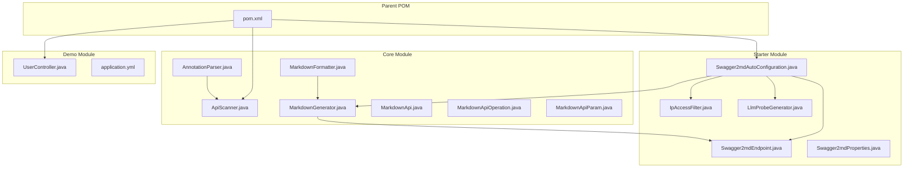
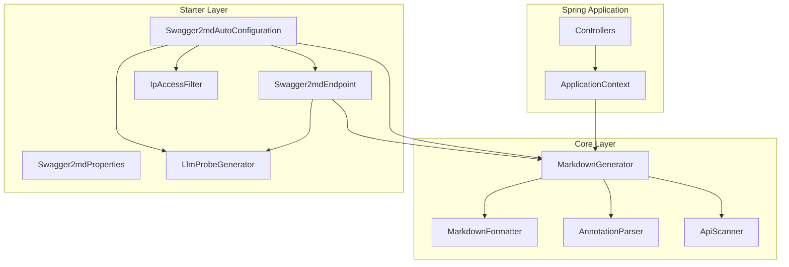
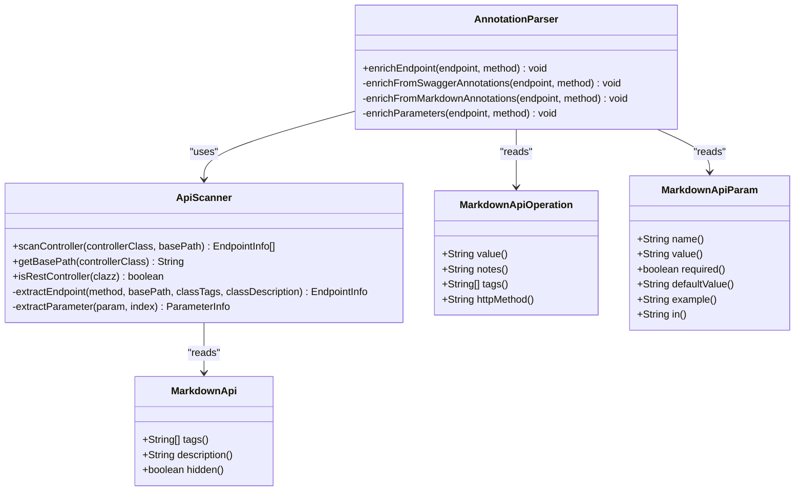
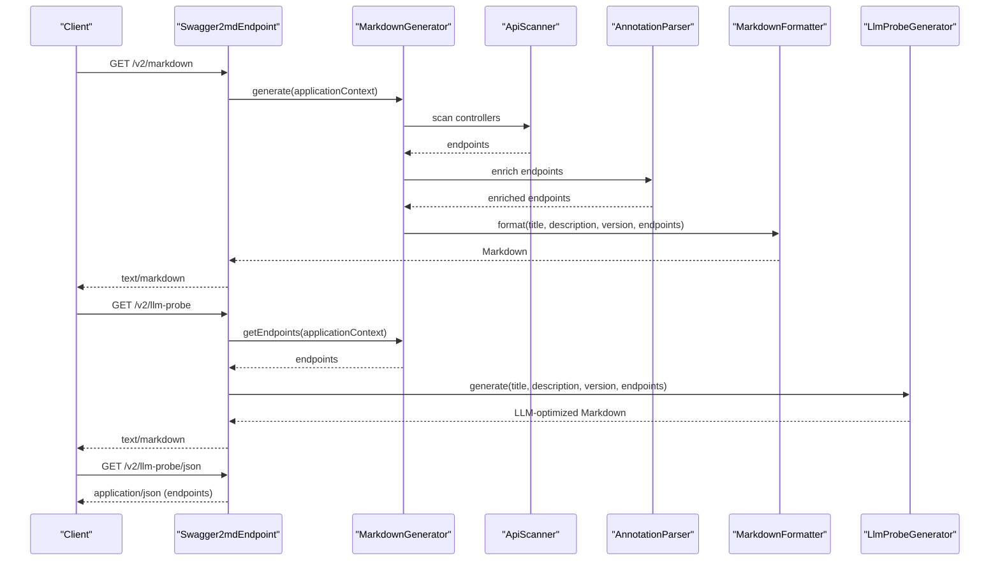
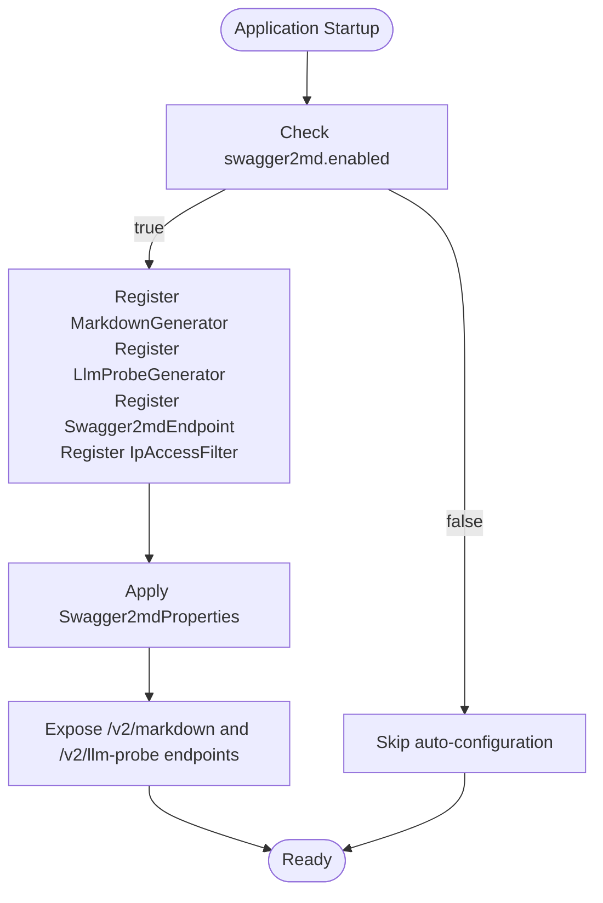
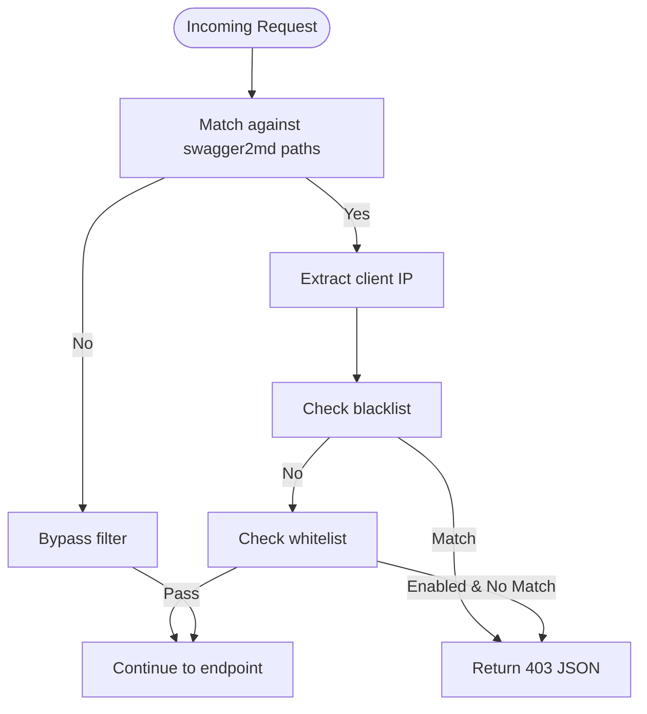
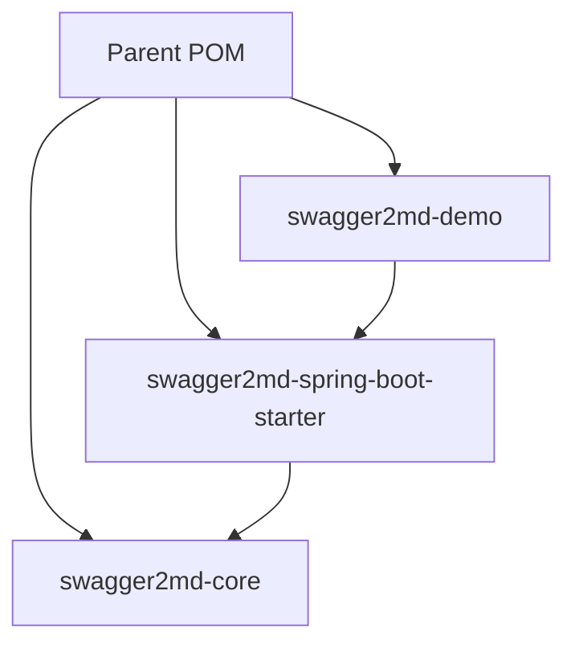
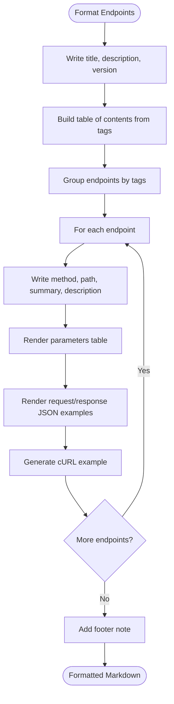
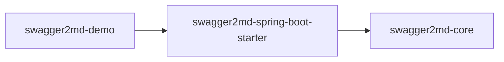

# Key Features

<cite>
**Referenced Files in This Document**
- [MarkdownApi.java](file://swagger2md-core/src/main/java/com/github/tentac/swagger2md/annotation/MarkdownApi.java)
- [MarkdownApiOperation.java](file://swagger2md-core/src/main/java/com/github/tentac/swagger2md/annotation/MarkdownApiOperation.java)
- [MarkdownApiParam.java](file://swagger2md-core/src/main/java/com/github/tentac/swagger2md/annotation/MarkdownApiParam.java)
- [AnnotationParser.java](file://swagger2md-core/src/main/java/com/github/tentac/swagger2md/core/AnnotationParser.java)
- [ApiScanner.java](file://swagger2md-core/src/main/java/com/github/tentac/swagger2md/core/ApiScanner.java)
- [MarkdownFormatter.java](file://swagger2md-core/src/main/java/com/github/tentac/swagger2md/core/MarkdownFormatter.java)
- [MarkdownGenerator.java](file://swagger2md-core/src/main/java/com/github/tentac/swagger2md/core/MarkdownGenerator.java)
- [Swagger2mdAutoConfiguration.java](file://swagger2md-spring-boot-starter/src/main/java/com/github/tentac/swagger2md/autoconfigure/Swagger2mdAutoConfiguration.java)
- [Swagger2mdEndpoint.java](file://swagger2md-spring-boot-starter/src/main/java/com/github/tentac/swagger2md/autoconfigure/Swagger2mdEndpoint.java)
- [Swagger2mdProperties.java](file://swagger2md-spring-boot-starter/src/main/java/com/github/tentac/swagger2md/autoconfigure/Swagger2mdProperties.java)
- [IpAccessFilter.java](file://swagger2md-spring-boot-starter/src/main/java/com/github/tentac/swagger2md/filter/IpAccessFilter.java)
- [LlmProbeGenerator.java](file://swagger2md-spring-boot-starter/src/main/java/com/github/tentac/swagger2md/probe/LlmProbeGenerator.java)
- [UserController.java](file://swagger2md-demo/src/main/java/com/github/tentac/swagger2md/demo/controller/UserController.java)
- [application.yml](file://swagger2md-demo/src/main/resources/application.yml)
- [pom.xml](file://pom.xml)
</cite>

## Table of Contents
1. [Introduction](#introduction)
2. [Project Structure](#project-structure)
3. [Core Components](#core-components)
4. [Architecture Overview](#architecture-overview)
5. [Detailed Component Analysis](#detailed-component-analysis)
6. [Dependency Analysis](#dependency-analysis)
7. [Performance Considerations](#performance-considerations)
8. [Troubleshooting Guide](#troubleshooting-guide)
9. [Conclusion](#conclusion)

## Introduction
This document highlights the key differentiators of the tentac project that elevate it beyond standard API documentation generators:
- Dual annotation support: native compatibility with Swagger2 annotations alongside a custom Markdown annotation system for standalone documentation.
- LLM-optimized documentation generation: structured Markdown outputs designed for AI consumption, including a dedicated probe format and raw JSON endpoint for programmatic integration.
- Spring Boot auto-configuration and endpoint exposure: seamless activation via properties, automatic bean registration, and configurable endpoints for Markdown and LLM probes.
- Security features: IP access control with whitelist/blacklist filters and CIDR notation support.
- Modular architecture: distinct core, starter, and demo modules enabling flexible integration and demonstration.
- Markdown formatting optimization: human-friendly and AI-friendly formatting tailored for readability and parsing.

## Project Structure
The project is organized into three Maven modules:
- swagger2md-core: Contains the core scanning, parsing, formatting, and generation logic.
- swagger2md-spring-boot-starter: Provides Spring Boot auto-configuration, endpoint exposure, security filters, and LLM probe generation.
- swagger2md-demo: Demonstrates usage with a sample controller and configuration.

**Diagram sources**
- [pom.xml:15-19](file://pom.xml#L15-L19)
- [ApiScanner.java:1-400](file://swagger2md-core/src/main/java/com/github/tentac/swagger2md/core/ApiScanner.java#L1-L400)
- [AnnotationParser.java:1-211](file://swagger2md-core/src/main/java/com/github/tentac/swagger2md/core/AnnotationParser.java#L1-L211)
- [MarkdownFormatter.java:1-202](file://swagger2md-core/src/main/java/com/github/tentac/swagger2md/core/MarkdownFormatter.java#L1-L202)
- [MarkdownGenerator.java:1-156](file://swagger2md-core/src/main/java/com/github/tentac/swagger2md/core/MarkdownGenerator.java#L1-L156)
- [Swagger2mdAutoConfiguration.java:1-82](file://swagger2md-spring-boot-starter/src/main/java/com/github/tentac/swagger2md/autoconfigure/Swagger2mdAutoConfiguration.java#L1-L82)
- [Swagger2mdEndpoint.java:1-72](file://swagger2md-spring-boot-starter/src/main/java/com/github/tentac/swagger2md/autoconfigure/Swagger2mdEndpoint.java#L1-L72)
- [Swagger2mdProperties.java:1-127](file://swagger2md-spring-boot-starter/src/main/java/com/github/tentac/swagger2md/autoconfigure/Swagger2mdProperties.java#L1-L127)
- [IpAccessFilter.java:1-196](file://swagger2md-spring-boot-starter/src/main/java/com/github/tentac/swagger2md/filter/IpAccessFilter.java#L1-L196)
- [LlmProbeGenerator.java:1-161](file://swagger2md-spring-boot-starter/src/main/java/com/github/tentac/swagger2md/probe/LlmProbeGenerator.java#L1-L161)
- [UserController.java:1-187](file://swagger2md-demo/src/main/java/com/github/tentac/swagger2md/demo/controller/UserController.java#L1-L187)
- [application.yml:1-29](file://swagger2md-demo/src/main/resources/application.yml#L1-L29)

**Section sources**
- [pom.xml:15-19](file://pom.xml#L15-L19)

## Core Components
This section outlines the building blocks that enable dual annotation support, structured Markdown generation, and LLM-ready outputs.

- Dual annotation support
  - Swagger2 compatibility: The system reflectsively reads Swagger2 annotations (e.g., ApiOperation, ApiParam) to enrich endpoint metadata.
  - Custom Markdown annotations: Standalone annotations (MarkdownApi, MarkdownApiOperation, MarkdownApiParam) provide equivalent metadata for controllers and endpoints without requiring Swagger2 dependencies.
  - Priority and fallback: Both annotation systems are supported concurrently; Swagger2 annotations are processed first, followed by custom Markdown annotations for augmentation.

- Structured Markdown generation
  - Endpoint discovery: ApiScanner identifies REST endpoints from Spring controllers, mapping HTTP methods, paths, consumes/produces, and parameters.
  - Metadata enrichment: AnnotationParser merges Swagger2 and custom annotations into EndpointInfo objects.
  - Formatting: MarkdownFormatter renders a human-readable and navigable Markdown document with tags, tables, JSON examples, and cURL snippets.

- LLM-optimized outputs
  - Probe generator: LlmProbeGenerator creates a compact, structured Markdown document optimized for AI consumption, including capability summaries and details.
  - Raw JSON endpoint: Exposes endpoints as JSON for programmatic ingestion by LLMs and automation tools.

- Spring Boot integration
  - Auto-configuration: Swagger2mdAutoConfiguration registers beans conditionally when enabled and applies property-driven configuration.
  - Endpoints: Swagger2mdEndpoint exposes Markdown and LLM probe endpoints with configurable paths.
  - Security: IpAccessFilter enforces IP-based access control using whitelist/blacklist with CIDR notation.

**Section sources**
- [AnnotationParser.java:14-109](file://swagger2md-core/src/main/java/com/github/tentac/swagger2md/core/AnnotationParser.java#L14-L109)
- [ApiScanner.java:19-277](file://swagger2md-core/src/main/java/com/github/tentac/swagger2md/core/ApiScanner.java#L19-L277)
- [MarkdownFormatter.java:8-136](file://swagger2md-core/src/main/java/com/github/tentac/swagger2md/core/MarkdownFormatter.java#L8-L136)
- [MarkdownGenerator.java:11-99](file://swagger2md-core/src/main/java/com/github/tentac/swagger2md/core/MarkdownGenerator.java#L11-L99)
- [LlmProbeGenerator.java:10-146](file://swagger2md-spring-boot-starter/src/main/java/com/github/tentac/swagger2md/probe/LlmProbeGenerator.java#L10-L146)
- [Swagger2mdAutoConfiguration.java:16-81](file://swagger2md-spring-boot-starter/src/main/java/com/github/tentac/swagger2md/autoconfigure/Swagger2mdAutoConfiguration.java#L16-L81)
- [Swagger2mdEndpoint.java:16-71](file://swagger2md-spring-boot-starter/src/main/java/com/github/tentac/swagger2md/autoconfigure/Swagger2mdEndpoint.java#L16-L71)
- [IpAccessFilter.java:19-196](file://swagger2md-spring-boot-starter/src/main/java/com/github/tentac/swagger2md/filter/IpAccessFilter.java#L19-L196)

## Architecture Overview
The system orchestrates scanning, parsing, formatting, and serving of documentation through a layered design with clear separation of concerns.

**Diagram sources**
- [MarkdownGenerator.java:15-99](file://swagger2md-core/src/main/java/com/github/tentac/swagger2md/core/MarkdownGenerator.java#L15-L99)
- [ApiScanner.java:22-56](file://swagger2md-core/src/main/java/com/github/tentac/swagger2md/core/ApiScanner.java#L22-L56)
- [AnnotationParser.java:18-35](file://swagger2md-core/src/main/java/com/github/tentac/swagger2md/core/AnnotationParser.java#L18-L35)
- [MarkdownFormatter.java:11-71](file://swagger2md-core/src/main/java/com/github/tentac/swagger2md/core/MarkdownFormatter.java#L11-L71)
- [Swagger2mdAutoConfiguration.java:20-81](file://swagger2md-spring-boot-starter/src/main/java/com/github/tentac/swagger2md/autoconfigure/Swagger2mdAutoConfiguration.java#L20-L81)
- [Swagger2mdEndpoint.java:20-71](file://swagger2md-spring-boot-starter/src/main/java/com/github/tentac/swagger2md/autoconfigure/Swagger2mdEndpoint.java#L20-L71)
- [IpAccessFilter.java:23-95](file://swagger2md-spring-boot-starter/src/main/java/com/github/tentac/swagger2md/filter/IpAccessFilter.java#L23-L95)
- [LlmProbeGenerator.java:15-146](file://swagger2md-spring-boot-starter/src/main/java/com/github/tentac/swagger2md/probe/LlmProbeGenerator.java#L15-L146)

## Detailed Component Analysis

### Dual Annotation Support
The system supports both Swagger2 and custom Markdown annotations to maximize compatibility and flexibility.

**Diagram sources**
- [AnnotationParser.java:18-210](file://swagger2md-core/src/main/java/com/github/tentac/swagger2md/core/AnnotationParser.java#L18-L210)
- [ApiScanner.java:22-162](file://swagger2md-core/src/main/java/com/github/tentac/swagger2md/core/ApiScanner.java#L22-L162)
- [MarkdownApi.java:14-24](file://swagger2md-core/src/main/java/com/github/tentac/swagger2md/annotation/MarkdownApi.java#L14-L24)
- [MarkdownApiOperation.java:14-27](file://swagger2md-core/src/main/java/com/github/tentac/swagger2md/annotation/MarkdownApiOperation.java#L14-L27)
- [MarkdownApiParam.java:14-33](file://swagger2md-core/src/main/java/com/github/tentac/swagger2md/annotation/MarkdownApiParam.java#L14-L33)

Practical example value:
- Enables migration from Swagger2 to Markdown annotations without losing metadata.
- Allows teams to adopt Markdown annotations incrementally while retaining existing Swagger2 annotations.

**Section sources**
- [AnnotationParser.java:26-109](file://swagger2md-core/src/main/java/com/github/tentac/swagger2md/core/AnnotationParser.java#L26-L109)
- [ApiScanner.java:98-162](file://swagger2md-core/src/main/java/com/github/tentac/swagger2md/core/ApiScanner.java#L98-L162)
- [MarkdownApi.java:14-24](file://swagger2md-core/src/main/java/com/github/tentac/swagger2md/annotation/MarkdownApi.java#L14-L24)
- [MarkdownApiOperation.java:14-27](file://swagger2md-core/src/main/java/com/github/tentac/swagger2md/annotation/MarkdownApiOperation.java#L14-L27)
- [MarkdownApiParam.java:14-33](file://swagger2md-core/src/main/java/com/github/tentac/swagger2md/annotation/MarkdownApiParam.java#L14-L33)

### LLM-Optimized Documentation Generation
The system generates two complementary outputs optimized for AI integration:
- Human-readable Markdown documentation via MarkdownFormatter.
- LLM-optimized Markdown via LlmProbeGenerator with capability summaries and structured details.
- Raw JSON endpoint for programmatic consumption.

**Diagram sources**
- [Swagger2mdEndpoint.java:40-71](file://swagger2md-spring-boot-starter/src/main/java/com/github/tentac/swagger2md/autoconfigure/Swagger2mdEndpoint.java#L40-L71)
- [MarkdownGenerator.java:54-99](file://swagger2md-core/src/main/java/com/github/tentac/swagger2md/core/MarkdownGenerator.java#L54-L99)
- [ApiScanner.java:38-56](file://swagger2md-core/src/main/java/com/github/tentac/swagger2md/core/ApiScanner.java#L38-L56)
- [AnnotationParser.java:26-35](file://swagger2md-core/src/main/java/com/github/tentac/swagger2md/core/AnnotationParser.java#L26-L35)
- [MarkdownFormatter.java:24-71](file://swagger2md-core/src/main/java/com/github/tentac/swagger2md/core/MarkdownFormatter.java#L24-L71)
- [LlmProbeGenerator.java:26-146](file://swagger2md-spring-boot-starter/src/main/java/com/github/tentac/swagger2md/probe/LlmProbeGenerator.java#L26-L146)

Practical example value:
- AI agents can consume the LLM-optimized Markdown to understand capabilities and constraints.
- Raw JSON enables automated tooling to programmatically inspect endpoints and generate clients or tests.

**Section sources**
- [Swagger2mdEndpoint.java:40-71](file://swagger2md-spring-boot-starter/src/main/java/com/github/tentac/swagger2md/autoconfigure/Swagger2mdEndpoint.java#L40-L71)
- [LlmProbeGenerator.java:26-146](file://swagger2md-spring-boot-starter/src/main/java/com/github/tentac/swagger2md/probe/LlmProbeGenerator.java#L26-L146)
- [MarkdownGenerator.java:54-99](file://swagger2md-core/src/main/java/com/github/tentac/swagger2md/core/MarkdownGenerator.java#L54-L99)

### Spring Boot Auto-Configuration and Endpoint Exposure
Auto-configuration registers beans and endpoints based on properties, enabling zero-effort activation and customization.

**Diagram sources**
- [Swagger2mdAutoConfiguration.java:20-81](file://swagger2md-spring-boot-starter/src/main/java/com/github/tentac/swagger2md/autoconfigure/Swagger2mdAutoConfiguration.java#L20-L81)
- [Swagger2mdProperties.java:12-127](file://swagger2md-spring-boot-starter/src/main/java/com/github/tentac/swagger2md/autoconfigure/Swagger2mdProperties.java#L12-L127)
- [Swagger2mdEndpoint.java:20-71](file://swagger2md-spring-boot-starter/src/main/java/com/github/tentac/swagger2md/autoconfigure/Swagger2mdEndpoint.java#L20-L71)

Practical example value:
- Teams can enable documentation endpoints with a single property toggle.
- Paths and probe toggles are fully configurable via application properties.

**Section sources**
- [Swagger2mdAutoConfiguration.java:20-81](file://swagger2md-spring-boot-starter/src/main/java/com/github/tentac/swagger2md/autoconfigure/Swagger2mdAutoConfiguration.java#L20-L81)
- [Swagger2mdProperties.java:12-127](file://swagger2md-spring-boot-starter/src/main/java/com/github/tentac/swagger2md/autoconfigure/Swagger2mdProperties.java#L12-L127)
- [Swagger2mdEndpoint.java:20-71](file://swagger2md-spring-boot-starter/src/main/java/com/github/tentac/swagger2md/autoconfigure/Swagger2mdEndpoint.java#L20-L71)

### Security: IP Access Control and Filtering
The system enforces IP-based access control for documentation endpoints using whitelist and blacklist filters with CIDR notation support.

**Diagram sources**
- [IpAccessFilter.java:61-95](file://swagger2md-spring-boot-starter/src/main/java/com/github/tentac/swagger2md/filter/IpAccessFilter.java#L61-L95)
- [Swagger2mdAutoConfiguration.java:52-80](file://swagger2md-spring-boot-starter/src/main/java/com/github/tentac/swagger2md/autoconfigure/Swagger2mdAutoConfiguration.java#L52-L80)

Practical example value:
- Restrict documentation access to trusted networks or IPs.
- Supports IPv4/IPv6 and CIDR ranges for granular control.

**Section sources**
- [IpAccessFilter.java:23-196](file://swagger2md-spring-boot-starter/src/main/java/com/github/tentac/swagger2md/filter/IpAccessFilter.java#L23-L196)
- [Swagger2mdAutoConfiguration.java:52-80](file://swagger2md-spring-boot-starter/src/main/java/com/github/tentac/swagger2md/autoconfigure/Swagger2mdAutoConfiguration.java#L52-L80)

### Modular Architecture
The project is split into three modules:
- Core: Provides scanning, parsing, formatting, and generation logic.
- Starter: Adds Spring Boot auto-configuration, endpoints, filters, and LLM probe generator.
- Demo: Demonstrates usage with a sample controller and configuration.

**Diagram sources**
- [pom.xml:15-19](file://pom.xml#L15-L19)

Practical example value:
- Developers can depend only on the core module for custom integrations.
- The starter module simplifies adoption in Spring Boot applications.

**Section sources**
- [pom.xml:15-19](file://pom.xml#L15-L19)

### Markdown Formatting Optimization
The formatter optimizes Markdown for readability and AI processing:
- Structured sections with clear headings and anchors.
- Parameter tables with concise formatting.
- JSON examples with fenced code blocks.
- cURL examples for quick testing.

**Diagram sources**
- [MarkdownFormatter.java:24-136](file://swagger2md-core/src/main/java/com/github/tentac/swagger2md/core/MarkdownFormatter.java#L24-L136)

Practical example value:
- Easier for humans to navigate and for LLMs to parse due to consistent structure and minimal formatting noise.

**Section sources**
- [MarkdownFormatter.java:24-136](file://swagger2md-core/src/main/java/com/github/tentac/swagger2md/core/MarkdownFormatter.java#L24-L136)

### Practical Examples and Use Cases
- Dual annotation support
  - Use both Swagger2 and Markdown annotations on the same controller/method to preserve legacy docs while adding Markdown-specific metadata.
  - Reference: [UserController.java:22-137](file://swagger2md-demo/src/main/java/com/github/tentac/swagger2md/demo/controller/UserController.java#L22-L137)

- LLM-optimized outputs
  - Consume /v2/llm-probe for agent-driven workflows and /v2/llm-probe/json for programmatic integrations.
  - Reference: [Swagger2mdEndpoint.java:43-70](file://swagger2md-spring-boot-starter/src/main/java/com/github/tentac/swagger2md/autoconfigure/Swagger2mdEndpoint.java#L43-L70)

- Spring Boot auto-configuration
  - Enable and configure via application.yml; endpoints become available automatically.
  - Reference: [application.yml:8-24](file://swagger2md-demo/src/main/resources/application.yml#L8-L24)

- Security
  - Configure ip-whitelist/ip-blacklist to restrict access to documentation endpoints.
  - Reference: [application.yml:17-24](file://swagger2md-demo/src/main/resources/application.yml#L17-L24)

- Modular usage
  - Depend on swagger2md-core for custom integrations or swagger2md-spring-boot-starter for Spring Boot projects.
  - Reference: [pom.xml:58-66](file://pom.xml#L58-L66)

**Section sources**
- [UserController.java:22-137](file://swagger2md-demo/src/main/java/com/github/tentac/swagger2md/demo/controller/UserController.java#L22-L137)
- [Swagger2mdEndpoint.java:43-70](file://swagger2md-spring-boot-starter/src/main/java/com/github/tentac/swagger2md/autoconfigure/Swagger2mdEndpoint.java#L43-L70)
- [application.yml:8-24](file://swagger2md-demo/src/main/resources/application.yml#L8-L24)
- [pom.xml:58-66](file://pom.xml#L58-L66)

## Dependency Analysis
The starter module depends on the core module, and the demo module depends on the starter for demonstration purposes.

**Diagram sources**
- [pom.xml:58-66](file://pom.xml#L58-L66)

**Section sources**
- [pom.xml:58-66](file://pom.xml#L58-L66)

## Performance Considerations
- Reflection overhead: The system uses reflection to read Swagger2 annotations. While convenient, reflection can add overhead during startup. Consider minimizing repeated reflection calls and caching where appropriate.
- Endpoint scanning: Scanning large applications can be expensive. Use the basePackage property to limit the scan scope.
- JSON example generation: Generating JSON examples for request/response bodies involves reflection and serialization; keep payload models simple and avoid deeply nested structures when possible.
- Filter evaluation: IP access filtering is applied per request; ensure CIDR lists are reasonably sized to avoid excessive matching overhead.
- Concurrency: The endpoint handlers are stateless and thread-safe, but ensure proper container sizing and JVM tuning for production workloads.

[No sources needed since this section provides general guidance]

## Troubleshooting Guide
- Endpoints not exposed
  - Verify swagger2md.enabled is true and paths are correctly configured.
  - Reference: [Swagger2mdProperties.java:16](file://swagger2md-spring-boot-starter/src/main/java/com/github/tentac/swagger2md/autoconfigure/Swagger2mdProperties.java#L16), [application.yml:9](file://swagger2md-demo/src/main/resources/application.yml#L9)

- Access denied errors
  - Check ip-whitelist/ip-blacklist configuration and ensure the client IP matches the intended policy.
  - Reference: [IpAccessFilter.java:77-92](file://swagger2md-spring-boot-starter/src/main/java/com/github/tentac/swagger2md/filter/IpAccessFilter.java#L77-L92), [application.yml:17-24](file://swagger2md-demo/src/main/resources/application.yml#L17-L24)

- Missing or incorrect metadata
  - Confirm both Swagger2 and Markdown annotations are present where needed; ensure method signatures match operation IDs.
  - Reference: [AnnotationParser.java:26-35](file://swagger2md-core/src/main/java/com/github/tentac/swagger2md/core/AnnotationParser.java#L26-L35), [MarkdownGenerator.java:86-93](file://swagger2md-core/src/main/java/com/github/tentac/swagger2md/core/MarkdownGenerator.java#L86-L93)

**Section sources**
- [Swagger2mdProperties.java:16](file://swagger2md-spring-boot-starter/src/main/java/com/github/tentac/swagger2md/autoconfigure/Swagger2mdProperties.java#L16)
- [application.yml:9](file://swagger2md-demo/src/main/resources/application.yml#L9)
- [IpAccessFilter.java:77-92](file://swagger2md-spring-boot-starter/src/main/java/com/github/tentac/swagger2md/filter/IpAccessFilter.java#L77-L92)
- [application.yml:17-24](file://swagger2md-demo/src/main/resources/application.yml#L17-L24)
- [AnnotationParser.java:26-35](file://swagger2md-core/src/main/java/com/github/tentac/swagger2md/core/AnnotationParser.java#L26-L35)
- [MarkdownGenerator.java:86-93](file://swagger2md-core/src/main/java/com/github/tentac/swagger2md/core/MarkdownGenerator.java#L86-L93)

## Conclusion
tentac delivers a robust, modular, and AI-ready documentation solution that:
- Seamlessly integrates with existing Swagger2 annotations while introducing a flexible Markdown annotation system.
- Produces human-friendly Markdown and LLM-optimized outputs for diverse consumption scenarios.
- Provides Spring Boot auto-configuration, configurable endpoints, and strong security controls.
- Offers a clean modular architecture enabling both simple and advanced integrations.

[No sources needed since this section summarizes without analyzing specific files]