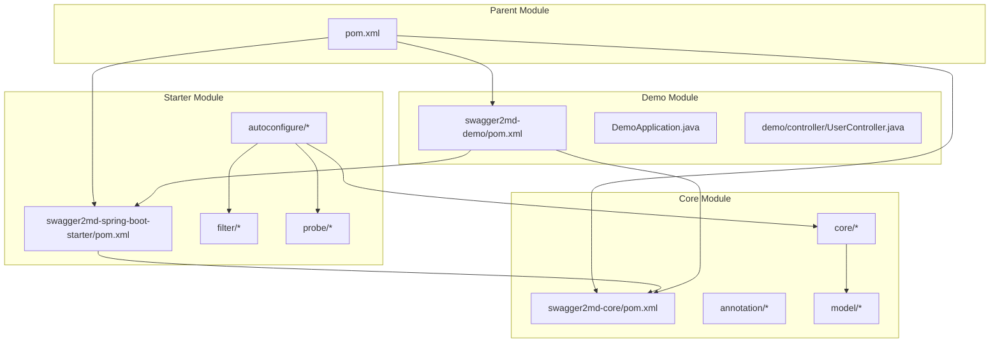
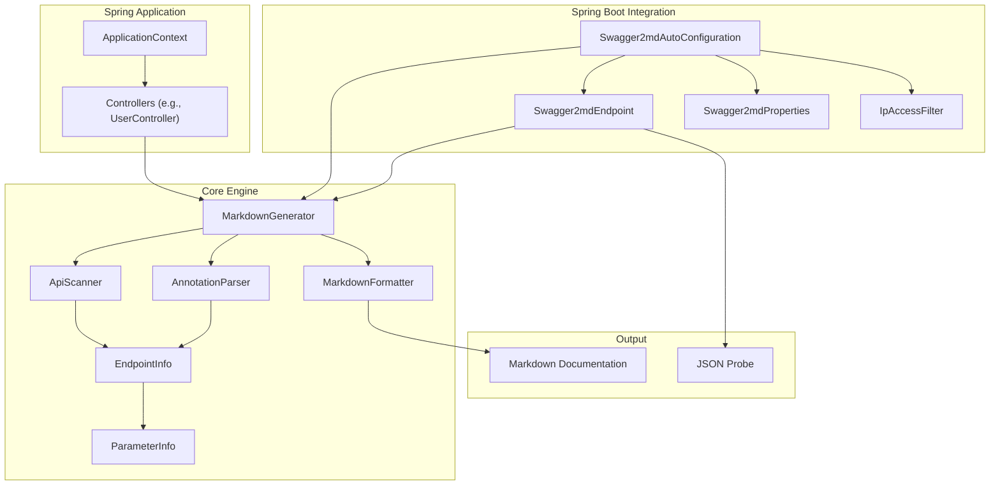
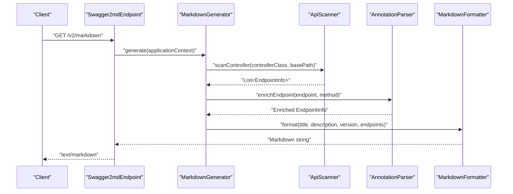
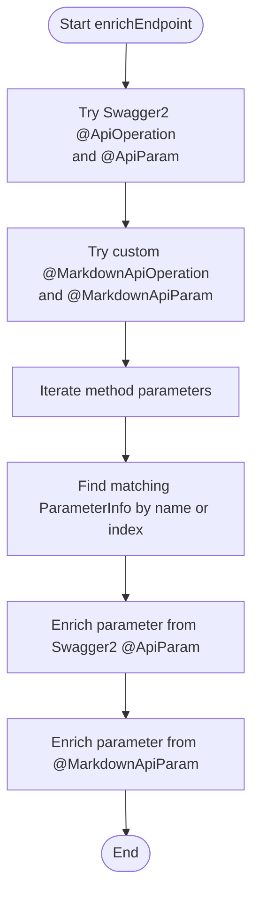
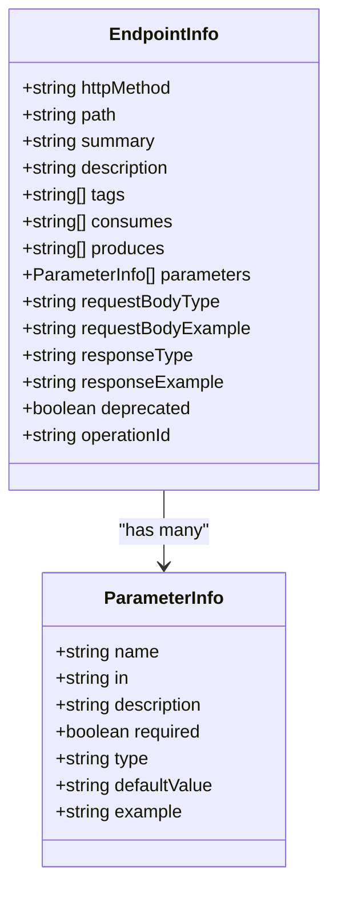
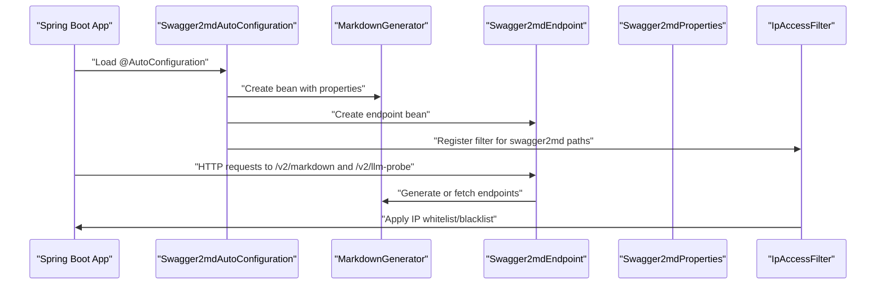
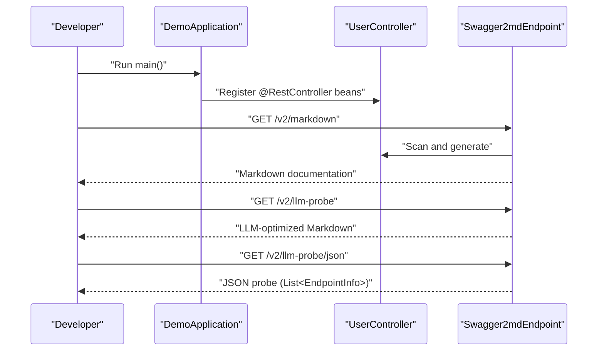
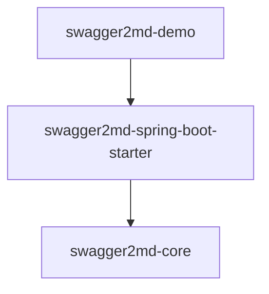

# Project Overview

<cite>
**Referenced Files in This Document**
- [pom.xml](file://pom.xml)
- [swagger2md-core/pom.xml](file://swagger2md-core/pom.xml)
- [swagger2md-spring-boot-starter/pom.xml](file://swagger2md-spring-boot-starter/pom.xml)
- [swagger2md-demo/pom.xml](file://swagger2md-demo/pom.xml)
- [MarkdownApi.java](file://swagger2md-core/src/main/java/com/github/tentac/swagger2md/annotation/MarkdownApi.java)
- [MarkdownApiOperation.java](file://swagger2md-core/src/main/java/com/github/tentac/swagger2md/annotation/MarkdownApiOperation.java)
- [MarkdownApiParam.java](file://swagger2md-core/src/main/java/com/github/tentac/swagger2md/annotation/MarkdownApiParam.java)
- [AnnotationParser.java](file://swagger2md-core/src/main/java/com/github/tentac/swagger2md/core/AnnotationParser.java)
- [ApiScanner.java](file://swagger2md-core/src/main/java/com/github/tentac/swagger2md/core/ApiScanner.java)
- [MarkdownFormatter.java](file://swagger2md-core/src/main/java/com/github/tentac/swagger2md/core/MarkdownFormatter.java)
- [MarkdownGenerator.java](file://swagger2md-core/src/main/java/com/github/tentac/swagger2md/core/MarkdownGenerator.java)
- [EndpointInfo.java](file://swagger2md-core/src/main/java/com/github/tentac/swagger2md/model/EndpointInfo.java)
- [ParameterInfo.java](file://swagger2md-core/src/main/java/com/github/tentac/swagger2md/model/ParameterInfo.java)
- [Swagger2mdAutoConfiguration.java](file://swagger2md-spring-boot-starter/src/main/java/com/github/tentac/swagger2md/autoconfigure/Swagger2mdAutoConfiguration.java)
- [Swagger2mdEndpoint.java](file://swagger2md-spring-boot-starter/src/main/java/com/github/tentac/swagger2md/autoconfigure/Swagger2mdEndpoint.java)
- [Swagger2mdProperties.java](file://swagger2md-spring-boot-starter/src/main/java/com/github/tentac/swagger2md/autoconfigure/Swagger2mdProperties.java)
- [IpAccessFilter.java](file://swagger2md-spring-boot-starter/src/main/java/com/github/tentac/swagger2md/filter/IpAccessFilter.java)
- [DemoApplication.java](file://swagger2md-demo/src/main/java/com/github/tentac/swagger2md/demo/DemoApplication.java)
- [UserController.java](file://swagger2md-demo/src/main/java/com/github/tentac/swagger2md/demo/controller/UserController.java)
</cite>

## Table of Contents
1. [Introduction](#introduction)
2. [Project Structure](#project-structure)
3. [Core Components](#core-components)
4. [Architecture Overview](#architecture-overview)
5. [Detailed Component Analysis](#detailed-component-analysis)
6. [Dependency Analysis](#dependency-analysis)
7. [Performance Considerations](#performance-considerations)
8. [Troubleshooting Guide](#troubleshooting-guide)
9. [Conclusion](#conclusion)
10. [Appendices](#appendices)

## Introduction
tentac is a specialized Java library that generates Markdown-formatted API documentation from Spring MVC controllers. It is optimized for Large Language Model (LLM) integration while maintaining compatibility with Swagger2 annotations. The project consists of three modules:
- core: Provides the engine to scan, parse, and format API documentation
- spring-boot-starter: Adds Spring Boot auto-configuration, web endpoints, and IP access control
- demo: A sample application demonstrating usage and showcasing the generated documentation

The primary value propositions are:
- LLM-optimized documentation: Offers both human-friendly Markdown and machine-consumable JSON probes for AI agents
- Seamless Spring Boot integration: Auto-configures endpoints and security policies out-of-the-box
- Dual annotation support: Works with existing Swagger2 annotations or custom Markdown annotations for standalone mode

## Project Structure
The project is organized as a Maven multi-module build with a parent POM managing shared properties and dependency versions. Three modules encapsulate distinct responsibilities:
- swagger2md-core: Contains annotation definitions, scanning logic, parsing, formatting, and data models
- swagger2md-spring-boot-starter: Exposes REST endpoints, registers filters, and wires configuration
- swagger2md-demo: Demonstrates real-world usage with a sample controller

**Diagram sources**
- [pom.xml:15-19](file://pom.xml#L15-L19)
- [swagger2md-core/pom.xml:19-48](file://swagger2md-core/pom.xml#L19-L48)
- [swagger2md-spring-boot-starter/pom.xml:19-47](file://swagger2md-spring-boot-starter/pom.xml#L19-L47)
- [swagger2md-demo/pom.xml:19-40](file://swagger2md-demo/pom.xml#L19-L40)

**Section sources**
- [pom.xml:15-19](file://pom.xml#L15-L19)
- [swagger2md-core/pom.xml:19-48](file://swagger2md-core/pom.xml#L19-L48)
- [swagger2md-spring-boot-starter/pom.xml:19-47](file://swagger2md-spring-boot-starter/pom.xml#L19-L47)
- [swagger2md-demo/pom.xml:19-40](file://swagger2md-demo/pom.xml#L19-L40)

## Core Components
This section introduces the essential building blocks that power Markdown generation and LLM integration.

- Annotation layer
  - Custom annotations enable standalone documentation without Swagger2: @MarkdownApi, @MarkdownApiOperation, @MarkdownApiParam
  - These annotations mirror Swagger2 semantics but remain optional, allowing migration or hybrid usage

- Scanning and parsing
  - ApiScanner discovers Spring MVC controllers, extracts HTTP methods, paths, consumes/produces, and parameters
  - AnnotationParser enriches EndpointInfo with summaries, descriptions, tags, deprecation, and parameter details from both Swagger2 and custom annotations

- Formatting and generation
  - MarkdownFormatter converts EndpointInfo lists into a structured Markdown document with tags, parameters, request/response examples, and cURL samples
  - MarkdownGenerator orchestrates scanning, parsing, and formatting, and exposes methods to generate Markdown or retrieve raw EndpointInfo for LLM probes

- Data models
  - EndpointInfo captures endpoint metadata, parameters, request/response types/examples, and operation identifiers
  - ParameterInfo captures parameter attributes including location, type, defaults, and examples

**Section sources**
- [MarkdownApi.java:12-24](file://swagger2md-core/src/main/java/com/github/tentac/swagger2md/annotation/MarkdownApi.java#L12-L24)
- [MarkdownApiOperation.java:12-27](file://swagger2md-core/src/main/java/com/github/tentac/swagger2md/annotation/MarkdownApiOperation.java#L12-L27)
- [MarkdownApiParam.java:12-33](file://swagger2md-core/src/main/java/com/github/tentac/swagger2md/annotation/MarkdownApiParam.java#L12-L33)
- [ApiScanner.java:22-25](file://swagger2md-core/src/main/java/com/github/tentac/swagger2md/core/ApiScanner.java#L22-L25)
- [AnnotationParser.java:26-35](file://swagger2md-core/src/main/java/com/github/tentac/swagger2md/core/AnnotationParser.java#L26-L35)
- [MarkdownFormatter.java:24-71](file://swagger2md-core/src/main/java/com/github/tentac/swagger2md/core/MarkdownFormatter.java#L24-L71)
- [MarkdownGenerator.java:54-99](file://swagger2md-core/src/main/java/com/github/tentac/swagger2md/core/MarkdownGenerator.java#L54-L99)
- [EndpointInfo.java:11-52](file://swagger2md-core/src/main/java/com/github/tentac/swagger2md/model/EndpointInfo.java#L11-L52)
- [ParameterInfo.java:8-28](file://swagger2md-core/src/main/java/com/github/tentac/swagger2md/model/ParameterInfo.java#L8-L28)

## Architecture Overview
The system integrates Spring MVC discovery with annotation parsing and Markdown formatting, exposing endpoints for both human-readable documentation and LLM consumption.

**Diagram sources**
- [MarkdownGenerator.java:54-99](file://swagger2md-core/src/main/java/com/github/tentac/swagger2md/core/MarkdownGenerator.java#L54-L99)
- [ApiScanner.java:34-52](file://swagger2md-core/src/main/java/com/github/tentac/swagger2md/core/ApiScanner.java#L34-L52)
- [AnnotationParser.java:26-35](file://swagger2md-core/src/main/java/com/github/tentac/swagger2md/core/AnnotationParser.java#L26-L35)
- [MarkdownFormatter.java:24-71](file://swagger2md-core/src/main/java/com/github/tentac/swagger2md/core/MarkdownFormatter.java#L24-L71)
- [Swagger2mdAutoConfiguration.java:25-46](file://swagger2md-spring-boot-starter/src/main/java/com/github/tentac/swagger2md/autoconfigure/Swagger2mdAutoConfiguration.java#L25-L46)
- [Swagger2mdEndpoint.java:43-70](file://swagger2md-spring-boot-starter/src/main/java/com/github/tentac/swagger2md/autoconfigure/Swagger2mdEndpoint.java#L43-L70)
- [Swagger2mdProperties.java:15-44](file://swagger2md-spring-boot-starter/src/main/java/com/github/tentac/swagger2md/autoconfigure/Swagger2mdProperties.java#L15-L44)
- [IpAccessFilter.java:61-95](file://swagger2md-spring-boot-starter/src/main/java/com/github/tentac/swagger2md/filter/IpAccessFilter.java#L61-L95)

## Detailed Component Analysis

### Core Generation Pipeline
The generation pipeline transforms Spring controllers into Markdown documentation with LLM-friendly outputs.

**Diagram sources**
- [Swagger2mdEndpoint.java:43-47](file://swagger2md-spring-boot-starter/src/main/java/com/github/tentac/swagger2md/autoconfigure/Swagger2mdEndpoint.java#L43-L47)
- [MarkdownGenerator.java:54-99](file://swagger2md-core/src/main/java/com/github/tentac/swagger2md/core/MarkdownGenerator.java#L54-L99)
- [ApiScanner.java:34-52](file://swagger2md-core/src/main/java/com/github/tentac/swagger2md/core/ApiScanner.java#L34-L52)
- [AnnotationParser.java:26-35](file://swagger2md-core/src/main/java/com/github/tentac/swagger2md/core/AnnotationParser.java#L26-L35)
- [MarkdownFormatter.java:24-71](file://swagger2md-core/src/main/java/com/github/tentac/swagger2md/core/MarkdownFormatter.java#L24-L71)

**Section sources**
- [Swagger2mdEndpoint.java:43-70](file://swagger2md-spring-boot-starter/src/main/java/com/github/tentac/swagger2md/autoconfigure/Swagger2mdEndpoint.java#L43-L70)
- [MarkdownGenerator.java:54-99](file://swagger2md-core/src/main/java/com/github/tentac/swagger2md/core/MarkdownGenerator.java#L54-L99)

### Annotation Parsing Logic
The parser supports both Swagger2 and custom Markdown annotations, merging metadata into EndpointInfo and ParameterInfo.

**Diagram sources**
- [AnnotationParser.java:26-121](file://swagger2md-core/src/main/java/com/github/tentac/swagger2md/core/AnnotationParser.java#L26-L121)
- [AnnotationParser.java:187-209](file://swagger2md-core/src/main/java/com/github/tentac/swagger2md/core/AnnotationParser.java#L187-L209)

**Section sources**
- [AnnotationParser.java:26-121](file://swagger2md-core/src/main/java/com/github/tentac/swagger2md/core/AnnotationParser.java#L26-L121)
- [AnnotationParser.java:187-209](file://swagger2md-core/src/main/java/com/github/tentac/swagger2md/core/AnnotationParser.java#L187-L209)

### Data Models
The data model captures endpoint and parameter metadata used across the pipeline.

**Diagram sources**
- [EndpointInfo.java:11-52](file://swagger2md-core/src/main/java/com/github/tentac/swagger2md/model/EndpointInfo.java#L11-L52)
- [ParameterInfo.java:8-28](file://swagger2md-core/src/main/java/com/github/tentac/swagger2md/model/ParameterInfo.java#L8-L28)

**Section sources**
- [EndpointInfo.java:11-52](file://swagger2md-core/src/main/java/com/github/tentac/swagger2md/model/EndpointInfo.java#L11-L52)
- [ParameterInfo.java:8-28](file://swagger2md-core/src/main/java/com/github/tentac/swagger2md/model/ParameterInfo.java#L8-L28)

### Spring Boot Integration
The starter module auto-configures the generator, exposes endpoints, and applies IP access control.

**Diagram sources**
- [Swagger2mdAutoConfiguration.java:25-80](file://swagger2md-spring-boot-starter/src/main/java/com/github/tentac/swagger2md/autoconfigure/Swagger2mdAutoConfiguration.java#L25-L80)
- [Swagger2mdEndpoint.java:43-70](file://swagger2md-spring-boot-starter/src/main/java/com/github/tentac/swagger2md/autoconfigure/Swagger2mdEndpoint.java#L43-L70)
- [Swagger2mdProperties.java:15-44](file://swagger2md-spring-boot-starter/src/main/java/com/github/tentac/swagger2md/autoconfigure/Swagger2mdProperties.java#L15-L44)
- [IpAccessFilter.java:61-95](file://swagger2md-spring-boot-starter/src/main/java/com/github/tentac/swagger2md/filter/IpAccessFilter.java#L61-L95)

**Section sources**
- [Swagger2mdAutoConfiguration.java:25-80](file://swagger2md-spring-boot-starter/src/main/java/com/github/tentac/swagger2md/autoconfigure/Swagger2mdAutoConfiguration.java#L25-L80)
- [Swagger2mdEndpoint.java:43-70](file://swagger2md-spring-boot-starter/src/main/java/com/github/tentac/swagger2md/autoconfigure/Swagger2mdEndpoint.java#L43-L70)
- [Swagger2mdProperties.java:15-44](file://swagger2md-spring-boot-starter/src/main/java/com/github/tentac/swagger2md/autoconfigure/Swagger2mdProperties.java#L15-L44)
- [IpAccessFilter.java:61-95](file://swagger2md-spring-boot-starter/src/main/java/com/github/tentac/swagger2md/filter/IpAccessFilter.java#L61-L95)

### Demo Application
The demo showcases dual annotation support and demonstrates the generated outputs.

**Diagram sources**
- [DemoApplication.java:16-18](file://swagger2md-demo/src/main/java/com/github/tentac/swagger2md/demo/DemoApplication.java#L16-L18)
- [UserController.java:20-24](file://swagger2md-demo/src/main/java/com/github/tentac/swagger2md/demo/controller/UserController.java#L20-L24)
- [Swagger2mdEndpoint.java:43-70](file://swagger2md-spring-boot-starter/src/main/java/com/github/tentac/swagger2md/autoconfigure/Swagger2mdEndpoint.java#L43-L70)

**Section sources**
- [DemoApplication.java:16-18](file://swagger2md-demo/src/main/java/com/github/tentac/swagger2md/demo/DemoApplication.java#L16-L18)
- [UserController.java:20-24](file://swagger2md-demo/src/main/java/com/github/tentac/swagger2md/demo/controller/UserController.java#L20-L24)
- [Swagger2mdEndpoint.java:43-70](file://swagger2md-spring-boot-starter/src/main/java/com/github/tentac/swagger2md/autoconfigure/Swagger2mdEndpoint.java#L43-L70)

## Dependency Analysis
The modules maintain clear boundaries and minimal coupling:
- swagger2md-core depends on Spring Web/Context and Jackson; it optionally depends on Swagger2 annotations
- swagger2md-spring-boot-starter depends on swagger2md-core and Spring Boot starters; it also depends on Jakarta Servlet for filter support
- swagger2md-demo depends on the starter and Spring Boot Web for demonstration

**Diagram sources**
- [swagger2md-core/pom.xml:19-48](file://swagger2md-core/pom.xml#L19-L48)
- [swagger2md-spring-boot-starter/pom.xml:19-47](file://swagger2md-spring-boot-starter/pom.xml#L19-L47)
- [swagger2md-demo/pom.xml:19-40](file://swagger2md-demo/pom.xml#L19-L40)

**Section sources**
- [swagger2md-core/pom.xml:19-48](file://swagger2md-core/pom.xml#L19-L48)
- [swagger2md-spring-boot-starter/pom.xml:19-47](file://swagger2md-spring-boot-starter/pom.xml#L19-L47)
- [swagger2md-demo/pom.xml:19-40](file://swagger2md-demo/pom.xml#L19-L40)

## Performance Considerations
- Reflection-based scanning: The generator uses reflection to discover controllers and enrich endpoints. Keep basePackage configured to limit scanning scope for large applications.
- Annotation parsing overhead: Parsing both Swagger2 and custom annotations adds minimal overhead; cache results if generating frequently.
- Formatting cost: MarkdownFormatter constructs strings per endpoint; consider batching or caching outputs in production environments.
- Endpoint retrieval: For LLM probes, retrieving raw EndpointInfo avoids reformatting when downstream systems require structured data.

[No sources needed since this section provides general guidance]

## Troubleshooting Guide
Common issues and resolutions:
- Endpoints not appearing
  - Verify controllers are annotated with @RestController or equivalent and are within the scanned basePackage
  - Confirm @MarkdownApi.hidden is not set to true for the controller
- Missing Swagger2 metadata
  - Ensure swagger-annotations dependency is present if using @Api/@ApiOperation/@ApiParam
- Access denied errors
  - Review IP whitelist/blacklist configuration; invalid CIDR entries are logged and ignored
  - Confirm filter URL patterns match configured paths

**Section sources**
- [MarkdownGenerator.java:67-77](file://swagger2md-core/src/main/java/com/github/tentac/swagger2md/core/MarkdownGenerator.java#L67-L77)
- [Swagger2mdProperties.java:39-44](file://swagger2md-spring-boot-starter/src/main/java/com/github/tentac/swagger2md/autoconfigure/Swagger2mdProperties.java#L39-L44)
- [IpAccessFilter.java:40-58](file://swagger2md-spring-boot-starter/src/main/java/com/github/tentac/swagger2md/filter/IpAccessFilter.java#L40-L58)
- [IpAccessFilter.java:76-92](file://swagger2md-spring-boot-starter/src/main/java/com/github/tentac/swagger2md/filter/IpAccessFilter.java#L76-L92)

## Conclusion
tentac delivers a focused solution for generating Markdown API documentation optimized for LLM consumption while preserving compatibility with Swagger2 annotations. Its modular design enables seamless Spring Boot integration, robust endpoint exposure, and flexible access control. Developers building AI applications will benefit from both human-readable documentation and machine-consumable probes, streamlining agent-driven API exploration and integration workflows.

[No sources needed since this section summarizes without analyzing specific files]

## Appendices
Practical examples and use cases:
- Hybrid migration scenario
  - Controllers retain @Api/@ApiOperation/@ApiParam alongside @MarkdownApi/@MarkdownApiOperation/@MarkdownApiParam during transition
  - Use @MarkdownApi.hidden to gradually phase out legacy annotations
- LLM agent integration
  - Consume /v2/llm-probe/json for structured EndpointInfo and /v2/llm-probe for contextual Markdown
  - Combine with IP whitelisting to restrict probe access to trusted networks
- Documentation delivery
  - Serve /v2/markdown to teams and CI pipelines requiring Markdown artifacts
  - Configure basePackage to scope generation to specific subsystems

[No sources needed since this section provides general guidance]