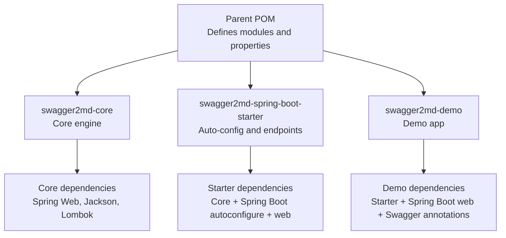
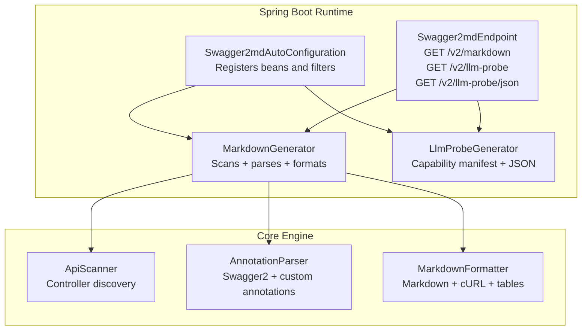
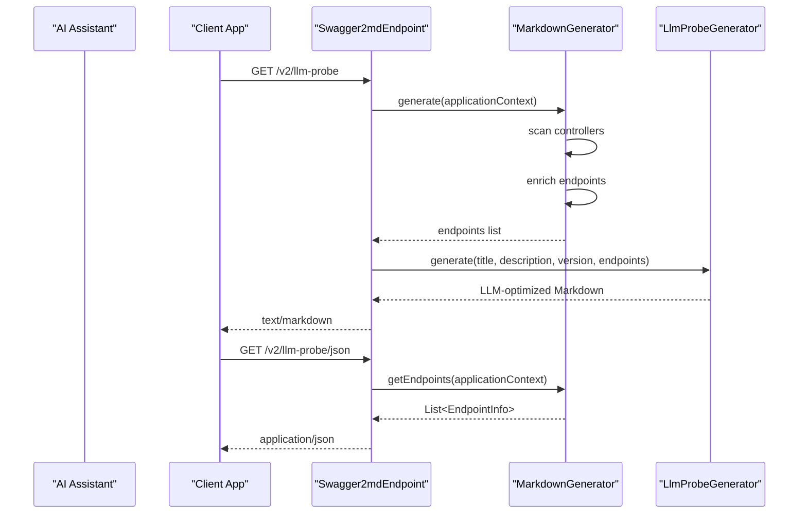
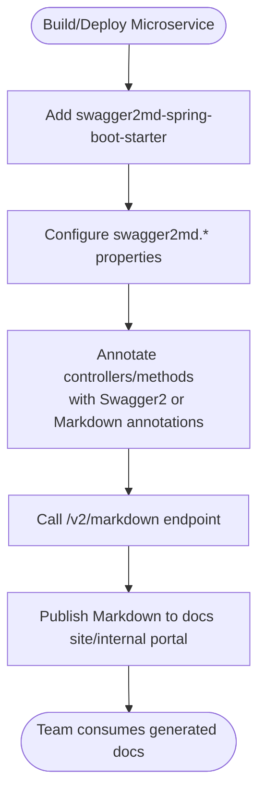
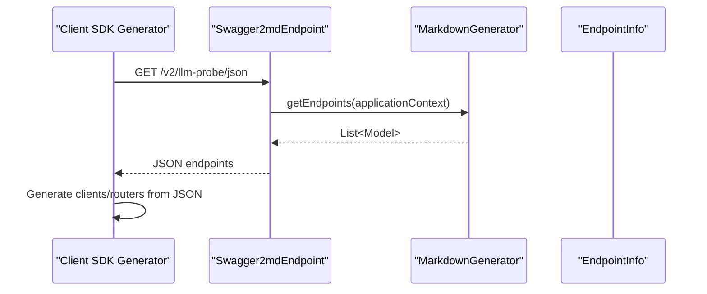
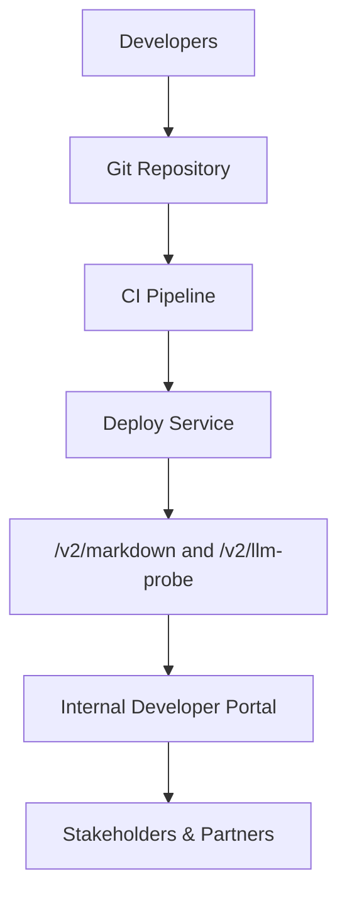
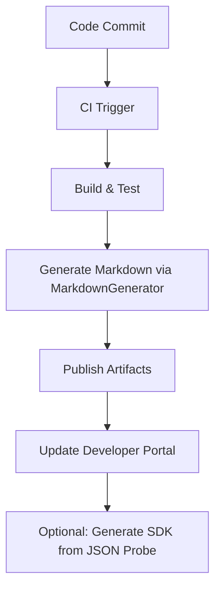
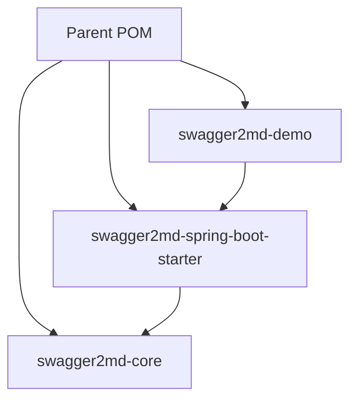
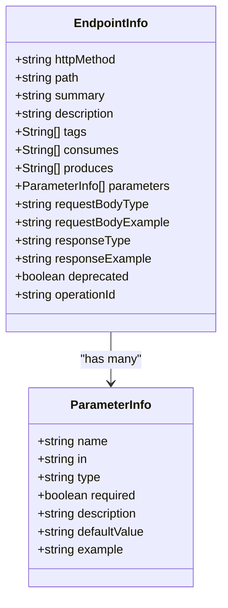

# Use Cases

<cite>
**Referenced Files in This Document**
- [pom.xml](file://pom.xml)
- [swagger2md-core/pom.xml](file://swagger2md-core/pom.xml)
- [swagger2md-spring-boot-starter/pom.xml](file://swagger2md-spring-boot-starter/pom.xml)
- [swagger2md-demo/pom.xml](file://swagger2md-demo/pom.xml)
- [AnnotationParser.java](file://swagger2md-core/src/main/java/com/github/tentac/swagger2md/core/AnnotationParser.java)
- [ApiScanner.java](file://swagger2md-core/src/main/java/com/github/tentac/swagger2md/core/ApiScanner.java)
- [MarkdownFormatter.java](file://swagger2md-core/src/main/java/com/github/tentac/swagger2md/core/MarkdownFormatter.java)
- [MarkdownGenerator.java](file://swagger2md-core/src/main/java/com/github/tentac/swagger2md/core/MarkdownGenerator.java)
- [MarkdownApi.java](file://swagger2md-core/src/main/java/com/github/tentac/swagger2md/annotation/MarkdownApi.java)
- [MarkdownApiOperation.java](file://swagger2md-core/src/main/java/com/github/tentac/swagger2md/annotation/MarkdownApiOperation.java)
- [MarkdownApiParam.java](file://swagger2md-core/src/main/java/com/github/tentac/swagger2md/annotation/MarkdownApiParam.java)
- [EndpointInfo.java](file://swagger2md-core/src/main/java/com/github/tentac/swagger2md/model/EndpointInfo.java)
- [Swagger2mdAutoConfiguration.java](file://swagger2md-spring-boot-starter/src/main/java/com/github/tentac/swagger2md/autoconfigure/Swagger2mdAutoConfiguration.java)
- [Swagger2mdEndpoint.java](file://swagger2md-spring-boot-starter/src/main/java/com/github/tentac/swagger2md/autoconfigure/Swagger2mdEndpoint.java)
- [LlmProbeGenerator.java](file://swagger2md-spring-boot-starter/src/main/java/com/github/tentac/swagger2md/probe/LlmProbeGenerator.java)
- [org.springframework.boot.autoconfigure.AutoConfiguration.imports](file://swagger2md-spring-boot-starter/src/main/resources/META-INF/spring/org.springframework.boot.autoconfigure.AutoConfiguration.imports)
</cite>

## Table of Contents
1. [Introduction](#introduction)
2. [Project Structure](#project-structure)
3. [Core Components](#core-components)
4. [Architecture Overview](#architecture-overview)
5. [Detailed Component Analysis](#detailed-component-analysis)
6. [Dependency Analysis](#dependency-analysis)
7. [Performance Considerations](#performance-considerations)
8. [Troubleshooting Guide](#troubleshooting-guide)
9. [Conclusion](#conclusion)
10. [Appendices](#appendices)

## Introduction
This document presents practical use cases for the tentac project, focusing on how its Markdown-format API documentation generator delivers value across AI/LLM integration projects, microservices documentation, and client onboarding. It explains how the LLM-optimized documentation format benefits AI assistants and automated systems, outlines integration patterns with AI frameworks and chatbot platforms, and provides guidance for incorporating documentation generation into development workflows and CI/CD pipelines. Enterprise scenarios such as API governance, internal developer portals, and external partner documentation are covered, along with performance considerations for large API sets and concurrent access patterns. Finally, it provides practical guidance on choosing between standalone and Spring Boot integration modes.

## Project Structure
The tentac project is organized as a Maven multi-module build with three primary modules:
- Core engine for Markdown generation
- Spring Boot starter for runtime integration and endpoints
- Demo application showcasing integration and usage

**Diagram sources**
- [pom.xml:15-18](file://pom.xml#L15-L18)
- [swagger2md-core/pom.xml:19-48](file://swagger2md-core/pom.xml#L19-L48)
- [swagger2md-spring-boot-starter/pom.xml:19-47](file://swagger2md-spring-boot-starter/pom.xml#L19-L47)
- [swagger2md-demo/pom.xml:19-40](file://swagger2md-demo/pom.xml#L19-L40)

**Section sources**
- [pom.xml:15-18](file://pom.xml#L15-L18)
- [swagger2md-core/pom.xml:19-48](file://swagger2md-core/pom.xml#L19-L48)
- [swagger2md-spring-boot-starter/pom.xml:19-47](file://swagger2md-spring-boot-starter/pom.xml#L19-L47)
- [swagger2md-demo/pom.xml:19-40](file://swagger2md-demo/pom.xml#L19-L40)

## Core Components
The core engine orchestrates discovery, enrichment, and formatting of API documentation:
- Discovery: Scans Spring controllers and extracts endpoint metadata
- Enrichment: Applies Swagger2 and custom annotations to augment endpoint details
- Formatting: Produces Markdown documentation and LLM-optimized probe outputs

Key capabilities:
- Supports Spring mapping annotations and optional Swagger2 annotations
- Generates request/response JSON examples via reflection-based type analysis
- Provides LLM-optimized capability manifest and JSON probe for automation

**Section sources**
- [ApiScanner.java:24-27](file://swagger2md-core/src/main/java/com/github/tentac/swagger2md/core/ApiScanner.java#L24-L27)
- [AnnotationParser.java:26-35](file://swagger2md-core/src/main/java/com/github/tentac/swagger2md/core/AnnotationParser.java#L26-L35)
- [MarkdownFormatter.java:24-71](file://swagger2md-core/src/main/java/com/github/tentac/swagger2md/core/MarkdownFormatter.java#L24-L71)
- [MarkdownGenerator.java:54-99](file://swagger2md-core/src/main/java/com/github/tentac/swagger2md/core/MarkdownGenerator.java#L54-L99)

## Architecture Overview
The system integrates with Spring Boot through auto-configuration, exposing endpoints for Markdown documentation and LLM probes. The starter module registers filters for IP access control and exposes configurable paths for documentation delivery.

**Diagram sources**
- [Swagger2mdAutoConfiguration.java:25-46](file://swagger2md-spring-boot-starter/src/main/java/com/github/tentac/swagger2md/autoconfigure/Swagger2mdAutoConfiguration.java#L25-L46)
- [Swagger2mdEndpoint.java:43-70](file://swagger2md-spring-boot-starter/src/main/java/com/github/tentac/swagger2md/autoconfigure/Swagger2mdEndpoint.java#L43-L70)
- [MarkdownGenerator.java:54-99](file://swagger2md-core/src/main/java/com/github/tentac/swagger2md/core/MarkdownGenerator.java#L54-L99)
- [ApiScanner.java:38-56](file://swagger2md-core/src/main/java/com/github/tentac/swagger2md/core/ApiScanner.java#L38-L56)
- [AnnotationParser.java:26-35](file://swagger2md-core/src/main/java/com/github/tentac/swagger2md/core/AnnotationParser.java#L26-L35)
- [MarkdownFormatter.java:24-71](file://swagger2md-core/src/main/java/com/github/tentac/swagger2md/core/MarkdownFormatter.java#L24-L71)

## Detailed Component Analysis

### Use Case 1: AI/LLM Integration Projects
The LLM-optimized documentation format is designed to be machine-readable and semantically structured, enabling AI assistants and automated systems to:
- Parse capability summaries and details
- Understand parameters, request/response shapes, and examples
- Generate accurate API calls programmatically

Key assets:
- Capability manifest with compact summaries and grouped details
- JSON probe for programmatic consumption
- Structured Markdown with clear sections and examples

**Diagram sources**
- [Swagger2mdEndpoint.java:52-70](file://swagger2md-spring-boot-starter/src/main/java/com/github/tentac/swagger2md/autoconfigure/Swagger2mdEndpoint.java#L52-L70)
- [MarkdownGenerator.java:111-144](file://swagger2md-core/src/main/java/com/github/tentac/swagger2md/core/MarkdownGenerator.java#L111-L144)
- [LlmProbeGenerator.java:26-146](file://swagger2md-spring-boot-starter/src/main/java/com/github/tentac/swagger2md/probe/LlmProbeGenerator.java#L26-L146)

Practical benefits:
- AI agents can reliably extract operation IDs, parameters, and examples
- JSON probe enables downstream automation and tooling
- Structured sections reduce ambiguity for parsing

**Section sources**
- [LlmProbeGenerator.java:26-146](file://swagger2md-spring-boot-starter/src/main/java/com/github/tentac/swagger2md/probe/LlmProbeGenerator.java#L26-L146)
- [Swagger2mdEndpoint.java:52-70](file://swagger2md-spring-boot-starter/src/main/java/com/github/tentac/swagger2md/autoconfigure/Swagger2mdEndpoint.java#L52-L70)

### Use Case 2: Microservices Documentation Generation
For development teams building microservices, tentac can:
- Automatically generate Markdown documentation from Spring controllers
- Support both Swagger2 annotations and custom Markdown annotations
- Provide consistent documentation across services with minimal setup

Integration pattern:
- Add the Spring Boot starter dependency
- Configure properties for title, version, base package, and paths
- Expose documentation endpoints and optionally restrict access via IP filtering

**Diagram sources**
- [swagger2md-spring-boot-starter/pom.xml:22-23](file://swagger2md-spring-boot-starter/pom.xml#L22-L23)
- [Swagger2mdAutoConfiguration.java:25-33](file://swagger2md-spring-boot-starter/src/main/java/com/github/tentac/swagger2md/autoconfigure/Swagger2mdAutoConfiguration.java#L25-L33)
- [Swagger2mdEndpoint.java:43-47](file://swagger2md-spring-boot-starter/src/main/java/com/github/tentac/swagger2md/autoconfigure/Swagger2mdEndpoint.java#L43-L47)

**Section sources**
- [swagger2md-spring-boot-starter/pom.xml:22-23](file://swagger2md-spring-boot-starter/pom.xml#L22-L23)
- [Swagger2mdAutoConfiguration.java:25-33](file://swagger2md-spring-boot-starter/src/main/java/com/github/tentac/swagger2md/autoconfigure/Swagger2mdAutoConfiguration.java#L25-L33)
- [Swagger2mdEndpoint.java:43-47](file://swagger2md-spring-boot-starter/src/main/java/com/github/tentac/swagger2md/autoconfigure/Swagger2mdEndpoint.java#L43-L47)

### Use Case 3: API Onboarding for Client Applications
Client applications can integrate with the LLM probe to:
- Programmatically ingest endpoint metadata
- Generate SDK stubs or request builders
- Validate API usage against documented examples

**Diagram sources**
- [Swagger2mdEndpoint.java:66-70](file://swagger2md-spring-boot-starter/src/main/java/com/github/tentac/swagger2md/autoconfigure/Swagger2mdEndpoint.java#L66-L70)
- [MarkdownGenerator.java:111-144](file://swagger2md-core/src/main/java/com/github/tentac/swagger2md/core/MarkdownGenerator.java#L111-L144)

**Section sources**
- [Swagger2mdEndpoint.java:66-70](file://swagger2md-spring-boot-starter/src/main/java/com/github/tentac/swagger2md/autoconfigure/Swagger2mdEndpoint.java#L66-L70)
- [MarkdownGenerator.java:111-144](file://swagger2md-core/src/main/java/com/github/tentac/swagger2md/core/MarkdownGenerator.java#L111-L144)

### Use Case 4: Enterprise API Governance and Developer Portals
Organizations can leverage tentac for:
- Centralized API documentation across teams
- Controlled access via IP filtering
- Automated updates integrated into CI/CD pipelines

**Diagram sources**
- [Swagger2mdAutoConfiguration.java:52-80](file://swagger2md-spring-boot-starter/src/main/java/com/github/tentac/swagger2md/autoconfigure/Swagger2mdAutoConfiguration.java#L52-L80)
- [Swagger2mdEndpoint.java:43-70](file://swagger2md-spring-boot-starter/src/main/java/com/github/tentac/swagger2md/autoconfigure/Swagger2mdEndpoint.java#L43-L70)

**Section sources**
- [Swagger2mdAutoConfiguration.java:52-80](file://swagger2md-spring-boot-starter/src/main/java/com/github/tentac/swagger2md/autoconfigure/Swagger2mdAutoConfiguration.java#L52-L80)
- [Swagger2mdEndpoint.java:43-70](file://swagger2md-spring-boot-starter/src/main/java/com/github/tentac/swagger2md/autoconfigure/Swagger2mdEndpoint.java#L43-L70)

### Integration Patterns with AI Frameworks and Chatbot Platforms
- Use the JSON probe (/v2/llm-probe/json) to feed endpoint metadata into AI agents
- Consume the Markdown probe (/v2/llm-probe) for contextual guidance and capability summaries
- Combine with IP filtering to secure probe endpoints in production environments

**Section sources**
- [Swagger2mdEndpoint.java:52-70](file://swagger2md-spring-boot-starter/src/main/java/com/github/tentac/swagger2md/autoconfigure/Swagger2mdEndpoint.java#L52-L70)
- [LlmProbeGenerator.java:26-146](file://swagger2md-spring-boot-starter/src/main/java/com/github/tentac/swagger2md/probe/LlmProbeGenerator.java#L26-L146)

### Development Workflow Integration and CI/CD
Recommended CI/CD integration steps:
- Run documentation generation during build/test stages
- Publish Markdown artifacts to documentation sites or internal portals
- Optionally trigger SDK regeneration from the JSON probe output
- Secure endpoints with IP filtering in production-like environments

**Diagram sources**
- [MarkdownGenerator.java:54-99](file://swagger2md-core/src/main/java/com/github/tentac/swagger2md/core/MarkdownGenerator.java#L54-L99)
- [Swagger2mdEndpoint.java:43-47](file://swagger2md-spring-boot-starter/src/main/java/com/github/tentac/swagger2md/autoconfigure/Swagger2mdEndpoint.java#L43-L47)

**Section sources**
- [MarkdownGenerator.java:54-99](file://swagger2md-core/src/main/java/com/github/tentac/swagger2md/core/MarkdownGenerator.java#L54-L99)
- [Swagger2mdEndpoint.java:43-47](file://swagger2md-spring-boot-starter/src/main/java/com/github/tentac/swagger2md/autoconfigure/Swagger2mdEndpoint.java#L43-L47)

### Choosing Between Standalone and Spring Boot Integration Modes
Guidance:
- Use standalone mode when integrating into non-Spring environments or when you need fine-grained control over scanning and formatting without Spring Boot’s web stack.
- Use Spring Boot integration mode when you want auto-configuration, built-in endpoints, and IP filtering out of the box.

Decision criteria:
- If you require /v2/markdown and /v2/llm-probe endpoints plus IP filtering, choose the Spring Boot starter.
- If you prefer to embed generation logic directly in your application lifecycle or avoid Spring MVC, use the core engine in standalone mode.

**Section sources**
- [swagger2md-core/pom.xml:21-28](file://swagger2md-core/pom.xml#L21-L28)
- [swagger2md-spring-boot-starter/pom.xml:25-35](file://swagger2md-spring-boot-starter/pom.xml#L25-L35)
- [org.springframework.boot.autoconfigure.AutoConfiguration.imports:1](file://swagger2md-spring-boot-starter/src/main/resources/META-INF/spring/org.springframework.boot.autoconfigure.AutoConfiguration.imports#L1)

## Dependency Analysis
The modules and their relationships are defined in the parent POM and individual module POMs. The starter depends on the core, while the demo depends on the starter and Spring Boot web.

**Diagram sources**
- [pom.xml:15-18](file://pom.xml#L15-L18)
- [swagger2md-spring-boot-starter/pom.xml:22](file://swagger2md-spring-boot-starter/pom.xml#L22)
- [swagger2md-demo/pom.xml:22](file://swagger2md-demo/pom.xml#L22)

**Section sources**
- [pom.xml:15-18](file://pom.xml#L15-L18)
- [swagger2md-spring-boot-starter/pom.xml:22](file://swagger2md-spring-boot-starter/pom.xml#L22)
- [swagger2md-demo/pom.xml:22](file://swagger2md-demo/pom.xml#L22)

## Performance Considerations
- Large API sets: The generator scans all controllers and builds endpoint metadata. For very large applications, consider scoping by base package to limit discovery.
- Reflection overhead: Enrichment relies on reflection to inspect method signatures and generic return types. Keep annotations concise and avoid excessive nesting.
- Concurrent access: Expose endpoints behind load balancers and consider rate limiting or caching for repeated reads.
- JSON examples: Generating JSON examples involves type introspection; ensure payload classes are well-defined to minimize generation cost.

**Section sources**
- [MarkdownGenerator.java:67-70](file://swagger2md-core/src/main/java/com/github/tentac/swagger2md/core/MarkdownGenerator.java#L67-L70)
- [ApiScanner.java:360-367](file://swagger2md-core/src/main/java/com/github/tentac/swagger2md/core/ApiScanner.java#L360-L367)
- [ApiScanner.java:372-398](file://swagger2md-core/src/main/java/com/github/tentac/swagger2md/core/ApiScanner.java#L372-L398)

## Troubleshooting Guide
Common issues and resolutions:
- Endpoints not appearing: Verify controller annotations and ensure the base package filter matches your controllers.
- Missing Swagger2 annotations: The generator supports both Swagger2 and custom Markdown annotations; confirm annotation presence or switch to custom annotations.
- Incorrect paths or parameters: Confirm mapping annotations and parameter annotations on controller methods.
- Access control: If endpoints are unreachable, check IP filtering configuration and URL patterns.

Operational checks:
- Confirm auto-configuration is enabled and properties are set correctly.
- Validate endpoint paths and media types returned by the endpoints.

**Section sources**
- [MarkdownGenerator.java:67-70](file://swagger2md-core/src/main/java/com/github/tentac/swagger2md/core/MarkdownGenerator.java#L67-L70)
- [Swagger2mdAutoConfiguration.java:22-33](file://swagger2md-spring-boot-starter/src/main/java/com/github/tentac/swagger2md/autoconfigure/Swagger2mdAutoConfiguration.java#L22-L33)
- [Swagger2mdEndpoint.java:43-70](file://swagger2md-spring-boot-starter/src/main/java/com/github/tentac/swagger2md/autoconfigure/Swagger2mdEndpoint.java#L43-L70)

## Conclusion
tentac provides a pragmatic solution for generating Markdown API documentation optimized for both human consumption and AI/LLM systems. Its dual-mode architecture supports flexible deployment scenarios, while its LLM probe and JSON output streamline integration with automation pipelines and AI frameworks. By leveraging the starter module for Spring Boot environments or the core engine in standalone contexts, teams can maintain up-to-date, structured documentation that serves internal developers, external partners, and automated systems alike.

## Appendices

### Appendix A: Annotation Reference
- Controller-level: MarkdownApi for tags, description, and visibility
- Method-level: MarkdownApiOperation for summary, notes, tags, and HTTP method override
- Parameter-level: MarkdownApiParam for name, description, required flag, defaults, examples, and location

**Section sources**
- [MarkdownApi.java:16-24](file://swagger2md-core/src/main/java/com/github/tentac/swagger2md/annotation/MarkdownApi.java#L16-L24)
- [MarkdownApiOperation.java:16-27](file://swagger2md-core/src/main/java/com/github/tentac/swagger2md/annotation/MarkdownApiOperation.java#L16-L27)
- [MarkdownApiParam.java:16-33](file://swagger2md-core/src/main/java/com/github/tentac/swagger2md/annotation/MarkdownApiParam.java#L16-L33)

### Appendix B: Data Model Overview
EndpointInfo captures endpoint metadata, including HTTP method, path, tags, consumes/produces, parameters, request/response types and examples, deprecation status, and operation ID.

**Diagram sources**
- [EndpointInfo.java:11-52](file://swagger2md-core/src/main/java/com/github/tentac/swagger2md/model/EndpointInfo.java#L11-L52)