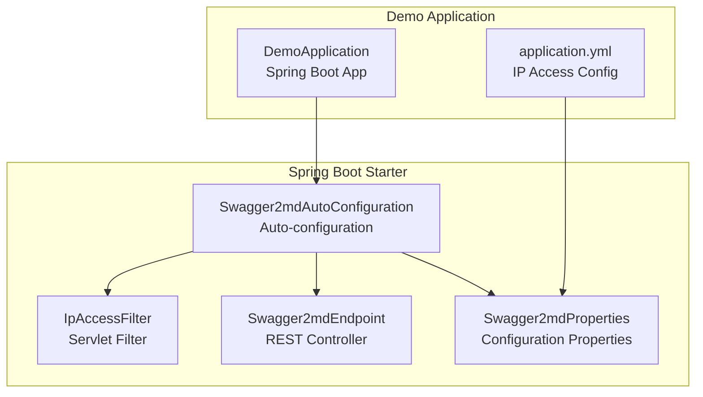
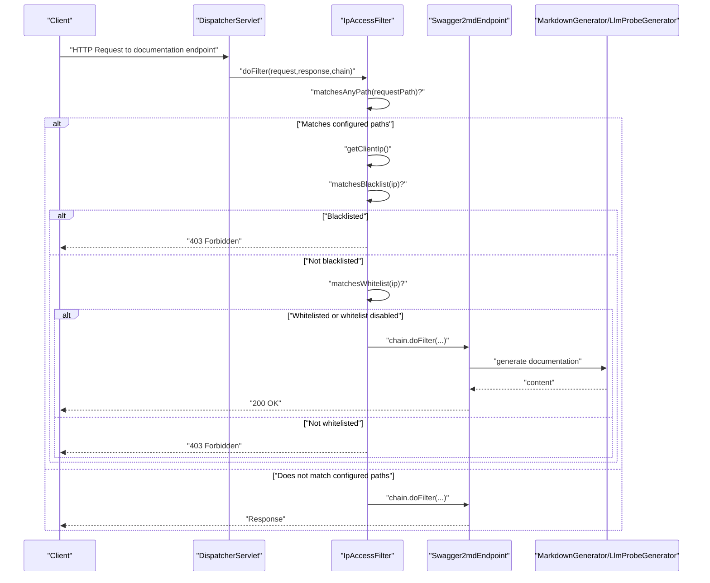
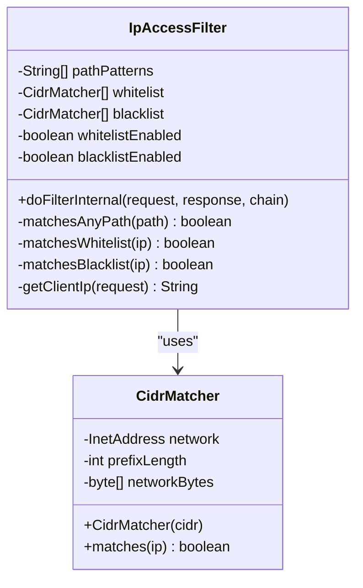
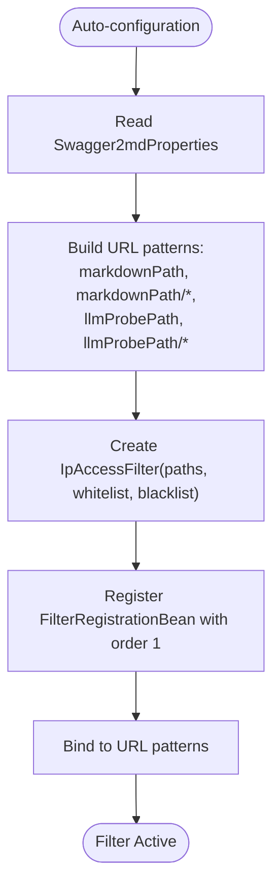
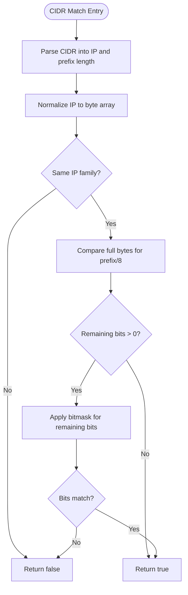
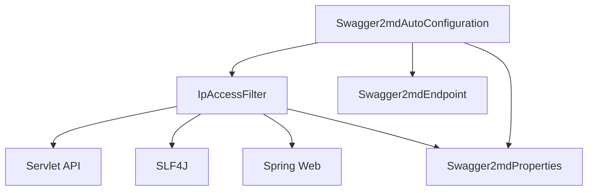

# Security Features

<cite>
**Referenced Files in This Document**
- [IpAccessFilter.java](file://swagger2md-spring-boot-starter/src/main/java/com/github/tentac/swagger2md/filter/IpAccessFilter.java)
- [Swagger2mdAutoConfiguration.java](file://swagger2md-spring-boot-starter/src/main/java/com/github/tentac/swagger2md/autoconfigure/Swagger2mdAutoConfiguration.java)
- [Swagger2mdEndpoint.java](file://swagger2md-spring-boot-starter/src/main/java/com/github/tentac/swagger2md/autoconfigure/Swagger2mdEndpoint.java)
- [Swagger2mdProperties.java](file://swagger2md-spring-boot-starter/src/main/java/com/github/tentac/swagger2md/autoconfigure/Swagger2mdProperties.java)
- [application.yml](file://swagger2md-demo/src/main/resources/application.yml)
- [DemoApplication.java](file://swagger2md-demo/src/main/java/com/github/tentac/swagger2md/demo/DemoApplication.java)
- [org.springframework.boot.autoconfigure.AutoConfiguration.imports](file://swagger2md-spring-boot-starter/src/main/resources/META-INF/spring/org.springframework.boot.autoconfigure.AutoConfiguration.imports)
</cite>

## Table of Contents
1. [Introduction](#introduction)
2. [Project Structure](#project-structure)
3. [Core Components](#core-components)
4. [Architecture Overview](#architecture-overview)
5. [Detailed Component Analysis](#detailed-component-analysis)
6. [Dependency Analysis](#dependency-analysis)
7. [Performance Considerations](#performance-considerations)
8. [Troubleshooting Guide](#troubleshooting-guide)
9. [Conclusion](#conclusion)
10. [Appendices](#appendices)

## Introduction
This document focuses on the security features for IP access control and protection mechanisms implemented in the project. It explains how the IpAccessFilter enforces access policies for documentation endpoints, including whitelist and blacklist filtering, CIDR notation support, and request filtering logic. It also documents configuration options, integration with Spring Security, and practical guidance for production deployments.

## Project Structure
The security-related components reside in the Spring Boot starter module and are integrated into the demo application. The key elements are:
- IpAccessFilter: Servlet filter that applies IP-based access control to documentation endpoints.
- Swagger2mdAutoConfiguration: Auto-configuration that registers the filter and endpoints.
- Swagger2mdEndpoint: REST endpoints exposed for Markdown and LLM probe outputs.
- Swagger2mdProperties: Configuration properties including IP whitelist and blacklist lists.
- Demo application configuration: Example of enabling and configuring IP access control.

**Diagram sources**
- [IpAccessFilter.java:1-196](file://swagger2md-spring-boot-starter/src/main/java/com/github/tentac/swagger2md/filter/IpAccessFilter.java#L1-L196)
- [Swagger2mdAutoConfiguration.java:1-82](file://swagger2md-spring-boot-starter/src/main/java/com/github/tentac/swagger2md/autoconfigure/Swagger2mdAutoConfiguration.java#L1-L82)
- [Swagger2mdEndpoint.java:1-72](file://swagger2md-spring-boot-starter/src/main/java/com/github/tentac/swagger2md/autoconfigure/Swagger2mdEndpoint.java#L1-L72)
- [Swagger2mdProperties.java:1-127](file://swagger2md-spring-boot-starter/src/main/java/com/github/tentac/swagger2md/autoconfigure/Swagger2mdProperties.java#L1-L127)
- [application.yml:1-29](file://swagger2md-demo/src/main/resources/application.yml#L1-L29)
- [DemoApplication.java:1-20](file://swagger2md-demo/src/main/java/com/github/tentac/swagger2md/demo/DemoApplication.java#L1-L20)

**Section sources**
- [org.springframework.boot.autoconfigure.AutoConfiguration.imports:1-2](file://swagger2md-spring-boot-starter/src/main/resources/META-INF/spring/org.springframework.boot.autoconfigure.AutoConfiguration.imports#L1-L2)
- [Swagger2mdAutoConfiguration.java:20-82](file://swagger2md-spring-boot-starter/src/main/java/com/github/tentac/swagger2md/autoconfigure/Swagger2mdAutoConfiguration.java#L20-L82)

## Core Components
- IpAccessFilter: Implements a servlet filter that checks incoming requests against configured path patterns and applies IP-based allow/deny decisions using CIDR notation. It supports both whitelist and blacklist modes, with blacklist taking precedence.
- Swagger2mdAutoConfiguration: Registers the IpAccessFilter bean and binds it to documentation endpoint URL patterns derived from Swagger2mdProperties.
- Swagger2mdEndpoint: Exposes the documentation endpoints whose access is controlled by the filter.
- Swagger2mdProperties: Provides configuration keys for enabling/disabling the module, endpoint paths, and IP access control lists.

Key capabilities:
- Path-based filtering: Only applies to configured documentation endpoints.
- CIDR-based IP matching: Supports both IPv4 and IPv6 with flexible CIDR notation.
- Precedence: Blacklist denies before whitelist allows.
- Robust IP extraction: Considers forwarded headers and remote address.

**Section sources**
- [IpAccessFilter.java:19-196](file://swagger2md-spring-boot-starter/src/main/java/com/github/tentac/swagger2md/filter/IpAccessFilter.java#L19-L196)
- [Swagger2mdAutoConfiguration.java:48-80](file://swagger2md-spring-boot-starter/src/main/java/com/github/tentac/swagger2md/autoconfigure/Swagger2mdAutoConfiguration.java#L48-L80)
- [Swagger2mdEndpoint.java:20-72](file://swagger2md-spring-boot-starter/src/main/java/com/github/tentac/swagger2md/autoconfigure/Swagger2mdEndpoint.java#L20-L72)
- [Swagger2mdProperties.java:8-127](file://swagger2md-spring-boot-starter/src/main/java/com/github/tentac/swagger2md/autoconfigure/Swagger2mdProperties.java#L8-L127)

## Architecture Overview
The security architecture integrates the IpAccessFilter into the request lifecycle for documentation endpoints. The filter evaluates the request path and client IP against configured policies and either permits or blocks access.

**Diagram sources**
- [IpAccessFilter.java:61-95](file://swagger2md-spring-boot-starter/src/main/java/com/github/tentac/swagger2md/filter/IpAccessFilter.java#L61-L95)
- [Swagger2mdAutoConfiguration.java:52-79](file://swagger2md-spring-boot-starter/src/main/java/com/github/tentac/swagger2md/autoconfigure/Swagger2mdAutoConfiguration.java#L52-L79)
- [Swagger2mdEndpoint.java:40-70](file://swagger2md-spring-boot-starter/src/main/java/com/github/tentac/swagger2md/autoconfigure/Swagger2mdEndpoint.java#L40-L70)

## Detailed Component Analysis

### IpAccessFilter Implementation
The IpAccessFilter is a OncePerRequestFilter that:
- Stores path patterns to apply filtering to.
- Maintains separate whitelist and blacklist collections of CIDR matchers.
- Extracts the client IP from forwarded headers or remote address.
- Enforces blacklist-first, then whitelist rules.

**Diagram sources**
- [IpAccessFilter.java:23-196](file://swagger2md-spring-boot-starter/src/main/java/com/github/tentac/swagger2md/filter/IpAccessFilter.java#L23-L196)

Key behaviors:
- Path filtering: Uses exact match or prefix match against configured patterns.
- IP extraction: Prefers X-Forwarded-For (first IP), then X-Real-IP, finally remote address.
- CIDR matching: Supports IPv4 and IPv6, with bit-wise comparison for prefix lengths.
- Policy precedence: Blacklist takes priority over whitelist.

**Section sources**
- [IpAccessFilter.java:61-143](file://swagger2md-spring-boot-starter/src/main/java/com/github/tentac/swagger2md/filter/IpAccessFilter.java#L61-L143)
- [IpAccessFilter.java:148-194](file://swagger2md-spring-boot-starter/src/main/java/com/github/tentac/swagger2md/filter/IpAccessFilter.java#L148-L194)

### Auto-Configuration and Endpoint Exposure
The auto-configuration:
- Registers the IpAccessFilter bean and binds it to documentation endpoint URL patterns.
- Derives patterns from Swagger2mdProperties (markdown path, LLM probe path, and JSON variant).
- Applies the filter with order 1 to ensure early evaluation.

**Diagram sources**
- [Swagger2mdAutoConfiguration.java:52-79](file://swagger2md-spring-boot-starter/src/main/java/com/github/tentac/swagger2md/autoconfigure/Swagger2mdAutoConfiguration.java#L52-L79)
- [Swagger2mdProperties.java:30-43](file://swagger2md-spring-boot-starter/src/main/java/com/github/tentac/swagger2md/autoconfigure/Swagger2mdProperties.java#L30-L43)

**Section sources**
- [Swagger2mdAutoConfiguration.java:48-80](file://swagger2md-spring-boot-starter/src/main/java/com/github/tentac/swagger2md/autoconfigure/Swagger2mdAutoConfiguration.java#L48-L80)
- [Swagger2mdEndpoint.java:40-70](file://swagger2md-spring-boot-starter/src/main/java/com/github/tentac/swagger2md/autoconfigure/Swagger2mdEndpoint.java#L40-L70)

### Configuration Options and Spring Security Integration
Configuration properties:
- swagger2md.enabled: Controls whether the module is active.
- swagger2md.markdown-path: Path for Markdown documentation endpoint.
- swagger2md.llm-probe-path: Path for LLM probe endpoints.
- swagger2md.ip-whitelist: List of CIDR entries for allowed IPs.
- swagger2md.ip-blacklist: List of CIDR entries for blocked IPs.

Integration with Spring Security:
- The IpAccessFilter is a servlet filter and does not depend on Spring Security.
- It can coexist with Spring Security filters; however, ensure the filter order places the IP filter before Spring Security’s authorization filters if you want IP-based decisions to take effect earlier.
- If using Spring Security, configure path matchers to exclude documentation endpoints from general security rules or apply dedicated security rules for those paths.

Example configuration (from demo):
- Enables the module and sets endpoint paths.
- Defines an IP whitelist including loopback, IPv6 localhost, and private network ranges.
- Leaves the blacklist empty.

**Section sources**
- [Swagger2mdProperties.java:39-43](file://swagger2md-spring-boot-starter/src/main/java/com/github/tentac/swagger2md/autoconfigure/Swagger2mdProperties.java#L39-L43)
- [application.yml:8-24](file://swagger2md-demo/src/main/resources/application.yml#L8-L24)

### CIDR Notation Support and Matching Logic
CIDR matching supports:
- IPv4 and IPv6 addresses.
- Full-prefix (e.g., /32 for IPv4, /128 for IPv6) and subnet prefixes.
- Graceful handling of invalid CIDR entries (logged warnings during filter initialization).

Matching algorithm:
- Converts both the configured CIDR network and the incoming IP to byte arrays.
- Compares full bytes for the prefix length in whole octets.
- Compares remaining bits using a bitmask.
- Returns false if IP family differs (IPv4 vs IPv6).

**Diagram sources**
- [IpAccessFilter.java:148-194](file://swagger2md-spring-boot-starter/src/main/java/com/github/tentac/swagger2md/filter/IpAccessFilter.java#L148-L194)

**Section sources**
- [IpAccessFilter.java:148-194](file://swagger2md-spring-boot-starter/src/main/java/com/github/tentac/swagger2md/filter/IpAccessFilter.java#L148-L194)

### Authentication Bypass Considerations
- The IpAccessFilter operates at the servlet filter level and does not require authentication to be effective.
- If authentication is enforced elsewhere (e.g., Spring Security), ensure that documentation endpoints are either excluded from authentication requirements or that authenticated users still satisfy IP policies.
- Consider placing the IP filter before authentication filters if you want to deny unauthorized IPs before expensive authentication steps.

**Section sources**
- [Swagger2mdAutoConfiguration.java:52-79](file://swagger2md-spring-boot-starter/src/main/java/com/github/tentac/swagger2md/autoconfigure/Swagger2mdAutoConfiguration.java#L52-L79)

## Dependency Analysis
The security filter depends on:
- Servlet API for request/response handling.
- SLF4J for logging.
- Spring Web for servlet filter infrastructure.
- Swagger2mdProperties for configuration.

**Diagram sources**
- [IpAccessFilter.java:3-11](file://swagger2md-spring-boot-starter/src/main/java/com/github/tentac/swagger2md/filter/IpAccessFilter.java#L3-L11)
- [Swagger2mdAutoConfiguration.java:3-11](file://swagger2md-spring-boot-starter/src/main/java/com/github/tentac/swagger2md/autoconfigure/Swagger2mdAutoConfiguration.java#L3-L11)
- [Swagger2mdProperties.java:12](file://swagger2md-spring-boot-starter/src/main/java/com/github/tentac/swagger2md/autoconfigure/Swagger2mdProperties.java#L12)

**Section sources**
- [IpAccessFilter.java:1-196](file://swagger2md-spring-boot-starter/src/main/java/com/github/tentac/swagger2md/filter/IpAccessFilter.java#L1-L196)
- [Swagger2mdAutoConfiguration.java:1-82](file://swagger2md-spring-boot-starter/src/main/java/com/github/tentac/swagger2md/autoconfigure/Swagger2mdAutoConfiguration.java#L1-L82)

## Performance Considerations
- CIDR matching is O(1) per entry with minimal overhead; performance scales linearly with the number of configured entries.
- Path matching is O(n) over configured patterns; keep the list concise.
- IP extraction reads a few headers and falls back to remote address; negligible overhead.
- Place the filter early (order 1) to short-circuit requests quickly.

[No sources needed since this section provides general guidance]

## Troubleshooting Guide
Common issues and resolutions:
- Access denied with no apparent reason:
  - Verify the request path matches the configured patterns.
  - Confirm the client IP is extracted correctly (check proxies and headers).
- Blacklist takes effect unexpectedly:
  - Ensure blacklist entries are correct and not inadvertently broad.
- Whitelist appears ineffective:
  - Confirm whitelist mode is enabled and entries are valid CIDRs.
  - Check that the filter order precedes any authorization filters.
- IPv4/IPv6 mismatch:
  - Ensure the client IP family matches the configured CIDR family.
- Invalid CIDR entries:
  - Review logs for warnings about invalid entries; remove or fix them.

Operational tips:
- Use the demo application configuration as a baseline and adjust incrementally.
- Test with known-good IPs (e.g., loopback) before expanding the whitelist.
- Monitor logs for access denials to refine policies.

**Section sources**
- [IpAccessFilter.java:76-92](file://swagger2md-spring-boot-starter/src/main/java/com/github/tentac/swagger2md/filter/IpAccessFilter.java#L76-L92)
- [application.yml:17-24](file://swagger2md-demo/src/main/resources/application.yml#L17-L24)

## Conclusion
The IpAccessFilter provides robust, efficient IP-based access control for documentation endpoints using CIDR notation. By combining blacklist-first and whitelist-second policies, it offers strong protection while allowing precise control. Proper configuration and awareness of filter ordering enable secure operation alongside Spring Security and in production environments.

[No sources needed since this section summarizes without analyzing specific files]

## Appendices

### Configuration Reference
- swagger2md.enabled: Enable/disable the module.
- swagger2md.markdown-path: Path for Markdown documentation.
- swagger2md.llm-probe-path: Path for LLM probe endpoints.
- swagger2md.ip-whitelist: List of CIDR entries for allowed IPs.
- swagger2md.ip-blacklist: List of CIDR entries for blocked IPs.

**Section sources**
- [Swagger2mdProperties.java:39-43](file://swagger2md-spring-boot-starter/src/main/java/com/github/tentac/swagger2md/autoconfigure/Swagger2mdProperties.java#L39-L43)
- [application.yml:8-24](file://swagger2md-demo/src/main/resources/application.yml#L8-L24)

### Example: Demo Application Configuration
- The demo demonstrates enabling the module, setting endpoint paths, and configuring an IP whitelist including loopback, IPv6 localhost, and private network ranges.

**Section sources**
- [application.yml:8-24](file://swagger2md-demo/src/main/resources/application.yml#L8-L24)
- [DemoApplication.java:6-12](file://swagger2md-demo/src/main/java/com/github/tentac/swagger2md/demo/DemoApplication.java#L6-L12)