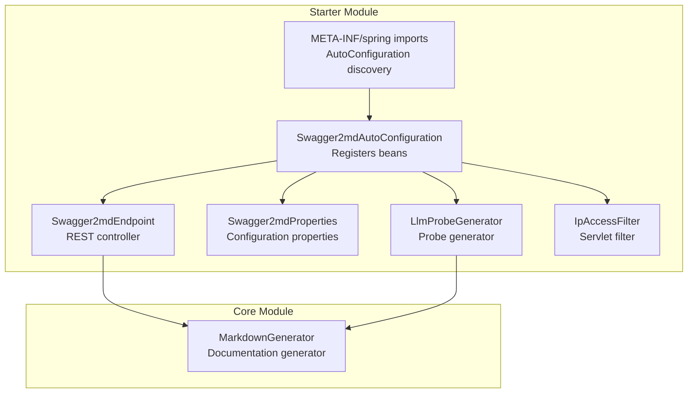
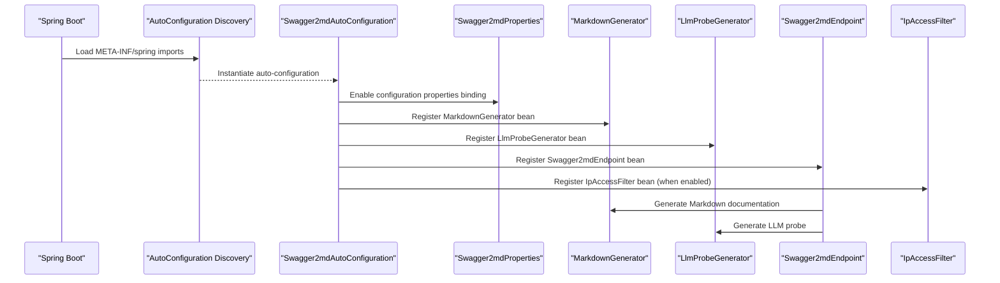
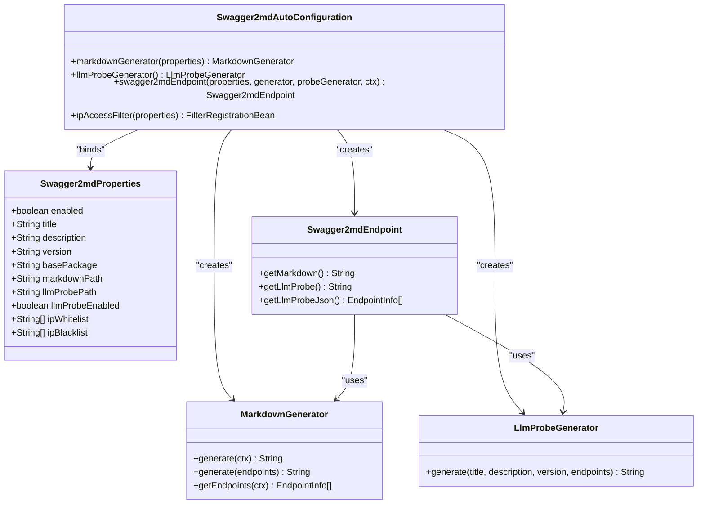
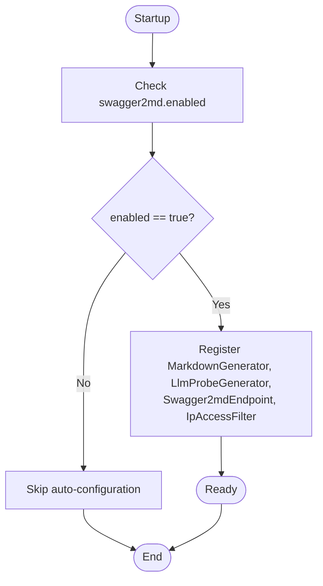
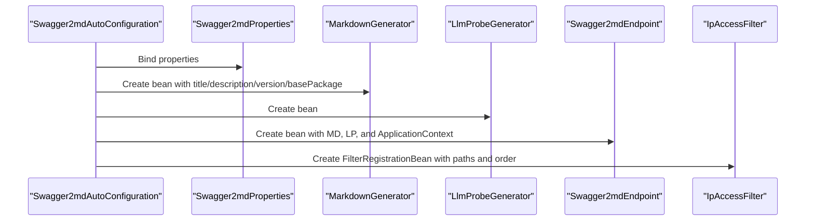
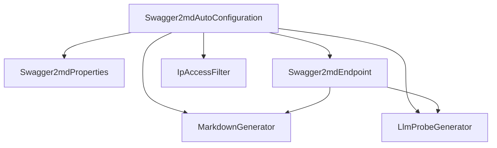

# Auto-Configuration Setup

<cite>
**Referenced Files in This Document**
- [Swagger2mdAutoConfiguration.java](file://swagger2md-spring-boot-starter/src/main/java/com/github/tentac/swagger2md/autoconfigure/Swagger2mdAutoConfiguration.java)
- [Swagger2mdEndpoint.java](file://swagger2md-spring-boot-starter/src/main/java/com/github/tentac/swagger2md/autoconfigure/Swagger2mdEndpoint.java)
- [Swagger2mdProperties.java](file://swagger2md-spring-boot-starter/src/main/java/com/github/tentac/swagger2md/autoconfigure/Swagger2mdProperties.java)
- [LlmProbeGenerator.java](file://swagger2md-spring-boot-starter/src/main/java/com/github/tentac/swagger2md/probe/LlmProbeGenerator.java)
- [MarkdownGenerator.java](file://swagger2md-core/src/main/java/com/github/tentac/swagger2md/core/MarkdownGenerator.java)
- [IpAccessFilter.java](file://swagger2md-spring-boot-starter/src/main/java/com/github/tentac/swagger2md/filter/IpAccessFilter.java)
- [org.springframework.boot.autoconfigure.AutoConfiguration.imports](file://swagger2md-spring-boot-starter/src/main/resources/META-INF/spring/org.springframework.boot.autoconfigure.AutoConfiguration.imports)
- [application.yml](file://swagger2md-demo/src/main/resources/application.yml)
- [DemoApplication.java](file://swagger2md-demo/src/main/java/com/github/tentac/swagger2md/demo/DemoApplication.java)
</cite>

## Table of Contents
1. [Introduction](#introduction)
2. [Project Structure](#project-structure)
3. [Core Components](#core-components)
4. [Architecture Overview](#architecture-overview)
5. [Detailed Component Analysis](#detailed-component-analysis)
6. [Dependency Analysis](#dependency-analysis)
7. [Performance Considerations](#performance-considerations)
8. [Troubleshooting Guide](#troubleshooting-guide)
9. [Conclusion](#conclusion)
10. [Appendices](#appendices)

## Introduction
This document explains how the Swagger2md Spring Boot starter integrates with Spring Boot’s auto-configuration mechanism. It focuses on the auto-configuration class, conditional activation logic, bean registration, and the relationship with Spring’s META-INF configuration discovery. Practical examples show how to enable or disable the auto-configuration, troubleshoot common issues, and understand the order of bean initialization.

## Project Structure
The auto-configuration lives in the Spring Boot starter module and registers beans for Markdown generation, LLM probe generation, and REST endpoints. Configuration properties are bound to a dedicated properties class. The starter also contributes a META-INF/spring configuration file so Spring Boot can discover the auto-configuration automatically.

**Diagram sources**
- [Swagger2mdAutoConfiguration.java:1-82](file://swagger2md-spring-boot-starter/src/main/java/com/github/tentac/swagger2md/autoconfigure/Swagger2mdAutoConfiguration.java#L1-L82)
- [Swagger2mdEndpoint.java:1-72](file://swagger2md-spring-boot-starter/src/main/java/com/github/tentac/swagger2md/autoconfigure/Swagger2mdEndpoint.java#L1-L72)
- [Swagger2mdProperties.java:1-127](file://swagger2md-spring-boot-starter/src/main/java/com/github/tentac/swagger2md/autoconfigure/Swagger2mdProperties.java#L1-L127)
- [LlmProbeGenerator.java:1-161](file://swagger2md-spring-boot-starter/src/main/java/com/github/tentac/swagger2md/probe/LlmProbeGenerator.java#L1-L161)
- [MarkdownGenerator.java:1-156](file://swagger2md-core/src/main/java/com/github/tentac/swagger2md/core/MarkdownGenerator.java#L1-L156)
- [org.springframework.boot.autoconfigure.AutoConfiguration.imports:1-2](file://swagger2md-spring-boot-starter/src/main/resources/META-INF/spring/org.springframework.boot.autoconfigure.AutoConfiguration.imports#L1-L2)

**Section sources**
- [Swagger2mdAutoConfiguration.java:1-82](file://swagger2md-spring-boot-starter/src/main/java/com/github/tentac/swagger2md/autoconfigure/Swagger2mdAutoConfiguration.java#L1-L82)
- [org.springframework.boot.autoconfigure.AutoConfiguration.imports:1-2](file://swagger2md-spring-boot-starter/src/main/resources/META-INF/spring/org.springframework.boot.autoconfigure.AutoConfiguration.imports#L1-L2)

## Core Components
- Swagger2mdAutoConfiguration: Declares and conditionally activates the auto-configuration using Spring Boot’s @AutoConfiguration and @ConditionalOnProperty. Registers beans for Markdown generation, LLM probe generation, and the REST endpoint. Also registers an IP access filter when enabled.
- Swagger2mdEndpoint: A REST controller that exposes endpoints for Markdown documentation and LLM probes. It is conditionally enabled via @ConditionalOnProperty.
- Swagger2mdProperties: Binds configuration properties under the swagger2md prefix, including toggles and paths.
- LlmProbeGenerator: Produces LLM-optimized Markdown and JSON probe outputs.
- MarkdownGenerator: Scans controllers and generates Markdown documentation.
- IpAccessFilter: Servlet filter enforcing IP whitelist/blacklist for Swagger2md endpoints.

**Section sources**
- [Swagger2mdAutoConfiguration.java:16-82](file://swagger2md-spring-boot-starter/src/main/java/com/github/tentac/swagger2md/autoconfigure/Swagger2mdAutoConfiguration.java#L16-L82)
- [Swagger2mdEndpoint.java:16-72](file://swagger2md-spring-boot-starter/src/main/java/com/github/tentac/swagger2md/autoconfigure/Swagger2mdEndpoint.java#L16-L72)
- [Swagger2mdProperties.java:8-127](file://swagger2md-spring-boot-starter/src/main/java/com/github/tentac/swagger2md/autoconfigure/Swagger2mdProperties.java#L8-L127)
- [LlmProbeGenerator.java:10-161](file://swagger2md-spring-boot-starter/src/main/java/com/github/tentac/swagger2md/probe/LlmProbeGenerator.java#L10-L161)
- [MarkdownGenerator.java:11-156](file://swagger2md-core/src/main/java/com/github/tentac/swagger2md/core/MarkdownGenerator.java#L11-L156)
- [IpAccessFilter.java:19-196](file://swagger2md-spring-boot-starter/src/main/java/com/github/tentac/swagger2md/filter/IpAccessFilter.java#L19-L196)

## Architecture Overview
The auto-configuration integrates with Spring Boot’s discovery mechanism through a META-INF/spring imports file. When the starter is on the classpath, Spring Boot loads the auto-configuration class. Conditional activation ensures beans are only registered when the swagger2md.enabled property is true (default true). The endpoint controller depends on the MarkdownGenerator and LlmProbeGenerator beans.

**Diagram sources**
- [org.springframework.boot.autoconfigure.AutoConfiguration.imports:1-2](file://swagger2md-spring-boot-starter/src/main/resources/META-INF/spring/org.springframework.boot.autoconfigure.AutoConfiguration.imports#L1-L2)
- [Swagger2mdAutoConfiguration.java:20-46](file://swagger2md-spring-boot-starter/src/main/java/com/github/tentac/swagger2md/autoconfigure/Swagger2mdAutoConfiguration.java#L20-L46)
- [Swagger2mdEndpoint.java:20-38](file://swagger2md-spring-boot-starter/src/main/java/com/github/tentac/swagger2md/autoconfigure/Swagger2mdEndpoint.java#L20-L38)
- [IpAccessFilter.java:23-95](file://swagger2md-spring-boot-starter/src/main/java/com/github/tentac/swagger2md/filter/IpAccessFilter.java#L23-L95)

## Detailed Component Analysis

### Auto-Configuration Class: Swagger2mdAutoConfiguration
- Purpose: Central place to register Swagger2md beans and configure conditional activation.
- Conditional Activation: Uses @ConditionalOnProperty with prefix "swagger2md", name "enabled", havingValue "true", and matchIfMissing true. This means the auto-configuration is enabled by default unless explicitly disabled.
- Bean Registration:
  - MarkdownGenerator: Created with configurable title, description, version, and base package.
  - LlmProbeGenerator: Stateless generator for LLM-friendly outputs.
  - Swagger2mdEndpoint: Exposes REST endpoints for Markdown and LLM probe.
  - IpAccessFilter: Registered only when enabled and configured with paths and IP lists.

**Diagram sources**
- [Swagger2mdAutoConfiguration.java:20-46](file://swagger2md-spring-boot-starter/src/main/java/com/github/tentac/swagger2md/autoconfigure/Swagger2mdAutoConfiguration.java#L20-L46)
- [Swagger2mdProperties.java:12-127](file://swagger2md-spring-boot-starter/src/main/java/com/github/tentac/swagger2md/autoconfigure/Swagger2mdProperties.java#L12-L127)
- [MarkdownGenerator.java:15-156](file://swagger2md-core/src/main/java/com/github/tentac/swagger2md/core/MarkdownGenerator.java#L15-L156)
- [LlmProbeGenerator.java:15-161](file://swagger2md-spring-boot-starter/src/main/java/com/github/tentac/swagger2md/probe/LlmProbeGenerator.java#L15-L161)
- [Swagger2mdEndpoint.java:20-71](file://swagger2md-spring-boot-starter/src/main/java/com/github/tentac/swagger2md/autoconfigure/Swagger2mdEndpoint.java#L20-L71)

**Section sources**
- [Swagger2mdAutoConfiguration.java:16-82](file://swagger2md-spring-boot-starter/src/main/java/com/github/tentac/swagger2md/autoconfigure/Swagger2mdAutoConfiguration.java#L16-L82)

### Conditional Activation Logic
- The auto-configuration is conditionally enabled by the swagger2md.enabled property. When true (default), beans are registered. When false, the auto-configuration does not activate, and no Swagger2md beans are created.
- Both the auto-configuration class and the REST endpoint controller apply the same conditional property, ensuring consistent behavior across the module.

**Diagram sources**
- [Swagger2mdAutoConfiguration.java:20-23](file://swagger2md-spring-boot-starter/src/main/java/com/github/tentac/swagger2md/autoconfigure/Swagger2mdAutoConfiguration.java#L20-L23)
- [Swagger2mdEndpoint.java:20-22](file://swagger2md-spring-boot-starter/src/main/java/com/github/tentac/swagger2md/autoconfigure/Swagger2mdEndpoint.java#L20-L22)

**Section sources**
- [Swagger2mdAutoConfiguration.java:20-23](file://swagger2md-spring-boot-starter/src/main/java/com/github/tentac/swagger2md/autoconfigure/Swagger2mdAutoConfiguration.java#L20-L23)
- [Swagger2mdEndpoint.java:20-22](file://swagger2md-spring-boot-starter/src/main/java/com/github/tentac/swagger2md/autoconfigure/Swagger2mdEndpoint.java#L20-L22)

### Bean Registration Process
- MarkdownGenerator: Constructed and configured with title, description, version, and base package from properties.
- LlmProbeGenerator: Stateless generator bean created for LLM probe outputs.
- Swagger2mdEndpoint: Created with injected properties, generator, probe generator, and application context. Exposes:
  - GET /v2/markdown (Markdown documentation)
  - GET /v2/llm-probe (LLM-optimized Markdown)
  - GET /v2/llm-probe/json (JSON probe)
- IpAccessFilter: Registered with URL patterns for the Markdown and LLM probe paths, with order set to 1. Only registered when enabled.

**Diagram sources**
- [Swagger2mdAutoConfiguration.java:25-46](file://swagger2md-spring-boot-starter/src/main/java/com/github/tentac/swagger2md/autoconfigure/Swagger2mdAutoConfiguration.java#L25-L46)
- [Swagger2mdEndpoint.java:30-38](file://swagger2md-spring-boot-starter/src/main/java/com/github/tentac/swagger2md/autoconfigure/Swagger2mdEndpoint.java#L30-L38)
- [IpAccessFilter.java:55-78](file://swagger2md-spring-boot-starter/src/main/java/com/github/tentac/swagger2md/filter/IpAccessFilter.java#L55-L78)

**Section sources**
- [Swagger2mdAutoConfiguration.java:25-80](file://swagger2md-spring-boot-starter/src/main/java/com/github/tentac/swagger2md/autoconfigure/Swagger2mdAutoConfiguration.java#L25-L80)
- [Swagger2mdEndpoint.java:40-71](file://swagger2md-spring-boot-starter/src/main/java/com/github/tentac/swagger2md/autoconfigure/Swagger2mdEndpoint.java#L40-L71)

### Relationship with Spring Boot’s META-INF Configuration
- The starter contributes a META-INF/spring configuration file that lists the auto-configuration class. During startup, Spring Boot reads this file and instantiates the auto-configuration, enabling automatic bean registration without manual configuration.

**Diagram sources**
- [org.springframework.boot.autoconfigure.AutoConfiguration.imports:1-2](file://swagger2md-spring-boot-starter/src/main/resources/META-INF/spring/org.springframework.boot.autoconfigure.AutoConfiguration.imports#L1-L2)
- [Swagger2mdAutoConfiguration.java:20-23](file://swagger2md-spring-boot-starter/src/main/java/com/github/tentac/swagger2md/autoconfigure/Swagger2mdAutoConfiguration.java#L20-L23)

**Section sources**
- [org.springframework.boot.autoconfigure.AutoConfiguration.imports:1-2](file://swagger2md-spring-boot-starter/src/main/resources/META-INF/spring/org.springframework.boot.autoconfigure.AutoConfiguration.imports#L1-L2)

### Practical Examples: Enabling/Disabling Auto-Configuration
- Enable by default: No action required if swagger2md.enabled is not set; the default is true.
- Disable explicitly: Set swagger2md.enabled=false in configuration.
- Configure paths: Adjust swagger2md.markdown-path and swagger2md.llm-probe-path to change endpoint URLs.
- Example configuration (YAML):
  - See [application.yml:8-24](file://swagger2md-demo/src/main/resources/application.yml#L8-L24) for a complete example including title, description, version, base package, and IP filtering.

**Section sources**
- [Swagger2mdProperties.java:12-127](file://swagger2md-spring-boot-starter/src/main/java/com/github/tentac/swagger2md/autoconfigure/Swagger2mdProperties.java#L12-L127)
- [application.yml:8-24](file://swagger2md-demo/src/main/resources/application.yml#L8-L24)

### Understanding Bean Initialization Order
- The auto-configuration registers the endpoint controller and filters after properties are bound. The endpoint controller depends on MarkdownGenerator and LlmProbeGenerator, which are created earlier.
- The IpAccessFilter is registered with order 1 and applies to the Markdown and LLM probe paths, ensuring early filtering of requests.

**Section sources**
- [Swagger2mdAutoConfiguration.java:52-80](file://swagger2md-spring-boot-starter/src/main/java/com/github/tentac/swagger2md/autoconfigure/Swagger2mdAutoConfiguration.java#L52-L80)
- [IpAccessFilter.java:67-95](file://swagger2md-spring-boot-starter/src/main/java/com/github/tentac/swagger2md/filter/IpAccessFilter.java#L67-L95)

## Dependency Analysis
- The auto-configuration class depends on:
  - Swagger2mdProperties for configuration binding.
  - MarkdownGenerator and LlmProbeGenerator for endpoint functionality.
  - Application context for endpoint scanning.
- The endpoint controller depends on:
  - MarkdownGenerator for Markdown output.
  - LlmProbeGenerator for LLM probe output.
- The filter depends on:
  - Properties for path patterns and IP lists.

**Diagram sources**
- [Swagger2mdAutoConfiguration.java:25-46](file://swagger2md-spring-boot-starter/src/main/java/com/github/tentac/swagger2md/autoconfigure/Swagger2mdAutoConfiguration.java#L25-L46)
- [Swagger2mdEndpoint.java:24-38](file://swagger2md-spring-boot-starter/src/main/java/com/github/tentac/swagger2md/autoconfigure/Swagger2mdEndpoint.java#L24-L38)
- [IpAccessFilter.java:33-59](file://swagger2md-spring-boot-starter/src/main/java/com/github/tentac/swagger2md/filter/IpAccessFilter.java#L33-L59)

**Section sources**
- [Swagger2mdAutoConfiguration.java:25-46](file://swagger2md-spring-boot-starter/src/main/java/com/github/tentac/swagger2md/autoconfigure/Swagger2mdAutoConfiguration.java#L25-L46)
- [Swagger2mdEndpoint.java:24-38](file://swagger2md-spring-boot-starter/src/main/java/com/github/tentac/swagger2md/autoconfigure/Swagger2mdEndpoint.java#L24-L38)

## Performance Considerations
- Markdown generation scans controllers at runtime; limiting the base package reduces scanning overhead.
- LLM probe generation builds a comprehensive Markdown document; consider disabling it in production environments where not needed.
- IP filtering adds minimal overhead but ensures only authorized clients access endpoints.

[No sources needed since this section provides general guidance]

## Troubleshooting Guide
- Auto-configuration not activating:
  - Verify swagger2md.enabled is true (default) or remove explicit false setting.
  - Confirm the starter is on the classpath and META-INF/spring imports is present.
- Endpoints not exposed:
  - Ensure swagger2md.enabled is true and the endpoint controller is not filtered out by conditional logic.
  - Check that the application context contains @RestController beans.
- IP filtering issues:
  - Validate CIDR entries in swagger2md.ip-whitelist and swagger2md.ip-blacklist.
  - Confirm the filter order and URL patterns match the configured paths.
- Bean creation errors:
  - Review property bindings and ensure required properties are set appropriately.

**Section sources**
- [Swagger2mdAutoConfiguration.java:20-23](file://swagger2md-spring-boot-starter/src/main/java/com/github/tentac/swagger2md/autoconfigure/Swagger2mdAutoConfiguration.java#L20-L23)
- [IpAccessFilter.java:40-59](file://swagger2md-spring-boot-starter/src/main/java/com/github/tentac/swagger2md/filter/IpAccessFilter.java#L40-L59)
- [application.yml:17-24](file://swagger2md-demo/src/main/resources/application.yml#L17-L24)

## Conclusion
The Swagger2md Spring Boot starter integrates seamlessly with Spring Boot’s auto-configuration mechanism. The @AutoConfiguration class, combined with @ConditionalOnProperty and META-INF/spring imports, ensures beans are registered only when needed. Configuration properties provide flexible control over behavior and endpoints, while the endpoint controller and filter deliver secure, LLM-friendly documentation.

[No sources needed since this section summarizes without analyzing specific files]

## Appendices
- Demo Application: Demonstrates the auto-configured endpoints and properties usage.
  - See [DemoApplication.java:6-12](file://swagger2md-demo/src/main/java/com/github/tentac/swagger2md/demo/DemoApplication.java#L6-L12) for endpoint references.

**Section sources**
- [DemoApplication.java:6-12](file://swagger2md-demo/src/main/java/com/github/tentac/swagger2md/demo/DemoApplication.java#L6-L12)