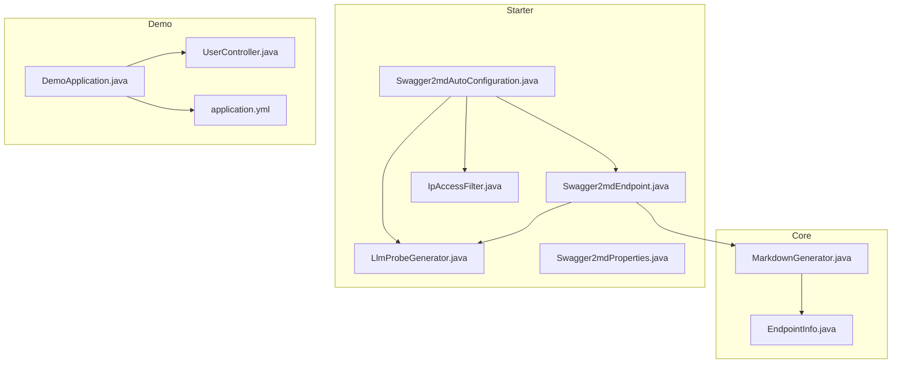
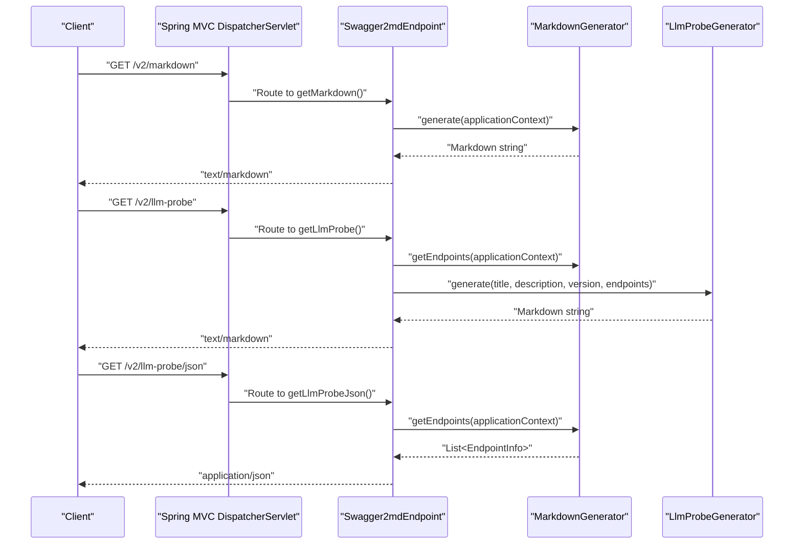
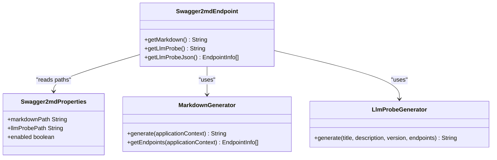
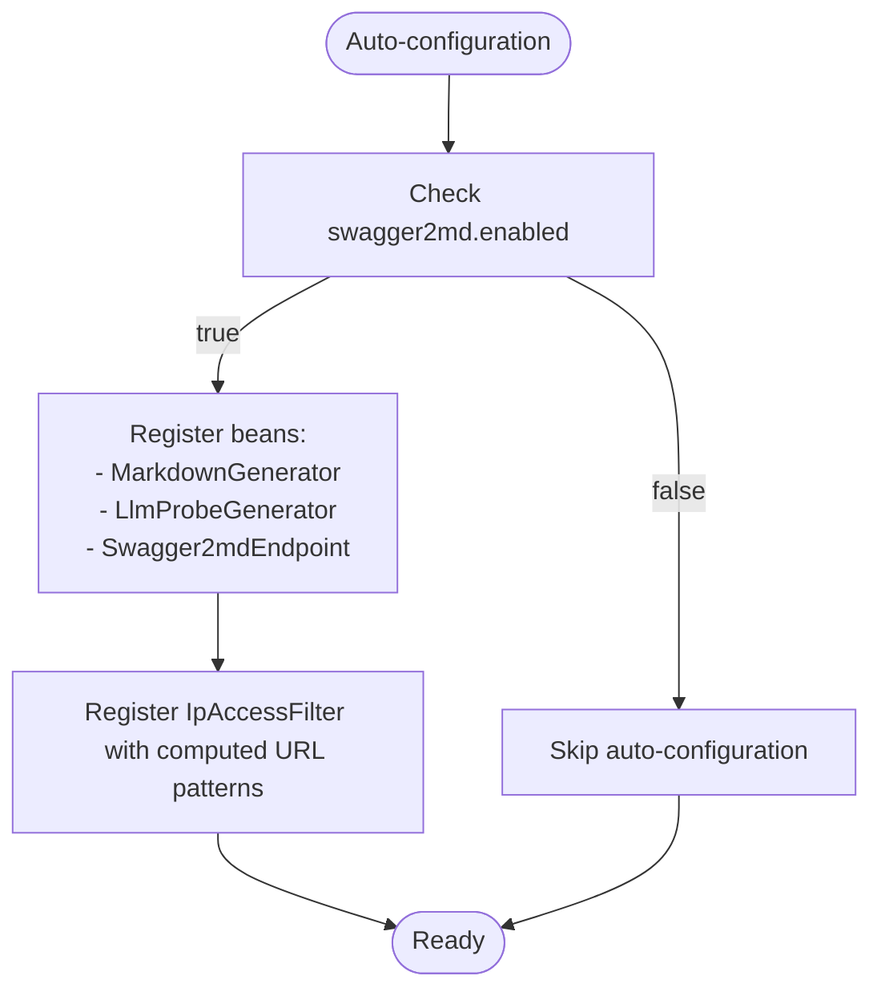
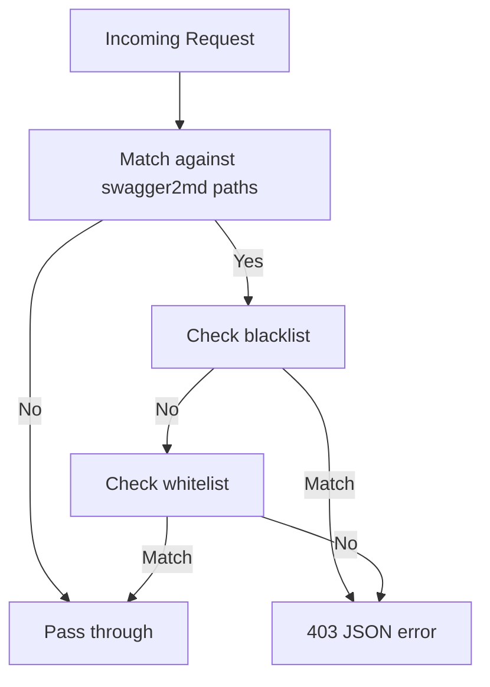
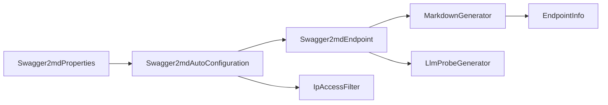

# Endpoint Management

<cite>
**Referenced Files in This Document**
- [Swagger2mdEndpoint.java](file://swagger2md-spring-boot-starter/src/main/java/com/github/tentac/swagger2md/autoconfigure/Swagger2mdEndpoint.java)
- [Swagger2mdAutoConfiguration.java](file://swagger2md-spring-boot-starter/src/main/java/com/github/tentac/swagger2md/autoconfigure/Swagger2mdAutoConfiguration.java)
- [Swagger2mdProperties.java](file://swagger2md-spring-boot-starter/src/main/java/com/github/tentac/swagger2md/autoconfigure/Swagger2mdProperties.java)
- [IpAccessFilter.java](file://swagger2md-spring-boot-starter/src/main/java/com/github/tentac/swagger2md/filter/IpAccessFilter.java)
- [LlmProbeGenerator.java](file://swagger2md-spring-boot-starter/src/main/java/com/github/tentac/swagger2md/probe/LlmProbeGenerator.java)
- [MarkdownGenerator.java](file://swagger2md-core/src/main/java/com/github/tentac/swagger2md/core/MarkdownGenerator.java)
- [EndpointInfo.java](file://swagger2md-core/src/main/java/com/github/tentac/swagger2md/model/EndpointInfo.java)
- [DemoApplication.java](file://swagger2md-demo/src/main/java/com/github/tentac/swagger2md/demo/DemoApplication.java)
- [UserController.java](file://swagger2md-demo/src/main/java/com/github/tentac/swagger2md/demo/controller/UserController.java)
- [application.yml](file://swagger2md-demo/src/main/resources/application.yml)
- [org.springframework.boot.autoconfigure.AutoConfiguration.imports](file://swagger2md-spring-boot-starter/src/main/resources/META-INF/spring/org.springframework.boot.autoconfigure.AutoConfiguration.imports)
</cite>

## Table of Contents
1. [Introduction](#introduction)
2. [Project Structure](#project-structure)
3. [Core Components](#core-components)
4. [Architecture Overview](#architecture-overview)
5. [Detailed Component Analysis](#detailed-component-analysis)
6. [Dependency Analysis](#dependency-analysis)
7. [Performance Considerations](#performance-considerations)
8. [Troubleshooting Guide](#troubleshooting-guide)
9. [Conclusion](#conclusion)
10. [Appendices](#appendices)

## Introduction
This document explains how Swagger2md exposes documentation endpoints in a Spring Boot application. It focuses on the Swagger2mdEndpoint class and the three main endpoints:
- /v2/markdown: Full API documentation in Markdown
- /v2/llm-probe: LLM-optimized capability manifest in Markdown
- /v2/llm-probe/json: Raw JSON representation of endpoints for programmatic consumption by LLMs

It covers endpoint routing, HTTP methods, response formats, registration through Spring Boot’s web infrastructure, configuration options, security considerations, rate limiting, monitoring, and troubleshooting.

## Project Structure
The project is organized as a Maven multi-module project:
- swagger2md-core: Core generation engine and models
- swagger2md-spring-boot-starter: Auto-configuration, endpoint controller, filters, and probe generator
- swagger2md-demo: Example Spring Boot application demonstrating usage

**Diagram sources**
- [Swagger2mdAutoConfiguration.java:1-82](file://swagger2md-spring-boot-starter/src/main/java/com/github/tentac/swagger2md/autoconfigure/Swagger2mdAutoConfiguration.java#L1-L82)
- [Swagger2mdEndpoint.java:1-72](file://swagger2md-spring-boot-starter/src/main/java/com/github/tentac/swagger2md/autoconfigure/Swagger2mdEndpoint.java#L1-L72)
- [LlmProbeGenerator.java:1-161](file://swagger2md-spring-boot-starter/src/main/java/com/github/tentac/swagger2md/probe/LlmProbeGenerator.java#L1-L161)
- [MarkdownGenerator.java:1-156](file://swagger2md-core/src/main/java/com/github/tentac/swagger2md/core/MarkdownGenerator.java#L1-L156)
- [EndpointInfo.java:1-165](file://swagger2md-core/src/main/java/com/github/tentac/swagger2md/model/EndpointInfo.java#L1-L165)
- [DemoApplication.java:1-20](file://swagger2md-demo/src/main/java/com/github/tentac/swagger2md/demo/DemoApplication.java#L1-L20)
- [UserController.java:1-187](file://swagger2md-demo/src/main/java/com/github/tentac/swagger2md/demo/controller/UserController.java#L1-L187)
- [application.yml:1-29](file://swagger2md-demo/src/main/resources/application.yml#L1-L29)

**Section sources**
- [pom.xml:1-112](file://pom.xml#L1-L112)

## Core Components
- Swagger2mdEndpoint: Exposes the three endpoints as a Spring MVC REST controller. It conditionally activates when swagger2md.enabled is true and uses property-driven paths for customization.
- Swagger2mdAutoConfiguration: Registers beans (MarkdownGenerator, LlmProbeGenerator, Swagger2mdEndpoint) and the IpAccessFilter when enabled. It computes URL patterns from properties and applies them to swagger2md endpoints.
- Swagger2mdProperties: Centralized configuration for enabling/disabling, titles, versions, base package scanning, endpoint paths, and IP access lists.
- LlmProbeGenerator: Produces LLM-optimized Markdown documents and JSON for programmatic consumption.
- MarkdownGenerator: Scans Spring controllers, enriches endpoint metadata, and formats output as Markdown.
- EndpointInfo: Data model representing endpoint metadata (HTTP method, path, parameters, request/response examples, etc.).

**Section sources**
- [Swagger2mdEndpoint.java:16-72](file://swagger2md-spring-boot-starter/src/main/java/com/github/tentac/swagger2md/autoconfigure/Swagger2mdEndpoint.java#L16-L72)
- [Swagger2mdAutoConfiguration.java:16-82](file://swagger2md-spring-boot-starter/src/main/java/com/github/tentac/swagger2md/autoconfigure/Swagger2mdAutoConfiguration.java#L16-L82)
- [Swagger2mdProperties.java:8-127](file://swagger2md-spring-boot-starter/src/main/java/com/github/tentac/swagger2md/autoconfigure/Swagger2mdProperties.java#L8-L127)
- [LlmProbeGenerator.java:10-161](file://swagger2md-spring-boot-starter/src/main/java/com/github/tentac/swagger2md/probe/LlmProbeGenerator.java#L10-L161)
- [MarkdownGenerator.java:11-156](file://swagger2md-core/src/main/java/com/github/tentac/swagger2md/core/MarkdownGenerator.java#L11-L156)
- [EndpointInfo.java:6-165](file://swagger2md-core/src/main/java/com/github/tentac/swagger2md/model/EndpointInfo.java#L6-L165)

## Architecture Overview
The endpoints are registered automatically when the starter is included and enabled. The controller delegates to the generation pipeline and returns either Markdown or JSON.

**Diagram sources**
- [Swagger2mdEndpoint.java:40-70](file://swagger2md-spring-boot-starter/src/main/java/com/github/tentac/swagger2md/autoconfigure/Swagger2mdEndpoint.java#L40-L70)
- [MarkdownGenerator.java:111-145](file://swagger2md-core/src/main/java/com/github/tentac/swagger2md/core/MarkdownGenerator.java#L111-L145)
- [LlmProbeGenerator.java:26-146](file://swagger2md-spring-boot-starter/src/main/java/com/github/tentac/swagger2md/probe/LlmProbeGenerator.java#L26-L146)

## Detailed Component Analysis

### Swagger2mdEndpoint
- Purpose: Expose three endpoints under configurable paths.
- Routing:
  - /v2/markdown: GET, produces text/markdown
  - /v2/llm-probe: GET, produces text/markdown
  - /v2/llm-probe/json: GET, produces application/json
- Response formats:
  - Full Markdown documentation
  - LLM-optimized Markdown capability manifest
  - JSON list of endpoints for programmatic consumption
- Path customization:
  - Uses properties swagger2md.markdown-path and swagger2md.llm-probe-path
  - Defaults to /v2/markdown and /v2/llm-probe respectively
- Conditional activation:
  - Enabled by default when swagger2md.enabled=true

**Diagram sources**
- [Swagger2mdEndpoint.java:20-70](file://swagger2md-spring-boot-starter/src/main/java/com/github/tentac/swagger2md/autoconfigure/Swagger2mdEndpoint.java#L20-L70)
- [Swagger2mdProperties.java:30-101](file://swagger2md-spring-boot-starter/src/main/java/com/github/tentac/swagger2md/autoconfigure/Swagger2mdProperties.java#L30-L101)
- [MarkdownGenerator.java:54-99](file://swagger2md-core/src/main/java/com/github/tentac/swagger2md/core/MarkdownGenerator.java#L54-L99)
- [LlmProbeGenerator.java:26-146](file://swagger2md-spring-boot-starter/src/main/java/com/github/tentac/swagger2md/probe/LlmProbeGenerator.java#L26-L146)

**Section sources**
- [Swagger2mdEndpoint.java:16-72](file://swagger2md-spring-boot-starter/src/main/java/com/github/tentac/swagger2md/autoconfigure/Swagger2mdEndpoint.java#L16-L72)

### Swagger2mdAutoConfiguration
- Registers:
  - MarkdownGenerator with title, description, version, and basePackage
  - LlmProbeGenerator
  - Swagger2mdEndpoint
  - IpAccessFilter when enabled and IP lists are configured
- URL patterns for filter registration:
  - markdownPath
  - markdownPath/*
  - llmProbePath
  - llmProbePath/*

**Diagram sources**
- [Swagger2mdAutoConfiguration.java:20-82](file://swagger2md-spring-boot-starter/src/main/java/com/github/tentac/swagger2md/autoconfigure/Swagger2mdAutoConfiguration.java#L20-L82)

**Section sources**
- [Swagger2mdAutoConfiguration.java:16-82](file://swagger2md-spring-boot-starter/src/main/java/com/github/tentac/swagger2md/autoconfigure/Swagger2mdAutoConfiguration.java#L16-L82)

### IpAccessFilter
- Purpose: Restrict access to swagger2md endpoints by IP using whitelist/blacklist with CIDR notation.
- Behavior:
  - Checks X-Forwarded-For, X-Real-IP, and remote address
  - Applies blacklist first, then whitelist
  - Returns JSON error with 403 on denial
- Configuration:
  - Controlled via swagger2md.ip-whitelist and swagger2md.ip-blacklist

**Diagram sources**
- [IpAccessFilter.java:61-95](file://swagger2md-spring-boot-starter/src/main/java/com/github/tentac/swagger2md/filter/IpAccessFilter.java#L61-L95)

**Section sources**
- [IpAccessFilter.java:19-196](file://swagger2md-spring-boot-starter/src/main/java/com/github/tentac/swagger2md/filter/IpAccessFilter.java#L19-L196)

### LlmProbeGenerator
- Produces:
  - Markdown capability manifest with summary table and detailed sections
  - JSON list of endpoints for programmatic consumption
- Output includes:
  - API title/version/description
  - Endpoint method, path, operationId, summary
  - Parameters (name, location, type, required, description, example)
  - Request/response examples (formatted JSON blocks)
  - Usage instructions for LLMs

**Section sources**
- [LlmProbeGenerator.java:10-161](file://swagger2md-spring-boot-starter/src/main/java/com/github/tentac/swagger2md/probe/LlmProbeGenerator.java#L10-L161)

### MarkdownGenerator
- Scans Spring controllers:
  - Finds @RestController beans
  - Optionally filters by basePackage
  - Skips controllers annotated with hidden flag
  - Collects endpoints and enriches with annotations
- Produces:
  - Markdown documentation
  - Endpoint list for JSON probe

**Section sources**
- [MarkdownGenerator.java:48-145](file://swagger2md-core/src/main/java/com/github/tentac/swagger2md/core/MarkdownGenerator.java#L48-L145)

### EndpointInfo Model
- Captures endpoint metadata:
  - HTTP method, path, tags, consumes/produces
  - Parameters, request/response types/examples
  - Deprecation status, operationId
- Used by both Markdown and JSON probes

**Section sources**
- [EndpointInfo.java:6-165](file://swagger2md-core/src/main/java/com/github/tentac/swagger2md/model/EndpointInfo.java#L6-L165)

## Dependency Analysis
- Auto-configuration registers the endpoint controller and filter, wiring them to the generation pipeline.
- The endpoint controller depends on:
  - MarkdownGenerator for Markdown output and endpoint enumeration
  - LlmProbeGenerator for LLM-optimized Markdown
  - Swagger2mdProperties for path customization
- IpAccessFilter depends on:
  - Swagger2mdProperties for path patterns and IP lists
  - Servlet APIs for request filtering

**Diagram sources**
- [Swagger2mdAutoConfiguration.java:20-82](file://swagger2md-spring-boot-starter/src/main/java/com/github/tentac/swagger2md/autoconfigure/Swagger2mdAutoConfiguration.java#L20-L82)
- [Swagger2mdEndpoint.java:24-38](file://swagger2md-spring-boot-starter/src/main/java/com/github/tentac/swagger2md/autoconfigure/Swagger2mdEndpoint.java#L24-L38)
- [Swagger2mdProperties.java:30-101](file://swagger2md-spring-boot-starter/src/main/java/com/github/tentac/swagger2md/autoconfigure/Swagger2mdProperties.java#L30-L101)
- [MarkdownGenerator.java:17-30](file://swagger2md-core/src/main/java/com/github/tentac/swagger2md/core/MarkdownGenerator.java#L17-L30)
- [EndpointInfo.java:9-52](file://swagger2md-core/src/main/java/com/github/tentac/swagger2md/model/EndpointInfo.java#L9-L52)

**Section sources**
- [org.springframework.boot.autoconfigure.AutoConfiguration.imports:1-2](file://swagger2md-spring-boot-starter/src/main/resources/META-INF/spring/org.springframework.boot.autoconfigure.AutoConfiguration.imports#L1-L2)

## Performance Considerations
- Generation cost:
  - Endpoint scanning and annotation enrichment occur on demand per request.
  - Consider caching generated Markdown or JSON if endpoints change infrequently.
- Filtering overhead:
  - IpAccessFilter performs CIDR checks per request; keep whitelist/blacklist concise.
- Base package scoping:
  - Configure basePackage to limit controller scanning and reduce overhead.

[No sources needed since this section provides general guidance]

## Troubleshooting Guide
- Endpoints not accessible:
  - Verify swagger2md.enabled is true and properties are loaded.
  - Confirm paths match swagger2md.markdown-path and swagger2md.llm-probe-path.
- CORS issues:
  - Configure CORS globally in your application or add a dedicated CORS filter.
  - Ensure preflight OPTIONS requests are handled if needed.
- IP restrictions:
  - If IpAccessFilter is active, confirm your client IP is whitelisted or not blacklisted.
  - Check X-Forwarded-For/X-Real-IP headers if behind a proxy.
- Rate limiting:
  - Add a rate-limiting filter or use Spring Cloud Gateway/Actuator metrics.
- Monitoring:
  - Enable debug logging for the swagger2md package to inspect generation steps.
  - Use Actuator endpoints to monitor health and metrics.

**Section sources**
- [application.yml:8-29](file://swagger2md-demo/src/main/resources/application.yml#L8-L29)
- [IpAccessFilter.java:61-95](file://swagger2md-spring-boot-starter/src/main/java/com/github/tentac/swagger2md/filter/IpAccessFilter.java#L61-L95)

## Conclusion
Swagger2md provides a simple, configurable way to expose API documentation and LLM-friendly capability manifests in Spring Boot applications. The three endpoints are easy to integrate, customizable via properties, and optionally secured with IP-based filters. For production deployments, consider caching, CORS configuration, rate limiting, and monitoring to ensure reliability and performance.

## Appendices

### Endpoint Reference
- /v2/markdown
  - Method: GET
  - Produces: text/markdown
  - Purpose: Full Markdown API documentation
  - Path customization: swagger2md.markdown-path
- /v2/llm-probe
  - Method: GET
  - Produces: text/markdown
  - Purpose: LLM-optimized capability manifest
  - Path customization: swagger2md.llm-probe-path
- /v2/llm-probe/json
  - Method: GET
  - Produces: application/json
  - Purpose: Raw JSON of endpoints for programmatic consumption
  - Path customization: swagger2md.llm-probe-path

**Section sources**
- [Swagger2mdEndpoint.java:40-70](file://swagger2md-spring-boot-starter/src/main/java/com/github/tentac/swagger2md/autoconfigure/Swagger2mdEndpoint.java#L40-L70)
- [Swagger2mdProperties.java:30-101](file://swagger2md-spring-boot-starter/src/main/java/com/github/tentac/swagger2md/autoconfigure/Swagger2mdProperties.java#L30-L101)

### Access Examples
- Using curl:
  - curl http://localhost:8080/v2/markdown
  - curl http://localhost:8080/v2/llm-probe
  - curl http://localhost:8080/v2/llm-probe/json
- Integration with existing apps:
  - Include the swagger2md-spring-boot-starter dependency.
  - Configure swagger2md.* properties in application.yml.
  - Ensure controllers are annotated and discoverable by Spring.

**Section sources**
- [DemoApplication.java:8-12](file://swagger2md-demo/src/main/java/com/github/tentac/swagger2md/demo/DemoApplication.java#L8-L12)
- [application.yml:8-29](file://swagger2md-demo/src/main/resources/application.yml#L8-L29)

### Security and Access Control
- IP-based access:
  - Configure swagger2md.ip-whitelist and swagger2md.ip-blacklist.
  - Filter applies to all swagger2md endpoints.
- Additional security:
  - Combine with Spring Security (basic auth, OAuth2, etc.) as needed.
  - Place behind a reverse proxy with TLS termination and WAF.

**Section sources**
- [Swagger2mdAutoConfiguration.java:48-80](file://swagger2md-spring-boot-starter/src/main/java/com/github/tentac/swagger2md/autoconfigure/Swagger2mdAutoConfiguration.java#L48-L80)
- [IpAccessFilter.java:23-95](file://swagger2md-spring-boot-starter/src/main/java/com/github/tentac/swagger2md/filter/IpAccessFilter.java#L23-L95)

### Configuration Options
- swagger2md.enabled: Enable/disable the module
- swagger2md.title: API title for documentation header
- swagger2md.description: API description
- swagger2md.version: API version
- swagger2md.base-package: Package to scan for controllers
- swagger2md.markdown-path: Path for /v2/markdown
- swagger2md.llm-probe-path: Path for /v2/llm-probe and /v2/llm-probe/json
- swagger2md.ip-whitelist: CIDR list for allowed IPs
- swagger2md.ip-blacklist: CIDR list for blocked IPs

**Section sources**
- [Swagger2mdProperties.java:15-127](file://swagger2md-spring-boot-starter/src/main/java/com/github/tentac/swagger2md/autoconfigure/Swagger2mdProperties.java#L15-L127)

### Example Controllers
- The demo includes a sample controller with Swagger2 and Swagger2md annotations to demonstrate compatibility and endpoint discovery.

**Section sources**
- [UserController.java:20-187](file://swagger2md-demo/src/main/java/com/github/tentac/swagger2md/demo/controller/UserController.java#L20-L187)