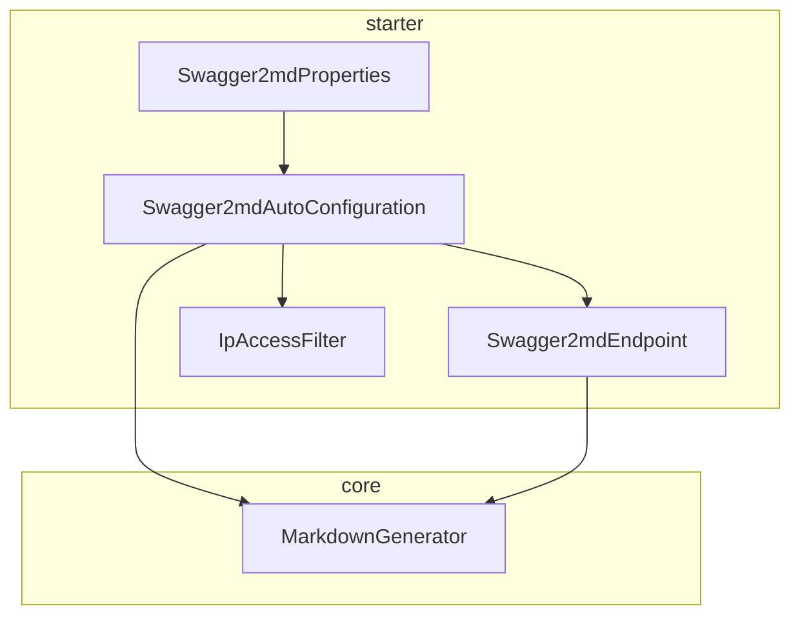
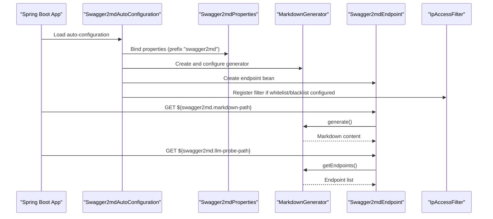
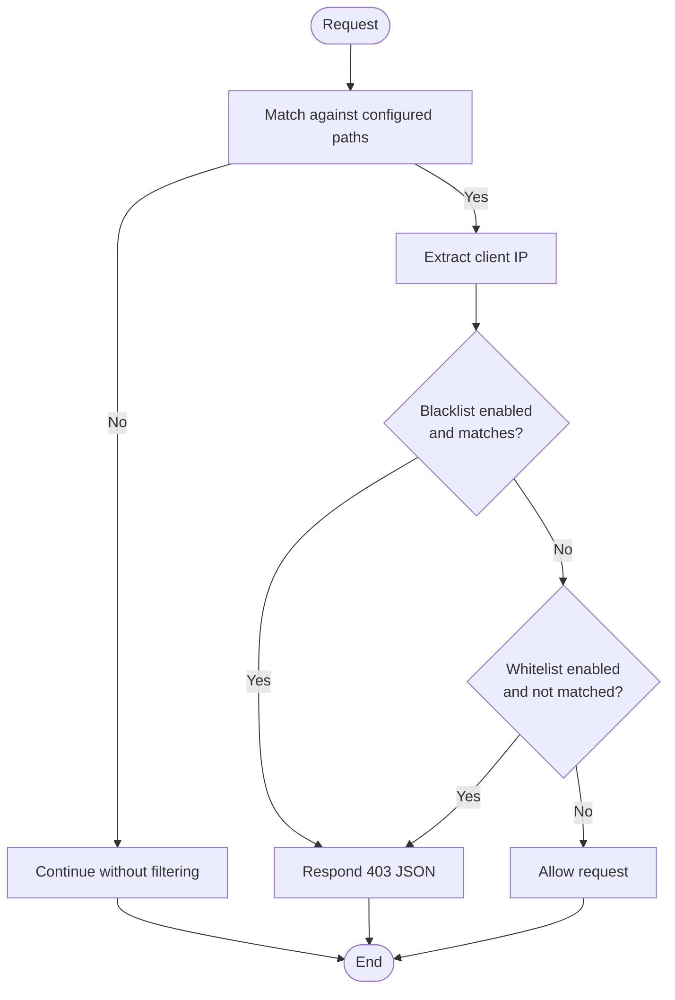
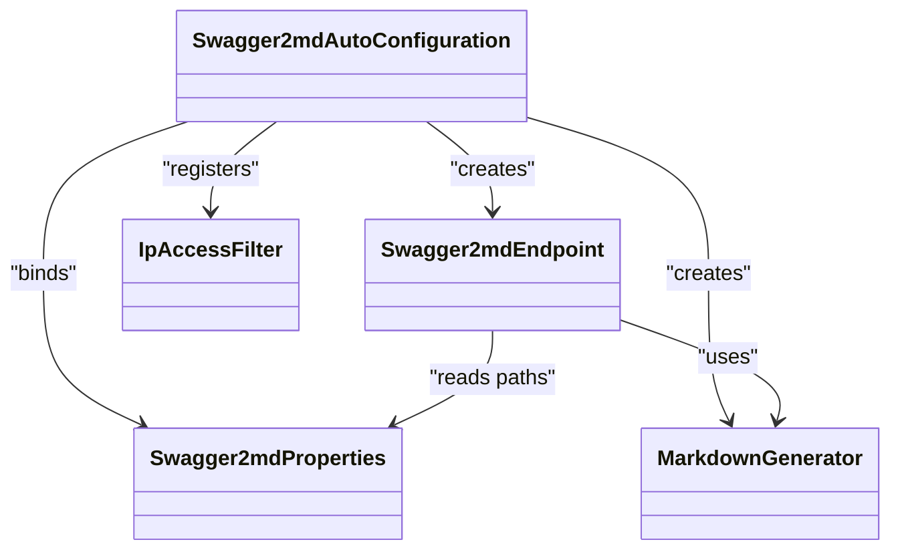

# Property Configuration

<cite>
**Referenced Files in This Document**
- [Swagger2mdProperties.java](file://swagger2md-spring-boot-starter/src/main/java/com/github/tentac/swagger2md/autoconfigure/Swagger2mdProperties.java)
- [Swagger2mdAutoConfiguration.java](file://swagger2md-spring-boot-starter/src/main/java/com/github/tentac/swagger2md/autoconfigure/Swagger2mdAutoConfiguration.java)
- [Swagger2mdEndpoint.java](file://swagger2md-spring-boot-starter/src/main/java/com/github/tentac/swagger2md/autoconfigure/Swagger2mdEndpoint.java)
- [IpAccessFilter.java](file://swagger2md-spring-boot-starter/src/main/java/com/github/tentac/swagger2md/filter/IpAccessFilter.java)
- [MarkdownGenerator.java](file://swagger2md-core/src/main/java/com/github/tentac/swagger2md/core/MarkdownGenerator.java)
- [application.yml](file://swagger2md-demo/src/main/resources/application.yml)
- [org.springframework.boot.autoconfigure.AutoConfiguration.imports](file://swagger2md-spring-boot-starter/src/main/resources/META-INF/spring/org.springframework.boot.autoconfigure.AutoConfiguration.imports)
- [pom.xml](file://pom.xml)
</cite>

## Table of Contents
1. [Introduction](#introduction)
2. [Project Structure](#project-structure)
3. [Core Components](#core-components)
4. [Architecture Overview](#architecture-overview)
5. [Detailed Component Analysis](#detailed-component-analysis)
6. [Dependency Analysis](#dependency-analysis)
7. [Performance Considerations](#performance-considerations)
8. [Troubleshooting Guide](#troubleshooting-guide)
9. [Conclusion](#conclusion)
10. [Appendices](#appendices)

## Introduction
This document provides comprehensive guidance for configuring Swagger2md via the Swagger2mdProperties class and related bean configurations. It explains each configuration option, default values, data types, validation rules, and how properties map to runtime behavior. Practical examples demonstrate YAML and Java property usage, and the document covers precedence, environment variable overrides, and command-line argument support. Best practices and common deployment patterns are included to help teams configure the module safely and effectively.

## Project Structure
Swagger2md is organized as a multi-module Maven project:
- swagger2md-core: Core generation engine and models
- swagger2md-spring-boot-starter: Spring Boot auto-configuration, endpoints, filters, and starter metadata
- swagger2md-demo: Example application demonstrating configuration and usage

Key configuration is centralized in the starter module under the swagger2md namespace.

**Diagram sources**
- [Swagger2mdProperties.java:12-126](file://swagger2md-spring-boot-starter/src/main/java/com/github/tentac/swagger2md/autoconfigure/Swagger2mdProperties.java#L12-L126)
- [Swagger2mdAutoConfiguration.java:20-81](file://swagger2md-spring-boot-starter/src/main/java/com/github/tentac/swagger2md/autoconfigure/Swagger2mdAutoConfiguration.java#L20-L81)
- [Swagger2mdEndpoint.java:20-71](file://swagger2md-spring-boot-starter/src/main/java/com/github/tentac/swagger2md/autoconfigure/Swagger2mdEndpoint.java#L20-L71)
- [IpAccessFilter.java:23-195](file://swagger2md-spring-boot-starter/src/main/java/com/github/tentac/swagger2md/filter/IpAccessFilter.java#L23-L195)
- [MarkdownGenerator.java:15-155](file://swagger2md-core/src/main/java/com/github/tentac/swagger2md/core/MarkdownGenerator.java#L15-L155)

**Section sources**
- [pom.xml:15-19](file://pom.xml#L15-L19)
- [org.springframework.boot.autoconfigure.AutoConfiguration.imports:1-2](file://swagger2md-spring-boot-starter/src/main/resources/META-INF/spring/org.springframework.boot.autoconfigure.AutoConfiguration.imports#L1-L2)

## Core Components
This section documents the Swagger2mdProperties class and its role in controlling the module’s behavior. Each property is described with its type, default value, and effect on runtime beans.

- enabled
  - Type: boolean
  - Default: true
  - Description: Controls whether the module is active. When false, auto-configuration does not register beans.
  - Effect: Conditional activation of beans and endpoints.

- title
  - Type: String
  - Default: "API Documentation"
  - Description: Sets the documentation title used by the generator and endpoints.

- description
  - Type: String
  - Default: empty string
  - Description: Sets the documentation description used by the generator and endpoints.

- version
  - Type: String
  - Default: "1.0.0"
  - Description: Sets the API version used by the generator and endpoints.

- basePackage
  - Type: String
  - Default: empty string
  - Description: Restricts controller scanning to a specific package prefix. Empty scans all controllers.

- markdownPath
  - Type: String
  - Default: "/v2/markdown"
  - Description: Path for the Markdown documentation endpoint.

- llmProbePath
  - Type: String
  - Default: "/v2/llm-probe"
  - Description: Base path for LLM probe endpoints.

- llmProbeEnabled
  - Type: boolean
  - Default: true
  - Description: Controls whether LLM probe endpoints are exposed.

- ipWhitelist
  - Type: List<String> (CIDR notation)
  - Default: empty list
  - Description: Allow-list of IPs/subnets for accessing documentation endpoints.

- ipBlacklist
  - Type: List<String> (CIDR notation)
  - Default: empty list
  - Description: Deny-list of IPs/subnets for accessing documentation endpoints.

Validation rules:
- CIDR notation is validated during filter initialization; invalid entries are logged and ignored.
- Paths must be non-empty when used; otherwise, defaults apply.

Behavioral mapping:
- Properties are injected into MarkdownGenerator and Swagger2mdEndpoint.
- IP whitelist/blacklist are enforced by IpAccessFilter when configured.

**Section sources**
- [Swagger2mdProperties.java:12-126](file://swagger2md-spring-boot-starter/src/main/java/com/github/tentac/swagger2md/autoconfigure/Swagger2mdProperties.java#L12-L126)
- [Swagger2mdAutoConfiguration.java:25-46](file://swagger2md-spring-boot-starter/src/main/java/com/github/tentac/swagger2md/autoconfigure/Swagger2mdAutoConfiguration.java#L25-L46)
- [Swagger2mdEndpoint.java:43-70](file://swagger2md-spring-boot-starter/src/main/java/com/github/tentac/swagger2md/autoconfigure/Swagger2mdEndpoint.java#L43-L70)
- [IpAccessFilter.java:40-58](file://swagger2md-spring-boot-starter/src/main/java/com/github/tentac/swagger2md/filter/IpAccessFilter.java#L40-L58)

## Architecture Overview
The configuration system binds external settings to internal beans through Spring Boot’s configuration properties mechanism. Beans are conditionally registered based on the enabled flag, and endpoints expose documentation and probes according to configured paths.

**Diagram sources**
- [Swagger2mdAutoConfiguration.java:20-81](file://swagger2md-spring-boot-starter/src/main/java/com/github/tentac/swagger2md/autoconfigure/Swagger2mdAutoConfiguration.java#L20-L81)
- [Swagger2mdProperties.java:12-126](file://swagger2md-spring-boot-starter/src/main/java/com/github/tentac/swagger2md/autoconfigure/Swagger2mdProperties.java#L12-L126)
- [Swagger2mdEndpoint.java:20-71](file://swagger2md-spring-boot-starter/src/main/java/com/github/tentac/swagger2md/autoconfigure/Swagger2mdEndpoint.java#L20-L71)
- [MarkdownGenerator.java:15-155](file://swagger2md-core/src/main/java/com/github/tentac/swagger2md/core/MarkdownGenerator.java#L15-L155)

## Detailed Component Analysis

### Property-to-Bean Mapping
- enabled
  - Controls conditional registration of beans and endpoints.
  - See conditional annotations in auto-configuration and endpoint.

- title, description, version
  - Injected into MarkdownGenerator to format documentation.

- basePackage
  - Filters scanned controllers to reduce load and scope.

- markdownPath, llmProbePath
  - Used by Swagger2mdEndpoint to define REST mappings.
  - Also used by IpAccessFilter to restrict URL patterns.

- llmProbeEnabled
  - Not directly bound to a bean in the provided code; endpoints remain active when enabled is true.

- ipWhitelist, ipBlacklist
  - Construct IpAccessFilter with path patterns derived from markdownPath and llmProbePath.

**Section sources**
- [Swagger2mdAutoConfiguration.java:20-81](file://swagger2md-spring-boot-starter/src/main/java/com/github/tentac/swagger2md/autoconfigure/Swagger2mdAutoConfiguration.java#L20-L81)
- [Swagger2mdEndpoint.java:20-71](file://swagger2md-spring-boot-starter/src/main/java/com/github/tentac/swagger2md/autoconfigure/Swagger2mdEndpoint.java#L20-L71)
- [IpAccessFilter.java:33-59](file://swagger2md-spring-boot-starter/src/main/java/com/github/tentac/swagger2md/filter/IpAccessFilter.java#L33-L59)

### Security Filtering Logic
The IP access filter enforces allow/deny rules based on CIDR notation. It checks blacklist first, then whitelist if present.

**Diagram sources**
- [IpAccessFilter.java:61-95](file://swagger2md-spring-boot-starter/src/main/java/com/github/tentac/swagger2md/filter/IpAccessFilter.java#L61-L95)

**Section sources**
- [IpAccessFilter.java:23-195](file://swagger2md-spring-boot-starter/src/main/java/com/github/tentac/swagger2md/filter/IpAccessFilter.java#L23-L195)

### Endpoint Behavior
- Markdown endpoint: Serves generated Markdown content.
- LLM probe endpoints: Serve Markdown and JSON representations of endpoints for LLM consumption.

**Section sources**
- [Swagger2mdEndpoint.java:40-71](file://swagger2md-spring-boot-starter/src/main/java/com/github/tentac/swagger2md/autoconfigure/Swagger2mdEndpoint.java#L40-L71)

## Dependency Analysis
- Auto-configuration depends on:
  - Swagger2mdProperties for configuration
  - MarkdownGenerator for content generation
  - LlmProbeGenerator for probe output
  - IpAccessFilter for security enforcement
- Endpoint depends on:
  - Swagger2mdProperties for path resolution
  - MarkdownGenerator for endpoint discovery and formatting

**Diagram sources**
- [Swagger2mdAutoConfiguration.java:20-81](file://swagger2md-spring-boot-starter/src/main/java/com/github/tentac/swagger2md/autoconfigure/Swagger2mdAutoConfiguration.java#L20-L81)
- [Swagger2mdEndpoint.java:20-71](file://swagger2md-spring-boot-starter/src/main/java/com/github/tentac/swagger2md/autoconfigure/Swagger2mdEndpoint.java#L20-L71)
- [IpAccessFilter.java:23-195](file://swagger2md-spring-boot-starter/src/main/java/com/github/tentac/swagger2md/filter/IpAccessFilter.java#L23-L195)
- [MarkdownGenerator.java:15-155](file://swagger2md-core/src/main/java/com/github/tentac/swagger2md/core/MarkdownGenerator.java#L15-L155)

**Section sources**
- [Swagger2mdAutoConfiguration.java:20-81](file://swagger2md-spring-boot-starter/src/main/java/com/github/tentac/swagger2md/autoconfigure/Swagger2mdAutoConfiguration.java#L20-L81)
- [Swagger2mdEndpoint.java:20-71](file://swagger2md-spring-boot-starter/src/main/java/com/github/tentac/swagger2md/autoconfigure/Swagger2mdEndpoint.java#L20-L71)

## Performance Considerations
- basePackage reduces controller scanning overhead by limiting the package scope.
- Empty basePackage scans all controllers; consider scoping to production APIs only.
- LLM probe endpoints generate endpoint lists; keep paths secure and rate-limit where appropriate.

[No sources needed since this section provides general guidance]

## Troubleshooting Guide
- Endpoints not reachable
  - Verify enabled is true and paths are correct.
  - Confirm IpAccessFilter is not blocking requests due to whitelist/blacklist misconfiguration.

- Invalid CIDR entries
  - Invalid CIDR entries are logged and ignored; review logs for warnings.

- Wrong IP detection behind proxies
  - The filter reads X-Forwarded-For and X-Real-IP headers; ensure reverse proxy forwards these headers.

- LLM probe disabled
  - llmProbeEnabled is not bound to a property in the provided code; ensure enabled is true and paths are correct.

**Section sources**
- [IpAccessFilter.java:127-143](file://swagger2md-spring-boot-starter/src/main/java/com/github/tentac/swagger2md/filter/IpAccessFilter.java#L127-L143)
- [Swagger2mdAutoConfiguration.java:52-80](file://swagger2md-spring-boot-starter/src/main/java/com/github/tentac/swagger2md/autoconfigure/Swagger2mdAutoConfiguration.java#L52-L80)

## Conclusion
Swagger2mdProperties centralizes configuration for enabling/disabling the module, setting documentation metadata, controlling endpoint paths, and enforcing IP-based access. Properly scoped basePackage and secure IP policies ensure safe operation in production. The provided examples and patterns enable teams to tailor configuration to their deployment needs while maintaining predictable behavior.

[No sources needed since this section summarizes without analyzing specific files]

## Appendices

### Configuration Options Reference
- Property: swagger2md.enabled
  - Type: boolean
  - Default: true
  - Effect: Activates/deactivates module beans and endpoints

- Property: swagger2md.title
  - Type: String
  - Default: "API Documentation"
  - Effect: Sets documentation title

- Property: swagger2md.description
  - Type: String
  - Default: ""
  - Effect: Sets documentation description

- Property: swagger2md.version
  - Type: String
  - Default: "1.0.0"
  - Effect: Sets documentation version

- Property: swagger2md.base-package
  - Type: String
  - Default: ""
  - Effect: Restricts controller scanning to package prefix

- Property: swagger2md.markdown-path
  - Type: String
  - Default: "/v2/markdown"
  - Effect: Path for Markdown endpoint

- Property: swagger2md.llm-probe-path
  - Type: String
  - Default: "/v2/llm-probe"
  - Effect: Base path for LLM probe endpoints

- Property: swagger2md.llm-probe-enabled
  - Type: boolean
  - Default: true
  - Effect: Controls exposure of LLM probe endpoints

- Property: swagger2md.ip-whitelist
  - Type: List<String>
  - Default: []
  - Effect: Allow-list of CIDR entries for endpoint access

- Property: swagger2md.ip-blacklist
  - Type: List<String>
  - Default: []
  - Effect: Deny-list of CIDR entries for endpoint access

**Section sources**
- [Swagger2mdProperties.java:12-126](file://swagger2md-spring-boot-starter/src/main/java/com/github/tentac/swagger2md/autoconfigure/Swagger2mdProperties.java#L12-L126)

### Practical Configuration Examples

- application.yml
  - Example demonstrates enabling the module, setting title, description, version, base package, endpoint paths, and IP whitelist/blacklist.
  - See [application.yml:8-24](file://swagger2md-demo/src/main/resources/application.yml#L8-L24) for a complete example.

- application.properties
  - Equivalent property keys can be used with dot notation:
    - swagger2md.enabled=true
    - swagger2md.title=My API Docs
    - swagger2md.description=A demo API
    - swagger2md.version=1.0.0
    - swagger2md.base-package=com.example.api
    - swagger2md.markdown-path=/v2/markdown
    - swagger2md.llm-probe-path=/v2/llm-probe
    - swagger2md.llm-probe-enabled=true
    - swagger2md.ip-whitelist[0]=127.0.0.1/32
    - swagger2md.ip-blacklist[0]=0.0.0.0/0

- Environment Variables
  - Spring Boot supports environment variable overrides using upper-case, dot-separated keys and underscores for nesting:
    - SWAGGER2MD_ENABLED=true
    - SWAGGER2MD_TITLE=My API Docs
    - SWAGGER2MD_IP_WHITELIST_0=127.0.0.1/32
  - Note: List indices are represented as underscore-prefixed numeric suffixes.

- Command-Line Arguments
  - Spring Boot supports command-line overrides:
    - --swagger2md.enabled=true
    - --swagger2md.ip-whitelist[0]=127.0.0.1/32

Precedence order (highest to lowest):
1. Command-line arguments
2. Environment variables
3. application.properties
4. application.yml
5. Defaults in Swagger2mdProperties

**Section sources**
- [application.yml:8-24](file://swagger2md-demo/src/main/resources/application.yml#L8-L24)
- [Swagger2mdProperties.java:12-126](file://swagger2md-spring-boot-starter/src/main/java/com/github/tentac/swagger2md/autoconfigure/Swagger2mdProperties.java#L12-L126)

### Relationship Between Properties and Bean Configurations
- Enabled flag
  - Controls conditional registration of beans and endpoints.
  - See conditional annotations in auto-configuration and endpoint.

- Path properties
  - markdownPath and llmProbePath are used by Swagger2mdEndpoint for REST mappings.
  - They are also used by IpAccessFilter to register URL patterns.

- Security properties
  - ipWhitelist and ipBlacklist are consumed by IpAccessFilter to enforce access control.

- Generator properties
  - title, description, version, and basePackage are injected into MarkdownGenerator.

**Section sources**
- [Swagger2mdAutoConfiguration.java:20-81](file://swagger2md-spring-boot-starter/src/main/java/com/github/tentac/swagger2md/autoconfigure/Swagger2mdAutoConfiguration.java#L20-L81)
- [Swagger2mdEndpoint.java:40-70](file://swagger2md-spring-boot-starter/src/main/java/com/github/tentac/swagger2md/autoconfigure/Swagger2mdEndpoint.java#L40-L70)
- [IpAccessFilter.java:33-59](file://swagger2md-spring-boot-starter/src/main/java/com/github/tentac/swagger2md/filter/IpAccessFilter.java#L33-L59)
- [MarkdownGenerator.java:32-46](file://swagger2md-core/src/main/java/com/github/tentac/swagger2md/core/MarkdownGenerator.java#L32-L46)

### Best Practices and Common Patterns
- Development
  - Keep enabled=true and ip-whitelist empty to allow local access.
  - Use base-package to limit scanning to development controllers.

- Staging
  - Enable ip-whitelist with staging subnet(s).
  - Keep llmProbeEnabled true for LLM integration testing.

- Production
  - Enable ip-whitelist with production CIDRs.
  - Optionally enable ip-blacklist for known-bad networks.
  - Consider disabling llmProbeEnabled if JSON probe is not needed.

- Multi-environment
  - Use environment variables for overrides in containerized deployments.
  - Use application.yml profiles to manage environment-specific settings.

[No sources needed since this section provides general guidance]