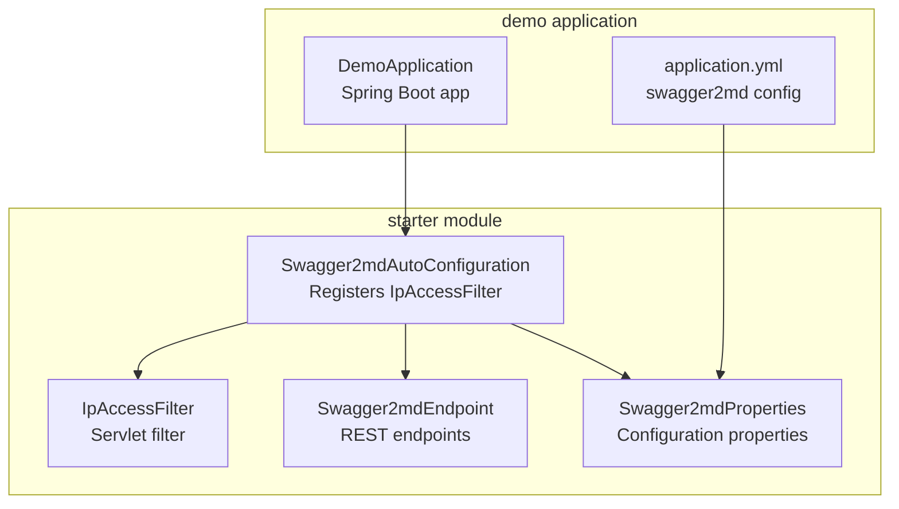
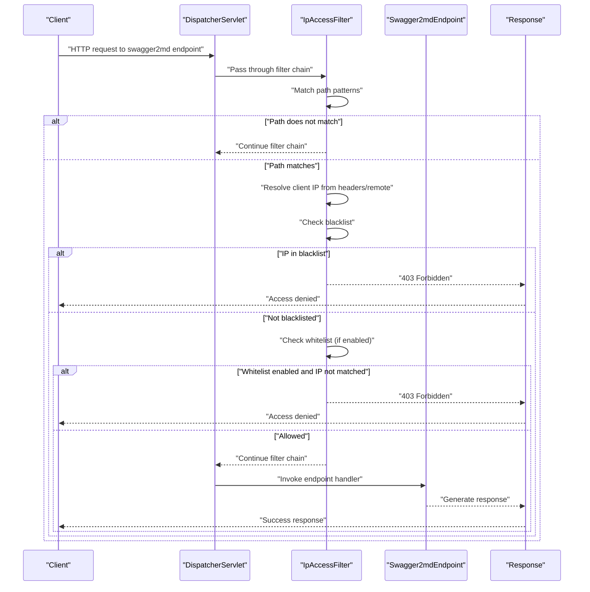
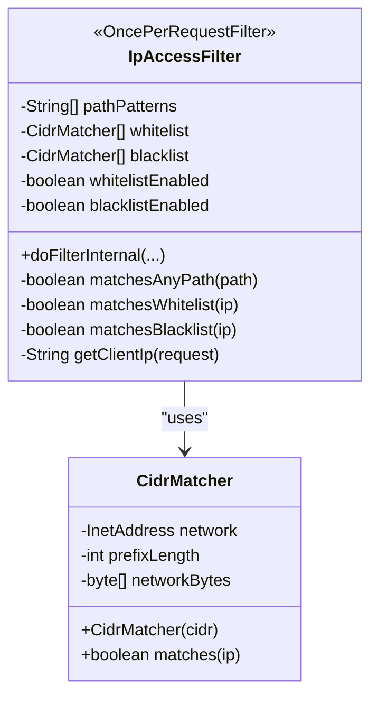
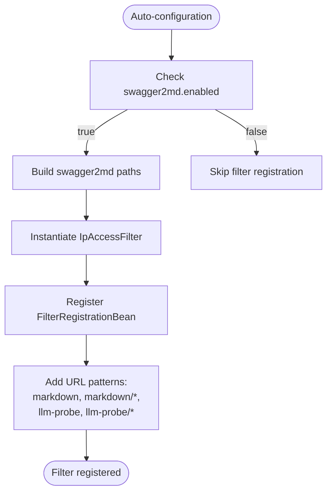
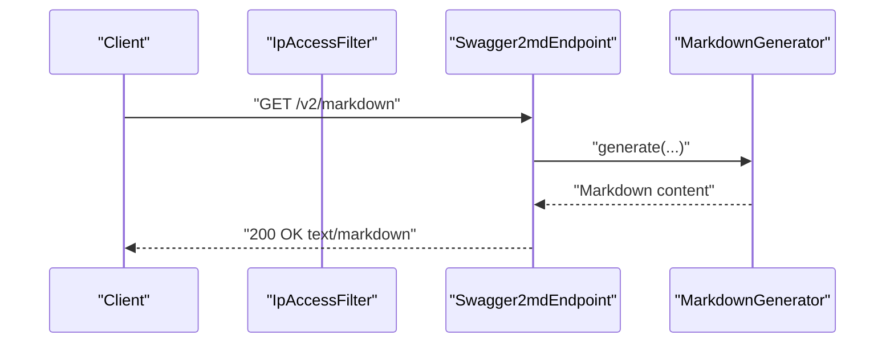
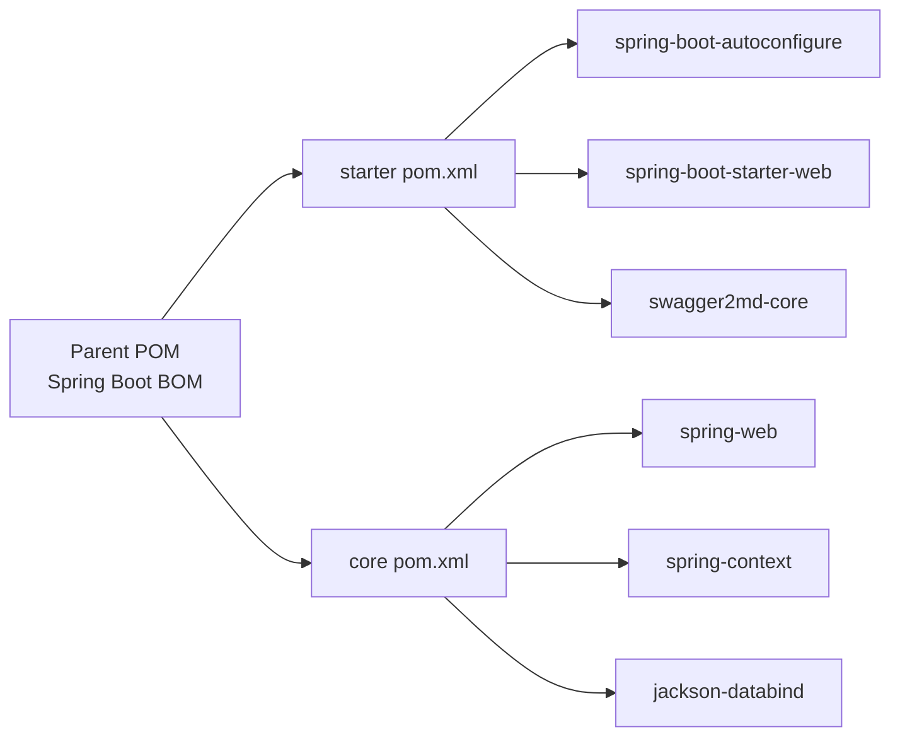

# Security Integration

<cite>
**Referenced Files in This Document**
- [IpAccessFilter.java](file://swagger2md-spring-boot-starter/src/main/java/com/github/tentac/swagger2md/filter/IpAccessFilter.java)
- [Swagger2mdAutoConfiguration.java](file://swagger2md-spring-boot-starter/src/main/java/com/github/tentac/swagger2md/autoconfigure/Swagger2mdAutoConfiguration.java)
- [Swagger2mdEndpoint.java](file://swagger2md-spring-boot-starter/src/main/java/com/github/tentac/swagger2md/autoconfigure/Swagger2mdEndpoint.java)
- [Swagger2mdProperties.java](file://swagger2md-spring-boot-starter/src/main/java/com/github/tentac/swagger2md/autoconfigure/Swagger2mdProperties.java)
- [application.yml](file://swagger2md-demo/src/main/resources/application.yml)
- [DemoApplication.java](file://swagger2md-demo/src/main/java/com/github/tentac/swagger2md/demo/DemoApplication.java)
- [AutoConfiguration.imports](file://swagger2md-spring-boot-starter/src/main/resources/META-INF/spring/org.springframework.boot.autoconfigure.AutoConfiguration.imports)
- [pom.xml](file://pom.xml)
- [swagger2md-spring-boot-starter/pom.xml](file://swagger2md-spring-boot-starter/pom.xml)
</cite>

## Table of Contents
1. [Introduction](#introduction)
2. [Project Structure](#project-structure)
3. [Core Components](#core-components)
4. [Architecture Overview](#architecture-overview)
5. [Detailed Component Analysis](#detailed-component-analysis)
6. [Dependency Analysis](#dependency-analysis)
7. [Performance Considerations](#performance-considerations)
8. [Troubleshooting Guide](#troubleshooting-guide)
9. [Conclusion](#conclusion)
10. [Appendices](#appendices)

## Introduction
This document explains the security integration for IP access control and security filtering mechanisms in the project. It focuses on the IpAccessFilter implementation, how it integrates with Spring Boot’s servlet filter chain, and how it enforces IP-based access to swagger2md endpoints. It covers configuration options for whitelists and blacklists, CIDR notation support, IP address validation, filter registration, URL pattern matching, and practical examples for multi-layered security. It also provides best practices, monitoring guidance, troubleshooting tips, and production security recommendations.

## Project Structure
The security integration spans the spring boot starter module and the demo application:
- The starter module provides the auto-configuration, the IP access filter, and the swagger2md endpoints.
- The demo application demonstrates configuration and usage of the IP access control.

**Diagram sources**
- [Swagger2mdAutoConfiguration.java:1-82](file://swagger2md-spring-boot-starter/src/main/java/com/github/tentac/swagger2md/autoconfigure/Swagger2mdAutoConfiguration.java#L1-L82)
- [IpAccessFilter.java:1-196](file://swagger2md-spring-boot-starter/src/main/java/com/github/tentac/swagger2md/filter/IpAccessFilter.java#L1-L196)
- [Swagger2mdEndpoint.java:1-72](file://swagger2md-spring-boot-starter/src/main/java/com/github/tentac/swagger2md/autoconfigure/Swagger2mdEndpoint.java#L1-L72)
- [Swagger2mdProperties.java:1-127](file://swagger2md-spring-boot-starter/src/main/java/com/github/tentac/swagger2md/autoconfigure/Swagger2mdProperties.java#L1-L127)
- [application.yml:1-29](file://swagger2md-demo/src/main/resources/application.yml#L1-L29)
- [DemoApplication.java:1-20](file://swagger2md-demo/src/main/java/com/github/tentac/swagger2md/demo/DemoApplication.java#L1-L20)

**Section sources**
- [pom.xml:1-112](file://pom.xml#L1-L112)
- [swagger2md-spring-boot-starter/pom.xml:1-50](file://swagger2md-spring-boot-starter/pom.xml#L1-L50)

## Core Components
- IpAccessFilter: A servlet filter that enforces IP-based access control for swagger2md endpoints. It supports whitelist and blacklist modes, CIDR notation, and robust IP extraction from common proxy headers.
- Swagger2mdAutoConfiguration: Auto-configuration that registers the IpAccessFilter with the servlet filter chain and binds it to swagger2md endpoint URL patterns.
- Swagger2mdEndpoint: REST endpoints exposed by the starter module for markdown and LLM probe outputs.
- Swagger2mdProperties: Configuration properties for enabling/disabling the module, endpoint paths, and IP access lists.

Key capabilities:
- Path-based filtering: Only applies to swagger2md endpoints.
- Dual-mode enforcement: Blacklist-first, then whitelist verification if enabled.
- CIDR support: Both IPv4 and IPv6 with flexible CIDR notation.
- Robust IP resolution: Considers X-Forwarded-For, X-Real-IP, and remote address.

**Section sources**
- [IpAccessFilter.java:19-196](file://swagger2md-spring-boot-starter/src/main/java/com/github/tentac/swagger2md/filter/IpAccessFilter.java#L19-L196)
- [Swagger2mdAutoConfiguration.java:48-80](file://swagger2md-spring-boot-starter/src/main/java/com/github/tentac/swagger2md/autoconfigure/Swagger2mdAutoConfiguration.java#L48-L80)
- [Swagger2mdEndpoint.java:20-71](file://swagger2md-spring-boot-starter/src/main/java/com/github/tentac/swagger2md/autoconfigure/Swagger2mdEndpoint.java#L20-L71)
- [Swagger2mdProperties.java:39-43](file://swagger2md-spring-boot-starter/src/main/java/com/github/tentac/swagger2md/autoconfigure/Swagger2mdProperties.java#L39-L43)

## Architecture Overview
The security filter integrates into the Spring Boot servlet filter chain and restricts access to swagger2md endpoints based on configured IP policies.

**Diagram sources**
- [IpAccessFilter.java:61-95](file://swagger2md-spring-boot-starter/src/main/java/com/github/tentac/swagger2md/filter/IpAccessFilter.java#L61-L95)
- [Swagger2mdAutoConfiguration.java:52-80](file://swagger2md-spring-boot-starter/src/main/java/com/github/tentac/swagger2md/autoconfigure/Swagger2mdAutoConfiguration.java#L52-L80)
- [Swagger2mdEndpoint.java:40-70](file://swagger2md-spring-boot-starter/src/main/java/com/github/tentac/swagger2md/autoconfigure/Swagger2mdEndpoint.java#L40-L70)

## Detailed Component Analysis

### IpAccessFilter Implementation
- Purpose: Enforce IP-based access control for swagger2md endpoints.
- Path filtering: Uses configured path patterns to decide whether to apply IP checks.
- Enforcement order:
  - Blacklist check: Deny immediately if IP matches blacklist.
  - Whitelist check: If enabled, deny if IP does not match whitelist.
- IP resolution: Extracts client IP from X-Forwarded-For, X-Real-IP, or remote address, handling comma-separated proxies and “unknown” values.
- CIDR matching: Supports IPv4 and IPv6 with flexible CIDR notation. Invalid entries are logged and ignored.

**Diagram sources**
- [IpAccessFilter.java:23-196](file://swagger2md-spring-boot-starter/src/main/java/com/github/tentac/swagger2md/filter/IpAccessFilter.java#L23-L196)

**Section sources**
- [IpAccessFilter.java:19-196](file://swagger2md-spring-boot-starter/src/main/java/com/github/tentac/swagger2md/filter/IpAccessFilter.java#L19-L196)

### Filter Registration and URL Pattern Matching
- Registration bean: Created conditionally when the module is enabled.
- URL patterns: Applied to swagger2md endpoints and their subpaths:
  - Markdown endpoint path
  - Markdown endpoint path with wildcard
  - LLM probe endpoint path
  - LLM probe endpoint path with wildcard
- Order: Registered with a low order to ensure early enforcement.

**Diagram sources**
- [Swagger2mdAutoConfiguration.java:52-80](file://swagger2md-spring-boot-starter/src/main/java/com/github/tentac/swagger2md/autoconfigure/Swagger2mdAutoConfiguration.java#L52-L80)

**Section sources**
- [Swagger2mdAutoConfiguration.java:48-80](file://swagger2md-spring-boot-starter/src/main/java/com/github/tentac/swagger2md/autoconfigure/Swagger2mdAutoConfiguration.java#L48-L80)

### Swagger2md Endpoints
- Markdown endpoint: Serves full Markdown API documentation.
- LLM probe endpoints: Serve human-readable and JSON outputs for LLM consumption.
- Paths are configurable via properties and used by the filter registration.

**Diagram sources**
- [Swagger2mdEndpoint.java:40-47](file://swagger2md-spring-boot-starter/src/main/java/com/github/tentac/swagger2md/autoconfigure/Swagger2mdEndpoint.java#L40-L47)

**Section sources**
- [Swagger2mdEndpoint.java:20-71](file://swagger2md-spring-boot-starter/src/main/java/com/github/tentac/swagger2md/autoconfigure/Swagger2mdEndpoint.java#L20-L71)

### Configuration Properties
- Enable/disable the module.
- Configure endpoint paths for markdown and LLM probe.
- Define IP whitelist and blacklist in CIDR notation.
- Optional LLM probe enable flag.

Practical configuration examples:
- Whitelist local loopback and private networks.
- Use IPv6 loopback and private subnet ranges.
- Leave blacklist empty for allow-all scenarios.

**Section sources**
- [Swagger2mdProperties.java:12-44](file://swagger2md-spring-boot-starter/src/main/java/com/github/tentac/swagger2md/autoconfigure/Swagger2mdProperties.java#L12-L44)
- [application.yml:8-24](file://swagger2md-demo/src/main/resources/application.yml#L8-L24)

## Dependency Analysis
- The starter module depends on spring-boot-autoconfigure and spring-boot-starter-web (for servlet/filter support).
- The core module depends on Spring Web and Jackson for documentation generation.
- Auto-configuration is registered via META-INF imports.

**Diagram sources**
- [pom.xml:33-68](file://pom.xml#L33-L68)
- [swagger2md-spring-boot-starter/pom.xml:19-47](file://swagger2md-spring-boot-starter/pom.xml#L19-L47)
- [swagger2md-core/pom.xml:19-48](file://swagger2md-core/pom.xml#L19-L48)

**Section sources**
- [AutoConfiguration.imports:1-2](file://swagger2md-spring-boot-starter/src/main/resources/META-INF/spring/org.springframework.boot.autoconfigure.AutoConfiguration.imports#L1-L2)

## Performance Considerations
- Filter evaluation cost: Minimal overhead due to simple list scans and byte-wise CIDR comparisons.
- CIDR parsing: CIDR entries are parsed during filter construction; invalid entries are skipped with warnings.
- Path matching: Single pass over configured patterns with equality and prefix checks.
- Recommendations:
  - Keep whitelist/blacklist lists concise.
  - Prefer CIDR ranges over individual IPs for private networks.
  - Avoid overly broad patterns to reduce unnecessary filter invocations.

[No sources needed since this section provides general guidance]

## Troubleshooting Guide
Common issues and resolutions:
- Access denied despite correct IP:
  - Verify the exact IP seen by the server. Proxies may alter the client IP; inspect X-Forwarded-For/X-Real-IP headers.
  - Confirm the path pattern matches the endpoint. The filter only applies to swagger2md endpoints.
  - Check that the filter order allows it to run before handlers.
- Invalid CIDR entries:
  - Invalid CIDR entries are logged and ignored. Review logs for warnings about invalid whitelist/blacklist entries.
- No effect when accessing endpoints:
  - Ensure the module is enabled and the filter registration bean is active.
  - Confirm the swagger2md endpoints are reachable and the URL patterns match.

Operational tips:
- Enable debug logging for the swagger2md package to observe filter decisions.
- Monitor access logs for blocked requests and reasons.

**Section sources**
- [IpAccessFilter.java:44-56](file://swagger2md-spring-boot-starter/src/main/java/com/github/tentac/swagger2md/filter/IpAccessFilter.java#L44-L56)
- [application.yml:26-29](file://swagger2md-demo/src/main/resources/application.yml#L26-L29)

## Conclusion
The IpAccessFilter provides a lightweight, robust mechanism to enforce IP-based access control for swagger2md endpoints. It integrates seamlessly with Spring Boot’s servlet filter chain, supports both whitelist and blacklist modes, and handles CIDR notation for both IPv4 and IPv6. Combined with other security measures, it enables a layered defense-in-depth approach for protecting internal documentation and LLM probe endpoints.

[No sources needed since this section summarizes without analyzing specific files]

## Appendices

### Practical Configuration Examples
- Whitelist examples:
  - Localhost IPv4: 127.0.0.1/32
  - Localhost IPv6: 0:0:0:0:0:0:0:1/128
  - Private network: 192.168.0.0/16
  - Organization network: 10.0.0.0/8
- Blacklist examples:
  - Empty list for allow-all scenarios.
  - Specific subnets or hosts to block.

Integration with other security mechanisms:
- Combine with Spring Security (basic auth, OAuth2) for authentication.
- Use reverse proxies (e.g., Nginx) for TLS termination and rate limiting.
- Employ WAF rules for additional protection against common attacks.

Monitoring and logging:
- Enable debug logs for the swagger2md package to track filter decisions.
- Integrate with centralized logging and alerting for blocked access attempts.

Production hardening:
- Prefer strict whitelist mode for sensitive environments.
- Regularly audit and prune stale CIDR entries.
- Consider adding rate limiting and request timeouts at the proxy layer.

**Section sources**
- [application.yml:17-24](file://swagger2md-demo/src/main/resources/application.yml#L17-L24)
- [Swagger2mdProperties.java:39-43](file://swagger2md-spring-boot-starter/src/main/java/com/github/tentac/swagger2md/autoconfigure/Swagger2mdProperties.java#L39-L43)