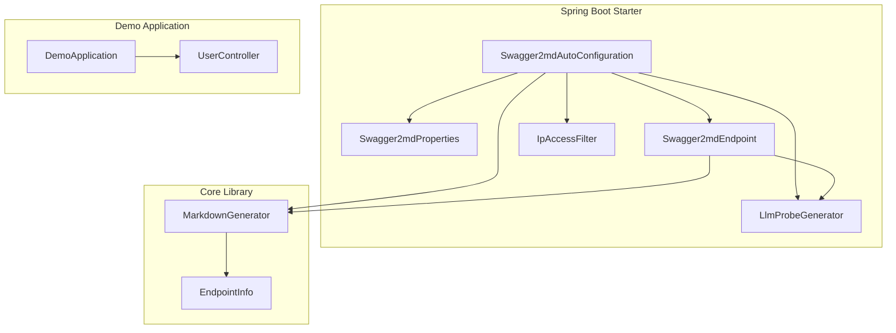
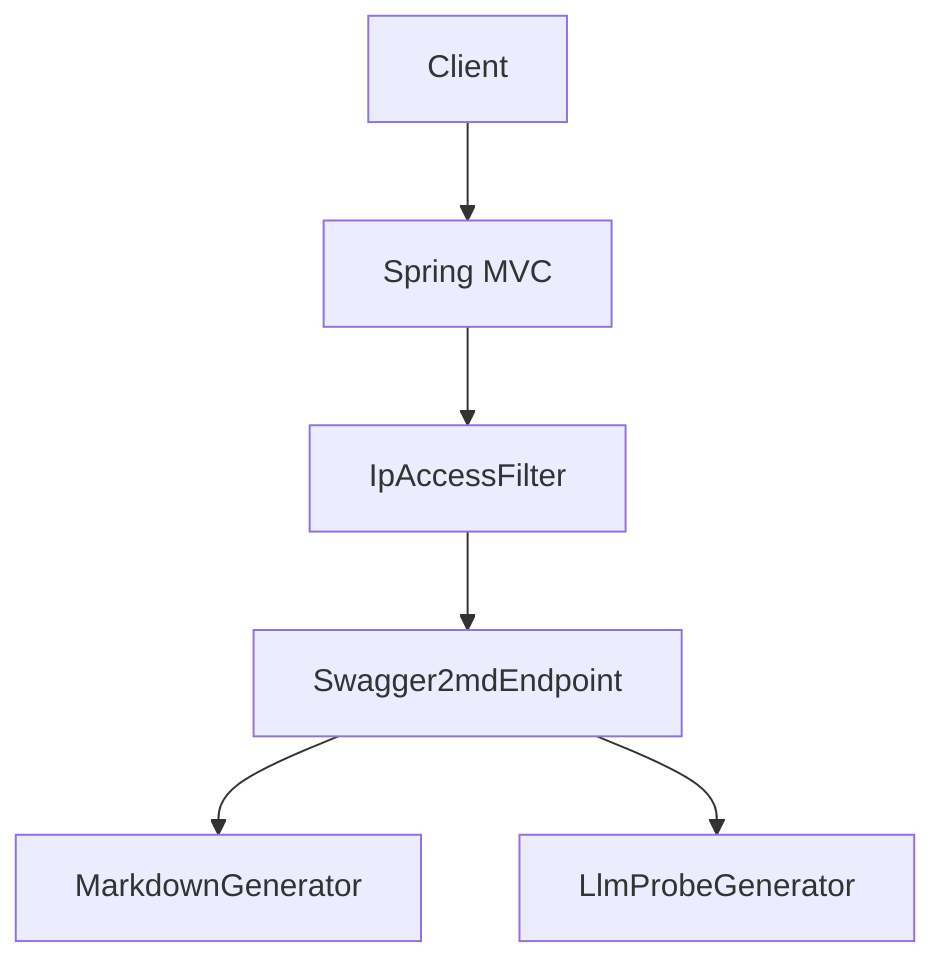
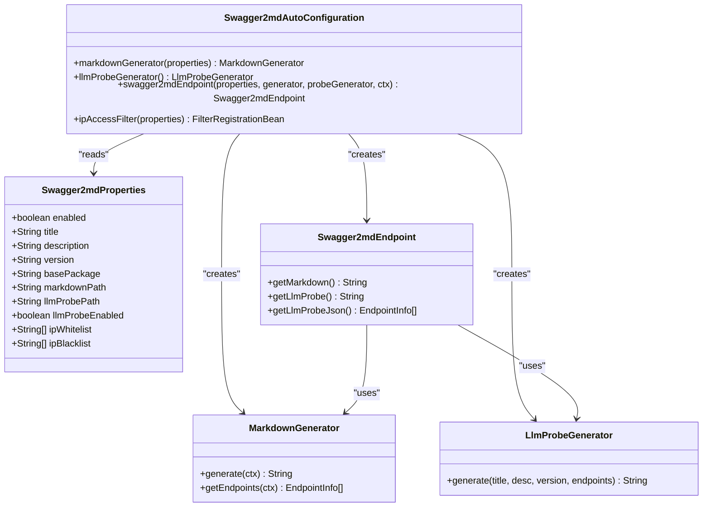
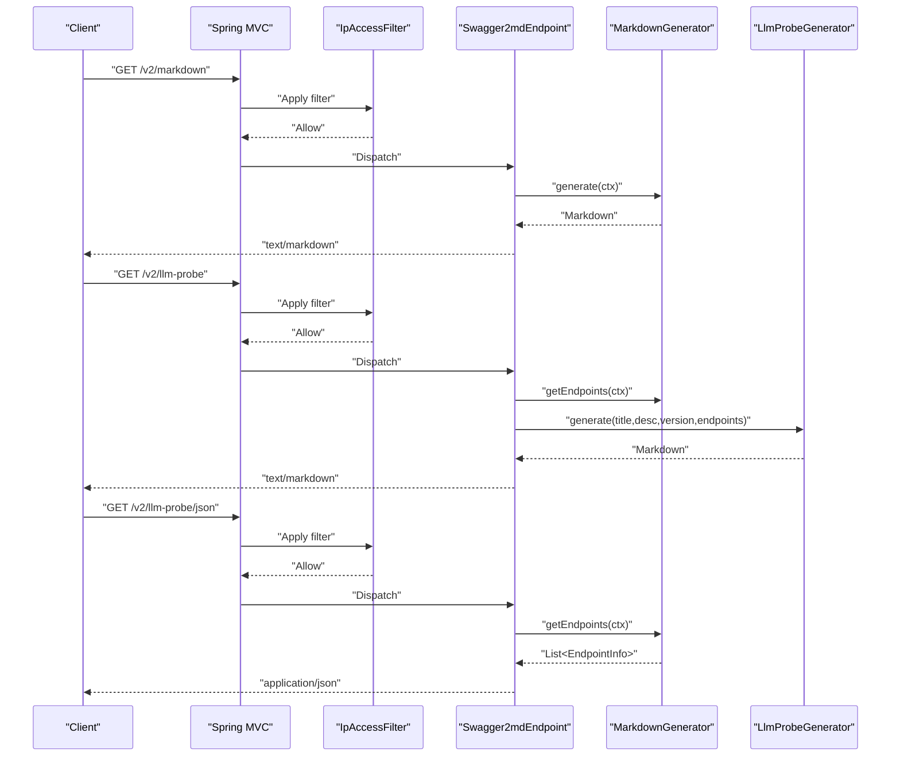
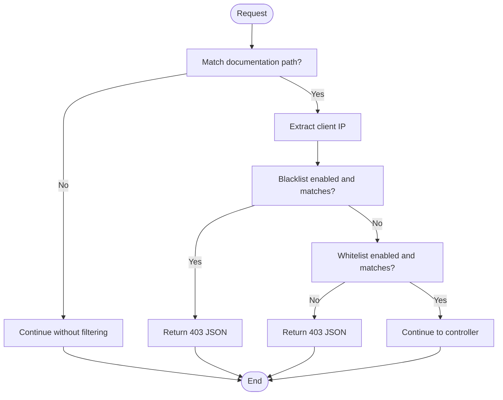
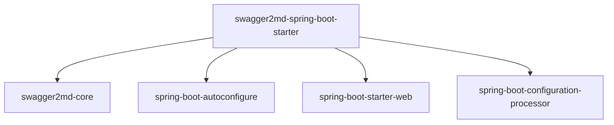

# Spring Boot Integration

<cite>
**Referenced Files in This Document**
- [Swagger2mdAutoConfiguration.java](file://swagger2md-spring-boot-starter/src/main/java/com/github/tentac/swagger2md/autoconfigure/Swagger2mdAutoConfiguration.java)
- [Swagger2mdProperties.java](file://swagger2md-spring-boot-starter/src/main/java/com/github/tentac/swagger2md/autoconfigure/Swagger2mdProperties.java)
- [Swagger2mdEndpoint.java](file://swagger2md-spring-boot-starter/src/main/java/com/github/tentac/swagger2md/autoconfigure/Swagger2mdEndpoint.java)
- [IpAccessFilter.java](file://swagger2md-spring-boot-starter/src/main/java/com/github/tentac/swagger2md/filter/IpAccessFilter.java)
- [LlmProbeGenerator.java](file://swagger2md-spring-boot-starter/src/main/java/com/github/tentac/swagger2md/probe/LlmProbeGenerator.java)
- [org.springframework.boot.autoconfigure.AutoConfiguration.imports](file://swagger2md-spring-boot-starter/src/main/resources/META-INF/spring/org.springframework.boot.autoconfigure.AutoConfiguration.imports)
- [application.yml](file://swagger2md-demo/src/main/resources/application.yml)
- [DemoApplication.java](file://swagger2md-demo/src/main/java/com/github/tentac/swagger2md/demo/DemoApplication.java)
- [UserController.java](file://swagger2md-demo/src/main/java/com/github/tentac/swagger2md/demo/controller/UserController.java)
- [MarkdownGenerator.java](file://swagger2md-core/src/main/java/com/github/tentac/swagger2md/core/MarkdownGenerator.java)
- [EndpointInfo.java](file://swagger2md-core/src/main/java/com/github/tentac/swagger2md/model/EndpointInfo.java)
- [pom.xml](file://pom.xml)
- [swagger2md-spring-boot-starter/pom.xml](file://swagger2md-spring-boot-starter/pom.xml)
</cite>

## Table of Contents
1. [Introduction](#introduction)
2. [Project Structure](#project-structure)
3. [Core Components](#core-components)
4. [Architecture Overview](#architecture-overview)
5. [Detailed Component Analysis](#detailed-component-analysis)
6. [Dependency Analysis](#dependency-analysis)
7. [Performance Considerations](#performance-considerations)
8. [Troubleshooting Guide](#troubleshooting-guide)
9. [Conclusion](#conclusion)
10. [Appendices](#appendices)

## Introduction
This section documents the Spring Boot integration for Swagger2md, focusing on auto-configuration capabilities and production-ready features. It explains how the auto-configuration registers beans, exposes configurable endpoints, secures access via IP filters, and generates both human-readable Markdown documentation and LLM-optimized probe outputs. It also covers property-based configuration, endpoint exposure mechanisms, and practical deployment considerations for production environments.

## Project Structure
The Spring Boot integration is implemented in the swagger2md-spring-boot-starter module. The key elements are:
- Auto-configuration class that conditionally enables the feature and registers beans
- Properties class for configuration via application.yml
- REST endpoint controller exposing documentation and probe endpoints
- IP access filter for securing endpoints
- LLM probe generator for structured, machine-readable API capability manifests

**Diagram sources**
- [Swagger2mdAutoConfiguration.java:1-82](file://swagger2md-spring-boot-starter/src/main/java/com/github/tentac/swagger2md/autoconfigure/Swagger2mdAutoConfiguration.java#L1-L82)
- [Swagger2mdProperties.java:1-127](file://swagger2md-spring-boot-starter/src/main/java/com/github/tentac/swagger2md/autoconfigure/Swagger2mdProperties.java#L1-L127)
- [Swagger2mdEndpoint.java:1-72](file://swagger2md-spring-boot-starter/src/main/java/com/github/tentac/swagger2md/autoconfigure/Swagger2mdEndpoint.java#L1-L72)
- [IpAccessFilter.java:1-196](file://swagger2md-spring-boot-starter/src/main/java/com/github/tentac/swagger2md/filter/IpAccessFilter.java#L1-L196)
- [LlmProbeGenerator.java:1-148](file://swagger2md-spring-boot-starter/src/main/java/com/github/tentac/swagger2md/probe/LlmProbeGenerator.java#L1-L148)
- [MarkdownGenerator.java:1-156](file://swagger2md-core/src/main/java/com/github/tentac/swagger2md/core/MarkdownGenerator.java#L1-L156)
- [EndpointInfo.java:1-165](file://swagger2md-core/src/main/java/com/github/tentac/swagger2md/model/EndpointInfo.java#L1-L165)
- [DemoApplication.java:1-20](file://swagger2md-demo/src/main/java/com/github/tentac/swagger2md/demo/DemoApplication.java#L1-L20)
- [UserController.java:1-187](file://swagger2md-demo/src/main/java/com/github/tentac/swagger2md/demo/controller/UserController.java#L1-L187)

**Section sources**
- [pom.xml:15-19](file://pom.xml#L15-L19)
- [swagger2md-spring-boot-starter/pom.xml:1-50](file://swagger2md-spring-boot-starter/pom.xml#L1-L50)

## Core Components
This section outlines the primary building blocks of the Spring Boot integration and their roles.

- Swagger2mdAutoConfiguration: Central auto-configuration that registers beans when the feature is enabled. It creates a MarkdownGenerator, an LlmProbeGenerator, and a Swagger2mdEndpoint, and conditionally registers an IP access filter.
- Swagger2mdProperties: Configuration properties bound to the swagger2md prefix, controlling enablement, title, description, version, base package, endpoint paths, LLM probe enablement, and IP access lists.
- Swagger2mdEndpoint: REST controller exposing two endpoints: Markdown documentation and LLM probes (Markdown and JSON).
- IpAccessFilter: Servlet filter enforcing IP-based access control for the documentation endpoints using CIDR notation.
- LlmProbeGenerator: Generator that produces a Markdown manifest optimized for LLM consumption and a JSON list of endpoints for programmatic use.

**Section sources**
- [Swagger2mdAutoConfiguration.java:16-82](file://swagger2md-spring-boot-starter/src/main/java/com/github/tentac/swagger2md/autoconfigure/Swagger2mdAutoConfiguration.java#L16-L82)
- [Swagger2mdProperties.java:8-127](file://swagger2md-spring-boot-starter/src/main/java/com/github/tentac/swagger2md/autoconfigure/Swagger2mdProperties.java#L8-L127)
- [Swagger2mdEndpoint.java:16-72](file://swagger2md-spring-boot-starter/src/main/java/com/github/tentac/swagger2md/autoconfigure/Swagger2mdEndpoint.java#L16-L72)
- [IpAccessFilter.java:19-196](file://swagger2md-spring-boot-starter/src/main/java/com/github/tentac/swagger2md/filter/IpAccessFilter.java#L19-L196)
- [LlmProbeGenerator.java:10-148](file://swagger2md-spring-boot-starter/src/main/java/com/github/tentac/swagger2md/probe/LlmProbeGenerator.java#L10-L148)

## Architecture Overview
The auto-configuration activates when the swagger2md.enabled property is true (default true). It registers:
- A MarkdownGenerator bean configured from Swagger2mdProperties
- An LlmProbeGenerator bean
- A Swagger2mdEndpoint REST controller
- An IpAccessFilter applied to the documentation paths

**Diagram sources**
- [Swagger2mdAutoConfiguration.java:20-82](file://swagger2md-spring-boot-starter/src/main/java/com/github/tentac/swagger2md/autoconfigure/Swagger2mdAutoConfiguration.java#L20-L82)
- [Swagger2mdEndpoint.java:20-72](file://swagger2md-spring-boot-starter/src/main/java/com/github/tentac/swagger2md/autoconfigure/Swagger2mdEndpoint.java#L20-L72)
- [IpAccessFilter.java:23-95](file://swagger2md-spring-boot-starter/src/main/java/com/github/tentac/swagger2md/filter/IpAccessFilter.java#L23-L95)

## Detailed Component Analysis

### Auto-Configuration Setup
The auto-configuration class orchestrates bean registration and conditional activation:
- Enables when swagger2md.enabled is true (or missing, due to matchIfMissing)
- Creates MarkdownGenerator and configures it from properties
- Creates LlmProbeGenerator
- Creates Swagger2mdEndpoint wired with properties, generator, probe generator, and ApplicationContext
- Registers IpAccessFilter only when enabled and when whitelist or blacklist is configured

**Diagram sources**
- [Swagger2mdAutoConfiguration.java:20-82](file://swagger2md-spring-boot-starter/src/main/java/com/github/tentac/swagger2md/autoconfigure/Swagger2mdAutoConfiguration.java#L20-L82)
- [Swagger2mdProperties.java:12-127](file://swagger2md-spring-boot-starter/src/main/java/com/github/tentac/swagger2md/autoconfigure/Swagger2mdProperties.java#L12-L127)
- [Swagger2mdEndpoint.java:20-72](file://swagger2md-spring-boot-starter/src/main/java/com/github/tentac/swagger2md/autoconfigure/Swagger2mdEndpoint.java#L20-L72)
- [MarkdownGenerator.java:15-156](file://swagger2md-core/src/main/java/com/github/tentac/swagger2md/core/MarkdownGenerator.java#L15-L156)
- [LlmProbeGenerator.java:15-148](file://swagger2md-spring-boot-starter/src/main/java/com/github/tentac/swagger2md/probe/LlmProbeGenerator.java#L15-L148)

**Section sources**
- [Swagger2mdAutoConfiguration.java:20-82](file://swagger2md-spring-boot-starter/src/main/java/com/github/tentac/swagger2md/autoconfigure/Swagger2mdAutoConfiguration.java#L20-L82)
- [org.springframework.boot.autoconfigure.AutoConfiguration.imports:1-2](file://swagger2md-spring-boot-starter/src/main/resources/META-INF/spring/org.springframework.boot.autoconfigure.AutoConfiguration.imports#L1-L2)

### Property-Based Configuration Options
The Swagger2mdProperties class defines all configuration keys under the swagger2md prefix:
- enabled: toggles the feature (default true)
- title, description, version: metadata for documentation
- basePackage: restricts controller scanning to a package prefix
- markdownPath: path for Markdown documentation endpoint
- llmProbePath: base path for LLM probe endpoints
- llmProbeEnabled: toggles LLM probe endpoints
- ipWhitelist, ipBlacklist: CIDR-based access control lists

These properties are bound automatically via @EnableConfigurationProperties and used throughout the auto-configuration and endpoint controller.

**Section sources**
- [Swagger2mdProperties.java:12-127](file://swagger2md-spring-boot-starter/src/main/java/com/github/tentac/swagger2md/autoconfigure/Swagger2mdProperties.java#L12-L127)

### Endpoint Exposure Mechanisms
Swagger2mdEndpoint exposes three endpoints:
- GET ${swagger2md.markdown-path} (default /v2/markdown): returns Markdown documentation
- GET ${swagger2md.llm-probe-path} (default /v2/llm-probe): returns LLM-optimized Markdown
- GET ${swagger2md.llm-probe-path}/json: returns JSON list of endpoints

The controller is conditionally enabled when swagger2md.enabled is true. The IpAccessFilter applies to all three paths when enabled and when IP lists are configured.

**Diagram sources**
- [Swagger2mdEndpoint.java:40-71](file://swagger2md-spring-boot-starter/src/main/java/com/github/tentac/swagger2md/autoconfigure/Swagger2mdEndpoint.java#L40-L71)
- [IpAccessFilter.java:61-95](file://swagger2md-spring-boot-starter/src/main/java/com/github/tentac/swagger2md/filter/IpAccessFilter.java#L61-L95)
- [MarkdownGenerator.java:111-145](file://swagger2md-core/src/main/java/com/github/tentac/swagger2md/core/MarkdownGenerator.java#L111-L145)
- [LlmProbeGenerator.java:26-146](file://swagger2md-spring-boot-starter/src/main/java/com/github/tentac/swagger2md/probe/LlmProbeGenerator.java#L26-L146)

**Section sources**
- [Swagger2mdEndpoint.java:20-72](file://swagger2md-spring-boot-starter/src/main/java/com/github/tentac/swagger2md/autoconfigure/Swagger2mdEndpoint.java#L20-L72)
- [Swagger2mdAutoConfiguration.java:52-80](file://swagger2md-spring-boot-starter/src/main/java/com/github/tentac/swagger2md/autoconfigure/Swagger2mdAutoConfiguration.java#L52-L80)

### Security Integration Patterns
The IP access filter enforces allow/deny rules:
- Blacklist takes precedence: any matching CIDR blocks the request
- Whitelist applies only when present: non-matching IPs are blocked
- Supports IPv4 and IPv6 CIDRs; invalid entries are logged and ignored
- Respects X-Forwarded-For and X-Real-IP headers when present

**Diagram sources**
- [IpAccessFilter.java:61-95](file://swagger2md-spring-boot-starter/src/main/java/com/github/tentac/swagger2md/filter/IpAccessFilter.java#L61-L95)

**Section sources**
- [IpAccessFilter.java:19-196](file://swagger2md-spring-boot-starter/src/main/java/com/github/tentac/swagger2md/filter/IpAccessFilter.java#L19-L196)
- [Swagger2mdAutoConfiguration.java:52-80](file://swagger2md-spring-boot-starter/src/main/java/com/github/tentac/swagger2md/autoconfigure/Swagger2mdAutoConfiguration.java#L52-L80)

### LLM Probe Generation
The LlmProbeGenerator produces a Markdown document containing:
- Header with API title, version, description, and total endpoint count
- Capability Summary table (method, path, operationId, summary)
- Capability Details grouped by path with operationId, description, deprecation status, parameters, request body, and response examples
- LLM Usage Instructions for consumers

It also provides a JSON endpoint returning the raw list of EndpointInfo objects for programmatic consumption.

**Section sources**
- [LlmProbeGenerator.java:10-148](file://swagger2md-spring-boot-starter/src/main/java/com/github/tentac/swagger2md/probe/LlmProbeGenerator.java#L10-L148)
- [Swagger2mdEndpoint.java:49-71](file://swagger2md-spring-boot-starter/src/main/java/com/github/tentac/swagger2md/autoconfigure/Swagger2mdEndpoint.java#L49-L71)
- [EndpointInfo.java:6-165](file://swagger2md-core/src/main/java/com/github/tentac/swagger2md/model/EndpointInfo.java#L6-L165)

### Practical Configuration Examples
Below are example configurations for common scenarios. Replace values according to your environment.

- Minimal configuration enabling the feature and setting basic metadata
- Restricting controller scanning to a specific package
- Customizing endpoint paths
- Enabling IP-based access control with whitelist and blacklist
- Disabling LLM probe endpoints

For reference, see the demo application’s configuration file.

**Section sources**
- [application.yml:8-29](file://swagger2md-demo/src/main/resources/application.yml#L8-L29)

### Production Deployment Considerations
- Enable IP access control using ip-whitelist and/or ip-blacklist to restrict access to documentation endpoints
- Use a dedicated basePackage to limit scanning scope and improve performance
- Monitor logs for warnings about invalid CIDR entries in IP lists
- Consider rate limiting at the reverse proxy level for documentation endpoints
- Ensure proper CORS configuration if serving documentation from a different origin
- Use HTTPS and secure headers for production-grade applications

[No sources needed since this section provides general guidance]

## Dependency Analysis
The starter depends on Spring Boot autoconfigure and web starters, and on the core library. The parent POM manages Spring Boot version and shared dependencies.

**Diagram sources**
- [swagger2md-spring-boot-starter/pom.xml:19-48](file://swagger2md-spring-boot-starter/pom.xml#L19-L48)
- [pom.xml:33-67](file://pom.xml#L33-L67)

**Section sources**
- [swagger2md-spring-boot-starter/pom.xml:19-48](file://swagger2md-spring-boot-starter/pom.xml#L19-L48)
- [pom.xml:21-67](file://pom.xml#L21-L67)

## Performance Considerations
- Limit controller scanning by setting basePackage to reduce reflection overhead during documentation generation
- Avoid overly broad IP CIDR ranges to minimize filter evaluation costs
- Cache generated documentation if endpoints change infrequently; regenerate on demand otherwise
- Keep LLM probe JSON disabled in high-throughput environments if not needed

[No sources needed since this section provides general guidance]

## Troubleshooting Guide
Common issues and resolutions:
- Endpoints not exposed: Verify swagger2md.enabled is true (default) and the starter is on the classpath
- Access denied errors: Check ip-whitelist and ip-blacklist entries; confirm the client IP is correctly extracted from headers
- Invalid CIDR warnings: Review whitelist/blacklist entries; invalid CIDRs are ignored but logged
- Empty documentation: Ensure basePackage matches controller packages or leave empty to scan all
- LLM probe disabled: Confirm llmProbeEnabled is true and llmProbePath is set appropriately

**Section sources**
- [Swagger2mdAutoConfiguration.java:20-23](file://swagger2md-spring-boot-starter/src/main/java/com/github/tentac/swagger2md/autoconfigure/Swagger2mdAutoConfiguration.java#L20-L23)
- [IpAccessFilter.java:40-58](file://swagger2md-spring-boot-starter/src/main/java/com/github/tentac/swagger2md/filter/IpAccessFilter.java#L40-L58)
- [application.yml:8-29](file://swagger2md-demo/src/main/resources/application.yml#L8-L29)

## Conclusion
The Spring Boot integration for Swagger2md provides a seamless, property-driven setup for generating Markdown documentation and LLM-optimized API capability manifests. With built-in IP-based access control and flexible configuration, it supports both development convenience and production hardening. By tuning basePackage, endpoint paths, and security settings, teams can deploy robust, maintainable API documentation systems tailored to their needs.

[No sources needed since this section summarizes without analyzing specific files]

## Appendices

### A. End-to-End Demo Walkthrough
- Run the demo application and navigate to:
  - Markdown documentation endpoint
  - LLM probe endpoint
  - LLM probe JSON endpoint
- Observe how Swagger2md scans controllers annotated with Swagger2 and Swagger2md annotations, and how the LLM probe compiles endpoint metadata into a structured format.

**Section sources**
- [DemoApplication.java:6-19](file://swagger2md-demo/src/main/java/com/github/tentac/swagger2md/demo/DemoApplication.java#L6-L19)
- [UserController.java:16-187](file://swagger2md-demo/src/main/java/com/github/tentac/swagger2md/demo/controller/UserController.java#L16-L187)