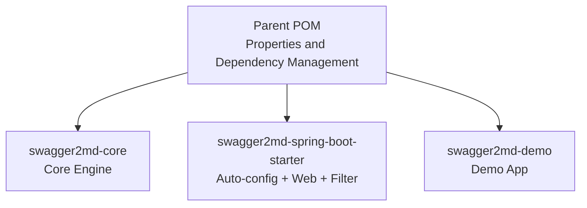
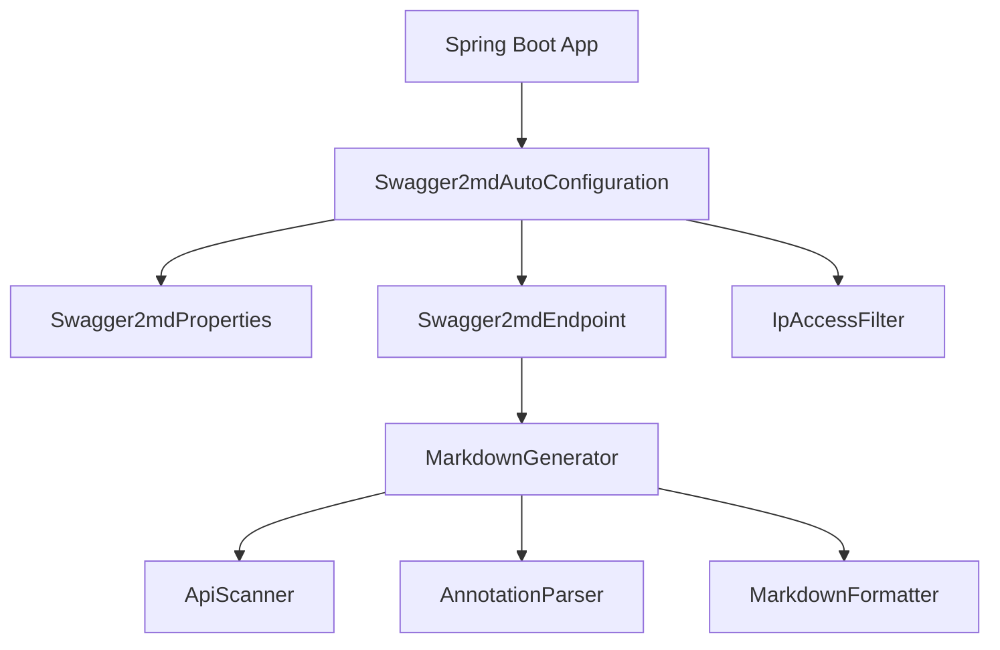
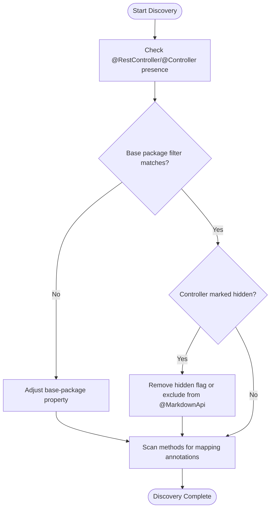
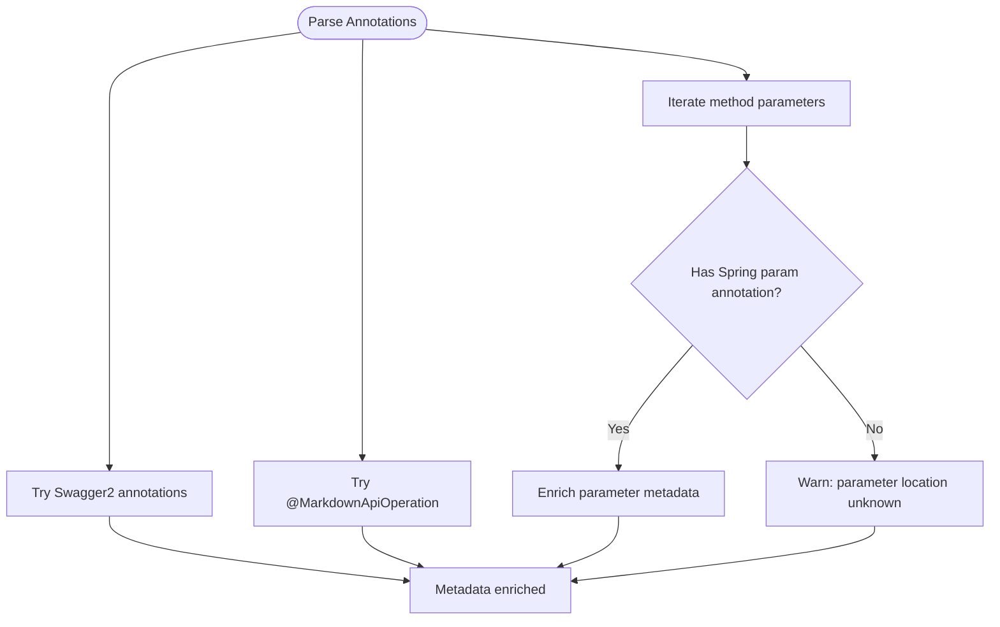
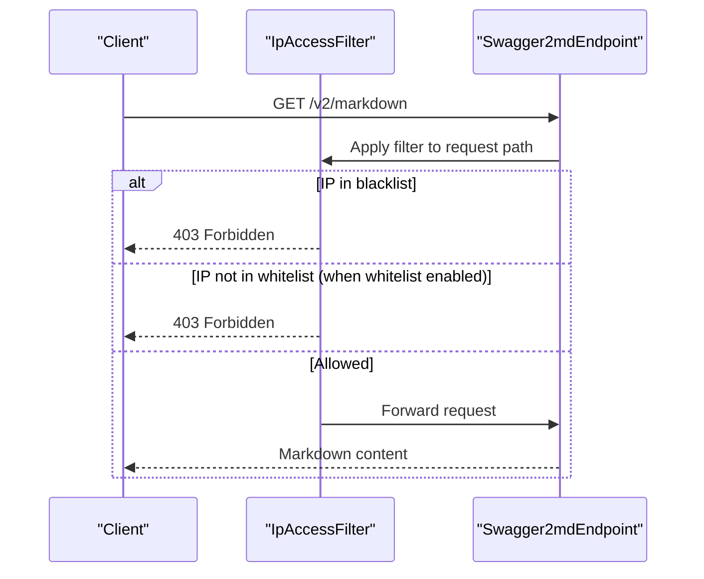
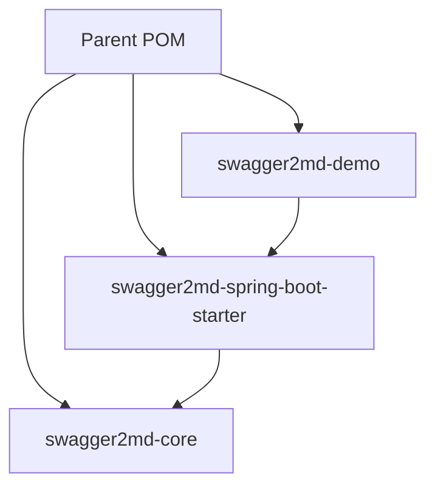

# Troubleshooting Guide

<cite>
**Referenced Files in This Document**
- [pom.xml](file://pom.xml)
- [swagger2md-core/pom.xml](file://swagger2md-core/pom.xml)
- [swagger2md-spring-boot-starter/pom.xml](file://swagger2md-spring-boot-starter/pom.xml)
- [swagger2md-demo/pom.xml](file://swagger2md-demo/pom.xml)
- [MarkdownApi.java](file://swagger2md-core/src/main/java/com/github/tentac/swagger2md/annotation/MarkdownApi.java)
- [MarkdownApiOperation.java](file://swagger2md-core/src/main/java/com/github/tentac/swagger2md/annotation/MarkdownApiOperation.java)
- [MarkdownApiParam.java](file://swagger2md-core/src/main/java/com/github/tentac/swagger2md/annotation/MarkdownApiParam.java)
- [AnnotationParser.java](file://swagger2md-core/src/main/java/com/github/tentac/swagger2md/core/AnnotationParser.java)
- [ApiScanner.java](file://swagger2md-core/src/main/java/com/github/tentac/swagger2md/core/ApiScanner.java)
- [MarkdownGenerator.java](file://swagger2md-core/src/main/java/com/github/tentac/swagger2md/core/MarkdownGenerator.java)
- [Swagger2mdAutoConfiguration.java](file://swagger2md-spring-boot-starter/src/main/java/com/github/tentac/swagger2md/autoconfigure/Swagger2mdAutoConfiguration.java)
- [Swagger2mdEndpoint.java](file://swagger2md-spring-boot-starter/src/main/java/com/github/tentac/swagger2md/autoconfigure/Swagger2mdEndpoint.java)
- [Swagger2mdProperties.java](file://swagger2md-spring-boot-starter/src/main/java/com/github/tentac/swagger2md/autoconfigure/Swagger2mdProperties.java)
- [IpAccessFilter.java](file://swagger2md-spring-boot-starter/src/main/java/com/github/tentac/swagger2md/filter/IpAccessFilter.java)
- [DemoApplication.java](file://swagger2md-demo/src/main/java/com/github/tentac/swagger2md/demo/DemoApplication.java)
- [UserController.java](file://swagger2md-demo/src/main/java/com/github/tentac/swagger2md/demo/controller/UserController.java)
- [application.yml](file://swagger2md-demo/src/main/resources/application.yml)
- [org.springframework.boot.autoconfigure.AutoConfiguration.imports](file://swagger2md-spring-boot-starter/src/main/resources/META-INF/spring/org.springframework.boot.autoconfigure.AutoConfiguration.imports)
</cite>

## Table of Contents
1. [Introduction](#introduction)
2. [Project Structure](#project-structure)
3. [Core Components](#core-components)
4. [Architecture Overview](#architecture-overview)
5. [Detailed Component Analysis](#detailed-component-analysis)
6. [Dependency Analysis](#dependency-analysis)
7. [Performance Considerations](#performance-considerations)
8. [Troubleshooting Guide](#troubleshooting-guide)
9. [Conclusion](#conclusion)
10. [Appendices](#appendices)

## Introduction
This troubleshooting guide focuses on common issues encountered when using the tentac project (swagger2md) in Spring Boot applications. It covers controller discovery failures, annotation processing errors, endpoint access issues, and security filter conflicts. It also provides diagnostic approaches, debugging techniques, resolution strategies, performance tuning for large API sets, memory optimization tips, scaling considerations, logging configuration, and integration guidance for dependency and version compatibility.

## Project Structure
The project is a multi-module Maven build with three modules:
- Parent POM defines shared properties and dependency management for Java 17, Spring Boot 3.2.5, Swagger annotations, Jackson, and Lombok.
- swagger2md-core: Core engine for scanning Spring controllers, parsing annotations, and generating Markdown documentation.
- swagger2md-spring-boot-starter: Auto-configuration, web endpoints, and IP access filter for Spring Boot.
- swagger2md-demo: Demo application showcasing usage and configuration.

**Diagram sources**
- [pom.xml:1-112](file://pom.xml#L1-L112)
- [swagger2md-core/pom.xml:1-51](file://swagger2md-core/pom.xml#L1-L51)
- [swagger2md-spring-boot-starter/pom.xml:1-50](file://swagger2md-spring-boot-starter/pom.xml#L1-L50)
- [swagger2md-demo/pom.xml:1-55](file://swagger2md-demo/pom.xml#L1-L55)

**Section sources**
- [pom.xml:1-112](file://pom.xml#L1-L112)

## Core Components
Key components involved in discovery, parsing, and serving documentation:
- ApiScanner: Discovers REST endpoints from Spring controllers, extracts paths, HTTP methods, consumes/produces, parameters, and generates request/response examples.
- AnnotationParser: Enriches EndpointInfo with metadata from Swagger2 and custom annotations.
- MarkdownGenerator: Orchestrates scanning, parsing, and formatting to produce Markdown documentation.
- Swagger2mdAutoConfiguration: Registers beans, endpoints, and IP access filter conditionally.
- Swagger2mdEndpoint: Exposes Markdown and LLM probe endpoints.
- Swagger2mdProperties: Configuration properties for enabling/disabling features, paths, base package, and IP filters.
- IpAccessFilter: Applies whitelist/blacklist filtering for documentation endpoints.

**Section sources**
- [ApiScanner.java:1-400](file://swagger2md-core/src/main/java/com/github/tentac/swagger2md/core/ApiScanner.java#L1-L400)
- [AnnotationParser.java:1-211](file://swagger2md-core/src/main/java/com/github/tentac/swagger2md/core/AnnotationParser.java#L1-L211)
- [MarkdownGenerator.java:1-156](file://swagger2md-core/src/main/java/com/github/tentac/swagger2md/core/MarkdownGenerator.java#L1-L156)
- [Swagger2mdAutoConfiguration.java:1-82](file://swagger2md-spring-boot-starter/src/main/java/com/github/tentac/swagger2md/autoconfigure/Swagger2mdAutoConfiguration.java#L1-L82)
- [Swagger2mdEndpoint.java:1-72](file://swagger2md-spring-boot-starter/src/main/java/com/github/tentac/swagger2md/autoconfigure/Swagger2mdEndpoint.java#L1-L72)
- [Swagger2mdProperties.java:1-127](file://swagger2md-spring-boot-starter/src/main/java/com/github/tentac/swagger2md/autoconfigure/Swagger2mdProperties.java#L1-L127)
- [IpAccessFilter.java:1-196](file://swagger2md-spring-boot-starter/src/main/java/com/github/tentac/swagger2md/filter/IpAccessFilter.java#L1-L196)

## Architecture Overview
The runtime flow for documentation generation and serving:
- Spring Boot loads auto-configuration and registers beans when enabled.
- The endpoint controller serves Markdown and LLM probe outputs.
- The generator scans controllers, enriches endpoints, and formats output.

**Diagram sources**
- [Swagger2mdAutoConfiguration.java:1-82](file://swagger2md-spring-boot-starter/src/main/java/com/github/tentac/swagger2md/autoconfigure/Swagger2mdAutoConfiguration.java#L1-L82)
- [Swagger2mdEndpoint.java:1-72](file://swagger2md-spring-boot-starter/src/main/java/com/github/tentac/swagger2md/autoconfigure/Swagger2mdEndpoint.java#L1-L72)
- [Swagger2mdProperties.java:1-127](file://swagger2md-spring-boot-starter/src/main/java/com/github/tentac/swagger2md/autoconfigure/Swagger2mdProperties.java#L1-L127)
- [MarkdownGenerator.java:1-156](file://swagger2md-core/src/main/java/com/github/tentac/swagger2md/core/MarkdownGenerator.java#L1-L156)
- [ApiScanner.java:1-400](file://swagger2md-core/src/main/java/com/github/tentac/swagger2md/core/ApiScanner.java#L1-L400)
- [AnnotationParser.java:1-211](file://swagger2md-core/src/main/java/com/github/tentac/swagger2md/core/AnnotationParser.java#L1-L211)
- [IpAccessFilter.java:1-196](file://swagger2md-spring-boot-starter/src/main/java/com/github/tentac/swagger2md/filter/IpAccessFilter.java#L1-L196)

## Detailed Component Analysis

### Controller Discovery Failures
Symptoms:
- Endpoints missing from generated documentation.
- Empty or partial Markdown output.

Root causes and diagnostics:
- Controllers not annotated with Spring’s REST annotations or not in the scanned package.
- Base package filtering excludes controllers.
- Hidden controllers marked as hidden via annotations.

Resolution steps:
- Verify controllers are annotated with Spring REST annotations or are @RestController/@Controller with @ResponseBody methods.
- Confirm base package configuration includes target controllers.
- Ensure controllers are not marked as hidden.

**Diagram sources**
- [MarkdownGenerator.java:54-99](file://swagger2md-core/src/main/java/com/github/tentac/swagger2md/core/MarkdownGenerator.java#L54-L99)
- [ApiScanner.java:81-96](file://swagger2md-core/src/main/java/com/github/tentac/swagger2md/core/ApiScanner.java#L81-L96)
- [ApiScanner.java:61-76](file://swagger2md-core/src/main/java/com/github/tentac/swagger2md/core/ApiScanner.java#L61-L76)

**Section sources**
- [MarkdownGenerator.java:54-99](file://swagger2md-core/src/main/java/com/github/tentac/swagger2md/core/MarkdownGenerator.java#L54-L99)
- [ApiScanner.java:81-96](file://swagger2md-core/src/main/java/com/github/tentac/swagger2md/core/ApiScanner.java#L81-L96)
- [ApiScanner.java:61-76](file://swagger2md-core/src/main/java/com/github/tentac/swagger2md/core/ApiScanner.java#L61-L76)

### Annotation Processing Errors
Symptoms:
- Missing summaries, descriptions, tags, or parameter details.
- Exceptions during annotation parsing.

Root causes and diagnostics:
- Missing or incompatible Swagger2 annotations.
- Missing parameter location annotations (e.g., @RequestParam, @PathVariable, @RequestHeader, @RequestBody).
- Method signature mismatches when resolving method by operationId.

Resolution steps:
- Add proper Spring mapping annotations and optional Swagger2 annotations for richer metadata.
- Ensure each method parameter is annotated with a Spring parameter annotation to determine location and required fields.
- Verify method names and signatures match operationId used by the generator.

**Diagram sources**
- [AnnotationParser.java:26-35](file://swagger2md-core/src/main/java/com/github/tentac/swagger2md/core/AnnotationParser.java#L26-L35)
- [AnnotationParser.java:93-109](file://swagger2md-core/src/main/java/com/github/tentac/swagger2md/core/AnnotationParser.java#L93-L109)
- [AnnotationParser.java:111-134](file://swagger2md-core/src/main/java/com/github/tentac/swagger2md/core/AnnotationParser.java#L111-L134)
- [ApiScanner.java:279-331](file://swagger2md-core/src/main/java/com/github/tentac/swagger2md/core/ApiScanner.java#L279-L331)

**Section sources**
- [AnnotationParser.java:26-35](file://swagger2md-core/src/main/java/com/github/tentac/swagger2md/core/AnnotationParser.java#L26-L35)
- [AnnotationParser.java:93-109](file://swagger2md-core/src/main/java/com/github/tentac/swagger2md/core/AnnotationParser.java#L93-L109)
- [AnnotationParser.java:111-134](file://swagger2md-core/src/main/java/com/github/tentac/swagger2md/core/AnnotationParser.java#L111-L134)
- [ApiScanner.java:279-331](file://swagger2md-core/src/main/java/com/github/tentac/swagger2md/core/ApiScanner.java#L279-L331)

### Endpoint Access Issues
Symptoms:
- Cannot access /v2/markdown or /v2/llm-probe endpoints.
- 403 Forbidden responses.

Root causes and diagnostics:
- Auto-configuration disabled or properties misconfigured.
- IP access filter blocking requests due to whitelist/blacklist.
- Incorrect path configuration.

Resolution steps:
- Ensure swagger2md.enabled is true and paths are correctly set.
- Review IP whitelist/blacklist entries and CIDR notation.
- Temporarily disable IP filtering to confirm access.

**Diagram sources**
- [IpAccessFilter.java:61-95](file://swagger2md-spring-boot-starter/src/main/java/com/github/tentac/swagger2md/filter/IpAccessFilter.java#L61-L95)
- [Swagger2mdEndpoint.java:43-70](file://swagger2md-spring-boot-starter/src/main/java/com/github/tentac/swagger2md/autoconfigure/Swagger2mdEndpoint.java#L43-L70)
- [Swagger2mdAutoConfiguration.java:52-80](file://swagger2md-spring-boot-starter/src/main/java/com/github/tentac/swagger2md/autoconfigure/Swagger2mdAutoConfiguration.java#L52-L80)

**Section sources**
- [IpAccessFilter.java:61-95](file://swagger2md-spring-boot-starter/src/main/java/com/github/tentac/swagger2md/filter/IpAccessFilter.java#L61-L95)
- [Swagger2mdEndpoint.java:43-70](file://swagger2md-spring-boot-starter/src/main/java/com/github/tentac/swagger2md/autoconfigure/Swagger2mdEndpoint.java#L43-L70)
- [Swagger2mdAutoConfiguration.java:52-80](file://swagger2md-spring-boot-starter/src/main/java/com/github/tentac/swagger2md/autoconfigure/Swagger2mdAutoConfiguration.java#L52-L80)

### Security Filter Conflicts
Symptoms:
- Unexpected 403 responses for documentation endpoints.
- Conflicts with application-level filters.

Root causes and diagnostics:
- Order of filters and URL patterns overlap with application filters.
- Misconfigured path patterns or CIDR entries.

Resolution steps:
- Verify filter order and URL patterns are scoped to swagger2md paths.
- Validate CIDR entries and ensure no overlap with internal networks.
- Temporarily disable filter to isolate conflicts.

**Section sources**
- [Swagger2mdAutoConfiguration.java:52-80](file://swagger2md-spring-boot-starter/src/main/java/com/github/tentac/swagger2md/autoconfigure/Swagger2mdAutoConfiguration.java#L52-L80)
- [IpAccessFilter.java:33-59](file://swagger2md-spring-boot-starter/src/main/java/com/github/tentac/swagger2md/filter/IpAccessFilter.java#L33-L59)

## Dependency Analysis
Module-level dependencies and external libraries:
- Parent POM manages Spring Boot, Swagger annotations, Jackson, and Lombok versions.
- Core module depends on Spring Web and Context, optional Swagger annotations, and Jackson.
- Starter module depends on core, Spring Boot autoconfigure/web, and configuration processor.
- Demo module depends on starter and Spring Boot web; demonstrates configuration and usage.

**Diagram sources**
- [pom.xml:1-112](file://pom.xml#L1-L112)
- [swagger2md-core/pom.xml:19-48](file://swagger2md-core/pom.xml#L19-L48)
- [swagger2md-spring-boot-starter/pom.xml:19-47](file://swagger2md-spring-boot-starter/pom.xml#L19-L47)
- [swagger2md-demo/pom.xml:19-40](file://swagger2md-demo/pom.xml#L19-L40)

**Section sources**
- [pom.xml:1-112](file://pom.xml#L1-L112)
- [swagger2md-core/pom.xml:19-48](file://swagger2md-core/pom.xml#L19-L48)
- [swagger2md-spring-boot-starter/pom.xml:19-47](file://swagger2md-spring-boot-starter/pom.xml#L19-L47)
- [swagger2md-demo/pom.xml:19-40](file://swagger2md-demo/pom.xml#L19-L40)

## Performance Considerations
Large API sets and scaling:
- Reduce scanning scope by setting base-package to limit controller discovery.
- Avoid unnecessary reflection-heavy operations by minimizing custom annotations where not needed.
- Cache generated Markdown output if content does not change frequently.
- Monitor memory usage during generation; consider breaking down large applications into smaller modules.

Memory optimization tips:
- Prefer primitive types and simple POJOs for request/response examples.
- Avoid deeply nested generics that increase example generation complexity.
- Limit the number of endpoints processed per request if generating on-demand.

Scaling considerations:
- Use separate environments for documentation endpoints.
- Employ reverse proxy load balancing for high-traffic scenarios.
- Consider offloading generation to CI/CD pipelines and serving static Markdown.

[No sources needed since this section provides general guidance]

## Troubleshooting Guide

### Step-by-Step Resolution Guides

#### Controller Discovery Failure
1. Verify controllers are annotated with Spring REST annotations or are @RestController/@Controller with @ResponseBody methods.
2. Confirm base-package property includes target controllers.
3. Ensure controllers are not marked hidden via @MarkdownApi(hidden = true).
4. Re-run application and review logs for discovery messages.

**Section sources**
- [MarkdownGenerator.java:54-99](file://swagger2md-core/src/main/java/com/github/tentac/swagger2md/core/MarkdownGenerator.java#L54-L99)
- [ApiScanner.java:81-96](file://swagger2md-core/src/main/java/com/github/tentac/swagger2md/core/ApiScanner.java#L81-L96)

#### Annotation Processing Errors
1. Add Spring mapping annotations (@RequestParam, @PathVariable, @RequestHeader, @RequestBody) to all method parameters.
2. Optionally add Swagger2 annotations for richer metadata.
3. Ensure method names and signatures match operationId used by the generator.
4. Validate that method resolution succeeds when enriching endpoints.

**Section sources**
- [AnnotationParser.java:26-35](file://swagger2md-core/src/main/java/com/github/tentac/swagger2md/core/AnnotationParser.java#L26-L35)
- [ApiScanner.java:279-331](file://swagger2md-core/src/main/java/com/github/tentac/swagger2md/core/ApiScanner.java#L279-L331)

#### Endpoint Access Issues
1. Confirm swagger2md.enabled is true and paths are set correctly.
2. Review IP whitelist/blacklist entries and CIDR notation.
3. Temporarily disable IP filtering to confirm access.
4. Validate filter URL patterns and order.

**Section sources**
- [Swagger2mdEndpoint.java:43-70](file://swagger2md-spring-boot-starter/src/main/java/com/github/tentac/swagger2md/autoconfigure/Swagger2mdEndpoint.java#L43-L70)
- [Swagger2mdAutoConfiguration.java:52-80](file://swagger2md-spring-boot-starter/src/main/java/com/github/tentac/swagger2md/autoconfigure/Swagger2mdAutoConfiguration.java#L52-L80)
- [IpAccessFilter.java:61-95](file://swagger2md-spring-boot-starter/src/main/java/com/github/tentac/swagger2md/filter/IpAccessFilter.java#L61-L95)

#### Security Filter Conflicts
1. Check filter order and URL patterns to avoid overlapping with application filters.
2. Validate CIDR entries for whitelist/blacklist.
3. Temporarily disable filter to isolate conflicts.

**Section sources**
- [Swagger2mdAutoConfiguration.java:52-80](file://swagger2md-spring-boot-starter/src/main/java/com/github/tentac/swagger2md/autoconfigure/Swagger2mdAutoConfiguration.java#L52-L80)
- [IpAccessFilter.java:33-59](file://swagger2md-spring-boot-starter/src/main/java/com/github/tentac/swagger2md/filter/IpAccessFilter.java#L33-L59)

### Logging Configuration and Debug Modes
- Enable debug logging for the swagger2md package to observe discovery and enrichment steps.
- Use application.yml to configure logging levels.

**Section sources**
- [application.yml:26-29](file://swagger2md-demo/src/main/resources/application.yml#L26-L29)

### Diagnostic Tools and Techniques
- Inspect generated endpoints via the LLM probe endpoints for quick verification.
- Use the JSON probe endpoint for programmatic consumption and validation.
- Temporarily disable IP filtering to confirm endpoint accessibility.

**Section sources**
- [Swagger2mdEndpoint.java:52-70](file://swagger2md-spring-boot-starter/src/main/java/com/github/tentac/swagger2md/autoconfigure/Swagger2mdEndpoint.java#L52-L70)

### Integration with Spring Boot Applications
Common issues:
- Auto-configuration not loaded.
- Missing starter dependency.
- Property precedence conflicts.

Resolution steps:
- Ensure the starter dependency is included in the application.
- Confirm the AutoConfiguration import is present.
- Validate property precedence and environment-specific overrides.

**Section sources**
- [swagger2md-spring-boot-starter/pom.xml:19-47](file://swagger2md-spring-boot-starter/pom.xml#L19-L47)
- [org.springframework.boot.autoconfigure.AutoConfiguration.imports:1-2](file://swagger2md-spring-boot-starter/src/main/resources/META-INF/spring/org.springframework.boot.autoconfigure.AutoConfiguration.imports#L1-L2)

### Dependency Conflicts and Version Compatibility
- Align Spring Boot version with the managed version in the parent POM.
- Ensure Jackson and Lombok versions are compatible with the Spring Boot release.
- Avoid mixing Swagger2 annotations with incompatible versions.

**Section sources**
- [pom.xml:21-67](file://pom.xml#L21-L67)

### Preventive Measures
- Keep base-package narrowly scoped to reduce scanning overhead.
- Use consistent annotation usage across controllers.
- Regularly validate endpoint accessibility and IP filter configurations.
- Monitor logs for discovery and parsing warnings.

**Section sources**
- [Swagger2mdProperties.java:27-28](file://swagger2md-spring-boot-starter/src/main/java/com/github/tentac/swagger2md/autoconfigure/Swagger2mdProperties.java#L27-L28)
- [application.yml:8-24](file://swagger2md-demo/src/main/resources/application.yml#L8-L24)

## Conclusion
By systematically diagnosing controller discovery, annotation parsing, endpoint access, and security filter conflicts, most issues can be resolved quickly. Use the provided step-by-step guides, leverage logging and probe endpoints, and apply performance and scaling recommendations for large API sets. Ensure proper integration with Spring Boot and maintain version compatibility to prevent common pitfalls.

## Appendices

### Configuration Reference
Key properties and defaults:
- enabled: true/false
- title: API title for documentation header
- description: API description
- version: API version
- base-package: package to scan for controllers
- markdown-path: path for Markdown endpoint
- llm-probe-path: path for LLM probe endpoints
- llm-probe-enabled: enable/disable LLM probes
- ip-whitelist: list of CIDR entries
- ip-blacklist: list of CIDR entries

**Section sources**
- [Swagger2mdProperties.java:15-43](file://swagger2md-spring-boot-starter/src/main/java/com/github/tentac/swagger2md/autoconfigure/Swagger2mdProperties.java#L15-L43)

### Demo Application Usage
- Run the demo application and visit:
  - http://localhost:8080/v2/markdown
  - http://localhost:8080/v2/llm-probe
  - http://localhost:8080/v2/llm-probe/json

**Section sources**
- [DemoApplication.java:6-12](file://swagger2md-demo/src/main/java/com/github/tentac/swagger2md/demo/DemoApplication.java#L6-L12)